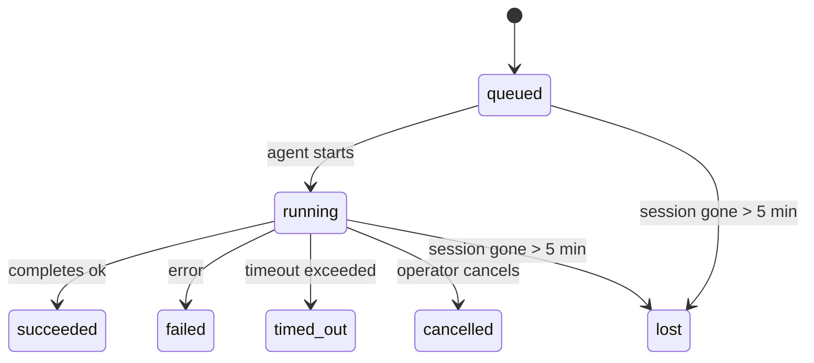

---
read_when:
    - 進行中または最近完了したバックグラウンド作業の確認
    - 切り離されたエージェント実行の配信失敗のデバッグ
    - バックグラウンド実行がセッション、Cron、Heartbeat とどのように関係するかを理解する
summary: ACP 実行、サブエージェント、分離された Cron ジョブ、CLI 操作のバックグラウンドタスク追跡
title: バックグラウンドタスク
x-i18n:
    generated_at: "2026-04-24T04:45:09Z"
    model: gpt-5.4
    provider: openai
    source_hash: 10f16268ab5cce8c3dfd26c54d8d913c0ac0f9bfb4856ed1bb28b085ddb78528
    source_path: automation/tasks.md
    workflow: 15
---

> **スケジュール設定をお探しですか？** 適切な仕組みを選ぶには、[自動化とタスク](/ja-JP/automation)を参照してください。このページで扱うのはバックグラウンド作業の**追跡**であり、スケジュール設定ではありません。

バックグラウンドタスクは、**メインの会話セッションの外側**で実行される作業を追跡します。
ACP 実行、サブエージェントの起動、分離された Cron ジョブの実行、CLI から開始された操作が該当します。

タスクはセッション、Cron ジョブ、Heartbeat を置き換えるものではありません。タスクは、切り離された作業で何が起きたか、いつ起きたか、成功したかどうかを記録する**アクティビティ台帳**です。

<Note>
すべてのエージェント実行がタスクを作成するわけではありません。Heartbeat ターンと通常の対話型チャットは作成しません。すべての Cron 実行、ACP 起動、サブエージェント起動、CLI エージェントコマンドは作成します。
</Note>

## 要点

- タスクはスケジューラではなく**記録**です。作業を _いつ_ 実行するかは Cron と Heartbeat が決定し、何が起きたかはタスクが追跡します。
- ACP、サブエージェント、すべての Cron ジョブ、CLI 操作はタスクを作成します。Heartbeat ターンは作成しません。
- 各タスクは `queued → running → terminal`（succeeded、failed、timed_out、cancelled、または lost）を経て進行します。
- Cron タスクは、Cron ランタイムがそのジョブを所有している間は有効なままです。チャットに裏打ちされた CLI タスクは、所有する実行コンテキストがまだ有効な間だけ有効なままです。
- 完了はプッシュ駆動です。切り離された作業は、完了時に直接通知するか、要求元のセッション/Heartbeat を起こすことができるため、通常はステータスをポーリングするループは適切ではありません。
- 分離された Cron 実行とサブエージェント完了では、最終的なクリーンアップ記録処理の前に、子セッション用に追跡されたブラウザータブ/プロセスをベストエフォートでクリーンアップします。
- 分離された Cron の配信では、子孫サブエージェント作業の排出が続いている間は古い中間親返信を抑制し、配信前に最終的な子孫出力が到着した場合はそちらを優先します。
- 完了通知はチャネルに直接配信されるか、次の Heartbeat 用にキューに入れられます。
- `openclaw tasks list` はすべてのタスクを表示し、`openclaw tasks audit` は問題を検出します。
- 終端レコードは 7 日間保持され、その後自動的に削除されます。

## クイックスタート

```bash
# すべてのタスクを一覧表示（新しい順）
openclaw tasks list

# ランタイムまたはステータスで絞り込み
openclaw tasks list --runtime acp
openclaw tasks list --status running

# 特定のタスクの詳細を表示（ID、run ID、または session key で指定）
openclaw tasks show <lookup>

# 実行中のタスクをキャンセル（子セッションを終了）
openclaw tasks cancel <lookup>

# タスクの通知ポリシーを変更
openclaw tasks notify <lookup> state_changes

# ヘルス監査を実行
openclaw tasks audit

# メンテナンスをプレビューまたは適用
openclaw tasks maintenance
openclaw tasks maintenance --apply

# TaskFlow の状態を確認
openclaw tasks flow list
openclaw tasks flow show <lookup>
openclaw tasks flow cancel <lookup>
```

## タスクを作成するもの

| ソース                 | ランタイムタイプ | タスクレコードが作成されるタイミング                     | デフォルトの通知ポリシー |
| ---------------------- | ---------------- | -------------------------------------------------------- | ------------------------ |
| ACP バックグラウンド実行 | `acp`            | 子 ACP セッションを起動したとき                          | `done_only`              |
| サブエージェントのオーケストレーション | `subagent`       | `sessions_spawn` によってサブエージェントを起動したとき | `done_only`              |
| Cron ジョブ（全タイプ） | `cron`           | すべての Cron 実行（メインセッションと分離実行）         | `silent`                 |
| CLI 操作               | `cli`            | Gateway を通じて実行される `openclaw agent` コマンド     | `silent`                 |
| エージェントのメディアジョブ | `cli`            | セッションに裏打ちされた `video_generate` 実行           | `silent`                 |

メインセッションの Cron タスクは、デフォルトで `silent` 通知ポリシーを使用します。追跡用のレコードは作成しますが、通知は生成しません。分離された Cron タスクもデフォルトは `silent` ですが、独自のセッションで実行されるため、より見えやすくなります。

セッションに裏打ちされた `video_generate` 実行も `silent` 通知ポリシーを使います。これらもタスクレコードを作成しますが、完了は元のエージェントセッションに内部 wake として返されるため、エージェント自身がフォローアップメッセージを書き、完成した動画を添付できます。`tools.media.asyncCompletion.directSend` を有効にすると、非同期の `music_generate` と `video_generate` の完了は、要求元セッションを起こす経路にフォールバックする前に、まずチャネルへ直接配信を試みます。

セッションに裏打ちされた `video_generate` タスクがまだ有効な間、このツールはガードレールとしても機能します。同じセッションで `video_generate` を繰り返し呼び出すと、2 つ目の同時生成を開始する代わりに、有効なタスクのステータスを返します。エージェント側から明示的に進行状況/ステータスを確認したい場合は、`action: "status"` を使ってください。

**タスクを作成しないもの:**

- Heartbeat ターン — メインセッション。[Heartbeat](/ja-JP/gateway/heartbeat)を参照
- 通常の対話型チャットターン
- 直接の `/command` 応答

## タスクのライフサイクル



| ステータス  | 意味                                                                       |
| ----------- | -------------------------------------------------------------------------- |
| `queued`    | 作成済みで、エージェントの開始待ち                                         |
| `running`   | エージェントのターンが現在実行中                                           |
| `succeeded` | 正常に完了                                                                 |
| `failed`    | エラーで完了                                                               |
| `timed_out` | 設定されたタイムアウトを超過                                               |
| `cancelled` | オペレーターが `openclaw tasks cancel` で停止                             |
| `lost`      | 5 分の猶予期間後、ランタイムが権威ある裏付け状態を失った                   |

遷移は自動で行われます。関連するエージェント実行が終了すると、タスクステータスはそれに合わせて更新されます。

`lost` はランタイムを認識します。

- ACP タスク: 裏付けとなる ACP 子セッションのメタデータが消えた。
- サブエージェントタスク: 裏付けとなる子セッションが対象エージェントストアから消えた。
- Cron タスク: Cron ランタイムがそのジョブをアクティブとして追跡しなくなった。
- CLI タスク: 分離された子セッションタスクは子セッションを使いますが、チャットに裏打ちされた CLI タスクは代わりにライブの実行コンテキストを使うため、チャネル/グループ/ダイレクトセッションの行が残っていても有効状態は維持されません。

## 配信と通知

タスクが終端状態に達すると、OpenClaw が通知します。配信経路は 2 つあります。

**直接配信** — タスクにチャネルの送信先（`requesterOrigin`）がある場合、完了メッセージはそのチャネル（Telegram、Discord、Slack など）に直接送られます。サブエージェント完了については、利用可能な場合にバインドされたスレッド/トピックのルーティングも保持し、直接配信を諦める前に、要求元セッションに保存されたルート（`lastChannel` / `lastTo` / `lastAccountId`）から欠けている `to` / account を補完できます。

**セッションキュー配信** — 直接配信に失敗した場合、または origin が設定されていない場合、更新は要求元セッション内のシステムイベントとしてキューに入れられ、次の Heartbeat で表面化します。

<Tip>
タスク完了は即座に Heartbeat wake を発生させるため、結果をすばやく確認できます。次に予定されている Heartbeat tick を待つ必要はありません。
</Tip>

つまり、通常のワークフローはプッシュベースです。切り離された作業を一度開始したら、完了時にランタイムが wake または通知するのに任せます。タスク状態のポーリングは、デバッグ、介入、または明示的な監査が必要なときだけ行ってください。

### 通知ポリシー

各タスクについて、どの程度通知を受け取るかを制御できます。

| ポリシー              | 配信される内容                                                          |
| --------------------- | ----------------------------------------------------------------------- |
| `done_only` (default) | 終端状態のみ（succeeded、failed など）— **これがデフォルトです**        |
| `state_changes`       | すべての状態遷移と進行状況更新                                          |
| `silent`              | 何も配信しない                                                          |

タスク実行中にポリシーを変更するには:

```bash
openclaw tasks notify <lookup> state_changes
```

## CLI リファレンス

### `tasks list`

```bash
openclaw tasks list [--runtime <acp|subagent|cron|cli>] [--status <status>] [--json]
```

出力列: Task ID、Kind、Status、Delivery、Run ID、Child Session、Summary。

### `tasks show`

```bash
openclaw tasks show <lookup>
```

lookup トークンには、task ID、run ID、または session key を指定できます。タイミング、配信状態、エラー、終端サマリーを含む完全なレコードを表示します。

### `tasks cancel`

```bash
openclaw tasks cancel <lookup>
```

ACP タスクとサブエージェントタスクでは、これにより子セッションを終了します。CLI 追跡タスクでは、キャンセルはタスクレジストリに記録されます（別個の子ランタイムハンドルはありません）。ステータスは `cancelled` に遷移し、該当する場合は配信通知が送られます。

### `tasks notify`

```bash
openclaw tasks notify <lookup> <done_only|state_changes|silent>
```

### `tasks audit`

```bash
openclaw tasks audit [--json]
```

運用上の問題を検出します。問題が検出された場合、所見は `openclaw status` にも表示されます。

| 所見                      | 重大度 | 条件                                                  |
| ------------------------- | ------ | ----------------------------------------------------- |
| `stale_queued`            | warn   | 10 分以上 queued のまま                               |
| `stale_running`           | error  | 30 分以上 running のまま                              |
| `lost`                    | error  | ランタイムに裏打ちされたタスク所有権が消失した        |
| `delivery_failed`         | warn   | 配信に失敗し、通知ポリシーが `silent` ではない        |
| `missing_cleanup`         | warn   | 終端タスクなのに cleanup タイムスタンプがない         |
| `inconsistent_timestamps` | warn   | タイムライン違反（たとえば started より前に ended）   |

### `tasks maintenance`

```bash
openclaw tasks maintenance [--json]
openclaw tasks maintenance --apply [--json]
```

これを使うと、タスクおよび Task Flow 状態の照合、クリーンアップ刻印、削除のプレビューまたは適用を行えます。

照合はランタイムを認識します。

- ACP/サブエージェントタスクは、裏付けとなる子セッションを確認します。
- Cron タスクは、Cron ランタイムがまだそのジョブを所有しているかを確認します。
- チャットに裏打ちされた CLI タスクは、チャットセッション行だけでなく、所有するライブの実行コンテキストを確認します。

完了後のクリーンアップもランタイムを認識します。

- サブエージェント完了では、通知クリーンアップの継続前に、子セッション用に追跡されたブラウザータブ/プロセスをベストエフォートで閉じます。
- 分離された Cron 完了では、実行が完全に終了する前に、Cron セッション用に追跡されたブラウザータブ/プロセスをベストエフォートで閉じます。
- 分離された Cron の配信では、必要に応じて子孫サブエージェントのフォローアップを待ち、古い親の確認テキストを通知する代わりに抑制します。
- サブエージェント完了の配信では、最新の可視アシスタントテキストを優先します。それが空の場合は、サニタイズ済みの最新の tool/toolResult テキストにフォールバックし、タイムアウトのみの tool-call 実行は短い部分進捗サマリーにまとめられることがあります。終端 failed 実行は、取得した返信テキストを再生せずに失敗ステータスを通知します。
- クリーンアップ失敗によって、実際のタスク結果が隠されることはありません。

### `tasks flow list|show|cancel`

```bash
openclaw tasks flow list [--status <status>] [--json]
openclaw tasks flow show <lookup> [--json]
openclaw tasks flow cancel <lookup>
```

個々のバックグラウンドタスクレコードではなく、オーケストレーションする TaskFlow 自体に関心がある場合は、これらを使ってください。

## チャットのタスクボード（`/tasks`）

任意のチャットセッションで `/tasks` を使うと、そのセッションに関連付けられたバックグラウンドタスクを確認できます。このボードには、アクティブなタスクと最近完了したタスクが、ランタイム、ステータス、タイミング、進行状況またはエラーの詳細とともに表示されます。

現在のセッションに表示可能な関連タスクがない場合、`/tasks` はエージェントローカルのタスク数にフォールバックするため、他セッションの詳細を漏らさずに概要を確認できます。

完全なオペレーター台帳については、CLI を使用してください: `openclaw tasks list`。

## ステータス統合（タスク負荷）

`openclaw status` には、一目でわかるタスク要約が含まれます。

```
Tasks: 3 queued · 2 running · 1 issues
```

この要約では、次を報告します。

- **active** — `queued` + `running` の件数
- **failures** — `failed` + `timed_out` + `lost` の件数
- **byRuntime** — `acp`、`subagent`、`cron`、`cli` ごとの内訳

`/status` と `session_status` ツールはどちらも、クリーンアップを考慮したタスクスナップショットを使用します。アクティブなタスクが優先され、古い完了済み行は非表示になり、最近の失敗はアクティブな作業が残っていない場合にのみ表示されます。これにより、ステータスカードは今重要なものに集中できます。

## ストレージとメンテナンス

### タスクの保存場所

タスクレコードは次の SQLite に永続化されます。

```
$OPENCLAW_STATE_DIR/tasks/runs.sqlite
```

レジストリは Gateway 起動時にメモリへ読み込まれ、再起動後の永続性のために書き込みを SQLite に同期します。

### 自動メンテナンス

スイーパーは **60 秒**ごとに実行され、次の 3 つを処理します。

1. **照合** — アクティブなタスクに、権威あるランタイムの裏付けがまだあるかを確認します。ACP/サブエージェントタスクは子セッション状態を使い、Cron タスクはアクティブジョブ所有権を使い、チャットに裏打ちされた CLI タスクは所有する実行コンテキストを使います。その裏付け状態が 5 分以上失われている場合、タスクは `lost` としてマークされます。
2. **クリーンアップ刻印** — 終端タスクに `cleanupAfter` タイムスタンプを設定します（endedAt + 7 日）。
3. **削除** — `cleanupAfter` 日時を過ぎたレコードを削除します。

**保持期間**: 終端タスクレコードは **7 日間**保持され、その後自動的に削除されます。設定は不要です。

## タスクと他のシステムとの関係

### タスクと Task Flow

[Task Flow](/ja-JP/automation/taskflow) は、バックグラウンドタスクの上位にあるフローオーケストレーション層です。単一のフローでも、managed または mirrored の同期モードを使って、そのライフタイム中に複数のタスクを調整することがあります。個々のタスクレコードを確認するには `openclaw tasks` を使い、オーケストレーションするフローを確認するには `openclaw tasks flow` を使います。

詳細は [Task Flow](/ja-JP/automation/taskflow) を参照してください。

### タスクと Cron

Cron ジョブの**定義**は `~/.openclaw/cron/jobs.json` にあり、ランタイム実行状態はその隣の `~/.openclaw/cron/jobs-state.json` にあります。**すべての** Cron 実行はタスクレコードを作成します。メインセッションと分離実行の両方が対象です。メインセッションの Cron タスクは、通知を生成せずに追跡するため、デフォルトで `silent` 通知ポリシーを使います。

[Cron ジョブ](/ja-JP/automation/cron-jobs)を参照してください。

### タスクと Heartbeat

Heartbeat 実行はメインセッションのターンであり、タスクレコードは作成しません。タスクが完了すると、結果をすばやく確認できるように Heartbeat wake をトリガーできます。

[Heartbeat](/ja-JP/gateway/heartbeat)を参照してください。

### タスクとセッション

タスクは `childSessionKey`（作業が実行される場所）と `requesterSessionKey`（それを開始した主体）を参照することがあります。セッションは会話コンテキストであり、タスクはその上にあるアクティビティ追跡です。

### タスクとエージェント実行

タスクの `runId` は、作業を行っているエージェント実行にリンクします。エージェントのライフサイクルイベント（開始、終了、エラー）はタスクステータスを自動的に更新するため、ライフサイクルを手動で管理する必要はありません。

## 関連

- [自動化とタスク](/ja-JP/automation) — すべての自動化メカニズムの概要
- [Task Flow](/ja-JP/automation/taskflow) — タスクの上位にあるフローオーケストレーション
- [スケジュールされたタスク](/ja-JP/automation/cron-jobs) — バックグラウンド作業のスケジュール設定
- [Heartbeat](/ja-JP/gateway/heartbeat) — 定期的なメインセッションターン
- [CLI: Tasks](/ja-JP/cli/tasks) — CLI コマンドリファレンス
