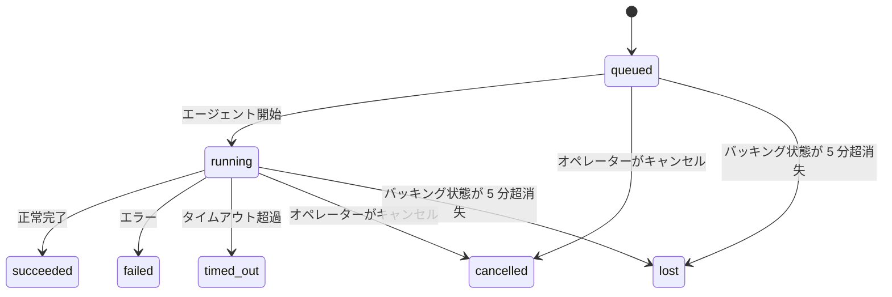

---
read_when:
    - 進行中または最近完了したバックグラウンド処理の確認
    - 切り離されたエージェント実行の配信失敗をデバッグする
    - バックグラウンド実行とセッション、Cron、Heartbeat の関係を理解する
sidebarTitle: Background tasks
summary: ACP 実行、サブエージェント、Cron 実行、CLI 操作のバックグラウンドタスク追跡
title: バックグラウンドタスク
x-i18n:
    generated_at: "2026-07-11T21:56:02Z"
    model: gpt-5.6
    postprocess_version: locale-links-v1
    provider: openai
    source_hash: 0a945e8103c5df5a64785f326a9d0b08784ac32a2ca6fa3d4c399d75fc54be2b
    source_path: automation/tasks.md
    workflow: 16
---

<Note>
スケジューリングについては、適切な仕組みを選択するために [自動化](/ja-JP/automation) を参照してください。このページはバックグラウンド作業のアクティビティ台帳であり、スケジューラーではありません。
</Note>

バックグラウンドタスクは、**メインの会話セッションの外部**で実行される作業（ACP の実行、サブエージェントの起動、Cron ジョブの実行、CLI から開始された操作）を追跡します。

タスクはセッション、Cron ジョブ、Heartbeat の代わりにはなりません。タスクは、切り離された作業で何が、いつ発生し、成功したかどうかを記録する**アクティビティ台帳**です。

<Note>
すべてのエージェント実行がタスクを作成するわけではありません。Heartbeat ターンと通常の対話型チャットでは作成されません。すべての Cron 実行、ACP の起動、サブエージェントの起動、および Gateway からディスパッチされた CLI エージェントコマンドでは作成されます。
</Note>

## 要約

- タスクはスケジューラーではなく**記録**です。Cron と Heartbeat が作業を実行する_タイミング_を決定し、タスクは_何が起きたか_を追跡します。
- ACP、サブエージェント、すべての Cron ジョブ、および CLI 操作はタスクを作成します。Heartbeat ターンは作成しません。
- 各タスクは `queued → running → terminal`（成功、失敗、タイムアウト、キャンセル、または消失）の順に遷移します。
- Cron ランタイムがジョブを所有している間、Cron タスクはアクティブなままです。メモリ内のランタイム状態が失われた場合、タスクのメンテナンスは、タスクを消失としてマークする前に永続的な Cron 実行履歴を確認します。
- 完了はプッシュ駆動です。切り離された作業は、完了時に直接通知するか、要求元のセッションまたは Heartbeat を起動できるため、通常、ステータスのポーリングループは適切ではありません。
- 分離された Cron 実行とサブエージェントの完了では、最終的なクリーンアップの記録処理を行う前に、子セッションで追跡されているブラウザータブやプロセスをベストエフォートでクリーンアップします。
- 分離された Cron の配信では、子孫サブエージェントの作業がまだ完了処理中の場合、古い中間親応答を抑制し、配信前に届いた場合は子孫の最終出力を優先します。
- 完了通知はチャネルへ直接配信されるか、次回の Heartbeat 用にキューへ追加されます。
- `openclaw tasks list` はすべてのタスクを表示し、`openclaw tasks audit` は問題を明らかにします。
- 終端状態の記録は 7 日間（`lost` の記録は 24 時間）保持された後、自動的に削除されます。

## クイックスタート

<Tabs>
  <Tab title="一覧表示と絞り込み">
    ```bash
    # すべてのタスクを一覧表示（新しい順）
    openclaw tasks list

    # ランタイムまたはステータスで絞り込み
    openclaw tasks list --runtime acp
    openclaw tasks list --status running
    ```

  </Tab>
  <Tab title="詳細確認">
    ```bash
    # 特定のタスクの詳細を表示（タスク ID、実行 ID、またはセッションキーを指定）
    openclaw tasks show <lookup>
    ```
  </Tab>
  <Tab title="キャンセルと通知">
    ```bash
    # 実行中のタスクをキャンセル（子セッションを終了）
    openclaw tasks cancel <lookup>

    # タスクの通知ポリシーを変更
    openclaw tasks notify <lookup> state_changes
    ```

  </Tab>
  <Tab title="監査とメンテナンス">
    ```bash
    # 健全性監査を実行
    openclaw tasks audit

    # メンテナンスをプレビューまたは適用
    openclaw tasks maintenance
    openclaw tasks maintenance --apply
    ```

  </Tab>
  <Tab title="タスクフロー">
    ```bash
    # TaskFlow の状態を確認
    openclaw tasks flow list
    openclaw tasks flow show <lookup>
    openclaw tasks flow cancel <lookup>
    ```
  </Tab>
</Tabs>

## タスクを作成するもの

| ソース                 | ランタイム種別 | タスク記録が作成されるタイミング                                          | デフォルトの通知ポリシー |
| ---------------------- | ------------ | ---------------------------------------------------------------------- | --------------------- |
| ACP バックグラウンド実行    | `acp`        | 子 ACP セッションを起動したとき                                           | `done_only`           |
| サブエージェントのオーケストレーション | `subagent`   | `sessions_spawn` でサブエージェントを起動したとき                               | `done_only`           |
| Cron ジョブ（全種別）  | `cron`       | Cron の実行ごと（メインセッションおよび分離実行）                       | `silent`              |
| CLI 操作         | `cli`        | Gateway 経由で実行される `openclaw agent` コマンド                 | `silent`              |
| エージェントのメディアジョブ       | `cli`        | セッションに関連付けられた `image_generate`/`music_generate`/`video_generate` の実行 | `silent`              |

<AccordionGroup>
  <Accordion title="Cron とメディアの通知デフォルト">
    Cron タスク（メインセッションおよび分離実行）は `silent` 通知ポリシーを使用します。追跡用の記録は作成しますが、タスク自体の通知は生成しません。配信経路は Cron が所有します。

    セッションに関連付けられた `image_generate`、`music_generate`、`video_generate` の実行も `silent` 通知ポリシーを使用します。これらもタスク記録を作成しますが、完了は内部起動として元のエージェントセッションに返されるため、エージェント自身がフォローアップメッセージを記述し、完成したメディアを添付できます。要求元エージェントは、通常の可視応答の契約に従います。設定されている場合は自動的に最終応答を返し、セッションでメッセージツールによる応答が必要な場合は `message(action="send")` と `NO_REPLY` を使用します。要求元セッションがすでにアクティブでないか、アクティブな起動に失敗し、かつ完了エージェントが生成されたメディアの一部または全部を取りこぼした場合、OpenClaw は不足しているメディアのみを含む冪等な直接フォールバックを元のチャネル送信先へ送ります。

  </Accordion>
  <Accordion title="同時メディア生成のガードレール">
    セッションに関連付けられたメディア生成タスクがまだアクティブな間、`image_generate`、`music_generate`、`video_generate` は誤った再試行を防ぎます。同じプロンプトまたは要求に対して呼び出しを繰り返すと、重複したタスクを開始する代わりに一致するアクティブタスクのステータスを返します。一方、異なるプロンプトでは独自のタスクを開始できます。エージェント側から進捗またはステータスを明示的に確認する場合は、`action: "status"` を使用してください。
  </Accordion>
  <Accordion title="タスクを作成しないもの">
    - Heartbeat ターン（メインセッション）。[Heartbeat](/ja-JP/gateway/heartbeat) を参照
    - 通常の対話型チャットターン
    - 直接の `/command` 応答

  </Accordion>
</AccordionGroup>

## タスクのライフサイクル



| ステータス      | 意味                                                               |
| ----------- | --------------------------------------------------------------------------- |
| `queued`    | 作成済みで、エージェントの開始待ち                                     |
| `running`   | エージェントターンが実行中                                            |
| `succeeded` | 正常に完了                                                      |
| `failed`    | エラーで完了                                                     |
| `timed_out` | 設定されたタイムアウトを超過                                             |
| `cancelled` | オペレーターが `openclaw tasks cancel` で停止したか、実行が中止された |
| `lost`      | 5 分間の猶予期間後に、ランタイムが信頼できるバッキング状態を失った  |

遷移は自動的に行われます。エージェント実行のライフサイクルイベント（開始、終了、エラー）がタスクのステータスを更新するため、手動で管理する必要はありません。

アクティブなタスク記録では、エージェント実行の完了が信頼できる判定基準です。切り離された実行が成功すると `succeeded`、通常の実行エラーでは `failed`、タイムアウトでは `timed_out`、キャンセルまたは中止では `cancelled` として確定します。タスクが終端状態になると、後続のライフサイクルシグナルによって状態が後退することはありません。オペレーターがキャンセルしたタスクや、すでに `failed`/`timed_out`/`lost` になっているタスクは、その後に成功シグナルが届いてもその状態を維持します。

`lost` の判定はランタイムを考慮します。

- ACP タスク: Gateway プロセス内で実行中の ACP ターンだけが、実行が継続していることを証明します。永続化されたセッションメタデータだけでは証明になりません。オフラインの CLI 監査は保守的に動作し、ACP タスクを回収することはありません。
- サブエージェントタスク: バッキングとなる子セッションが対象エージェントのストアから消失した場合（または再起動復旧用のトゥームストーンを持つ場合）。
- Cron タスク: Cron ランタイムがジョブをアクティブとして追跡しておらず、かつ永続的な Cron 実行履歴にもその実行の終端結果が記録されていない場合。オフラインの CLI 監査は、自身の空のプロセス内 Cron ランタイム状態を信頼できる判定基準として扱いません。
- CLI タスク: 実行 ID またはソース ID を持つタスクは実行中のランコンテキストを使用するため、Gateway が所有する実行が消失した後も、残存する子セッションやチャットセッションの行によってタスクがアクティブに保たれることはありません。実行識別子を持たない旧形式の CLI タスクだけは、引き続き子セッションへフォールバックします。Gateway 経由の `openclaw agent` 実行も実行結果から確定されるため、完了した実行がスイーパーによって `lost` とマークされるまでアクティブなままになることはありません。

## 配信と通知

タスクが終端状態に達すると、OpenClaw が通知します。配信経路は 2 つあります。

**直接配信** - タスクにチャネル送信先（`requesterOrigin`）がある場合、完了メッセージはそのチャネル（Discord、Slack、Telegram など）へ直接送信されます。ただし、グループおよびチャネルのタスク完了は要求元セッションを経由してルーティングされ、親エージェントが可視応答を記述できるようにします。サブエージェントの完了では、OpenClaw は利用可能な場合に関連付けられたスレッドまたはトピックのルーティングも維持し、直接配信を断念する前に、要求元セッションに保存されているルート（`lastChannel` / `lastTo` / `lastAccountId`）から不足している `to` / アカウントを補完できます。

**セッションキュー配信** - 直接配信に失敗した場合、または送信元が設定されていない場合、更新は要求元セッションのシステムイベントとしてキューに追加され、次回の Heartbeat で表示されます。

<Tip>
セッションのキューに追加されたタスク完了は、即座に Heartbeat の起動をトリガーするため、結果をすぐに確認できます。次に予定されている Heartbeat の実行時刻まで待つ必要はありません。
</Tip>

つまり、通常のワークフローはプッシュベースです。切り離された作業を一度開始した後は、完了時にランタイムが起動または通知するのを待ちます。タスク状態をポーリングするのは、デバッグ、介入、または明示的な監査が必要な場合だけにしてください。

### 通知ポリシー

各タスクについて受け取る通知の量を制御します。

| ポリシー                | 配信される内容                                       |
| --------------------- | ------------------------------------------------------- |
| `done_only`（デフォルト） | 終端状態のみ（成功、失敗など）           |
| `state_changes`       | すべての状態遷移と進捗更新              |
| `silent`              | 何も配信しない（Cron、CLI、メディアタスクのデフォルト） |

タスクの実行中にポリシーを変更できます。

```bash
openclaw tasks notify <lookup> state_changes
```

## CLI リファレンス

<AccordionGroup>
  <Accordion title="tasks list">
    ```bash
    openclaw tasks list [--runtime <acp|subagent|cron|cli>] [--status <status>] [--json]
    ```

    出力列: タスク、種類、ステータス、配信、実行、子セッション、概要。引数なしの `openclaw tasks` は `openclaw tasks list` と同様に動作します。

  </Accordion>
  <Accordion title="tasks show">
    ```bash
    openclaw tasks show <lookup> [--json]
    ```

    検索トークンには、タスク ID、実行 ID、またはセッションキーを指定できます。タイミング、配信状態、エラー、終端時の概要を含む完全な記録を表示します。

  </Accordion>
  <Accordion title="tasks cancel">
    ```bash
    openclaw tasks cancel <lookup>
    ```

    ACP およびサブエージェントのタスクでは、子セッションを終了します。ACP および Cron のキャンセルは、実行中の Gateway（`tasks.cancel`）を経由してルーティングされます。CLI で追跡されるタスクでは、キャンセルはタスクレジストリに記録されます（独立した子ランタイムハンドルはありません）。ステータスは `cancelled` に遷移し、該当する場合は配信通知が送信されます。

  </Accordion>
  <Accordion title="tasks notify">
    ```bash
    openclaw tasks notify <lookup> <done_only|state_changes|silent>
    ```
  </Accordion>
  <Accordion title="tasks audit">
    ```bash
    openclaw tasks audit [--severity <warn|error>] [--code <name>] [--limit <n>] [--json]
    ```

    タスクと TaskFlow の運用上の問題を 1 つのレポートで明らかにします。問題が検出された場合、検出結果は `openclaw status` にも表示されます。

    タスクの検出結果:

    | 検出項目                  | 重大度     | 発生条件                                                                                                     |
    | ------------------------- | ---------- | ------------------------------------------------------------------------------------------------------------ |
    | `stale_queued`            | 警告       | キューに入ってから10分以上経過                                                                               |
    | `stale_running`           | エラー     | 実行開始から30分以上経過                                                                                     |
    | `lost`                    | 警告/エラー | ランタイムに基づくタスクの所有情報が消失。保持中の消失タスクは `cleanupAfter` までは警告となり、その後エラーになる |
    | `delivery_failed`         | 警告       | 配信に失敗し、通知ポリシーが `silent` ではない                                                               |
    | `missing_cleanup`         | 警告       | 終端タスクにクリーンアップのタイムスタンプがない                                                             |
    | `inconsistent_timestamps` | 警告       | タイムライン違反（たとえば開始前に終了している）                                                             |

    TaskFlow の検出項目:

    | 検出項目               | 重大度     | 発生条件                                                                    |
    | ---------------------- | ---------- | --------------------------------------------------------------------------- |
    | `restore_failed`       | エラー     | SQLite からのフローレジストリの復元に失敗                                   |
    | `stale_running`        | エラー     | 実行中のフローが30分以上進行していない                                      |
    | `stale_waiting`        | 警告       | 待機中のフローが30分以上進行していない                                      |
    | `stale_blocked`        | 警告       | ブロック中のフローが30分以上進行していない                                  |
    | `cancel_stuck`         | 警告       | キャンセル要求から5分以上経過し、アクティブな子タスクがないにもかかわらず、まだ終端状態になっていない |
    | `missing_linked_tasks` | 警告/エラー | リンクされたタスクも待機状態もない、停滞した管理対象フロー                  |
    | `blocked_task_missing` | 警告       | ブロック中のフローが、すでに存在しないタスク ID を参照している              |

  </Accordion>
  <Accordion title="タスクのメンテナンス">
    ```bash
    openclaw tasks maintenance [--json]
    openclaw tasks maintenance --apply [--json]
    ```

    タスク、TaskFlow の状態、停滞した Cron 実行セッションレジストリ行について、整合、クリーンアップ時刻の付与、削除をプレビューまたは適用するには、これを使用します。

    整合処理はランタイムを考慮します:

    - ACP タスクでは Gateway 内で実行中のプロセス内ターンが必要です。サブエージェントタスクでは、その基盤となる子セッションを確認します。
    - 子セッションに再起動復旧用のトゥームストーンがあるサブエージェントタスクは、復旧可能な基盤セッションとして扱われず、消失としてマークされます。
    - Cron タスクでは、Cron ランタイムがまだジョブを所有しているかを確認し、その後 `lost` にフォールバックする前に、永続化された Cron 実行ログまたはジョブ状態から終端ステータスを復元します。メモリ内の Cron アクティブジョブ集合について信頼できるのは Gateway プロセスだけです。オフラインの CLI 監査は永続化された履歴を使用しますが、ローカルの集合が空であるという理由だけで Cron タスクを消失としてマークすることはありません。
    - 実行 ID を持つ CLI タスクでは、子セッションやチャットセッションの行だけでなく、所有元で実行中の実行コンテキストを確認します。

    完了時のクリーンアップもランタイムを考慮します:

    - サブエージェントの完了時には、通知のクリーンアップを続行する前に、子セッションで追跡されているブラウザタブやプロセスをベストエフォートで閉じます。
    - 分離された Cron の完了時には、実行を完全に終了する前に、Cron セッションで追跡されているブラウザタブやプロセスをベストエフォートで閉じます。
    - 分離された Cron の配信は、必要に応じて子孫サブエージェントによる後続処理の完了を待ち、古くなった親の確認テキストを通知せずに抑制します。
    - サブエージェントの完了配信では、子の最新の可視アシスタントテキストだけを使用します。ツールまたは `toolResult` の出力が子の結果テキストに昇格することはありません。終端状態が失敗である実行では、取得した応答テキストを再送せず、失敗ステータスを通知します。
    - クリーンアップの失敗によって、実際のタスク結果が隠されることはありません。

    メンテナンスを適用すると、OpenClaw は7日より古い `cron:<jobId>:run:<runId>` セッションレジストリ行も削除します。その際、現在実行中の Cron ジョブの行は保持し、Cron 以外のセッション行には変更を加えません。

  </Accordion>
  <Accordion title="タスクフローの一覧表示 | 詳細表示 | キャンセル">
    ```bash
    openclaw tasks flow list [--status <status>] [--json]
    openclaw tasks flow show <lookup> [--json]
    openclaw tasks flow cancel <lookup>
    ```

    フロー検索トークンには、フロー ID または所有者キーを指定できます。個々のバックグラウンドタスクレコードではなく、それらをオーケストレーションする [Task Flow](/ja-JP/automation/taskflow) を確認したい場合に使用します。

  </Accordion>
</AccordionGroup>

## チャットのタスクボード（`/tasks`）

任意のチャットセッションで `/tasks` を使用すると、そのセッションにリンクされたバックグラウンドタスクを確認できます。ボードには、アクティブなタスクと最近完了したタスクが最大5件表示され、ランタイム、ステータス、タイミング、進捗またはエラーの詳細を確認できます。

現在のセッションに表示可能なリンク済みタスクがない場合、`/tasks` はエージェントローカルのタスク件数にフォールバックするため、他のセッションの詳細を漏らさずに概要を確認できます。

運用者向けの完全な台帳を確認するには、CLI の `openclaw tasks list` を使用します。

### Control UI

Web の Control UI には、サイドバーにライブのアクティブタスクと最近のバックグラウンドタスクを表示する **タスク** ページがあります。進捗の確認、リンクされたセッションを開く操作、台帳の更新、キュー内および実行中のタスクのキャンセルに使用します。

チャットペインにも、そのペインのエージェントを対象とする折りたたみ可能な **バックグラウンドタスク** レールがあります。停止コントロール付きの実行中タスクとサブエージェント、完了済みセクション、各タスクの子セッションを開く「トランスクリプトを表示」リンクが含まれます。ペインヘッダーのアクティビティ切り替えボタン（単一ペインチャットではフローティングアクティビティボタン）から開きます。

## ステータス統合（タスク負荷）

`openclaw status` には、タスクの概要行が含まれます:

```
タスク    アクティブ 2件 · キュー内 1件 · 実行中 1件 · 問題 1件 · 監査は正常 · 追跡中 6件
```

概要には、アクティブな作業（`queued` + `running`）、失敗（`failed` + `timed_out` + `lost`）、監査の検出項目、追跡対象レコードの総数が集計されます。JSON ペイロードでは、ランタイム（`acp`、`subagent`、`cron`、`cli`）別の件数も表示されます。

`/status` と `session_status` ツールはどちらも、クリーンアップを考慮したタスクのスナップショットを使用します。アクティブなタスクが優先され、期限切れの行は非表示になり、終端タスクは最近の短い期間（5分間）だけ表示されます。アクティブな作業が残っていない場合は失敗が中心に表示されます。これにより、ステータスカードには現在重要な情報だけが表示されます。

## ストレージとメンテナンス

### タスクの保存場所

タスクレコードと配信状態は、共有 OpenClaw SQLite 状態データベースに永続化されます:

```
~/.openclaw/state/openclaw.sqlite   (テーブル: task_runs, task_delivery_state, flow_runs)
```

状態ルート全体（デフォルトは `~/.openclaw`）を別の場所へ移動するには、`OPENCLAW_STATE_DIR` を設定します。共有データベースのパスも一緒に移動します。

レジストリは初回使用時にメモリへ読み込まれ、書き込みのたびに SQLite へ永続化されるため、Gateway の再起動後もレコードが保持されます。WAL の増大は、SQLite のデフォルトの自動チェックポイントしきい値と定期的な `PASSIVE` チェックポイントによって制限されます。シャットダウン時と明示的なメンテナンス時のチェックポイントでは `TRUNCATE` を使用するため、バックグラウンドスイーパーをアクティブな読み取りの完了待ちにせず、通常の終了時に WAL 領域を回収できます。

古いインストールの従来のサイドカーストア（`tasks/runs.sqlite`、`flows/registry.sqlite`）は、`openclaw doctor` によって共有データベースへインポートされます。

### 自動メンテナンス

スイーパーは **60秒** ごとに実行され（初回は Gateway の起動から約5秒後）、次の4つを処理します:

<Steps>
  <Step title="整合">
    アクティブなタスクに、信頼できるランタイムの基盤がまだ存在するかを確認します。ACP タスクには実行中のプロセス内ターンが必要です。サブエージェントタスクは子セッションの状態を使用し、Cron タスクはアクティブジョブの所有情報と永続化された実行履歴を使用します。実行 ID を持つ CLI タスクは、所有元の実行コンテキストを使用します。基盤となる状態が5分以上（子を持たないネイティブのサブエージェントタスクでは30分以上）失われている場合、そのタスクは `lost` としてマークされます。
  </Step>
  <Step title="ACP セッションの修復">
    親が所有する単発 ACP セッションのうち、終端状態または孤立状態のものを閉じます。また、アクティブな会話の関連付けが残っていない場合に限り、停滞した終端状態または孤立状態の永続 ACP セッションを閉じます。
  </Step>
  <Step title="クリーンアップ時刻の付与">
    終端タスクに `cleanupAfter` タイムスタンプ（終端時刻 + 保持期間）を設定します。保持期間中、消失タスクは引き続き監査で警告として表示されます。`cleanupAfter` の期限が切れた後、またはクリーンアップのメタデータがない場合は、エラーになります。
  </Step>
  <Step title="削除">
    `cleanupAfter` の日付を過ぎたレコードを削除します。
  </Step>
</Steps>

<Note>
**保持期間:** 終端タスクのレコードは **7日間**（`lost` レコードは **24時間**）保持された後、自動的に削除されます。設定は不要です。
</Note>

## タスクと他のシステムとの関係

<AccordionGroup>
  <Accordion title="タスクと Task Flow">
    [Task Flow](/ja-JP/automation/taskflow) は、バックグラウンドタスクの上位にあるフローオーケストレーションレイヤーです。1つのフローは、管理同期モードまたはミラー同期モードを使用して、そのライフサイクル全体で複数のタスクを調整できます。個々のタスクレコードを確認するには `openclaw tasks` を使用し、それらをオーケストレーションするフローを確認するには `openclaw tasks flow` を使用します。

  </Accordion>
  <Accordion title="タスクと Cron">
    Cron ジョブの定義、ランタイムの実行状態、実行履歴は、OpenClaw の共有 SQLite 状態データベースに保存されます。メインセッションと分離セッションのどちらでも、**すべての** Cron 実行で通知ポリシーが `silent` のタスクレコードが作成されるため、Cron 実行自体によるタスク通知を生成せずに追跡できます。

    [Cron ジョブ](/ja-JP/automation/cron-jobs)を参照してください。

  </Accordion>
  <Accordion title="タスクと Heartbeat">
    Heartbeat の実行はメインセッションのターンであり、タスクレコードは作成されません。タスクが完了すると、Heartbeat のウェイクをトリガーし、結果をすぐに確認できるようにすることができます。

    [Heartbeat](/ja-JP/gateway/heartbeat)を参照してください。

  </Accordion>
  <Accordion title="タスクとセッション">
    タスクは `childSessionKey`（作業が実行される場所）と `requesterSessionKey`（開始した主体）を参照することがあります。`agentId` は作業を実行するエージェントを識別し、要求者フィールドと所有者フィールドは起動および制御のコンテキストを保持します。セッションは会話のコンテキストであり、タスクはその上に追加されるアクティビティ追跡です。
  </Accordion>
  <Accordion title="タスクとエージェント実行">
    タスクの `runId` は、作業を実行するエージェント実行にリンクします。エージェントのライフサイクルイベント（開始、終了、エラー）はタスクのステータスを自動的に更新するため、ライフサイクルを手動で管理する必要はありません。
  </Accordion>
</AccordionGroup>

## 関連項目

- [自動化](/ja-JP/automation) - すべての自動化メカニズムの概要
- [CLI: タスク](/ja-JP/cli/tasks) - CLI コマンドリファレンス
- [Heartbeat](/ja-JP/gateway/heartbeat) - メインセッションの定期ターン
- [スケジュール済みタスク](/ja-JP/automation/cron-jobs) - バックグラウンド作業のスケジュール設定
- [Task Flow](/ja-JP/automation/taskflow) - タスクの上位にあるフローオーケストレーション
