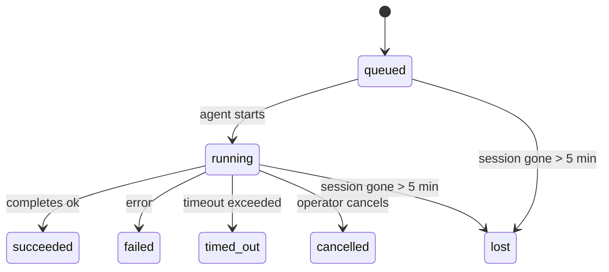

---
read_when:
    - 進行中または最近完了したバックグラウンド作業の確認
    - 分離されたエージェント実行の配信失敗のデバッグ
    - バックグラウンド実行がセッション、cron、heartbeat とどのように関連するかを理解する
summary: ACP 実行、サブエージェント、分離された cron ジョブ、および CLI 操作のバックグラウンドタスク追跡
title: バックグラウンドタスク
x-i18n:
    generated_at: "2026-04-10T04:43:44Z"
    model: gpt-5.4
    provider: openai
    source_hash: d7b5ba41f1025e0089986342ce85698bc62f676439c3ccf03f3ed146beb1b1ac
    source_path: automation/tasks.md
    workflow: 15
---

# バックグラウンドタスク

> **スケジューリングをお探しですか？** 適切な仕組みの選択については [Automation & Tasks](/ja-JP/automation) を参照してください。このページで扱うのはバックグラウンド作業の**追跡**であり、スケジューリングではありません。

バックグラウンドタスクは、**メインの会話セッションの外側**で実行される作業を追跡します。
ACP 実行、サブエージェントの起動、分離された cron ジョブの実行、CLI から開始された操作が対象です。

タスクはセッション、cron ジョブ、heartbeat を置き換えるものではありません。これらは、切り離された作業で何が起きたか、いつ起きたか、成功したかどうかを記録する**アクティビティ台帳**です。

<Note>
すべてのエージェント実行がタスクを作成するわけではありません。heartbeat ターンと通常の対話チャットでは作成されません。すべての cron 実行、ACP 起動、サブエージェント起動、CLI エージェントコマンドでは作成されます。
</Note>

## 要点

- タスクはスケジューラではなく**記録**です。作業を _いつ_ 実行するかは cron と heartbeat が決め、タスクは _何が起きたか_ を追跡します。
- ACP、サブエージェント、すべての cron ジョブ、CLI 操作はタスクを作成します。heartbeat ターンは作成しません。
- 各タスクは `queued → running → terminal`（succeeded、failed、timed_out、cancelled、または lost）を経由します。
- cron タスクは、cron ランタイムがそのジョブをまだ所有している間はライブ状態を保ちます。チャットに紐づく CLI タスクは、所有する実行コンテキストがまだアクティブな間だけライブ状態を保ちます。
- 完了はプッシュ駆動です。切り離された作業は完了時に直接通知したり、要求元のセッション/heartbeat を起こしたりできるため、通常はステータスのポーリングループは適した形ではありません。
- 分離された cron 実行とサブエージェント完了では、最終的なクリーンアップ記録の前に、その子セッションの追跡対象ブラウザータブ/プロセスをベストエフォートでクリーンアップします。
- 分離された cron の配信では、子孫サブエージェント作業の排出が続いている間は古い中間親返信を抑制し、配信前に子孫の最終出力が到着した場合はそれを優先します。
- 完了通知はチャネルに直接配信されるか、次の heartbeat のためにキューに入れられます。
- `openclaw tasks list` はすべてのタスクを表示し、`openclaw tasks audit` は問題を表面化します。
- 終端レコードは 7 日間保持され、その後自動的に削除されます。

## クイックスタート

```bash
# すべてのタスクを一覧表示（新しい順）
openclaw tasks list

# ランタイムまたはステータスで絞り込み
openclaw tasks list --runtime acp
openclaw tasks list --status running

# 特定のタスクの詳細を表示（ID、run ID、または session key で）
openclaw tasks show <lookup>

# 実行中のタスクをキャンセル（子セッションを終了）
openclaw tasks cancel <lookup>

# タスクの通知ポリシーを変更
openclaw tasks notify <lookup> state_changes

# ヘルス監査を実行
openclaw tasks audit

# メンテナンスをプレビューまたは適用
openclaw tasks maintenance
openclaw tasks maintenance --apply

# TaskFlow の状態を確認
openclaw tasks flow list
openclaw tasks flow show <lookup>
openclaw tasks flow cancel <lookup>
```

## タスクを作成するもの

| ソース | ランタイム種別 | タスクレコードが作成されるタイミング | デフォルト通知ポリシー |
| ---------------------- | ------------ | ------------------------------------------------------ | --------------------- |
| ACP バックグラウンド実行 | `acp`        | 子 ACP セッションの起動時 | `done_only`           |
| サブエージェントオーケストレーション | `subagent`   | `sessions_spawn` によるサブエージェント起動時 | `done_only`           |
| cron ジョブ（全種別） | `cron`       | すべての cron 実行時（メインセッションと分離実行の両方） | `silent`              |
| CLI 操作 | `cli`        | Gateway を通る `openclaw agent` コマンド | `silent`              |
| エージェントメディアジョブ | `cli`        | セッションに紐づく `video_generate` 実行 | `silent`              |

メインセッションの cron タスクはデフォルトで `silent` 通知ポリシーを使用します。追跡用のレコードは作成されますが、通知は生成されません。分離された cron タスクもデフォルトでは `silent` ですが、独自のセッションで実行されるため、より可視性があります。

セッションに紐づく `video_generate` 実行も `silent` 通知ポリシーを使用します。これらもタスクレコードを作成しますが、完了は内部 wake として元のエージェントセッションに返されるため、エージェント自身がフォローアップメッセージを書き、完成した動画を添付できます。`tools.media.asyncCompletion.directSend` を有効にすると、非同期の `music_generate` と `video_generate` の完了は、要求元セッションの wake パスにフォールバックする前に、まずチャネルへの直接配信を試みます。

セッションに紐づく `video_generate` タスクがまだアクティブな間、このツールはガードレールとしても機能します。同じセッション内で `video_generate` を繰り返し呼び出すと、2 つ目の同時生成を開始する代わりに、アクティブなタスクのステータスを返します。エージェント側から明示的な進捗/ステータス確認をしたい場合は `action: "status"` を使ってください。

**タスクを作成しないもの:**

- heartbeat ターン — メインセッション。詳しくは [Heartbeat](/ja-JP/gateway/heartbeat)
- 通常の対話チャットターン
- 直接の `/command` 応答

## タスクのライフサイクル



| ステータス | 意味 |
| ----------- | -------------------------------------------------------------------------- |
| `queued`    | 作成済みで、エージェントの開始待ち |
| `running`   | エージェントターンを現在実行中 |
| `succeeded` | 正常に完了 |
| `failed`    | エラーで完了 |
| `timed_out` | 設定されたタイムアウトを超過 |
| `cancelled` | オペレーターが `openclaw tasks cancel` で停止 |
| `lost`      | 5 分の猶予期間後に、ランタイムが権威ある裏付け状態を失った |

遷移は自動で発生します。関連するエージェント実行が終了すると、タスクステータスはそれに合わせて更新されます。

`lost` はランタイム認識型です。

- ACP タスク: 裏付けとなる ACP 子セッションメタデータが消えた。
- サブエージェントタスク: 裏付けとなる子セッションが対象エージェントストアから消えた。
- cron タスク: cron ランタイムがそのジョブをアクティブとして追跡しなくなった。
- CLI タスク: 分離された子セッションタスクは子セッションを使用し、チャットに紐づく CLI タスクは代わりにライブの実行コンテキストを使用するため、チャネル/グループ/ダイレクトのセッション行が残っていても、それだけではライブ状態を維持しません。

## 配信と通知

タスクが終端状態に達すると、OpenClaw は通知します。配信経路は 2 つあります。

**直接配信** — タスクにチャネルの対象（`requesterOrigin`）がある場合、完了メッセージはそのチャネル（Telegram、Discord、Slack など）に直接送られます。サブエージェント完了では、利用可能な場合にスレッド/トピックへの束縛ルーティングも保持され、直接配信を諦める前に、要求元セッションの保存済みルート（`lastChannel` / `lastTo` / `lastAccountId`）から不足している `to` / アカウントを補完できます。

**セッションキュー配信** — 直接配信に失敗した場合、または origin が設定されていない場合、更新は要求元セッション内のシステムイベントとしてキューに入れられ、次の heartbeat で表示されます。

<Tip>
タスク完了は heartbeat の即時 wake をトリガーするため、結果をすぐに確認できます。次に予定されている heartbeat ティックを待つ必要はありません。
</Tip>

つまり、通常のワークフローはプッシュベースです。切り離された作業を一度開始したら、完了時にランタイムが wake または通知するのに任せてください。タスク状態をポーリングするのは、デバッグ、介入、または明示的な監査が必要なときだけにしてください。

### 通知ポリシー

各タスクについてどれだけ通知を受けるかを制御します。

| ポリシー | 配信される内容 |
| --------------------- | ----------------------------------------------------------------------- |
| `done_only` (default) | 終端状態のみ（succeeded、failed など） — **これがデフォルトです** |
| `state_changes`       | すべての状態遷移と進捗更新 |
| `silent`              | 何も送られません |

タスク実行中にポリシーを変更できます。

```bash
openclaw tasks notify <lookup> state_changes
```

## CLI リファレンス

### `tasks list`

```bash
openclaw tasks list [--runtime <acp|subagent|cron|cli>] [--status <status>] [--json]
```

出力列: タスク ID、種類、ステータス、配信、Run ID、子セッション、概要。

### `tasks show`

```bash
openclaw tasks show <lookup>
```

lookup トークンにはタスク ID、run ID、または session key を指定できます。タイミング、配信状態、エラー、終端サマリーを含む完全なレコードを表示します。

### `tasks cancel`

```bash
openclaw tasks cancel <lookup>
```

ACP タスクとサブエージェントタスクでは、子セッションを終了します。CLI 追跡タスクでは、キャンセルはタスクレジストリに記録されます（別個の子ランタイムハンドルはありません）。ステータスは `cancelled` に遷移し、該当する場合は配信通知が送られます。

### `tasks notify`

```bash
openclaw tasks notify <lookup> <done_only|state_changes|silent>
```

### `tasks audit`

```bash
openclaw tasks audit [--json]
```

運用上の問題を表面化します。問題が検出されると、検出結果は `openclaw status` にも表示されます。

| 検出項目 | 重要度 | トリガー |
| ------------------------- | -------- | ----------------------------------------------------- |
| `stale_queued`            | warn     | 10 分を超えて queued のまま |
| `stale_running`           | error    | 30 分を超えて running のまま |
| `lost`                    | error    | ランタイムに裏付けられたタスク所有権が消失 |
| `delivery_failed`         | warn     | 配信に失敗し、通知ポリシーが `silent` ではない |
| `missing_cleanup`         | warn     | 終端タスクにクリーンアップタイムスタンプがない |
| `inconsistent_timestamps` | warn     | タイムライン違反（例: 開始前に終了している） |

### `tasks maintenance`

```bash
openclaw tasks maintenance [--json]
openclaw tasks maintenance --apply [--json]
```

これを使用して、タスクおよび Task Flow 状態の照合、クリーンアップスタンプ付与、削除のプレビューまたは適用を行います。

照合はランタイム認識型です。

- ACP/サブエージェントタスクは、裏付けとなる子セッションを確認します。
- cron タスクは、cron ランタイムがまだそのジョブを所有しているかを確認します。
- チャットに紐づく CLI タスクは、チャットセッション行だけでなく、所有するライブの実行コンテキストを確認します。

完了クリーンアップもランタイム認識型です。

- サブエージェント完了では、通知クリーンアップの継続前に、子セッションの追跡対象ブラウザータブ/プロセスをベストエフォートで閉じます。
- 分離された cron 完了では、実行が完全に終了する前に、cron セッションの追跡対象ブラウザータブ/プロセスをベストエフォートで閉じます。
- 分離された cron 配信では、必要に応じて子孫サブエージェントの後続処理を待ち、古い親確認テキストを通知せずに抑制します。
- サブエージェント完了配信では、最新の可視アシスタントテキストを優先し、それが空の場合はサニタイズ済みの最新 tool/toolResult テキストにフォールバックします。また、タイムアウトのみの tool-call 実行は短い部分進捗サマリーに集約されることがあります。
- クリーンアップ失敗によって実際のタスク結果が隠されることはありません。

### `tasks flow list|show|cancel`

```bash
openclaw tasks flow list [--status <status>] [--json]
openclaw tasks flow show <lookup> [--json]
openclaw tasks flow cancel <lookup>
```

個々のバックグラウンドタスク記録ではなく、オーケストレーションしている Task Flow 自体が気になる対象である場合に使用します。

## チャットタスクボード（`/tasks`）

任意のチャットセッションで `/tasks` を使うと、そのセッションに紐づくバックグラウンドタスクを確認できます。ボードには、ランタイム、ステータス、タイミング、進捗またはエラーの詳細とともに、アクティブなタスクと最近完了したタスクが表示されます。

現在のセッションに表示可能な紐づきタスクがない場合、`/tasks` はエージェントローカルのタスク数にフォールバックするため、他セッションの詳細を漏らすことなく概要を確認できます。

完全なオペレーター台帳を確認するには、CLI を使用します: `openclaw tasks list`。

## ステータス統合（タスク負荷）

`openclaw status` には、ひと目で分かるタスクサマリーが含まれます。

```
Tasks: 3 queued · 2 running · 1 issues
```

このサマリーでは、次を報告します。

- **active** — `queued` + `running` の件数
- **failures** — `failed` + `timed_out` + `lost` の件数
- **byRuntime** — `acp`、`subagent`、`cron`、`cli` ごとの内訳

`/status` と `session_status` ツールはどちらも、クリーンアップ認識型のタスクスナップショットを使用します。アクティブなタスクが優先され、古い完了済み行は非表示になり、最近の失敗はアクティブな作業が何も残っていない場合にのみ表示されます。これにより、ステータスカードは今重要なことに集中したままになります。

## ストレージとメンテナンス

### タスクの保存場所

タスクレコードは、次の SQLite に永続化されます。

```
$OPENCLAW_STATE_DIR/tasks/runs.sqlite
```

レジストリは Gateway 起動時にメモリへ読み込まれ、再起動後も永続性を保つために書き込みは SQLite に同期されます。

### 自動メンテナンス

スイーパーは **60 秒** ごとに実行され、次の 3 つを処理します。

1. **照合** — アクティブなタスクに権威あるランタイム上の裏付けがまだあるかを確認します。ACP/サブエージェントタスクは子セッション状態を、cron タスクはアクティブジョブ所有権を、チャットに紐づく CLI タスクは所有する実行コンテキストを使用します。その裏付け状態が 5 分を超えて失われている場合、タスクは `lost` としてマークされます。
2. **クリーンアップスタンプ付与** — 終端タスクに `cleanupAfter` タイムスタンプ（endedAt + 7 日）を設定します。
3. **削除** — `cleanupAfter` 日付を過ぎたレコードを削除します。

**保持期間**: 終端タスクレコードは **7 日間** 保持され、その後自動的に削除されます。設定は不要です。

## タスクと他のシステムとの関係

### タスクと Task Flow

[Task Flow](/ja-JP/automation/taskflow) は、バックグラウンドタスクの上位にあるフローオーケストレーション層です。1 つのフローは、その存続期間中に managed または mirrored の同期モードを使って複数のタスクを調整できます。個々のタスクレコードを確認するには `openclaw tasks` を、オーケストレーションしているフローを確認するには `openclaw tasks flow` を使用してください。

詳細は [Task Flow](/ja-JP/automation/taskflow) を参照してください。

### タスクと cron

cron ジョブの**定義**は `~/.openclaw/cron/jobs.json` にあります。cron の**すべて**の実行はタスクレコードを作成します。メインセッションと分離実行の両方が対象です。メインセッションの cron タスクはデフォルトで `silent` 通知ポリシーを使用するため、通知を生成せずに追跡します。

[cron ジョブ](/ja-JP/automation/cron-jobs) を参照してください。

### タスクと heartbeat

heartbeat 実行はメインセッションのターンであり、タスクレコードは作成しません。タスクが完了すると、結果をすぐ確認できるよう heartbeat の wake をトリガーできます。

[Heartbeat](/ja-JP/gateway/heartbeat) を参照してください。

### タスクとセッション

タスクは `childSessionKey`（作業が実行される場所）と `requesterSessionKey`（それを開始した人）を参照することがあります。セッションは会話コンテキストであり、タスクはその上にあるアクティビティ追跡です。

### タスクとエージェント実行

タスクの `runId` は、作業を実行しているエージェント実行にリンクします。エージェントのライフサイクルイベント（開始、終了、エラー）は自動的にタスクステータスを更新するため、ライフサイクルを手動で管理する必要はありません。

## 関連

- [Automation & Tasks](/ja-JP/automation) — すべての自動化メカニズムの概要
- [Task Flow](/ja-JP/automation/taskflow) — タスクの上位にあるフローオーケストレーション
- [Scheduled Tasks](/ja-JP/automation/cron-jobs) — バックグラウンド作業のスケジューリング
- [Heartbeat](/ja-JP/gateway/heartbeat) — 定期的なメインセッションターン
- [CLI: Tasks](/cli/index#tasks) — CLI コマンドリファレンス
