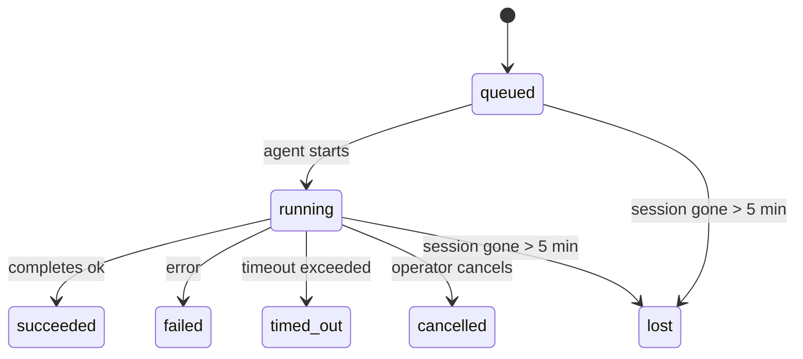

---
read_when:
    - 進行中または最近完了したバックグラウンド作業の確認
    - デタッチされたエージェント実行の配信失敗のデバッグ
    - バックグラウンド実行とセッション、Cron、Heartbeatの関係を理解する
sidebarTitle: Background tasks
summary: ACP 実行、サブエージェント、分離された Cron ジョブ、CLI 操作のバックグラウンドタスク追跡
title: バックグラウンドタスク
x-i18n:
    generated_at: "2026-05-10T19:20:56Z"
    model: gpt-5.5
    provider: openai
    source_hash: 5764a89634f90181d826ff3990ec8dac9538239074934d30fd446c1eb4564869
    source_path: automation/tasks.md
    workflow: 16
---

<Note>
スケジュール設定を探していますか？適切な仕組みを選ぶには、[自動化とタスク](/ja-JP/automation)を参照してください。このページはバックグラウンド作業のアクティビティ台帳であり、スケジューラーではありません。
</Note>

バックグラウンドタスクは、**メインの会話セッションの外部**で実行される作業を追跡します。ACP 実行、サブエージェントの起動、分離された Cron ジョブ実行、CLI から開始された操作が対象です。

タスクは、セッション、Cron ジョブ、Heartbeat を置き換えるものではありません。タスクは、切り離された作業で何が起きたか、いつ起きたか、成功したかどうかを記録する**アクティビティ台帳**です。

<Note>
すべてのエージェント実行がタスクを作成するわけではありません。Heartbeat ターンと通常の対話型チャットは作成しません。すべての Cron 実行、ACP 起動、サブエージェント起動、CLI エージェントコマンドは作成します。
</Note>

## 要約

- タスクはスケジューラーではなく**記録**です。Cron と Heartbeat が作業を_いつ_実行するかを決め、タスクは_何が起きたか_を追跡します。
- ACP、サブエージェント、すべての Cron ジョブ、CLI 操作はタスクを作成します。Heartbeat ターンは作成しません。
- 各タスクは `queued → running → terminal`（succeeded、failed、timed_out、cancelled、lost のいずれか）を通過します。
- Cron タスクは、Cron ランタイムがまだジョブを所有している間はライブのままです。
  メモリ内のランタイム状態がなくなった場合、タスクメンテナンスはタスクを lost としてマークする前に、まず永続化された Cron
  実行履歴を確認します。
- 完了はプッシュ駆動です。切り離された作業は、完了時に直接通知するか、リクエスターのセッション/Heartbeat を起こせるため、ステータスのポーリングループは
  通常は適切な形ではありません。
- 分離された Cron 実行とサブエージェント完了は、最終的なクリーンアップ帳簿処理の前に、子セッションの追跡対象ブラウザータブ/プロセスをベストエフォートでクリーンアップします。
- 分離された Cron 配信は、子孫サブエージェント作業がまだ排出中の間、古い暫定的な親返信を抑制し、配信前に到着した場合は最終的な子孫出力を優先します。
- 完了通知はチャンネルへ直接配信されるか、次の Heartbeat 用にキューに入れられます。
- `openclaw tasks list` はすべてのタスクを表示します。`openclaw tasks audit` は問題を明らかにします。
- ターミナルレコードは 7 日間保持され、その後自動的に削除されます。

## クイックスタート

<Tabs>
  <Tab title="一覧表示とフィルター">
    ```bash
    # すべてのタスクを一覧表示する（新しい順）
    openclaw tasks list

    # ランタイムまたはステータスでフィルターする
    openclaw tasks list --runtime acp
    openclaw tasks list --status running
    ```

  </Tab>
  <Tab title="調査">
    ```bash
    # 特定のタスクの詳細を表示する（ID、実行 ID、またはセッションキー）
    openclaw tasks show <lookup>
    ```
  </Tab>
  <Tab title="キャンセルと通知">
    ```bash
    # 実行中のタスクをキャンセルする（子セッションを終了する）
    openclaw tasks cancel <lookup>

    # タスクの通知ポリシーを変更する
    openclaw tasks notify <lookup> state_changes
    ```

  </Tab>
  <Tab title="監査とメンテナンス">
    ```bash
    # ヘルス監査を実行する
    openclaw tasks audit

    # メンテナンスをプレビューまたは適用する
    openclaw tasks maintenance
    openclaw tasks maintenance --apply
    ```

  </Tab>
  <Tab title="タスクフロー">
    ```bash
    # TaskFlow 状態を調査する
    openclaw tasks flow list
    openclaw tasks flow show <lookup>
    openclaw tasks flow cancel <lookup>
    ```
  </Tab>
</Tabs>

## タスクを作成するもの

| ソース                 | ランタイム種別 | タスクレコードが作成されるタイミング                   | 既定の通知ポリシー |
| ---------------------- | ------------ | ------------------------------------------------------ | --------------------- |
| ACP バックグラウンド実行    | `acp`        | 子 ACP セッションの起動                           | `done_only`           |
| サブエージェントのオーケストレーション | `subagent`   | `sessions_spawn` によるサブエージェントの起動               | `done_only`           |
| Cron ジョブ（全種別）  | `cron`       | すべての Cron 実行（メインセッションと分離実行）       | `silent`              |
| CLI 操作         | `cli`        | Gateway を通じて実行される `openclaw agent` コマンド | `silent`              |
| エージェントのメディアジョブ       | `cli`        | セッションに基づく `music_generate`/`video_generate` 実行  | `silent`              |

<AccordionGroup>
  <Accordion title="Cron とメディアの通知既定値">
    メインセッションの Cron タスクは、既定で `silent` 通知ポリシーを使用します。追跡用のレコードは作成しますが、通知は生成しません。分離された Cron タスクも既定で `silent` ですが、独自のセッションで実行されるため、より見えやすくなります。

    セッションに基づく `music_generate` と `video_generate` の実行も `silent` 通知ポリシーを使用します。それでもタスクレコードは作成されますが、完了は内部 wake として元のエージェントセッションに返され、エージェントがフォローアップメッセージを書き、完成したメディアを自分で添付できるようにします。グループ/チャンネルの完了は通常の可視返信ポリシーに従うため、送信元の配信で必要な場合、エージェントはメッセージツールを使用します。ツールのみのルートで完了エージェントがメッセージツール配信の証拠を生成できない場合、OpenClaw はメディアを非公開のままにするのではなく、完了フォールバックを元のチャンネルへ直接送信します。

  </Accordion>
  <Accordion title="同時 video_generate のガードレール">
    セッションに基づく `video_generate` タスクがまだアクティブな間、このツールはガードレールとしても機能します。同じセッションで繰り返し `video_generate` を呼び出すと、2 つ目の同時生成を開始する代わりに、アクティブなタスクのステータスを返します。エージェント側から明示的な進捗/ステータス照会を行いたい場合は `action: "status"` を使用してください。
  </Accordion>
  <Accordion title="タスクを作成しないもの">
    - Heartbeat ターン - メインセッション。詳しくは [Heartbeat](/ja-JP/gateway/heartbeat) を参照
    - 通常の対話型チャットターン
    - 直接の `/command` レスポンス

  </Accordion>
</AccordionGroup>

## タスクのライフサイクル



| ステータス      | 意味                                                              |
| ----------- | -------------------------------------------------------------------------- |
| `queued`    | 作成済みで、エージェントの開始を待機中                                    |
| `running`   | エージェントターンがアクティブに実行中                                           |
| `succeeded` | 正常に完了                                                     |
| `failed`    | エラーで完了                                                    |
| `timed_out` | 設定されたタイムアウトを超過                                            |
| `cancelled` | `openclaw tasks cancel` によってオペレーターが停止                        |
| `lost`      | ランタイムが、5 分間の猶予期間後に権威ある裏付け状態を失った |

遷移は自動的に発生します。関連付けられたエージェント実行が終了すると、タスクステータスはそれに合わせて更新されます。

エージェント実行の完了は、アクティブなタスクレコードに対して権威があります。成功した切り離し実行は `succeeded` として確定し、通常の実行エラーは `failed` として確定し、タイムアウトまたは中止の結果は `timed_out` として確定します。オペレーターがすでにタスクをキャンセルしている場合、またはランタイムがすでに `failed`、`timed_out`、`lost` などのより強いターミナル状態を記録している場合、後から成功シグナルが届いても、そのターミナルステータスを引き下げることはありません。

`lost` はランタイムを考慮します。

- ACP タスク: 裏付けとなる ACP 子セッションメタデータが消えました。
- サブエージェントタスク: 裏付けとなる子セッションがターゲットエージェントストアから消えました。
- Cron タスク: Cron ランタイムがそのジョブをアクティブとして追跡しなくなり、永続化された
  Cron 実行履歴にもその実行のターミナル結果が示されていません。オフライン CLI
  監査は、自身の空のインプロセス Cron ランタイム状態を権威として扱いません。
- CLI タスク: 実行 ID/ソース ID を持つタスクはライブ実行コンテキストを使用するため、
  残っている子セッションまたはチャットセッション行は、Gateway が所有する実行が消えた後に
  タスクを生存扱いにしません。実行 ID を持たないレガシー CLI タスクは、引き続き
  子セッションへフォールバックします。Gateway に基づく `openclaw agent` 実行も
  実行結果から確定するため、完了済みの実行が、スイーパーによって `lost` とマークされるまでアクティブのまま残ることはありません。

## 配信と通知

タスクがターミナル状態に到達すると、OpenClaw が通知します。配信経路は 2 つあります。

**直接配信** - タスクにチャンネルターゲット（`requesterOrigin`）がある場合、完了メッセージはそのチャンネル（Telegram、Discord、Slack など）へ直接送信されます。グループおよびチャンネルのタスク完了は、代わりにリクエスターセッション経由でルーティングされ、親エージェントが可視返信を書けるようにします。サブエージェント完了では、OpenClaw は利用可能な場合にバインド済みのスレッド/トピックルーティングも保持し、直接配信を断念する前に、リクエスターセッションに保存されたルート（`lastChannel` / `lastTo` / `lastAccountId`）から不足している `to` / アカウントを補完できます。

**セッションキュー配信** - 直接配信が失敗した場合、または origin が設定されていない場合、更新はリクエスターのセッション内のシステムイベントとしてキューに入れられ、次の Heartbeat で表示されます。

<Tip>
タスク完了は即時の Heartbeat wake をトリガーするため、結果をすばやく確認できます。次にスケジュールされた Heartbeat tick を待つ必要はありません。
</Tip>

つまり、通常のワークフローはプッシュベースです。切り離し作業を一度開始し、その後は完了時にランタイムが wake または通知するのに任せます。タスク状態をポーリングするのは、デバッグ、介入、または明示的な監査が必要な場合だけにしてください。

### 通知ポリシー

各タスクについて、どの程度通知を受けるかを制御します。

| ポリシー                | 配信される内容                                                       |
| --------------------- | ----------------------------------------------------------------------- |
| `done_only`（既定） | ターミナル状態（succeeded、failed など）のみ - **これが既定です** |
| `state_changes`       | すべての状態遷移と進捗更新                              |
| `silent`              | 何も配信しない                                                          |

タスクの実行中にポリシーを変更します。

```bash
openclaw tasks notify <lookup> state_changes
```

## CLI リファレンス

<AccordionGroup>
  <Accordion title="tasks list">
    ```bash
    openclaw tasks list [--runtime <acp|subagent|cron|cli>] [--status <status>] [--json]
    ```

    出力列: タスク ID、種別、ステータス、配信、実行 ID、子セッション、概要。

  </Accordion>
  <Accordion title="tasks show">
    ```bash
    openclaw tasks show <lookup>
    ```

    ルックアップトークンには、タスク ID、実行 ID、またはセッションキーを指定できます。タイミング、配信状態、エラー、ターミナル概要を含む完全なレコードを表示します。

  </Accordion>
  <Accordion title="tasks cancel">
    ```bash
    openclaw tasks cancel <lookup>
    ```

    ACP とサブエージェントのタスクでは、これにより子セッションが終了します。CLI 追跡タスクでは、キャンセルがタスクレジストリに記録されます（別個の子ランタイムハンドルはありません）。ステータスは `cancelled` に遷移し、該当する場合は配信通知が送信されます。

  </Accordion>
  <Accordion title="tasks notify">
    ```bash
    openclaw tasks notify <lookup> <done_only|state_changes|silent>
    ```
  </Accordion>
  <Accordion title="tasks audit">
    ```bash
    openclaw tasks audit [--json]
    ```

    運用上の問題を明らかにします。問題が検出された場合、結果は `openclaw status` にも表示されます。

    | 検出項目                   | 重要度   | トリガー                                                                                                      |
    | ------------------------- | ---------- | ------------------------------------------------------------------------------------------------------------ |
    | `stale_queued`            | warn       | 10分を超えてキューに入っている                                                                              |
    | `stale_running`           | error      | 30分を超えて実行中                                                                             |
    | `lost`                    | warn/error | ランタイムに裏付けられたタスク所有権が消失した。保持中の lost タスクは `cleanupAfter` までは警告になり、その後エラーになる |
    | `delivery_failed`         | warn       | 配信に失敗し、通知ポリシーが `silent` ではない                                                            |
    | `missing_cleanup`         | warn       | クリーンアップタイムスタンプがない終端タスク                                                                      |
    | `inconsistent_timestamps` | warn       | タイムライン違反（たとえば開始前に終了している）                                                        |

  </Accordion>
  <Accordion title="tasks maintenance">
    ```bash
    openclaw tasks maintenance [--json]
    openclaw tasks maintenance --apply [--json]
    ```

    これを使って、タスク、Task Flow 状態、古い cron 実行セッションレジストリ行に対する照合、クリーンアップスタンプ付与、枝刈りをプレビューまたは適用します。

    照合はランタイムを認識します。

    - ACP/サブエージェントタスクは、裏付けとなる子セッションを確認します。
    - 子セッションに再起動リカバリの tombstone があるサブエージェントタスクは、復旧可能な裏付けセッションとして扱われるのではなく、lost としてマークされます。
    - Cron タスクは、cron ランタイムがまだジョブを所有しているかを確認し、その後 `lost` へフォールバックする前に、永続化された cron 実行ログ/ジョブ状態から終端ステータスを復元します。インメモリの cron アクティブジョブセットについては Gateway プロセスだけが信頼できる情報源です。オフライン CLI 監査は耐久性のある履歴を使いますが、そのローカル Set が空であることだけを理由に cron タスクを lost とマークすることはありません。
    - 実行 ID を持つ CLI タスクは、子セッション行やチャットセッション行だけでなく、所有元のライブ実行コンテキストを確認します。

    完了クリーンアップもランタイムを認識します。

    - サブエージェント完了時には、announce クリーンアップを続行する前に、子セッションで追跡されているブラウザータブ/プロセスをベストエフォートで閉じます。
    - 分離 cron 完了時には、実行が完全に終了する前に、cron セッションで追跡されているブラウザータブ/プロセスをベストエフォートで閉じます。
    - 分離 cron 配信は、必要に応じて子孫サブエージェントのフォローアップを待ち、古い親確認テキストを通知する代わりに抑制します。
    - サブエージェント完了配信は、最新の表示可能なアシスタントテキストを優先します。それが空の場合は、サニタイズ済みの最新 tool/toolResult テキストにフォールバックし、タイムアウトのみのツール呼び出し実行は短い部分進捗サマリーに折りたたまれることがあります。終端した失敗実行は、キャプチャされた返信テキストを再生せずに失敗ステータスを通知します。
    - クリーンアップの失敗が実際のタスク結果を隠すことはありません。

    メンテナンスを適用すると、OpenClaw は現在実行中の cron ジョブの行を保持し、非 cron セッション行には触れずに、7日を超えて古い `cron:<jobId>:run:<uuid>` セッションレジストリ行も削除します。

  </Accordion>
  <Accordion title="tasks flow list | show | cancel">
    ```bash
    openclaw tasks flow list [--status <status>] [--json]
    openclaw tasks flow show <lookup> [--json]
    openclaw tasks flow cancel <lookup>
    ```

    個々のバックグラウンドタスクレコードではなく、オーケストレーションしている Task Flow を確認したい場合に使います。

  </Accordion>
</AccordionGroup>

## チャットタスクボード（`/tasks`）

任意のチャットセッションで `/tasks` を使うと、そのセッションにリンクされたバックグラウンドタスクを確認できます。ボードには、アクティブなタスクと最近完了したタスクが、ランタイム、ステータス、タイミング、進捗またはエラー詳細とともに表示されます。

現在のセッションに表示可能なリンク済みタスクがない場合、`/tasks` はエージェントローカルのタスク数にフォールバックするため、他セッションの詳細を漏らさずに概要を確認できます。

完全なオペレータ台帳には、CLI を使います: `openclaw tasks list`。

## ステータス統合（タスク負荷）

`openclaw status` には、ひと目で分かるタスクサマリーが含まれます。

```
Tasks: 3 queued · 2 running · 1 issues
```

サマリーは次を報告します。

- **active** - `queued` + `running` の数
- **failures** - `failed` + `timed_out` + `lost` の数
- **byRuntime** - `acp`、`subagent`、`cron`、`cli` ごとの内訳

`/status` と `session_status` ツールはいずれも、クリーンアップを認識するタスクスナップショットを使用します。アクティブなタスクが優先され、古い完了行は非表示になり、直近の失敗はアクティブな作業が残っていない場合にのみ表示されます。これにより、ステータスカードは今重要なことに集中できます。

## ストレージとメンテナンス

### タスクの保存場所

タスクレコードは、次の SQLite に永続化されます。

```
$OPENCLAW_STATE_DIR/tasks/runs.sqlite
```

レジストリは gateway 起動時にメモリへ読み込まれ、再起動をまたいだ耐久性のために書き込みを SQLite へ同期します。
Gateway は SQLite のデフォルトの autocheckpoint しきい値に加えて、定期的な `TRUNCATE` チェックポイントとシャットダウン時の `TRUNCATE` チェックポイントを使うことで、SQLite write-ahead log を一定範囲に保ちます。

### 自動メンテナンス

スイーパーは **60秒** ごとに実行され、4つのことを処理します。

<Steps>
  <Step title="照合">
    アクティブなタスクに、信頼できるランタイムの裏付けがまだあるかを確認します。ACP/サブエージェントタスクは子セッション状態を使い、cron タスクはアクティブジョブ所有権を使い、実行 ID を持つ CLI タスクは所有元の実行コンテキストを使います。その裏付け状態が5分を超えて失われている場合、タスクは `lost` としてマークされます。
  </Step>
  <Step title="ACP セッション修復">
    終端した、または孤立した親所有のワンショット ACP セッションを閉じます。また、アクティブな会話バインディングが残っていない場合にのみ、古い終端 ACP セッションまたは孤立した永続 ACP セッションを閉じます。
  </Step>
  <Step title="クリーンアップスタンプ付与">
    終端タスクに `cleanupAfter` タイムスタンプ（endedAt + 7日）を設定します。保持期間中、lost タスクは監査で警告として引き続き表示されます。`cleanupAfter` の期限切れ後、またはクリーンアップメタデータが欠落している場合、それらはエラーになります。
  </Step>
  <Step title="枝刈り">
    `cleanupAfter` 日を過ぎたレコードを削除します。
  </Step>
</Steps>

<Note>
**保持:** 終端タスクレコードは **7日間** 保持され、その後自動的に枝刈りされます。設定は不要です。
</Note>

## タスクと他システムの関係

<AccordionGroup>
  <Accordion title="タスクと Task Flow">
    [Task Flow](/ja-JP/automation/taskflow) は、バックグラウンドタスクの上位にあるフローオーケストレーション層です。単一のフローは、管理モードまたはミラー同期モードを使って、その存続期間中に複数のタスクを調整することがあります。個々のタスクレコードを調べるには `openclaw tasks` を使い、オーケストレーションしているフローを調べるには `openclaw tasks flow` を使います。

    詳細は [Task Flow](/ja-JP/automation/taskflow) を参照してください。

  </Accordion>
  <Accordion title="タスクと cron">
    cron ジョブの**定義**は `~/.openclaw/cron/jobs.json` にあり、ランタイム実行状態はその隣の `~/.openclaw/cron/jobs-state.json` にあります。cron 実行は**すべて**タスクレコードを作成します。メインセッションと分離の両方です。メインセッションの cron タスクは、通知を生成せずに追跡するよう、デフォルトで `silent` 通知ポリシーになります。

    [Cron Jobs](/ja-JP/automation/cron-jobs) を参照してください。

  </Accordion>
  <Accordion title="タスクと heartbeat">
    Heartbeat 実行はメインセッションのターンであり、タスクレコードは作成しません。タスクが完了すると、heartbeat wake をトリガーできるため、結果をすぐに確認できます。

    [Heartbeat](/ja-JP/gateway/heartbeat) を参照してください。

  </Accordion>
  <Accordion title="タスクとセッション">
    タスクは `childSessionKey`（作業の実行場所）と `requesterSessionKey`（開始した主体）を参照することがあります。セッションは会話コンテキストであり、タスクはその上にあるアクティビティ追跡です。
  </Accordion>
  <Accordion title="タスクとエージェント実行">
    タスクの `runId` は、作業を行っているエージェント実行にリンクします。エージェントのライフサイクルイベント（開始、終了、エラー）はタスクステータスを自動的に更新するため、ライフサイクルを手動で管理する必要はありません。
  </Accordion>
</AccordionGroup>

## 関連

- [自動化とタスク](/ja-JP/automation) - すべての自動化メカニズムの概要
- [CLI: タスク](/ja-JP/cli/tasks) - CLI コマンドリファレンス
- [Heartbeat](/ja-JP/gateway/heartbeat) - 定期的なメインセッションターン
- [スケジュール済みタスク](/ja-JP/automation/cron-jobs) - バックグラウンド作業のスケジューリング
- [Task Flow](/ja-JP/automation/taskflow) - タスクの上位にあるフローオーケストレーション
