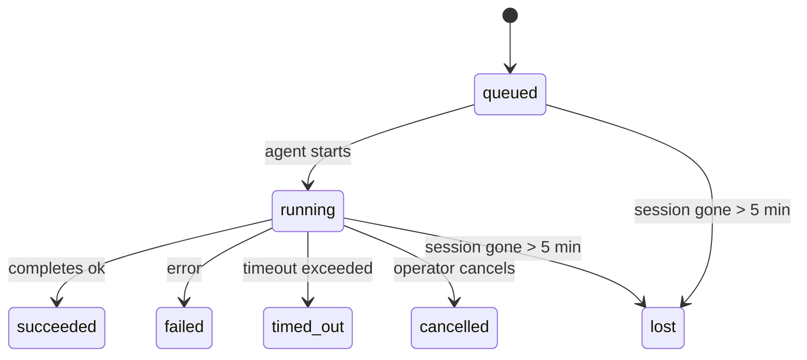

---
read_when:
    - 進行中または最近完了したバックグラウンド作業の確認
    - デタッチされたエージェント実行での配信失敗をデバッグする
    - バックグラウンド実行がセッション、Cron、Heartbeat とどのように関係するかを理解する
sidebarTitle: Background tasks
summary: ACP実行、サブエージェント、分離されたCronジョブ、CLI操作のためのバックグラウンドタスク追跡
title: バックグラウンドタスク
x-i18n:
    generated_at: "2026-04-30T04:57:41Z"
    model: gpt-5.5
    provider: openai
    source_hash: 4bbf74f3aeea532738b56b83cd2e1a0a3734bfd453da6636b8be985a28ccc027
    source_path: automation/tasks.md
    workflow: 16
---

<Note>
スケジューリングを探していますか？適切な仕組みを選ぶには [自動化とタスク](/ja-JP/automation) を参照してください。このページはバックグラウンド作業のアクティビティ台帳であり、スケジューラーではありません。
</Note>

バックグラウンドタスクは、**メインの会話セッションの外部**で実行される作業を追跡します。ACP の実行、サブエージェントの生成、分離された Cron ジョブの実行、CLI から開始された操作などです。

タスクはセッション、Cron ジョブ、Heartbeat を置き換えるものではありません。タスクは、切り離された作業で何が起きたか、いつ起きたか、成功したかどうかを記録する**アクティビティ台帳**です。

<Note>
すべてのエージェント実行がタスクを作成するわけではありません。Heartbeat ターンと通常の対話チャットは作成しません。すべての Cron 実行、ACP の生成、サブエージェントの生成、CLI エージェントコマンドは作成します。
</Note>

## 要約

- タスクはスケジューラーではなく**記録**です。Cron と Heartbeat が作業を_いつ_実行するかを決め、タスクは_何が起きたか_を追跡します。
- ACP、サブエージェント、すべての Cron ジョブ、CLI 操作はタスクを作成します。Heartbeat ターンは作成しません。
- 各タスクは `queued → running → terminal`（succeeded、failed、timed_out、cancelled、lost）を進みます。
- Cron タスクは Cron ランタイムがまだジョブを所有している間はライブのままです。
  インメモリのランタイム状態がなくなった場合、タスクメンテナンスはタスクを lost とマークする前に、まず永続化された Cron
  実行履歴を確認します。
- 完了はプッシュ駆動です。切り離された作業は完了時に直接通知するか、リクエスターのセッション/Heartbeat を起こせるため、ステータスのポーリングループは
  通常は適切な形ではありません。
- 分離された Cron 実行とサブエージェントの完了は、最終的なクリーンアップの記録処理の前に、子セッションで追跡中のブラウザータブ/プロセスをベストエフォートでクリーンアップします。
- 分離された Cron 配信は、子孫サブエージェントの作業がまだ排出中の間、古くなった途中の親返信を抑制し、配信前に到着した場合は最終的な子孫出力を優先します。
- 完了通知はチャンネルへ直接配信されるか、次の Heartbeat のためにキューに入れられます。
- `openclaw tasks list` はすべてのタスクを表示します。`openclaw tasks audit` は問題を表示します。
- ターミナル記録は 7 日間保持され、その後自動的に削除されます。

## クイックスタート

<Tabs>
  <Tab title="一覧とフィルター">
    ```bash
    # すべてのタスクを一覧表示（新しい順）
    openclaw tasks list

    # ランタイムまたはステータスでフィルター
    openclaw tasks list --runtime acp
    openclaw tasks list --status running
    ```

  </Tab>
  <Tab title="調査">
    ```bash
    # 特定のタスクの詳細を表示（ID、実行 ID、またはセッションキー）
    openclaw tasks show <lookup>
    ```
  </Tab>
  <Tab title="キャンセルと通知">
    ```bash
    # 実行中のタスクをキャンセル（子セッションを終了）
    openclaw tasks cancel <lookup>

    # タスクの通知ポリシーを変更
    openclaw tasks notify <lookup> state_changes
    ```

  </Tab>
  <Tab title="監査とメンテナンス">
    ```bash
    # ヘルス監査を実行
    openclaw tasks audit

    # メンテナンスをプレビューまたは適用
    openclaw tasks maintenance
    openclaw tasks maintenance --apply
    ```

  </Tab>
  <Tab title="タスクフロー">
    ```bash
    # TaskFlow の状態を調査
    openclaw tasks flow list
    openclaw tasks flow show <lookup>
    openclaw tasks flow cancel <lookup>
    ```
  </Tab>
</Tabs>

## タスクを作成するもの

| ソース                 | ランタイム種別 | タスク記録が作成されるタイミング                       | デフォルトの通知ポリシー |
| ---------------------- | ------------ | ------------------------------------------------------ | --------------------- |
| ACP バックグラウンド実行 | `acp`        | 子 ACP セッションを生成するとき                         | `done_only`           |
| サブエージェントのオーケストレーション | `subagent`   | `sessions_spawn` 経由でサブエージェントを生成するとき    | `done_only`           |
| Cron ジョブ（全種類）  | `cron`       | すべての Cron 実行（メインセッションと分離型）          | `silent`              |
| CLI 操作               | `cli`        | Gateway 経由で実行される `openclaw agent` コマンド      | `silent`              |
| エージェントメディアジョブ | `cli`        | セッションに裏付けられた `video_generate` 実行          | `silent`              |

<AccordionGroup>
  <Accordion title="Cron とメディアの通知デフォルト">
    メインセッションの Cron タスクはデフォルトで `silent` 通知ポリシーを使用します。追跡用の記録は作成しますが、通知は生成しません。分離された Cron タスクもデフォルトは `silent` ですが、独自のセッションで実行されるため、より見えやすくなります。

    セッションに裏付けられた `video_generate` 実行も `silent` 通知ポリシーを使用します。それでもタスク記録は作成されますが、完了は内部ウェイクとして元のエージェントセッションに戻され、エージェントがフォローアップメッセージを書き、完成した動画を自分で添付できるようにします。`tools.media.asyncCompletion.directSend` を有効にすると、非同期の `music_generate` と `video_generate` の完了は、リクエスターセッションのウェイク経路へフォールバックする前に、まず直接チャンネル配信を試します。

  </Accordion>
  <Accordion title="同時 video_generate のガードレール">
    セッションに裏付けられた `video_generate` タスクがまだアクティブな間、このツールはガードレールとしても動作します。同じセッションで `video_generate` を繰り返し呼び出すと、2 つ目の同時生成を開始する代わりに、アクティブなタスクのステータスを返します。エージェント側から明示的に進捗/ステータスを検索したい場合は `action: "status"` を使用します。
  </Accordion>
  <Accordion title="タスクを作成しないもの">
    - Heartbeat ターン — メインセッション。[Heartbeat](/ja-JP/gateway/heartbeat) を参照
    - 通常の対話チャットターン
    - 直接の `/command` 応答

  </Accordion>
</AccordionGroup>

## タスクのライフサイクル



| ステータス | 意味                                                                       |
| ----------- | -------------------------------------------------------------------------- |
| `queued`    | 作成済みで、エージェントの開始を待機中                                     |
| `running`   | エージェントターンがアクティブに実行中                                     |
| `succeeded` | 正常に完了                                                                 |
| `failed`    | エラーで完了                                                               |
| `timed_out` | 設定されたタイムアウトを超過                                               |
| `cancelled` | オペレーターが `openclaw tasks cancel` で停止                              |
| `lost`      | 5 分間の猶予期間後に、ランタイムが権威ある裏付け状態を失った              |

遷移は自動的に発生します。関連するエージェント実行が終了すると、タスクのステータスがそれに合わせて更新されます。

エージェント実行の完了は、アクティブなタスク記録に対して権威があります。成功した切り離し実行は `succeeded` として確定し、通常の実行エラーは `failed` として確定し、タイムアウトまたは中止の結果は `timed_out` として確定します。オペレーターがすでにタスクをキャンセルしていた場合、またはランタイムが `failed`、`timed_out`、`lost` のようなより強いターミナル状態をすでに記録している場合、後から成功シグナルが来てもそのターミナルステータスは下がりません。

`lost` はランタイムを認識します。

- ACP タスク: 裏付けとなる ACP 子セッションメタデータが消えた。
- サブエージェントタスク: 裏付けとなる子セッションがターゲットエージェントストアから消えた。
- Cron タスク: Cron ランタイムがジョブをアクティブとして追跡しなくなり、永続化された
  Cron 実行履歴にもその実行のターミナル結果が表示されない。オフライン CLI
  監査は、自身の空のインプロセス Cron ランタイム状態を権威として扱いません。
- CLI タスク: 分離された子セッションタスクは子セッションを使用します。チャットに裏付けられた
  CLI タスクは代わりにライブ実行コンテキストを使用するため、残存する
  チャンネル/グループ/ダイレクトのセッション行はそれらを生かし続けません。Gateway に裏付けられた
  `openclaw agent` 実行も実行結果から確定するため、完了した実行がスイーパーによって `lost` とマークされるまで
  アクティブなまま残ることはありません。

## 配信と通知

タスクがターミナル状態に到達すると、OpenClaw が通知します。配信経路は 2 つあります。

**直接配信** — タスクにチャンネルターゲット（`requesterOrigin`）がある場合、完了メッセージはそのチャンネル（Telegram、Discord、Slack など）へ直接送られます。サブエージェントの完了については、利用可能な場合、OpenClaw は紐づけられたスレッド/トピックのルーティングも保持し、直接配信をあきらめる前に、リクエスターセッションに保存されたルート（`lastChannel` / `lastTo` / `lastAccountId`）から不足している `to` / アカウントを補完できます。

**セッションキュー配信** — 直接配信が失敗した場合、または origin が設定されていない場合、更新はリクエスターのセッション内のシステムイベントとしてキューに入れられ、次の Heartbeat で表示されます。

<Tip>
タスク完了は即時の Heartbeat ウェイクをトリガーするため、結果をすばやく確認できます。次にスケジュールされた Heartbeat tick を待つ必要はありません。
</Tip>

つまり通常のワークフローはプッシュベースです。切り離された作業を一度開始したら、ランタイムが完了時にウェイクまたは通知するのを待ちます。タスク状態をポーリングするのは、デバッグ、介入、明示的な監査が必要な場合だけにしてください。

### 通知ポリシー

各タスクについて、どれだけ通知を受け取るかを制御します。

| ポリシー              | 配信される内容                                                          |
| --------------------- | ----------------------------------------------------------------------- |
| `done_only`（デフォルト） | ターミナル状態（succeeded、failed など）のみ — **これがデフォルトです** |
| `state_changes`       | すべての状態遷移と進捗更新                                             |
| `silent`              | 何も配信しない                                                          |

タスクの実行中にポリシーを変更します。

```bash
openclaw tasks notify <lookup> state_changes
```

## CLI リファレンス

<AccordionGroup>
  <Accordion title="tasks list">
    ```bash
    openclaw tasks list [--runtime <acp|subagent|cron|cli>] [--status <status>] [--json]
    ```

    出力列: タスク ID、種類、ステータス、配信、実行 ID、子セッション、概要。

  </Accordion>
  <Accordion title="tasks show">
    ```bash
    openclaw tasks show <lookup>
    ```

    検索トークンには、タスク ID、実行 ID、またはセッションキーを指定できます。タイミング、配信状態、エラー、ターミナル概要を含む完全な記録を表示します。

  </Accordion>
  <Accordion title="tasks cancel">
    ```bash
    openclaw tasks cancel <lookup>
    ```

    ACP タスクとサブエージェントタスクでは、これにより子セッションが終了します。CLI で追跡されるタスクでは、キャンセルはタスクレジストリに記録されます（別個の子ランタイムハンドルはありません）。ステータスは `cancelled` に遷移し、該当する場合は配信通知が送信されます。

  </Accordion>
  <Accordion title="tasks notify">
    ```bash
    openclaw tasks notify <lookup> <done_only|state_changes|silent>
    ```
  </Accordion>
  <Accordion title="tasks audit">
    ```bash
    openclaw tasks audit [--json]
    ```

    運用上の問題を表示します。問題が検出された場合、検出結果は `openclaw status` にも表示されます。

    | 検出結果                  | 重大度     | トリガー                                                                                                     |
    | ------------------------- | ---------- | ------------------------------------------------------------------------------------------------------------ |
    | `stale_queued`            | warn       | 10 分を超えてキュー済み                                                                                      |
    | `stale_running`           | error      | 30 分を超えて実行中                                                                                          |
    | `lost`                    | warn/error | ランタイムに裏付けられたタスク所有権が消失した。保持中の lost タスクは `cleanupAfter` までは警告になり、その後エラーになる |
    | `delivery_failed`         | warn       | 配信に失敗し、通知ポリシーが `silent` ではない                                                               |
    | `missing_cleanup`         | warn       | クリーンアップのタイムスタンプがない終端タスク                                                               |
    | `inconsistent_timestamps` | warn       | タイムライン違反（たとえば開始前に終了した場合）                                                             |

  </Accordion>
  <Accordion title="tasks maintenance">
    ```bash
    openclaw tasks maintenance [--json]
    openclaw tasks maintenance --apply [--json]
    ```

    これを使用して、タスクと Task Flow 状態の照合、クリーンアップのスタンプ付け、枝刈りをプレビューまたは適用します。

    照合はランタイムを考慮します。

    - ACP/サブエージェントタスクは、裏付けとなる子セッションを確認します。
    - Cron タスクは、cron ランタイムがまだジョブを所有しているかを確認し、`lost` にフォールバックする前に、永続化された cron 実行ログ/ジョブ状態から終端ステータスを復元します。メモリ内の cron アクティブジョブセットについては、Gateway プロセスだけが権威を持ちます。オフライン CLI 監査は永続履歴を使用しますが、そのローカル Set が空であることだけを理由に cron タスクを lost としてマークすることはありません。
    - チャットに裏付けられた CLI タスクは、チャットセッション行だけでなく、所有するライブ実行コンテキストを確認します。

    完了時のクリーンアップもランタイムを考慮します。

    - サブエージェント完了は、アナウンスのクリーンアップを続行する前に、子セッションの追跡対象ブラウザータブ/プロセスをベストエフォートで閉じます。
    - 分離 cron 完了は、実行が完全に終了する前に、cron セッションの追跡対象ブラウザータブ/プロセスをベストエフォートで閉じます。
    - 分離 cron 配信は、必要に応じて子孫サブエージェントのフォローアップを待ち、古い親の確認応答テキストをアナウンスする代わりに抑制します。
    - サブエージェント完了配信は、最新の表示可能なアシスタントテキストを優先します。それが空の場合は、サニタイズされた最新の tool/toolResult テキストにフォールバックし、タイムアウトのみのツール呼び出し実行は短い部分進捗サマリーにまとめられることがあります。終端失敗実行は、キャプチャされた返信テキストを再生せずに失敗ステータスをアナウンスします。
    - クリーンアップ失敗が実際のタスク結果を覆い隠すことはありません。

  </Accordion>
  <Accordion title="tasks flow list | show | cancel">
    ```bash
    openclaw tasks flow list [--status <status>] [--json]
    openclaw tasks flow show <lookup> [--json]
    openclaw tasks flow cancel <lookup>
    ```

    個別のバックグラウンドタスクレコードではなく、オーケストレーションしている Task Flow を確認したい場合に使用します。

  </Accordion>
</AccordionGroup>

## チャットタスクボード（`/tasks`）

任意のチャットセッションで `/tasks` を使用すると、そのセッションにリンクされたバックグラウンドタスクを確認できます。ボードには、アクティブなタスクと最近完了したタスクが、ランタイム、ステータス、タイミング、進捗またはエラー詳細とともに表示されます。

現在のセッションに表示可能なリンク済みタスクがない場合、`/tasks` はエージェントローカルのタスク数にフォールバックするため、他セッションの詳細を漏らさずに概要を把握できます。

完全なオペレーター台帳には CLI を使用します: `openclaw tasks list`。

## ステータス統合（タスク圧力）

`openclaw status` には、ひと目で分かるタスクサマリーが含まれます。

```
Tasks: 3 queued · 2 running · 1 issues
```

サマリーは次を報告します。

- **active** — `queued` + `running` の数
- **failures** — `failed` + `timed_out` + `lost` の数
- **byRuntime** — `acp`、`subagent`、`cron`、`cli` ごとの内訳

`/status` と `session_status` ツールはいずれも、クリーンアップを考慮したタスクスナップショットを使用します。アクティブなタスクが優先され、古い完了行は非表示になり、最近の失敗はアクティブな作業が残っていない場合にのみ表示されます。これにより、ステータスカードは現在重要な内容に集中できます。

## ストレージとメンテナンス

### タスクの保存場所

タスクレコードは SQLite の次の場所に永続化されます。

```
$OPENCLAW_STATE_DIR/tasks/runs.sqlite
```

レジストリは Gateway 起動時にメモリへ読み込まれ、再起動後も耐久性を保つために SQLite へ書き込みを同期します。
Gateway は、SQLite のデフォルトの
自動チェックポイントしきい値に加え、定期的な `TRUNCATE` チェックポイントとシャットダウン時の `TRUNCATE` チェックポイントを使用して、SQLite の write-ahead log を制限します。

### 自動メンテナンス

スイーパーは **60 秒** ごとに実行され、4 つの処理を行います。

<Steps>
  <Step title="照合">
    アクティブなタスクに、まだ権威あるランタイムの裏付けがあるかを確認します。ACP/サブエージェントタスクは子セッション状態を使用し、cron タスクはアクティブジョブ所有権を使用し、チャットに裏付けられた CLI タスクは所有する実行コンテキストを使用します。その裏付け状態が 5 分を超えて失われている場合、タスクは `lost` としてマークされます。
  </Step>
  <Step title="ACP セッション修復">
    終端状態または孤立した親所有のワンショット ACP セッションを閉じます。また、アクティブな会話バインディングが残っていない場合にのみ、古い終端状態または孤立した永続 ACP セッションを閉じます。
  </Step>
  <Step title="クリーンアップのスタンプ付け">
    終端タスクに `cleanupAfter` タイムスタンプを設定します（endedAt + 7 日）。保持期間中、lost タスクは監査で引き続き警告として表示されます。`cleanupAfter` の期限が切れた後、またはクリーンアップメタデータがない場合は、エラーになります。
  </Step>
  <Step title="枝刈り">
    `cleanupAfter` の日付を過ぎたレコードを削除します。
  </Step>
</Steps>

<Note>
**保持:** 終端タスクレコードは **7 日間** 保持され、その後自動的に枝刈りされます。設定は不要です。
</Note>

## タスクと他のシステムの関係

<AccordionGroup>
  <Accordion title="タスクと Task Flow">
    [Task Flow](/ja-JP/automation/taskflow) は、バックグラウンドタスクの上位にあるフローオーケストレーションレイヤーです。単一のフローは、そのライフタイム中に管理またはミラーリングされた同期モードを使用して複数のタスクを調整することがあります。個別のタスクレコードを調べるには `openclaw tasks` を使用し、オーケストレーションしているフローを調べるには `openclaw tasks flow` を使用します。

    詳細は [Task Flow](/ja-JP/automation/taskflow) を参照してください。

  </Accordion>
  <Accordion title="タスクと cron">
    cron ジョブ**定義**は `~/.openclaw/cron/jobs.json` にあり、ランタイム実行状態はその隣の `~/.openclaw/cron/jobs-state.json` にあります。**すべての** cron 実行は、メインセッションと分離の両方でタスクレコードを作成します。メインセッション cron タスクは、通知を生成せずに追跡するため、デフォルトで通知ポリシーが `silent` になります。

    [Cron Jobs](/ja-JP/automation/cron-jobs) を参照してください。

  </Accordion>
  <Accordion title="タスクと Heartbeat">
    Heartbeat 実行はメインセッションのターンであり、タスクレコードを作成しません。タスクが完了すると、heartbeat ウェイクをトリガーして、結果をすばやく確認できるようにすることがあります。

    [Heartbeat](/ja-JP/gateway/heartbeat) を参照してください。

  </Accordion>
  <Accordion title="タスクとセッション">
    タスクは `childSessionKey`（作業が実行される場所）と `requesterSessionKey`（開始した人）を参照することがあります。セッションは会話コンテキストであり、タスクはその上にあるアクティビティ追跡です。
  </Accordion>
  <Accordion title="タスクとエージェント実行">
    タスクの `runId` は、作業を行っているエージェント実行にリンクします。エージェントのライフサイクルイベント（開始、終了、エラー）はタスクステータスを自動的に更新します。ライフサイクルを手動で管理する必要はありません。
  </Accordion>
</AccordionGroup>

## 関連

- [自動化とタスク](/ja-JP/automation) — すべての自動化メカニズムの概要
- [CLI: タスク](/ja-JP/cli/tasks) — CLI コマンドリファレンス
- [Heartbeat](/ja-JP/gateway/heartbeat) — 定期的なメインセッションターン
- [Scheduled Tasks](/ja-JP/automation/cron-jobs) — バックグラウンド作業のスケジューリング
- [Task Flow](/ja-JP/automation/taskflow) — タスクの上位にあるフローオーケストレーション
