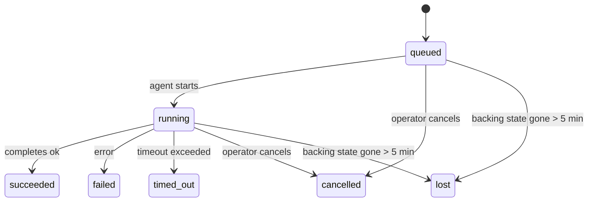

---
read_when:
    - 進行中または最近完了したバックグラウンド作業を確認する
    - 切り離されたエージェント実行の配信失敗をデバッグする
    - Understanding how background runs relate to sessions, cron, and heartbeat
sidebarTitle: Background tasks
summary: ACP 実行、サブエージェント、cron 実行、CLI 操作のバックグラウンドタスク追跡
title: バックグラウンドタスク
x-i18n:
    generated_at: "2026-07-06T21:46:27Z"
    model: gpt-5.5
    postprocess_version: locale-links-v1
    provider: openai
    source_hash: 839c7ed9b199288ab577ab10cfad1dd6eba7054fef43d1dacc2d3a4483b4edf0
    source_path: automation/tasks.md
    workflow: 16
---

<Note>
スケジューリングを探していますか？適切な仕組みを選ぶには [Automation](/ja-JP/automation) を参照してください。このページはバックグラウンド作業のアクティビティ台帳であり、スケジューラではありません。
</Note>

バックグラウンドタスクは、**メインの会話セッションの外側**で実行される作業を追跡します。ACP 実行、サブエージェントの生成、cron ジョブ実行、CLI から開始された操作が含まれます。

タスクはセッション、cron ジョブ、Heartbeat を置き換えるものではありません。タスクは、切り離された作業で何が起きたか、いつ起きたか、成功したかどうかを記録する**アクティビティ台帳**です。

<Note>
すべてのエージェント実行がタスクを作成するわけではありません。Heartbeat ターンと通常の対話チャットは作成しません。すべての cron 実行、ACP 生成、サブエージェント生成、Gateway 経由でディスパッチされる CLI エージェントコマンドは作成します。
</Note>

## TL;DR

- タスクはスケジューラではなく**記録**です。cron と Heartbeat が作業を_いつ_実行するかを決め、タスクは_何が起きたか_を追跡します。
- ACP、サブエージェント、すべての cron ジョブ、CLI 操作はタスクを作成します。Heartbeat ターンは作成しません。
- 各タスクは `queued → running → terminal`（succeeded、failed、timed_out、cancelled、または lost）を進みます。
- cron タスクは、cron ランタイムがまだジョブを所有している間はライブのままです。メモリ内ランタイム状態がなくなった場合、タスク保守はタスクを lost としてマークする前に、まず永続的な cron 実行履歴を確認します。
- 完了はプッシュ駆動です。切り離された作業は、完了時に直接通知するか、リクエスト元セッション/Heartbeat を起こせるため、ステータスポーリングループは通常適切な形ではありません。
- 分離された cron 実行とサブエージェント完了は、最終的なクリーンアップ記録の前に、子セッションで追跡されているブラウザータブ/プロセスをベストエフォートでクリーンアップします。
- 分離された cron 配信は、子孫サブエージェント作業がまだ排出中の間、古い中間の親返信を抑制し、配信前に最終的な子孫出力が届いた場合はそれを優先します。
- 完了通知はチャンネルに直接配信されるか、次の Heartbeat のためにキューに入れられます。
- `openclaw tasks list` はすべてのタスクを表示します。`openclaw tasks audit` は問題を表面化します。
- 終端記録は 7 日間保持されます（`lost` 記録は 24 時間）。その後、自動的に削除されます。

## クイックスタート

<Tabs>
  <Tab title="List and filter">
    ```bash
    # List all tasks (newest first)
    openclaw tasks list

    # Filter by runtime or status
    openclaw tasks list --runtime acp
    openclaw tasks list --status running
    ```

  </Tab>
  <Tab title="Inspect">
    ```bash
    # Show details for a specific task (by task ID, run ID, or session key)
    openclaw tasks show <lookup>
    ```
  </Tab>
  <Tab title="Cancel and notify">
    ```bash
    # Cancel a running task (kills the child session)
    openclaw tasks cancel <lookup>

    # Change notification policy for a task
    openclaw tasks notify <lookup> state_changes
    ```

  </Tab>
  <Tab title="Audit and maintenance">
    ```bash
    # Run a health audit
    openclaw tasks audit

    # Preview or apply maintenance
    openclaw tasks maintenance
    openclaw tasks maintenance --apply
    ```

  </Tab>
  <Tab title="Task flow">
    ```bash
    # Inspect TaskFlow state
    openclaw tasks flow list
    openclaw tasks flow show <lookup>
    openclaw tasks flow cancel <lookup>
    ```
  </Tab>
</Tabs>

## タスクを作成するもの

| ソース                 | ランタイム種別 | タスク記録が作成されるタイミング                                          | デフォルト通知ポリシー |
| ---------------------- | ------------ | ---------------------------------------------------------------------- | --------------------- |
| ACP バックグラウンド実行    | `acp`        | 子 ACP セッションの生成                                           | `done_only`           |
| サブエージェントのオーケストレーション | `subagent`   | `sessions_spawn` によるサブエージェントの生成                               | `done_only`           |
| cron ジョブ（すべての種別）  | `cron`       | すべての cron 実行（メインセッションおよび分離）                       | `silent`              |
| CLI 操作         | `cli`        | Gateway 経由で実行される `openclaw agent` コマンド                 | `silent`              |
| エージェントメディアジョブ       | `cli`        | セッションに支えられた `image_generate`/`music_generate`/`video_generate` 実行 | `silent`              |

<AccordionGroup>
  <Accordion title="Notify defaults for cron and media">
    cron タスク（メインセッションおよび分離）は `silent` 通知ポリシーを使用します。追跡用の記録は作成しますが、独自のタスク通知は生成しません。cron が配信経路を所有します。

    セッションに支えられた `image_generate`、`music_generate`、`video_generate` 実行も `silent` 通知ポリシーを使用します。それでもタスク記録は作成されますが、完了は内部 wake として元のエージェントセッションへ返されるため、エージェントがフォローアップメッセージを書き、完成したメディアを自分で添付できます。リクエスト元エージェントは通常の可視返信契約に従います。構成済みの場合は自動の最終返信、またはセッションがメッセージツール返信を必要とする場合は `message(action="send")` と `NO_REPLY` です。リクエスト元セッションがすでにアクティブでない、またはそのアクティブ wake が失敗し、完了エージェントが生成済みメディアの一部またはすべてを取り逃した場合、OpenClaw は不足しているメディアだけを含む冪等な直接フォールバックを元のチャンネルターゲットへ送信します。

  </Accordion>
  <Accordion title="Concurrent media-generation guardrail">
    セッションに支えられたメディア生成タスクがまだアクティブな間、`image_generate`、`music_generate`、`video_generate` は偶発的な再試行を防ぎます。同じプロンプト/リクエストで呼び出しを繰り返すと、重複を開始する代わりに一致するアクティブタスクのステータスを返し、異なるプロンプトは独自のタスクを開始できます。エージェント側から明示的な進行状況/ステータス検索が必要な場合は `action: "status"` を使用してください。
  </Accordion>
  <Accordion title="What does not create tasks">
    - Heartbeat ターン - メインセッション。[Heartbeat](/ja-JP/gateway/heartbeat) を参照
    - 通常の対話チャットターン
    - 直接の `/command` 応答

  </Accordion>
</AccordionGroup>

## タスクライフサイクル



| ステータス      | 意味                                                               |
| ----------- | --------------------------------------------------------------------------- |
| `queued`    | 作成済みで、エージェントの開始を待機中                                     |
| `running`   | エージェントターンがアクティブに実行中                                            |
| `succeeded` | 正常に完了                                                      |
| `failed`    | エラーで完了                                                     |
| `timed_out` | 構成されたタイムアウトを超過                                             |
| `cancelled` | `openclaw tasks cancel` によってオペレーターが停止した、または実行が中止された |
| `lost`      | ランタイムが 5 分の猶予期間後に権威ある裏付け状態を失った  |

遷移は自動的に発生します。エージェント実行ライフサイクルイベント（開始、終了、エラー）がタスクステータスを更新します。手動で管理する必要はありません。

エージェント実行の完了は、アクティブなタスク記録に対して権威があります。成功した切り離し実行は `succeeded` として確定し、通常の実行エラーは `failed`、タイムアウトは `timed_out`、キャンセル/中止結果は `cancelled` として確定します。タスクが終端になると、その後のライフサイクルシグナルが降格させることはありません。オペレーターによってキャンセルされた、またはすでに `failed`/`timed_out`/`lost` のタスクは、後で成功シグナルが届いてもそのままです。

`lost` はランタイムを考慮します。

- ACP タスク: Gateway 内のライブなインプロセス ACP ターンだけが実行の生存を証明します。永続化されたセッションメタデータだけでは証明しません。オフライン CLI audit は保守的に動作し、ACP タスクを回収しません。
- サブエージェントタスク: 裏付けとなる子セッションがターゲットエージェントストアから消えた（または再起動リカバリの tombstone を持つ）状態です。
- cron タスク: cron ランタイムがジョブをアクティブとして追跡しなくなり、永続的な cron 実行履歴にもその実行の終端結果が示されていない状態です。オフライン CLI audit は、自身の空のインプロセス cron ランタイム状態を権威として扱いません。
- CLI タスク: run id/source id を持つタスクはライブ実行コンテキストを使用するため、Gateway が所有する実行が消えた後、残留する子セッション行やチャットセッション行がそれらを生存扱いにしません。実行 ID のないレガシー CLI タスクは、引き続き子セッションへフォールバックします。Gateway に支えられた `openclaw agent` 実行も実行結果から確定するため、完了した実行が sweeper によって `lost` とマークされるまでアクティブのまま残ることはありません。

## 配信と通知

タスクが終端状態に到達すると、OpenClaw が通知します。配信経路は 2 つあります。

**直接配信** - タスクにチャンネルターゲット（`requesterOrigin`）がある場合、完了メッセージはそのチャンネル（Discord、Slack、Telegram など）へ直接送られます。グループおよびチャンネルタスクの完了は、代わりにリクエスト元セッション経由でルーティングされ、親エージェントが可視返信を書けるようにします。サブエージェント完了では、OpenClaw は利用可能な場合にバインドされたスレッド/トピックルーティングも保持し、直接配信を諦める前に、リクエスト元セッションに保存されたルート（`lastChannel` / `lastTo` / `lastAccountId`）から不足している `to` / アカウントを補完できます。

**セッションキュー配信** - 直接配信が失敗した場合、または origin が設定されていない場合、更新はリクエスト元のセッション内のシステムイベントとしてキューに入れられ、次の Heartbeat で表面化します。

<Tip>
セッションキューのタスク完了は即時の Heartbeat wake をトリガーするため、結果をすばやく確認できます。次にスケジュールされた Heartbeat tick を待つ必要はありません。
</Tip>

つまり、通常のワークフローはプッシュベースです。切り離された作業を一度開始し、その後は完了時にランタイムが wake または通知するのに任せます。タスク状態のポーリングは、デバッグ、介入、または明示的な audit が必要な場合にのみ行ってください。

### 通知ポリシー

各タスクについてどの程度通知を受け取るかを制御します。

| ポリシー                | 配信される内容                                       |
| --------------------- | ------------------------------------------------------- |
| `done_only`（デフォルト） | 終端状態のみ（succeeded、failed など）           |
| `state_changes`       | すべての状態遷移と進行状況更新              |
| `silent`              | 何も配信しない（cron、CLI、メディアタスクのデフォルト） |

タスクの実行中にポリシーを変更します。

```bash
openclaw tasks notify <lookup> state_changes
```

## CLI リファレンス

<AccordionGroup>
  <Accordion title="tasks list">
    ```bash
    openclaw tasks list [--runtime <acp|subagent|cron|cli>] [--status <status>] [--json]
    ```

    出力列: Task、Kind、Status、Delivery、Run、Child Session、Summary。裸の `openclaw tasks` は `openclaw tasks list` と同様に動作します。

  </Accordion>
  <Accordion title="tasks show">
    ```bash
    openclaw tasks show <lookup> [--json]
    ```

    ルックアップトークンは、タスク ID、実行 ID、またはセッションキーを受け付けます。タイミング、配信状態、エラー、終端サマリーを含む完全な記録を表示します。

  </Accordion>
  <Accordion title="tasks cancel">
    ```bash
    openclaw tasks cancel <lookup>
    ```

    ACP およびサブエージェントタスクでは、これにより子セッションが終了します。ACP および cron のキャンセルは、実行中の Gateway（`tasks.cancel`）経由でルーティングされます。CLI で追跡されるタスクでは、キャンセルはタスクレジストリに記録されます（独立した子ランタイムハンドルはありません）。ステータスは `cancelled` に遷移し、該当する場合は配信通知が送信されます。

  </Accordion>
  <Accordion title="tasks notify">
    ```bash
    openclaw tasks notify <lookup> <done_only|state_changes|silent>
    ```
  </Accordion>
  <Accordion title="tasks audit">
    ```bash
    openclaw tasks audit [--severity <warn|error>] [--code <name>] [--limit <n>] [--json]
    ```

    タスク**および** TaskFlow の運用上の問題を 1 つのレポートで表面化します。問題が検出されると、検出結果は `openclaw status` にも表示されます。

    タスクの検出結果:

    | 検出項目                  | 重要度     | トリガー                                                                                                      |
    | ------------------------- | ---------- | ------------------------------------------------------------------------------------------------------------ |
    | `stale_queued`            | warn       | 10 分を超えてキューに入っている                                                                              |
    | `stale_running`           | error      | 30 分を超えて実行中                                                                                          |
    | `lost`                    | warn/error | ランタイムに裏付けられたタスク所有権が消失した。保持された lost タスクは `cleanupAfter` まで warn になり、その後 error になる |
    | `delivery_failed`         | warn       | 配信に失敗し、通知ポリシーが `silent` ではない                                                               |
    | `missing_cleanup`         | warn       | クリーンアップのタイムスタンプがない終端タスク                                                               |
    | `inconsistent_timestamps` | warn       | タイムライン違反（例: 開始前に終了している）                                                                 |

    TaskFlow の検出項目:

    | 検出項目               | 重要度     | トリガー                                                                    |
    | ---------------------- | ---------- | --------------------------------------------------------------------------- |
    | `restore_failed`       | error      | SQLite からのフローレジストリ復元に失敗した                                 |
    | `stale_running`        | error      | 実行中のフローが 30 分を超えて進行していない                                 |
    | `stale_waiting`        | warn       | 待機中のフローが 30 分を超えて進行していない                                 |
    | `stale_blocked`        | warn       | ブロック中のフローが 30 分を超えて進行していない                             |
    | `cancel_stuck`         | warn       | キャンセル要求から 5 分以上経過し、アクティブな子タスクがなく、まだ非終端     |
    | `missing_linked_tasks` | warn/error | リンクされたタスクまたは待機状態がない古い管理対象フロー                     |
    | `blocked_task_missing` | warn       | ブロック中のフローが、すでに存在しないタスク ID を指している                 |

  </Accordion>
  <Accordion title="tasks maintenance">
    ```bash
    openclaw tasks maintenance [--json]
    openclaw tasks maintenance --apply [--json]
    ```

    これを使って、タスク、TaskFlow 状態、古い cron 実行セッションレジストリ行の照合、クリーンアップ時刻付与、削除をプレビューまたは適用します。

    照合はランタイムを考慮します:

    - ACP タスクには Gateway 内のライブなインプロセスターンが必要です。サブエージェントタスクは、その裏付けとなる子セッションを確認します。
    - 子セッションに再起動リカバリの tombstone があるサブエージェントタスクは、復旧可能な裏付けセッションとして扱われず、lost としてマークされます。
    - Cron タスクは、cron ランタイムがまだジョブを所有しているかを確認し、`lost` にフォールバックする前に永続化された cron 実行ログ/ジョブ状態から終端ステータスを復旧します。メモリ内の cron アクティブジョブセットについて権威があるのは Gateway プロセスだけです。オフライン CLI 監査は永続履歴を使用しますが、そのローカルセットが空であることだけを理由に cron タスクを lost とはマークしません。
    - 実行 ID を持つ CLI タスクは、子セッション行やチャットセッション行だけでなく、所有しているライブ実行コンテキストを確認します。

    完了時のクリーンアップもランタイムを考慮します:

    - サブエージェント完了時は、通知クリーンアップを続行する前に、子セッションで追跡されているブラウザタブ/プロセスをベストエフォートで閉じます。
    - 分離 cron 完了時は、実行が完全に終了する前に、cron セッションで追跡されているブラウザタブ/プロセスをベストエフォートで閉じます。
    - 分離 cron 配信は、必要に応じて子孫サブエージェントの後続処理を待ち、古い親確認応答テキストを通知する代わりに抑制します。
    - サブエージェント完了配信では、子の最新の可視アシスタントテキストのみを使用します。Tool/toolResult 出力は子の結果テキストには昇格されません。終端した失敗実行では、キャプチャ済みの返信テキストを再生せずに失敗ステータスを通知します。
    - クリーンアップ失敗が実際のタスク結果を覆い隠すことはありません。

    メンテナンスを適用すると、OpenClaw は 7 日より古い `cron:<jobId>:run:<runId>` セッションレジストリ行も削除します。その一方で、現在実行中の cron ジョブの行は保持し、cron 以外のセッション行は変更しません。

  </Accordion>
  <Accordion title="tasks flow list | show | cancel">
    ```bash
    openclaw tasks flow list [--status <status>] [--json]
    openclaw tasks flow show <lookup> [--json]
    openclaw tasks flow cancel <lookup>
    ```

    フロー検索トークンには、フロー ID または所有者キーを指定できます。個別のバックグラウンドタスクレコードではなく、オーケストレーションしている [Task Flow](/ja-JP/automation/taskflow) に関心がある場合に使用します。

  </Accordion>
</AccordionGroup>

## チャットタスクボード (`/tasks`)

任意のチャットセッションで `/tasks` を使うと、そのセッションにリンクされたバックグラウンドタスクを確認できます。ボードには、アクティブなタスクと最近完了したタスクが最大 5 件表示され、ランタイム、ステータス、タイミング、進捗またはエラー詳細が示されます。

現在のセッションに表示可能なリンク済みタスクがない場合、`/tasks` はエージェントローカルのタスク数にフォールバックするため、他セッションの詳細を漏らさずに概要を把握できます。

完全なオペレータ台帳には CLI を使用します: `openclaw tasks list`。

### Control UI

Web の Control UI には、サイドバーにライブのアクティブおよび最近のバックグラウンドタスクを表示する **Tasks** ページがあります。進捗の確認、リンクされたセッションのオープン、台帳の更新、またはキュー内および実行中のタスクのキャンセルに使用します。

## ステータス統合（タスク圧）

`openclaw status` には、一目で分かるタスク行が含まれます:

```
Tasks    2 active · 1 queued · 1 running · 1 issue · audit clean · 6 tracked
```

概要では、アクティブな作業（`queued` + `running`）、失敗（`failed` + `timed_out` + `lost`）、監査検出項目、追跡中レコードの総数をカウントします。JSON ペイロードでは、ランタイム別（`acp`、`subagent`、`cron`、`cli`）の内訳も示します。

`/status` と `session_status` ツールはどちらも、クリーンアップを考慮したタスクスナップショットを使用します。アクティブなタスクが優先され、期限切れの行は非表示になり、終端タスクは短い直近ウィンドウ（5 分）にのみ表示されます。アクティブな作業が残っていない場合は失敗にフォーカスします。これにより、ステータスカードは今重要なことに集中できます。

## ストレージとメンテナンス

### タスクの保存場所

タスクレコードと配信状態は、共有 OpenClaw SQLite 状態データベースに永続化されます:

```
~/.openclaw/state/openclaw.sqlite   (tables: task_runs, task_delivery_state, flow_runs)
```

`OPENCLAW_STATE_DIR` を設定すると、状態ルート全体（デフォルトは `~/.openclaw`）を別の場所へ移動できます。共有データベースパスもそれに合わせて移動します。

レジストリは初回使用時にメモリへ読み込まれ、すべての書き込みを SQLite に永続化するため、レコードは gateway の再起動後も保持されます。WAL の増加は、SQLite のデフォルト autocheckpoint しきい値と定期的な `PASSIVE` チェックポイントによって制限されます。シャットダウン時と明示的なメンテナンスチェックポイントでは `TRUNCATE` を使用するため、通常の終了時にバックグラウンドスイーパーがアクティブなリーダーを待たずに WAL 領域を回収できます。

古いインストールのレガシーサイドカーストア（`tasks/runs.sqlite`、`flows/registry.sqlite`）は、`openclaw doctor` によって共有データベースへインポートされます。

### 自動メンテナンス

スイーパーは **60 秒** ごとに実行され（初回パスは gateway 起動から約 5 秒後）、4 つの処理を行います:

<Steps>
  <Step title="照合">
    アクティブなタスクに、まだ権威あるランタイムの裏付けがあるかを確認します。ACP タスクにはライブなインプロセスターンが必要です。サブエージェントタスクは子セッション状態を使用し、cron タスクはアクティブジョブ所有権と永続実行履歴を使用し、実行 ID を持つ CLI タスクは所有している実行コンテキストを使用します。裏付け状態が 5 分を超えて失われている場合（子のないネイティブサブエージェントタスクでは 30 分）、そのタスクは `lost` とマークされます。
  </Step>
  <Step title="ACP セッション修復">
    終端または孤立した親所有のワンショット ACP セッションを閉じます。また、アクティブな会話バインディングが残っていない場合にのみ、古い終端または孤立した永続 ACP セッションを閉じます。
  </Step>
  <Step title="クリーンアップ時刻付与">
    終端タスクに `cleanupAfter` タイムスタンプを設定します（終端時刻 + 保持ウィンドウ）。保持期間中、lost タスクは監査ではまだ警告として表示されます。`cleanupAfter` が期限切れになった後、またはクリーンアップメタデータが欠落している場合は、error になります。
  </Step>
  <Step title="削除">
    `cleanupAfter` 日付を過ぎたレコードを削除します。
  </Step>
</Steps>

<Note>
**保持:** 終端タスクレコードは **7 日間**（`lost` レコードは **24 時間**）保持され、その後自動的に削除されます。設定は不要です。
</Note>

## タスクと他システムの関係

<AccordionGroup>
  <Accordion title="Tasks and Task Flow">
    [Task Flow](/ja-JP/automation/taskflow) は、バックグラウンドタスクの上にあるフローオーケストレーション層です。1 つのフローは、そのライフタイム中に管理モードまたはミラー同期モードを使って複数のタスクを調整することがあります。個別のタスクレコードを確認するには `openclaw tasks` を使い、オーケストレーションしているフローを確認するには `openclaw tasks flow` を使います。

  </Accordion>
  <Accordion title="Tasks and cron">
    Cron ジョブ定義、ランタイム実行状態、実行履歴は OpenClaw の共有 SQLite 状態データベースにあります。**すべての** cron 実行は、メインセッションと分離実行の両方で、`silent` 通知ポリシーを持つタスクレコードを作成します。そのため、cron 実行は独自のタスク通知を生成せずに追跡されます。

    [Cron Jobs](/ja-JP/automation/cron-jobs) を参照してください。

  </Accordion>
  <Accordion title="Tasks and heartbeat">
    Heartbeat 実行はメインセッションのターンです。タスクレコードは作成しません。タスクが完了すると heartbeat wake をトリガーできるため、結果をすぐに確認できます。

    [Heartbeat](/ja-JP/gateway/heartbeat) を参照してください。

  </Accordion>
  <Accordion title="Tasks and sessions">
    タスクは `childSessionKey`（作業が実行される場所）と `requesterSessionKey`（開始した主体）を参照することがあります。その `agentId` は作業を実行しているエージェントを識別し、requester フィールドと owner フィールドは起動と制御のコンテキストを保持します。セッションは会話コンテキストであり、タスクはその上にあるアクティビティ追跡です。
  </Accordion>
  <Accordion title="Tasks and agent runs">
    タスクの `runId` は、作業を行っているエージェント実行にリンクします。エージェントのライフサイクルイベント（開始、終了、エラー）はタスクステータスを自動的に更新します。ライフサイクルを手動で管理する必要はありません。
  </Accordion>
</AccordionGroup>

## 関連

- [自動化](/ja-JP/automation) - すべての自動化メカニズムの一覧
- [CLI: Tasks](/ja-JP/cli/tasks) - CLI コマンドリファレンス
- [Heartbeat](/ja-JP/gateway/heartbeat) - 定期的なメインセッションターン
- [Scheduled Tasks](/ja-JP/automation/cron-jobs) - バックグラウンド作業のスケジューリング
- [Task Flow](/ja-JP/automation/taskflow) - タスクの上にあるフローオーケストレーション
