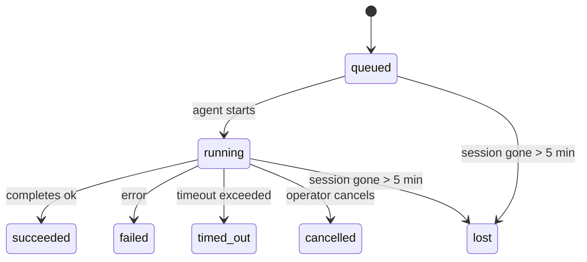

---
read_when:
    - 進行中または最近完了したバックグラウンド作業の確認
    - デタッチされたエージェント実行の配信失敗をデバッグする
    - バックグラウンド実行がセッション、Cron、Heartbeat とどのように関係するかを理解する
sidebarTitle: Background tasks
summary: ACP 実行、サブエージェント、分離された Cron ジョブ、CLI 操作のバックグラウンドタスク追跡
title: バックグラウンドタスク
x-i18n:
    generated_at: "2026-04-30T16:28:03Z"
    model: gpt-5.5
    provider: openai
    source_hash: 999653c9360323d5135e33193c76458cba8c288227de46a6217f1ccbed2a6d34
    source_path: automation/tasks.md
    workflow: 16
---

<Note>
スケジューリングを探している場合は、適切な仕組みを選ぶために[自動化とタスク](/ja-JP/automation)を参照してください。このページはバックグラウンド作業のアクティビティ台帳であり、スケジューラではありません。
</Note>

バックグラウンドタスクは、**メインの会話セッションの外側**で実行される作業を追跡します。ACP実行、サブエージェントの起動、分離されたCronジョブ実行、CLIから開始された操作が含まれます。

タスクは、セッション、Cronジョブ、Heartbeatを置き換えるものではありません。切り離された作業で何が起きたか、いつ起きたか、成功したかどうかを記録する**アクティビティ台帳**です。

<Note>
すべてのエージェント実行がタスクを作成するわけではありません。Heartbeatターンと通常の対話型チャットは作成しません。すべてのCron実行、ACP起動、サブエージェント起動、CLIエージェントコマンドは作成します。
</Note>

## 要点

- タスクはスケジューラではなく**記録**です。CronとHeartbeatが作業を_いつ_実行するかを決め、タスクは_何が起きたか_を追跡します。
- ACP、サブエージェント、すべてのCronジョブ、CLI操作はタスクを作成します。Heartbeatターンは作成しません。
- 各タスクは `queued → running → terminal`（succeeded、failed、timed_out、cancelled、lost）を遷移します。
- Cronタスクは、Cronランタイムがまだジョブを所有している間はライブのままです。
  インメモリのランタイム状態が失われている場合、タスクメンテナンスはまず永続化されたCron実行履歴を確認してから、タスクをlostとしてマークします。
- 完了はプッシュ駆動です。切り離された作業は、完了時に直接通知するか、
  リクエスト元セッション/Heartbeatを起こすことができるため、ステータスのポーリングループは
  通常は適切な形ではありません。
- 分離されたCron実行とサブエージェント完了は、最終的なクリーンアップ記録の前に、子セッションで追跡されているブラウザタブ/プロセスをベストエフォートでクリーンアップします。
- 分離されたCron配信は、子孫サブエージェント作業がまだ完了処理中の場合、古くなった途中の親返信を抑制し、配信前に子孫の最終出力が届いた場合はそれを優先します。
- 完了通知はチャンネルへ直接配信されるか、次のHeartbeatに向けてキューに入れられます。
- `openclaw tasks list` はすべてのタスクを表示します。`openclaw tasks audit` は問題を表示します。
- terminalレコードは7日間保持され、その後自動的に削除されます。

## クイックスタート

<Tabs>
  <Tab title="一覧表示とフィルタ">
    ```bash
    # List all tasks (newest first)
    openclaw tasks list

    # Filter by runtime or status
    openclaw tasks list --runtime acp
    openclaw tasks list --status running
    ```

  </Tab>
  <Tab title="確認">
    ```bash
    # Show details for a specific task (by ID, run ID, or session key)
    openclaw tasks show <lookup>
    ```
  </Tab>
  <Tab title="キャンセルと通知">
    ```bash
    # Cancel a running task (kills the child session)
    openclaw tasks cancel <lookup>

    # Change notification policy for a task
    openclaw tasks notify <lookup> state_changes
    ```

  </Tab>
  <Tab title="監査とメンテナンス">
    ```bash
    # Run a health audit
    openclaw tasks audit

    # Preview or apply maintenance
    openclaw tasks maintenance
    openclaw tasks maintenance --apply
    ```

  </Tab>
  <Tab title="タスクフロー">
    ```bash
    # Inspect TaskFlow state
    openclaw tasks flow list
    openclaw tasks flow show <lookup>
    openclaw tasks flow cancel <lookup>
    ```
  </Tab>
</Tabs>

## タスクを作成するもの

| ソース                 | ランタイム種別 | タスクレコードが作成されるタイミング                          | デフォルト通知ポリシー |
| ---------------------- | ------------ | ------------------------------------------------------ | --------------------- |
| ACPバックグラウンド実行    | `acp`        | 子ACPセッションの起動                           | `done_only`           |
| サブエージェントのオーケストレーション | `subagent`   | `sessions_spawn` によるサブエージェントの起動               | `done_only`           |
| Cronジョブ（全種別）  | `cron`       | すべてのCron実行（メインセッションと分離実行）       | `silent`              |
| CLI操作         | `cli`        | Gateway経由で実行される `openclaw agent` コマンド | `silent`              |
| エージェントメディアジョブ       | `cli`        | セッションに紐づく `video_generate` 実行                   | `silent`              |

<AccordionGroup>
  <Accordion title="Cronとメディアの通知デフォルト">
    メインセッションのCronタスクは、デフォルトで `silent` 通知ポリシーを使用します。追跡用のレコードは作成しますが、通知は生成しません。分離されたCronタスクもデフォルトは `silent` ですが、独自のセッションで実行されるため、より見えやすくなります。

    セッションに紐づく `video_generate` 実行も `silent` 通知ポリシーを使用します。タスクレコードは引き続き作成しますが、完了は内部wakeとして元のエージェントセッションに戻されるため、エージェントがフォローアップメッセージを書き、完成した動画を自分で添付できます。`tools.media.asyncCompletion.directSend` を有効にすると、非同期の `music_generate` と `video_generate` の完了は、リクエスト元セッションのwake経路へフォールバックする前に、まずチャンネルへの直接配信を試みます。

  </Accordion>
  <Accordion title="同時video_generateのガードレール">
    セッションに紐づく `video_generate` タスクがまだアクティブな間、このツールはガードレールとしても機能します。同じセッションで `video_generate` を繰り返し呼び出すと、2つ目の同時生成を開始する代わりに、アクティブなタスクのステータスを返します。エージェント側から明示的に進捗/ステータスを取得したい場合は、`action: "status"` を使用してください。
  </Accordion>
  <Accordion title="タスクを作成しないもの">
    - Heartbeatターン — メインセッション。[Heartbeat](/ja-JP/gateway/heartbeat)を参照
    - 通常の対話型チャットターン
    - 直接の `/command` 応答

  </Accordion>
</AccordionGroup>

## タスクのライフサイクル



| ステータス      | 意味                                                              |
| ----------- | -------------------------------------------------------------------------- |
| `queued`    | 作成済みで、エージェントの開始を待機中                                    |
| `running`   | エージェントターンがアクティブに実行中                                           |
| `succeeded` | 正常に完了                                                     |
| `failed`    | エラーで完了                                                    |
| `timed_out` | 設定されたタイムアウトを超過                                            |
| `cancelled` | `openclaw tasks cancel` によりオペレーターが停止                        |
| `lost`      | 5分間の猶予期間後に、ランタイムが信頼できる裏付け状態を失った |

遷移は自動的に発生します。関連するエージェント実行が終了すると、タスクステータスがそれに合わせて更新されます。

エージェント実行の完了は、アクティブなタスクレコードに対する信頼できる情報源です。成功した切り離し実行は `succeeded` として最終化され、通常の実行エラーは `failed` として最終化され、タイムアウトまたは中止の結果は `timed_out` として最終化されます。オペレーターがすでにタスクをキャンセルしている場合、またはランタイムが `failed`、`timed_out`、`lost` などより強いterminal状態をすでに記録している場合、後から成功シグナルが来ても、そのterminalステータスは弱められません。

`lost` はランタイムを考慮します。

- ACPタスク: 裏付けとなるACP子セッションメタデータが消えた。
- サブエージェントタスク: 裏付けとなる子セッションがターゲットエージェントストアから消えた。
- Cronタスク: Cronランタイムがジョブをアクティブとして追跡しなくなり、永続化された
  Cron実行履歴にもその実行のterminal結果がない。オフラインCLI
  監査は、自身の空のインプロセスCronランタイム状態を権威として扱いません。
- CLIタスク: 分離された子セッションタスクは子セッションを使用します。チャットに紐づく
  CLIタスクは代わりにライブ実行コンテキストを使用するため、残存する
  チャンネル/グループ/ダイレクトのセッション行がそれらを生存状態に保つことはありません。Gatewayに紐づく
  `openclaw agent` 実行も実行結果から最終化されるため、完了済み実行が
  スイーパーによって `lost` とマークされるまでアクティブのまま残ることはありません。

## 配信と通知

タスクがterminal状態に到達すると、OpenClawが通知します。配信経路は2つあります。

**直接配信** — タスクにチャンネルターゲット（`requesterOrigin`）がある場合、完了メッセージはそのチャンネル（Telegram、Discord、Slackなど）へ直接送られます。サブエージェント完了では、OpenClawは利用可能な場合に紐づいたスレッド/トピックのルーティングも保持し、直接配信を諦める前に、リクエスト元セッションに保存された経路（`lastChannel` / `lastTo` / `lastAccountId`）から不足している `to` / account を補完できます。

**セッションキュー配信** — 直接配信が失敗するかoriginが設定されていない場合、更新はリクエスト元のセッションにシステムイベントとしてキューに入れられ、次のHeartbeatで表示されます。

<Tip>
タスク完了は即時のHeartbeat wakeをトリガーするため、結果をすぐに確認できます。次にスケジュールされたHeartbeat tickを待つ必要はありません。
</Tip>

つまり、通常のワークフローはプッシュベースです。切り離された作業を一度開始し、その後は完了時にランタイムがwakeまたは通知するのに任せます。デバッグ、介入、明示的な監査が必要な場合にのみタスク状態をポーリングしてください。

### 通知ポリシー

各タスクについて、どの程度通知を受け取るかを制御します。

| ポリシー                | 配信される内容                                                       |
| --------------------- | ----------------------------------------------------------------------- |
| `done_only`（デフォルト） | terminal状態（succeeded、failedなど）のみ — **これがデフォルトです** |
| `state_changes`       | すべての状態遷移と進捗更新                              |
| `silent`              | 何もなし                                                          |

タスクの実行中にポリシーを変更します。

```bash
openclaw tasks notify <lookup> state_changes
```

## CLIリファレンス

<AccordionGroup>
  <Accordion title="tasks list">
    ```bash
    openclaw tasks list [--runtime <acp|subagent|cron|cli>] [--status <status>] [--json]
    ```

    出力列: Task ID、Kind、Status、Delivery、Run ID、Child Session、Summary。

  </Accordion>
  <Accordion title="tasks show">
    ```bash
    openclaw tasks show <lookup>
    ```

    lookupトークンには、タスクID、実行ID、セッションキーを指定できます。タイミング、配信状態、エラー、terminalサマリーを含む完全なレコードを表示します。

  </Accordion>
  <Accordion title="tasks cancel">
    ```bash
    openclaw tasks cancel <lookup>
    ```

    ACPタスクとサブエージェントタスクでは、これは子セッションを終了します。CLIで追跡されるタスクでは、キャンセルはタスクレジストリに記録されます（別個の子ランタイムハンドルはありません）。ステータスは `cancelled` に遷移し、該当する場合は配信通知が送信されます。

  </Accordion>
  <Accordion title="tasks notify">
    ```bash
    openclaw tasks notify <lookup> <done_only|state_changes|silent>
    ```
  </Accordion>
  <Accordion title="tasks audit">
    ```bash
    openclaw tasks audit [--json]
    ```

    運用上の問題を表示します。問題が検出された場合、検出結果は `openclaw status` にも表示されます。

    | 検出事項                  | 重要度     | トリガー                                                                                                      |
    | ------------------------- | ---------- | ------------------------------------------------------------------------------------------------------------ |
    | `stale_queued`            | warn       | 10 分を超えてキューに入っている                                                                              |
    | `stale_running`           | error      | 30 分を超えて実行中                                                                                          |
    | `lost`                    | warn/error | ランタイムに裏付けられたタスク所有権が消失した。保持された lost タスクは `cleanupAfter` までは警告になり、その後エラーになる |
    | `delivery_failed`         | warn       | 配信に失敗し、通知ポリシーが `silent` ではない                                                               |
    | `missing_cleanup`         | warn       | クリーンアップタイムスタンプがない終端タスク                                                                  |
    | `inconsistent_timestamps` | warn       | タイムライン違反（たとえば開始前に終了している）                                                              |

  </Accordion>
  <Accordion title="tasks maintenance">
    ```bash
    openclaw tasks maintenance [--json]
    openclaw tasks maintenance --apply [--json]
    ```

    これを使用して、タスクと Task Flow 状態の照合、クリーンアップのタイムスタンプ付与、プルーニングをプレビューまたは適用します。

    照合はランタイムを考慮します。

    - ACP/サブエージェントタスクは、裏付けとなる子セッションを確認します。
    - 子セッションに再起動リカバリの tombstone があるサブエージェントタスクは、リカバリ可能な裏付けセッションとして扱われるのではなく lost とマークされます。
    - Cron タスクは、cron ランタイムがまだジョブを所有しているかどうかを確認し、その後 `lost` にフォールバックする前に、永続化された cron 実行ログ/ジョブ状態から終端ステータスを復元します。メモリ内の cron アクティブジョブセットについて権威を持つのは Gateway プロセスだけです。オフライン CLI 監査は永続履歴を使用しますが、そのローカル Set が空であることだけを理由に cron タスクを lost とマークしません。
    - チャットに裏付けられた CLI タスクは、チャットセッション行だけでなく、所有するライブ実行コンテキストを確認します。

    完了クリーンアップもランタイムを考慮します。

    - サブエージェント完了では、通知クリーンアップを続ける前に、子セッションで追跡されているブラウザータブ/プロセスをベストエフォートで閉じます。
    - 分離 cron 完了では、実行が完全に終了する前に、cron セッションで追跡されているブラウザータブ/プロセスをベストエフォートで閉じます。
    - 分離 cron 配信は、必要に応じて子孫サブエージェントのフォローアップを待ち、古い親の確認応答テキストを通知する代わりに抑制します。
    - サブエージェント完了配信は、最新の表示可能なアシスタントテキストを優先します。それが空の場合は、サニタイズされた最新の tool/toolResult テキストにフォールバックし、タイムアウトのみのツール呼び出し実行は短い部分進捗サマリーに折りたたまれることがあります。終端失敗実行は、キャプチャされた返信テキストを再生せずに失敗ステータスを通知します。
    - クリーンアップ失敗は、実際のタスク結果を隠しません。

  </Accordion>
  <Accordion title="tasks flow list | show | cancel">
    ```bash
    openclaw tasks flow list [--status <status>] [--json]
    openclaw tasks flow show <lookup> [--json]
    openclaw tasks flow cancel <lookup>
    ```

    個々のバックグラウンドタスクレコードではなく、オーケストレーションしている Task Flow を確認したい場合に使用します。

  </Accordion>
</AccordionGroup>

## チャットタスクボード（`/tasks`）

任意のチャットセッションで `/tasks` を使用すると、そのセッションにリンクされたバックグラウンドタスクを確認できます。ボードには、アクティブなタスクと最近完了したタスクが、ランタイム、ステータス、タイミング、進捗またはエラー詳細とともに表示されます。

現在のセッションに表示可能なリンク済みタスクがない場合、`/tasks` はエージェントローカルのタスク数にフォールバックするため、他セッションの詳細を漏らさずに概要を把握できます。

完全なオペレーター台帳には CLI を使用します: `openclaw tasks list`。

## ステータス統合（タスク圧力）

`openclaw status` には、一目でわかるタスクサマリーが含まれます。

```
Tasks: 3 queued · 2 running · 1 issues
```

サマリーは次を報告します。

- **active** — `queued` + `running` の数
- **failures** — `failed` + `timed_out` + `lost` の数
- **byRuntime** — `acp`、`subagent`、`cron`、`cli` ごとの内訳

`/status` と `session_status` ツールはいずれも、クリーンアップを考慮したタスクスナップショットを使用します。アクティブなタスクが優先され、古い完了行は非表示になり、最近の失敗はアクティブな作業が残っていない場合にのみ表示されます。これにより、ステータスカードは今重要な内容に集中できます。

## ストレージとメンテナンス

### タスクの保存場所

タスクレコードは、SQLite で次の場所に永続化されます。

```
$OPENCLAW_STATE_DIR/tasks/runs.sqlite
```

レジストリは Gateway 起動時にメモリへ読み込まれ、再起動後も耐久性を保つために書き込みを SQLite に同期します。
Gateway は、SQLite のデフォルトの自動チェックポイントしきい値に加え、定期的およびシャットダウン時の `TRUNCATE` チェックポイントを使用して、SQLite write-ahead log を一定範囲に保ちます。

### 自動メンテナンス

sweeper は **60 秒** ごとに実行され、4 つの処理を行います。

<Steps>
  <Step title="照合">
    アクティブなタスクに、まだ権威あるランタイムの裏付けがあるかを確認します。ACP/サブエージェントタスクは子セッション状態を使用し、cron タスクはアクティブジョブ所有権を使用し、チャットに裏付けられた CLI タスクは所有する実行コンテキストを使用します。その裏付け状態が 5 分を超えて消失している場合、タスクは `lost` とマークされます。
  </Step>
  <Step title="ACP セッション修復">
    終端または孤立した親所有のワンショット ACP セッションを閉じ、アクティブな会話バインディングが残っていない場合にのみ、古い終端または孤立した永続 ACP セッションを閉じます。
  </Step>
  <Step title="クリーンアップのタイムスタンプ付与">
    終端タスクに `cleanupAfter` タイムスタンプを設定します（endedAt + 7 日）。保持期間中、lost タスクは監査で警告として表示されます。`cleanupAfter` が期限切れになった後、またはクリーンアップメタデータが欠落している場合はエラーになります。
  </Step>
  <Step title="プルーニング">
    `cleanupAfter` 日付を過ぎたレコードを削除します。
  </Step>
</Steps>

<Note>
**保持期間:** 終端タスクレコードは **7 日間** 保持され、その後自動的にプルーニングされます。設定は不要です。
</Note>

## タスクと他システムの関係

<AccordionGroup>
  <Accordion title="タスクと Task Flow">
    [Task Flow](/ja-JP/automation/taskflow) は、バックグラウンドタスクの上位にあるフローオーケストレーションレイヤーです。1 つのフローは、そのライフタイム中に managed または mirrored 同期モードを使用して複数のタスクを調整する場合があります。個々のタスクレコードを調べるには `openclaw tasks` を使用し、オーケストレーションしているフローを調べるには `openclaw tasks flow` を使用します。

    詳細は [Task Flow](/ja-JP/automation/taskflow) を参照してください。

  </Accordion>
  <Accordion title="タスクと cron">
    cron ジョブ**定義**は `~/.openclaw/cron/jobs.json` にあり、ランタイム実行状態はその横の `~/.openclaw/cron/jobs-state.json` にあります。**すべての** cron 実行は、メインセッションと分離実行の両方でタスクレコードを作成します。メインセッション cron タスクは、通知を生成せずに追跡できるよう、通知ポリシーのデフォルトが `silent` です。

    [Cron ジョブ](/ja-JP/automation/cron-jobs) を参照してください。

  </Accordion>
  <Accordion title="タスクと Heartbeat">
    Heartbeat 実行はメインセッションのターンであり、タスクレコードを作成しません。タスクが完了すると、結果をすぐに確認できるよう Heartbeat のウェイクをトリガーできます。

    [Heartbeat](/ja-JP/gateway/heartbeat) を参照してください。

  </Accordion>
  <Accordion title="タスクとセッション">
    タスクは `childSessionKey`（作業が実行される場所）と `requesterSessionKey`（開始した人）を参照する場合があります。セッションは会話コンテキストであり、タスクはその上にあるアクティビティ追跡です。
  </Accordion>
  <Accordion title="タスクとエージェント実行">
    タスクの `runId` は、作業を実行しているエージェント実行にリンクします。エージェントのライフサイクルイベント（開始、終了、エラー）は、タスクステータスを自動的に更新します。ライフサイクルを手動で管理する必要はありません。
  </Accordion>
</AccordionGroup>

## 関連

- [自動化とタスク](/ja-JP/automation) — すべての自動化メカニズムの概要
- [CLI: タスク](/ja-JP/cli/tasks) — CLI コマンドリファレンス
- [Heartbeat](/ja-JP/gateway/heartbeat) — 定期的なメインセッションターン
- [Scheduled Tasks](/ja-JP/automation/cron-jobs) — バックグラウンド作業のスケジューリング
- [Task Flow](/ja-JP/automation/taskflow) — タスクの上位にあるフローオーケストレーション
