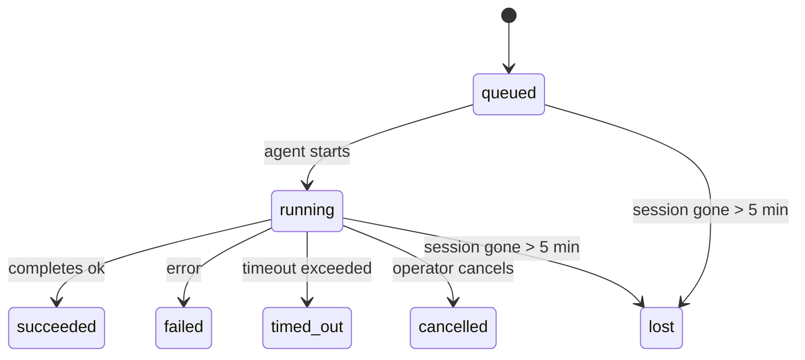

---
read_when:
    - 進行中または最近完了したバックグラウンド作業を確認する
    - デタッチされたエージェント実行の配信失敗をデバッグする
    - バックグラウンド実行がセッション、Cron、Heartbeat とどう関係するかを理解する
sidebarTitle: Background tasks
summary: ACP 実行、サブエージェント、分離された Cron ジョブ、CLI 操作のバックグラウンドタスク追跡
title: バックグラウンドタスク
x-i18n:
    generated_at: "2026-05-01T05:00:32Z"
    model: gpt-5.5
    provider: openai
    source_hash: 8782987a79989264ae3bd1ca4b16755bdfb7e295e4f77933bf3a38c136d837f4
    source_path: automation/tasks.md
    workflow: 16
---

<Note>
スケジュール設定を探していますか？適切な仕組みを選ぶには、[自動化とタスク](/ja-JP/automation)を参照してください。このページはバックグラウンド作業のアクティビティ台帳であり、スケジューラーではありません。
</Note>

バックグラウンドタスクは、**メインの会話セッションの外部**で実行される作業を追跡します: ACP 実行、サブエージェントの起動、分離された cron ジョブ実行、CLI から開始された操作です。

タスクはセッション、cron ジョブ、Heartbeat を置き換えるものではありません。タスクは、どの分離作業がいつ発生し、成功したかどうかを記録する**アクティビティ台帳**です。

<Note>
すべてのエージェント実行がタスクを作成するわけではありません。Heartbeat ターンと通常の対話型チャットは作成しません。すべての cron 実行、ACP 起動、サブエージェント起動、CLI エージェントコマンドは作成します。
</Note>

## 要約

- タスクはスケジューラーではなく**レコード**です。cron と Heartbeat は作業を_いつ_実行するかを決め、タスクは_何が起きたか_を追跡します。
- ACP、サブエージェント、すべての cron ジョブ、CLI 操作はタスクを作成します。Heartbeat ターンは作成しません。
- 各タスクは `queued → running → terminal`（succeeded、failed、timed_out、cancelled、または lost）を進みます。
- cron タスクは、cron ランタイムがまだジョブを所有している間はライブのままです。
  メモリ内のランタイム状態がなくなった場合、タスクのメンテナンスはタスクを lost としてマークする前に、まず永続化された cron
  実行履歴を確認します。
- 完了はプッシュ駆動です: 分離された作業は完了時に直接通知するか、リクエスターのセッション/Heartbeat を起こせるため、ステータスのポーリングループは通常適切な形ではありません。
- 分離された cron 実行とサブエージェント完了は、最終クリーンアップの帳簿処理の前に、子セッションで追跡されているブラウザータブ/プロセスをベストエフォートでクリーンアップします。
- 分離された cron 配信は、子孫サブエージェントの作業がまだ排出中の間は古くなった暫定的な親返信を抑制し、配信前に子孫の最終出力が届いた場合はそれを優先します。
- 完了通知はチャンネルに直接配信されるか、次の Heartbeat 用にキューに入れられます。
- `openclaw tasks list` はすべてのタスクを表示します。`openclaw tasks audit` は問題を表面化します。
- 終端レコードは 7 日間保持され、その後自動的に削除されます。

## クイックスタート

<Tabs>
  <Tab title="一覧表示とフィルター">
    ```bash
    # List all tasks (newest first)
    openclaw tasks list

    # Filter by runtime or status
    openclaw tasks list --runtime acp
    openclaw tasks list --status running
    ```

  </Tab>
  <Tab title="検査">
    ```bash
    # Show details for a specific task (by ID, run ID, or session key)
    openclaw tasks show <lookup>
    ```
  </Tab>
  <Tab title="キャンセルと通知">
    ```bash
    # Cancel a running task (kills the child session)
    openclaw tasks cancel <lookup>

    # Change notification policy for a task
    openclaw tasks notify <lookup> state_changes
    ```

  </Tab>
  <Tab title="監査とメンテナンス">
    ```bash
    # Run a health audit
    openclaw tasks audit

    # Preview or apply maintenance
    openclaw tasks maintenance
    openclaw tasks maintenance --apply
    ```

  </Tab>
  <Tab title="TaskFlow">
    ```bash
    # Inspect TaskFlow state
    openclaw tasks flow list
    openclaw tasks flow show <lookup>
    openclaw tasks flow cancel <lookup>
    ```
  </Tab>
</Tabs>

## タスクを作成するもの

| ソース                 | ランタイムタイプ | タスクレコードが作成されるタイミング                   | デフォルト通知ポリシー |
| ---------------------- | ------------ | ------------------------------------------------------ | --------------------- |
| ACP バックグラウンド実行 | `acp`        | 子 ACP セッションを起動する時                           | `done_only`           |
| サブエージェントのオーケストレーション | `subagent`   | `sessions_spawn` 経由でサブエージェントを起動する時     | `done_only`           |
| cron ジョブ（全タイプ） | `cron`       | すべての cron 実行（メインセッションおよび分離）        | `silent`              |
| CLI 操作               | `cli`        | Gateway を通じて実行される `openclaw agent` コマンド    | `silent`              |
| エージェントメディアジョブ | `cli`        | セッション backed の `music_generate`/`video_generate` 実行 | `silent`              |

<AccordionGroup>
  <Accordion title="cron とメディアの通知デフォルト">
    メインセッションの cron タスクは、デフォルトで `silent` 通知ポリシーを使用します。追跡用のレコードは作成しますが、通知は生成しません。分離された cron タスクもデフォルトは `silent` ですが、独自のセッションで実行されるため、より見えやすくなります。

    セッション backed の `music_generate` と `video_generate` 実行も `silent` 通知ポリシーを使用します。それでもタスクレコードは作成されますが、完了は内部 wake として元のエージェントセッションに戻され、エージェントがフォローアップメッセージを書き、完成したメディアを自分で添付できるようにします。`tools.media.asyncCompletion.directSend` を有効にすると、非同期の `video_generate` 完了はまず直接チャンネル配信を試せます。非同期の `music_generate` 完了はリクエスターセッションの wake パスに留まります。

  </Accordion>
  <Accordion title="同時 video_generate ガードレール">
    セッション backed の `video_generate` タスクがまだアクティブな間、このツールはガードレールとしても機能します。同じセッションで `video_generate` が繰り返し呼び出されると、2 つ目の同時生成を開始する代わりに、アクティブなタスクのステータスを返します。エージェント側から明示的に進行状況/ステータスを参照したい場合は `action: "status"` を使用してください。
  </Accordion>
  <Accordion title="タスクを作成しないもの">
    - Heartbeat ターン（メインセッション）。[Heartbeat](/ja-JP/gateway/heartbeat)を参照
    - 通常の対話型チャットターン
    - 直接の `/command` 応答

  </Accordion>
</AccordionGroup>

## タスクのライフサイクル



| ステータス      | 意味                                                                       |
| ----------- | -------------------------------------------------------------------------- |
| `queued`    | 作成済みで、エージェントの開始を待っています                               |
| `running`   | エージェントターンがアクティブに実行中です                                  |
| `succeeded` | 正常に完了しました                                                         |
| `failed`    | エラーで完了しました                                                       |
| `timed_out` | 構成されたタイムアウトを超過しました                                        |
| `cancelled` | オペレーターが `openclaw tasks cancel` で停止しました                       |
| `lost`      | ランタイムが 5 分間の猶予期間後に、信頼できる裏付け状態を失いました         |

遷移は自動的に発生します。関連付けられたエージェント実行が終了すると、タスクステータスはそれに合わせて更新されます。

エージェント実行の完了は、アクティブなタスクレコードに対して信頼できる情報源です。成功した分離実行は `succeeded` として確定し、通常の実行エラーは `failed` として確定し、タイムアウトまたは中止の結果は `timed_out` として確定します。オペレーターがすでにタスクをキャンセルしている場合、またはランタイムが `failed`、`timed_out`、`lost` など、より強い終端状態をすでに記録している場合、後から成功シグナルが来てもその終端ステータスは引き下げられません。

`lost` はランタイムを考慮します:

- ACP タスク: 裏付けとなる ACP 子セッションのメタデータが消えました。
- サブエージェントタスク: 裏付けとなる子セッションがターゲットエージェントストアから消えました。
- cron タスク: cron ランタイムがそのジョブをアクティブとして追跡しなくなり、永続化された
  cron 実行履歴にもその実行の終端結果が示されていません。オフライン CLI
  監査は、自身の空のインプロセス cron ランタイム状態を権威として扱いません。
- CLI タスク: 分離された子セッションタスクは子セッションを使用します。チャット backed の
  CLI タスクは代わりにライブ実行コンテキストを使用するため、残存する
  チャンネル/グループ/ダイレクトセッション行がそれらを生存状態に保つことはありません。Gateway backed の
  `openclaw agent` 実行も実行結果から確定されるため、完了済みの実行がスイーパーにより `lost` とマークされるまでアクティブなまま残ることはありません。

## 配信と通知

タスクが終端状態に達すると、OpenClaw が通知します。配信パスは 2 つあります:

**直接配信** — タスクにチャンネルターゲット（`requesterOrigin`）がある場合、完了メッセージはそのチャンネル（Telegram、Discord、Slack など）に直接送られます。サブエージェント完了では、OpenClaw は利用可能な場合に紐付いたスレッド/トピックのルーティングも保持し、直接配信を諦める前に、リクエスターセッションに保存されたルート（`lastChannel` / `lastTo` / `lastAccountId`）から欠けている `to` / アカウントを補完できます。

**セッションキュー配信** — 直接配信が失敗した場合、または origin が設定されていない場合、更新はリクエスターのセッション内のシステムイベントとしてキューに入れられ、次の Heartbeat で表面化します。

<Tip>
タスク完了は即時の Heartbeat wake をトリガーするため、結果をすばやく確認できます。次のスケジュール済み Heartbeat tick を待つ必要はありません。
</Tip>

つまり、通常のワークフローはプッシュベースです。分離された作業を一度開始したら、完了時にランタイムが wake または通知するのを待ちます。デバッグ、介入、明示的な監査が必要な場合にのみタスク状態をポーリングしてください。

### 通知ポリシー

各タスクについて、どの程度通知を受けるかを制御します:

| ポリシー                | 配信される内容                                                          |
| --------------------- | ----------------------------------------------------------------------- |
| `done_only`（デフォルト） | 終端状態（succeeded、failed など）のみ — **これがデフォルトです**       |
| `state_changes`       | すべての状態遷移と進行状況更新                                          |
| `silent`              | 何も配信されません                                                      |

タスクの実行中にポリシーを変更します:

```bash
openclaw tasks notify <lookup> state_changes
```

## CLI リファレンス

<AccordionGroup>
  <Accordion title="tasks list">
    ```bash
    openclaw tasks list [--runtime <acp|subagent|cron|cli>] [--status <status>] [--json]
    ```

    出力列: タスク ID、種類、ステータス、配信、実行 ID、子セッション、要約。

  </Accordion>
  <Accordion title="tasks show">
    ```bash
    openclaw tasks show <lookup>
    ```

    参照トークンには、タスク ID、実行 ID、またはセッションキーを指定できます。タイミング、配信状態、エラー、終端要約を含む完全なレコードを表示します。

  </Accordion>
  <Accordion title="tasks cancel">
    ```bash
    openclaw tasks cancel <lookup>
    ```

    ACP とサブエージェントタスクでは、これにより子セッションが終了されます。CLI で追跡されるタスクでは、キャンセルはタスクレジストリに記録されます（別個の子ランタイムハンドルはありません）。ステータスは `cancelled` に遷移し、該当する場合は配信通知が送信されます。

  </Accordion>
  <Accordion title="tasks notify">
    ```bash
    openclaw tasks notify <lookup> <done_only|state_changes|silent>
    ```
  </Accordion>
  <Accordion title="tasks audit">
    ```bash
    openclaw tasks audit [--json]
    ```

    運用上の問題を表面化します。問題が検出された場合、検出結果は `openclaw status` にも表示されます。

    | 検出項目                  | 重大度     | トリガー                                                                                                     |
    | ------------------------- | ---------- | ------------------------------------------------------------------------------------------------------------ |
    | `stale_queued`            | warn       | 10 分を超えてキューに入っている                                                                              |
    | `stale_running`           | error      | 30 分を超えて実行中                                                                                          |
    | `lost`                    | warn/error | ランタイムに裏付けられたタスク所有権が消失した。保持中の lost タスクは `cleanupAfter` まで警告になり、その後エラーになる |
    | `delivery_failed`         | warn       | 配信に失敗し、通知ポリシーが `silent` ではない                                                               |
    | `missing_cleanup`         | warn       | クリーンアップタイムスタンプがない終端タスク                                                                 |
    | `inconsistent_timestamps` | warn       | タイムライン違反（たとえば開始前に終了している）                                                             |

  </Accordion>
  <Accordion title="tasks メンテナンス">
    ```bash
    openclaw tasks maintenance [--json]
    openclaw tasks maintenance --apply [--json]
    ```

    タスクと Task Flow 状態の照合、クリーンアップのスタンプ付け、枝刈りをプレビューまたは適用するために使います。

    照合はランタイムを認識します。

    - ACP/サブエージェントタスクは、裏付けとなる子セッションを確認します。
    - 子セッションに再起動復旧の墓標があるサブエージェントタスクは、復旧可能な裏付けセッションとして扱われるのではなく、lost としてマークされます。
    - Cron タスクは、cron ランタイムがまだジョブを所有しているかを確認し、その後 `lost` にフォールバックする前に、永続化された cron 実行ログ/ジョブ状態から終端ステータスを復旧します。メモリ内の cron アクティブジョブセットについて権威を持つのは Gateway プロセスだけです。オフライン CLI 監査は永続履歴を使いますが、そのローカル Set が空であるという理由だけで cron タスクを lost にしません。
    - チャットに裏付けられた CLI タスクは、チャットセッション行だけでなく、所有しているライブ実行コンテキストを確認します。

    完了時のクリーンアップもランタイムを認識します。

    - サブエージェントの完了では、通知クリーンアップが続行する前に、子セッションの追跡対象ブラウザータブ/プロセスをベストエフォートで閉じます。
    - 分離 cron の完了では、実行が完全に終了する前に、cron セッションの追跡対象ブラウザータブ/プロセスをベストエフォートで閉じます。
    - 分離 cron の配信は、必要に応じて子孫サブエージェントのフォローアップを待機し、古くなった親の確認応答テキストを通知する代わりに抑制します。
    - サブエージェントの完了配信では、最新の表示可能な assistant テキストが優先されます。それが空の場合は、サニタイズ済みの最新 tool/toolResult テキストにフォールバックし、タイムアウトのみのツール呼び出し実行は短い部分進捗サマリーにまとめられることがあります。終端失敗実行では、キャプチャされた返信テキストを再生せずに失敗ステータスを通知します。
    - クリーンアップ失敗は、実際のタスク結果を覆い隠しません。

  </Accordion>
  <Accordion title="tasks flow list | show | cancel">
    ```bash
    openclaw tasks flow list [--status <status>] [--json]
    openclaw tasks flow show <lookup> [--json]
    openclaw tasks flow cancel <lookup>
    ```

    個別のバックグラウンドタスクレコードではなく、それらをオーケストレーションする Task Flow に関心がある場合に使います。

  </Accordion>
</AccordionGroup>

## チャットタスクボード（`/tasks`）

任意のチャットセッションで `/tasks` を使うと、そのセッションにリンクされたバックグラウンドタスクを確認できます。ボードには、アクティブなタスクと最近完了したタスクが、ランタイム、ステータス、タイミング、進捗またはエラー詳細とともに表示されます。

現在のセッションに表示可能なリンク済みタスクがない場合、`/tasks` はエージェントローカルのタスク数にフォールバックするため、他セッションの詳細を漏らさずに概要を確認できます。

完全なオペレーター台帳には CLI を使います: `openclaw tasks list`。

## ステータス統合（タスク負荷）

`openclaw status` には、ひと目で分かるタスクサマリーが含まれます。

```
Tasks: 3 queued · 2 running · 1 issues
```

サマリーには次が報告されます。

- **active** — `queued` + `running` の数
- **failures** — `failed` + `timed_out` + `lost` の数
- **byRuntime** — `acp`、`subagent`、`cron`、`cli` 別の内訳

`/status` と `session_status` ツールはいずれも、クリーンアップを認識したタスクスナップショットを使います。アクティブなタスクが優先され、古くなった完了行は非表示になり、最近の失敗はアクティブな作業が残っていない場合にのみ表示されます。これにより、ステータスカードは現在重要なものに集中できます。

## ストレージとメンテナンス

### タスクの保存場所

タスクレコードは次の SQLite に永続化されます。

```
$OPENCLAW_STATE_DIR/tasks/runs.sqlite
```

レジストリは Gateway 起動時にメモリへ読み込まれ、再起動をまたいだ耐久性のために書き込みを SQLite に同期します。
Gateway は、SQLite のデフォルト自動チェックポイントしきい値に加えて、定期的およびシャットダウン時の `TRUNCATE` チェックポイントを使うことで、SQLite の先行書き込みログを一定範囲に保ちます。

### 自動メンテナンス

スイーパーは **60 秒** ごとに実行され、4 つのことを処理します。

<Steps>
  <Step title="照合">
    アクティブなタスクに、まだ権威あるランタイムの裏付けがあるかを確認します。ACP/サブエージェントタスクは子セッション状態を使い、cron タスクはアクティブジョブの所有権を使い、チャットに裏付けられた CLI タスクは所有している実行コンテキストを使います。その裏付け状態が 5 分を超えて失われている場合、タスクは `lost` としてマークされます。
  </Step>
  <Step title="ACP セッション修復">
    終端または孤立した親所有のワンショット ACP セッションを閉じ、アクティブな会話バインディングが残っていない場合にのみ、古くなった終端または孤立した永続 ACP セッションを閉じます。
  </Step>
  <Step title="クリーンアップのスタンプ付け">
    終端タスクに `cleanupAfter` タイムスタンプを設定します（endedAt + 7 日）。保持期間中、lost タスクは監査で引き続き警告として表示されます。`cleanupAfter` が期限切れになった後、またはクリーンアップメタデータが欠落している場合は、エラーになります。
  </Step>
  <Step title="枝刈り">
    `cleanupAfter` 日付を過ぎたレコードを削除します。
  </Step>
</Steps>

<Note>
**保持:** 終端タスクレコードは **7 日間** 保持され、その後自動的に枝刈りされます。設定は不要です。
</Note>

## タスクと他システムの関係

<AccordionGroup>
  <Accordion title="タスクと Task Flow">
    [Task Flow](/ja-JP/automation/taskflow) は、バックグラウンドタスクの上位にあるフローオーケストレーション層です。1 つのフローは、そのライフタイムを通じて、管理同期モードまたはミラー同期モードを使って複数のタスクを調整できます。個別のタスクレコードを調べるには `openclaw tasks` を使い、オーケストレーションしているフローを調べるには `openclaw tasks flow` を使います。

    詳細は [Task Flow](/ja-JP/automation/taskflow) を参照してください。

  </Accordion>
  <Accordion title="タスクと cron">
    cron ジョブの**定義**は `~/.openclaw/cron/jobs.json` にあり、ランタイム実行状態はその隣の `~/.openclaw/cron/jobs-state.json` にあります。cron 実行は**すべて**タスクレコードを作成します。メインセッションと分離セッションの両方です。メインセッションの cron タスクはデフォルトで `silent` 通知ポリシーになっているため、通知を生成せずに追跡されます。

    [Cron ジョブ](/ja-JP/automation/cron-jobs) を参照してください。

  </Accordion>
  <Accordion title="タスクと Heartbeat">
    Heartbeat の実行はメインセッションのターンです。タスクレコードは作成しません。タスクが完了すると、結果をすぐに確認できるように Heartbeat ウェイクをトリガーできます。

    [Heartbeat](/ja-JP/gateway/heartbeat) を参照してください。

  </Accordion>
  <Accordion title="タスクとセッション">
    タスクは `childSessionKey`（作業が実行される場所）と `requesterSessionKey`（それを開始した人）を参照することがあります。セッションは会話コンテキストであり、タスクはその上にあるアクティビティ追跡です。
  </Accordion>
  <Accordion title="タスクとエージェント実行">
    タスクの `runId` は、作業を行っているエージェント実行にリンクします。エージェントのライフサイクルイベント（開始、終了、エラー）はタスクステータスを自動的に更新するため、ライフサイクルを手動で管理する必要はありません。
  </Accordion>
</AccordionGroup>

## 関連

- [自動化とタスク](/ja-JP/automation) — すべての自動化メカニズムの概要
- [CLI: タスク](/ja-JP/cli/tasks) — CLI コマンドリファレンス
- [Heartbeat](/ja-JP/gateway/heartbeat) — 定期的なメインセッションターン
- [スケジュール済みタスク](/ja-JP/automation/cron-jobs) — バックグラウンド作業のスケジューリング
- [Task Flow](/ja-JP/automation/taskflow) — タスク上位のフローオーケストレーション
