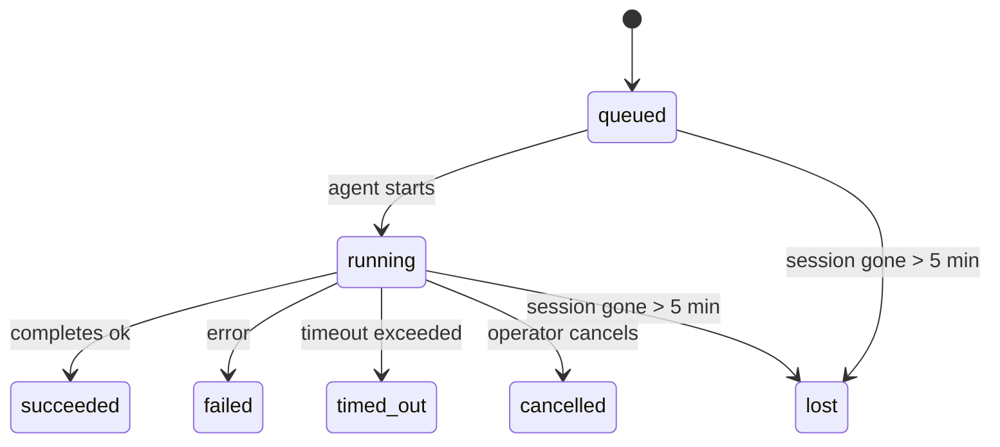

---
read_when:
    - 進行中または最近完了したバックグラウンド作業を調べる
    - 切り離されたエージェント実行の配信失敗をデバッグする
    - バックグラウンド実行とセッション、Cron、Heartbeatの関係を理解する
sidebarTitle: Background tasks
summary: ACP 実行、サブエージェント、分離された Cron ジョブ、CLI 操作のバックグラウンドタスク追跡
title: バックグラウンドタスク
x-i18n:
    generated_at: "2026-06-27T10:31:24Z"
    model: gpt-5.5
    postprocess_version: locale-links-v1
    provider: openai
    source_hash: 4a630a52d0d6bfd387a37415dd63fc4bfbce23f99eaa8cb780c3d6f8913675fd
    source_path: automation/tasks.md
    workflow: 16
---

<Note>
スケジューリングを探していますか？適切な仕組みを選ぶには [Automation](/ja-JP/automation) を参照してください。このページはバックグラウンド作業のアクティビティ台帳であり、スケジューラではありません。
</Note>

バックグラウンドタスクは、**メインの会話セッションの外側**で実行される作業を追跡します。ACP 実行、サブエージェントの起動、分離された cron ジョブの実行、CLI から開始された操作が含まれます。

タスクはセッション、cron ジョブ、Heartbeat を置き換えるものではありません。切り離された作業で何が起きたか、いつ起きたか、成功したかどうかを記録する**アクティビティ台帳**です。

<Note>
すべてのエージェント実行がタスクを作成するわけではありません。Heartbeat ターンと通常の対話型チャットは作成しません。すべての cron 実行、ACP 起動、サブエージェント起動、CLI エージェントコマンドは作成します。
</Note>

## 要約

- タスクはスケジューラではなく**記録**です。cron と Heartbeat が作業を_いつ_実行するかを決め、タスクは_何が起きたか_を追跡します。
- ACP、サブエージェント、すべての cron ジョブ、CLI 操作はタスクを作成します。Heartbeat ターンは作成しません。
- 各タスクは `queued → running → terminal`（succeeded、failed、timed_out、cancelled、lost）をたどります。
- cron ランタイムがまだジョブを所有している間、cron タスクはライブのままです。
  メモリ内のランタイム状態が失われた場合、タスクメンテナンスはタスクを lost とマークする前に、
  永続化された cron 実行履歴をまず確認します。
- 完了はプッシュ駆動です。切り離された作業は、完了時に直接通知するか、
  要求元セッションまたは Heartbeat を起床できるため、ステータスポーリングループは
  通常は適切な形ではありません。
- 分離された cron 実行とサブエージェント完了は、最終クリーンアップの記録処理の前に、子セッションで追跡されているブラウザタブやプロセスをベストエフォートでクリーンアップします。
- 分離された cron 配信は、子孫サブエージェント作業がまだ排出中の間、古くなった中間の親返信を抑制し、配信前に到着した場合は最終的な子孫出力を優先します。
- 完了通知はチャネルに直接配信されるか、次の Heartbeat 用にキューに入れられます。
- `openclaw tasks list` はすべてのタスクを表示します。`openclaw tasks audit` は問題を表面化します。
- ターミナル記録は 7 日間保持され、その後自動的に削除されます。

## クイックスタート

<Tabs>
  <Tab title="List and filter">
    ```bash
    # List all tasks (newest first)
    openclaw tasks list

    # Filter by runtime or status
    openclaw tasks list --runtime acp
    openclaw tasks list --status running
    ```

  </Tab>
  <Tab title="Inspect">
    ```bash
    # Show details for a specific task (by ID, run ID, or session key)
    openclaw tasks show <lookup>
    ```
  </Tab>
  <Tab title="Cancel and notify">
    ```bash
    # Cancel a running task (kills the child session)
    openclaw tasks cancel <lookup>

    # Change notification policy for a task
    openclaw tasks notify <lookup> state_changes
    ```

  </Tab>
  <Tab title="Audit and maintenance">
    ```bash
    # Run a health audit
    openclaw tasks audit

    # Preview or apply maintenance
    openclaw tasks maintenance
    openclaw tasks maintenance --apply
    ```

  </Tab>
  <Tab title="Task flow">
    ```bash
    # Inspect TaskFlow state
    openclaw tasks flow list
    openclaw tasks flow show <lookup>
    openclaw tasks flow cancel <lookup>
    ```
  </Tab>
</Tabs>

## タスクを作成するもの

| ソース                 | ランタイム種別 | タスク記録が作成されるタイミング                                          | 既定の通知ポリシー |
| ---------------------- | ------------ | ---------------------------------------------------------------------- | --------------------- |
| ACP バックグラウンド実行    | `acp`        | 子 ACP セッションを起動するとき                                           | `done_only`           |
| サブエージェントオーケストレーション | `subagent`   | `sessions_spawn` 経由でサブエージェントを起動するとき                               | `done_only`           |
| cron ジョブ（全種類）  | `cron`       | すべての cron 実行（メインセッションと分離）                       | `silent`              |
| CLI 操作         | `cli`        | Gateway を通じて実行される `openclaw agent` コマンド                 | `silent`              |
| エージェントメディアジョブ       | `cli`        | セッションに裏付けられた `image_generate`/`music_generate`/`video_generate` 実行 | `silent`              |

<AccordionGroup>
  <Accordion title="Notify defaults for cron and media">
    メインセッションの cron タスクは、既定で `silent` 通知ポリシーを使用します。追跡用の記録は作成しますが、通知は生成しません。分離された cron タスクも既定は `silent` ですが、独自のセッションで実行されるため、より見えやすくなります。

    セッションに裏付けられた `image_generate`、`music_generate`、`video_generate` 実行も `silent` 通知ポリシーを使用します。それでもタスク記録は作成されますが、完了は元のエージェントセッションに内部起床として戻されるため、エージェントはフォローアップメッセージを書き、完成したメディアを自分で添付できます。要求元エージェントは通常の可視返信契約に従います。設定されている場合は自動の最終返信、またはセッションがメッセージツール返信を必要とする場合は `message(action="send")` と `NO_REPLY` です。要求元セッションがすでにアクティブでない、またはアクティブ起床に失敗し、完了エージェントが生成済みメディアの一部または全部を取り逃した場合、OpenClaw は不足しているメディアだけを含む冪等な直接フォールバックを元のチャネルターゲットに送信します。

  </Accordion>
  <Accordion title="Concurrent media-generation guardrail">
    セッションに裏付けられたメディア生成タスクがまだアクティブな間、メディアツールは偶発的な再試行に対するガードレールとしても機能します。同じプロンプトに対する繰り返しの `image_generate` 呼び出しは、一致するアクティブタスクのステータスを返します。一方で、別の画像プロンプトは独自のタスクを開始できます。`music_generate` と `video_generate` の呼び出しは、2 つ目の同時生成を開始する代わりに、そのセッションのアクティブタスクステータスを返します。エージェント側から明示的な進行状況またはステータス検索が必要な場合は、`action: "status"` を使用してください。
  </Accordion>
  <Accordion title="What does not create tasks">
    - Heartbeat ターン - メインセッション。[Heartbeat](/ja-JP/gateway/heartbeat) を参照
    - 通常の対話型チャットターン
    - 直接の `/command` 応答

  </Accordion>
</AccordionGroup>

## タスクライフサイクル



| ステータス      | 意味                                                              |
| ----------- | -------------------------------------------------------------------------- |
| `queued`    | 作成済みで、エージェントの開始を待機中                                    |
| `running`   | エージェントターンがアクティブに実行中                                           |
| `succeeded` | 正常に完了                                                     |
| `failed`    | エラーで完了                                                    |
| `timed_out` | 設定されたタイムアウトを超過                                            |
| `cancelled` | オペレーターにより `openclaw tasks cancel` 経由で停止                        |
| `lost`      | 5 分間の猶予期間後、ランタイムが権威ある裏付け状態を失った |

遷移は自動的に発生します。関連付けられたエージェント実行が終了すると、タスクステータスはそれに合わせて更新されます。

エージェント実行の完了は、アクティブなタスク記録に対して権威があります。成功した切り離し実行は `succeeded` として確定し、通常の実行エラーは `failed` として確定し、タイムアウトまたは中止の結果は `timed_out` として確定します。オペレーターがすでにタスクをキャンセルしている場合、またはランタイムが `failed`、`timed_out`、`lost` など、より強いターミナル状態をすでに記録している場合、後から成功シグナルが来てもそのターミナルステータスは格下げされません。

`lost` はランタイムを考慮します。

- ACP タスク: 裏付けとなる ACP 子セッションメタデータが消失しました。
- サブエージェントタスク: 裏付けとなる子セッションがターゲットエージェントストアから消失しました。
- cron タスク: cron ランタイムがそのジョブをアクティブとして追跡しなくなり、永続化された
  cron 実行履歴にもその実行のターミナル結果がありません。オフライン CLI
  監査は、自分自身の空のプロセス内 cron ランタイム状態を権威として扱いません。
- CLI タスク: 実行 ID またはソース ID を持つタスクはライブ実行コンテキストを使用するため、
  残存する子セッションやチャットセッション行は、Gateway が所有する実行が消えた後も
  それらを生存扱いにはしません。実行 ID を持たないレガシー CLI タスクは引き続き
  子セッションにフォールバックします。Gateway に裏付けられた `openclaw agent` 実行も
  実行結果から確定するため、完了した実行がスイーパーに `lost` とマークされるまで
  アクティブのまま残ることはありません。

## 配信と通知

タスクがターミナル状態に到達すると、OpenClaw は通知します。配信経路は 2 つあります。

**直接配信** - タスクにチャネルターゲット（`requesterOrigin`）がある場合、完了メッセージはそのチャネル（Telegram、Discord、Slack など）に直接送られます。グループおよびチャネルのタスク完了は、代わりに要求元セッション経由でルーティングされ、親エージェントが可視返信を書けるようにします。サブエージェント完了では、OpenClaw は利用可能な場合、バインドされたスレッドまたはトピックのルーティングも保持し、直接配信を断念する前に、要求元セッションの保存済みルート（`lastChannel` / `lastTo` / `lastAccountId`）から不足している `to` / アカウントを補完できます。

**セッションキュー配信** - 直接配信が失敗した場合、または origin が設定されていない場合、更新は要求元のセッション内でシステムイベントとしてキューに入れられ、次の Heartbeat で表面化します。

<Tip>
タスク完了は即時 Heartbeat 起床をトリガーするため、結果をすばやく確認できます。次にスケジュールされた Heartbeat tick を待つ必要はありません。
</Tip>

つまり通常のワークフローはプッシュベースです。切り離された作業を一度開始し、その後はランタイムが完了時に起床または通知するのに任せます。タスク状態のポーリングは、デバッグ、介入、または明示的な監査が必要な場合にのみ行ってください。

### 通知ポリシー

各タスクについてどの程度通知を受けるかを制御します。

| ポリシー                | 配信される内容                                                       |
| --------------------- | ----------------------------------------------------------------------- |
| `done_only`（既定） | ターミナル状態（succeeded、failed など）のみ - **これが既定です** |
| `state_changes`       | すべての状態遷移と進行状況更新                              |
| `silent`              | 何もなし                                                          |

タスクの実行中にポリシーを変更します。

```bash
openclaw tasks notify <lookup> state_changes
```

## CLI リファレンス

<AccordionGroup>
  <Accordion title="tasks list">
    ```bash
    openclaw tasks list [--runtime <acp|subagent|cron|cli>] [--status <status>] [--json]
    ```

    出力列: タスク ID、種別、ステータス、配信、実行 ID、子セッション、概要。

  </Accordion>
  <Accordion title="tasks show">
    ```bash
    openclaw tasks show <lookup>
    ```

    検索トークンはタスク ID、実行 ID、またはセッションキーを受け付けます。タイミング、配信状態、エラー、ターミナル概要を含む完全な記録を表示します。

  </Accordion>
  <Accordion title="tasks cancel">
    ```bash
    openclaw tasks cancel <lookup>
    ```

    ACP およびサブエージェントタスクでは、これにより子セッションが kill されます。CLI で追跡されるタスクでは、キャンセルはタスクレジストリに記録されます（個別の子ランタイムハンドルはありません）。ステータスは `cancelled` に遷移し、該当する場合は配信通知が送信されます。

  </Accordion>
  <Accordion title="tasks notify">
    ```bash
    openclaw tasks notify <lookup> <done_only|state_changes|silent>
    ```
  </Accordion>
  <Accordion title="tasks audit">
    ```bash
    openclaw tasks audit [--json]
    ```

    運用上の問題を表面化します。問題が検出された場合、検出結果は `openclaw status` にも表示されます。

    | 検出項目                  | 重大度     | トリガー                                                                                                     |
    | ------------------------- | ---------- | ------------------------------------------------------------------------------------------------------------ |
    | `stale_queued`            | 警告       | 10分を超えてキューに入っている                                                                              |
    | `stale_running`           | エラー     | 30分を超えて実行中                                                                                          |
    | `lost`                    | 警告/エラー | ランタイムに裏付けられたタスク所有権が消失した。保持中の lost タスクは `cleanupAfter` まで警告になり、その後エラーになる |
    | `delivery_failed`         | 警告       | 配信に失敗し、通知ポリシーが `silent` ではない                                                              |
    | `missing_cleanup`         | 警告       | クリーンアップのタイムスタンプがない終端タスク                                                              |
    | `inconsistent_timestamps` | 警告       | タイムライン違反（たとえば開始前に終了している）                                                            |

  </Accordion>
  <Accordion title="tasks maintenance">
    ```bash
    openclaw tasks maintenance [--json]
    openclaw tasks maintenance --apply [--json]
    ```

    これを使用して、タスク、タスクフロー状態、古い cron 実行セッションレジストリ行に対する照合、クリーンアップスタンプ付与、削除をプレビューまたは適用します。

    照合はランタイムを考慮します。

    - ACP/サブエージェントタスクは、裏付けとなる子セッションを確認します。
    - 子セッションに再起動リカバリの tombstone があるサブエージェントタスクは、復旧可能な裏付けセッションとして扱われるのではなく、lost としてマークされます。
    - Cron タスクは、cron ランタイムがまだジョブを所有しているかを確認し、その後 `lost` へフォールバックする前に、永続化された cron 実行ログ/ジョブ状態から終端ステータスを復旧します。メモリ内の cron アクティブジョブセットについては、Gateway プロセスだけが信頼できる情報源です。オフライン CLI 監査は永続履歴を使用しますが、そのローカル Set が空であるという理由だけで cron タスクを lost としてマークすることはありません。
    - 実行 ID を持つ CLI タスクは、子セッションやチャットセッション行だけでなく、所有しているライブ実行コンテキストを確認します。

    完了時のクリーンアップもランタイムを考慮します。

    - サブエージェントの完了では、通知クリーンアップが続行する前に、子セッションで追跡されているブラウザタブ/プロセスをベストエフォートで閉じます。
    - 分離 cron の完了では、実行が完全に終了する前に、cron セッションで追跡されているブラウザタブ/プロセスをベストエフォートで閉じます。
    - 分離 cron の配信は、必要に応じて子孫サブエージェントのフォローアップを待ち、古い親の確認テキストを通知する代わりに抑制します。
    - サブエージェントの完了配信では、子の最新の表示可能な assistant テキストだけを使用します。ツール/toolResult 出力は子の結果テキストへ昇格されません。終端で失敗した実行は、取得済みの返信テキストを再生せずに失敗ステータスを通知します。
    - クリーンアップ失敗が実際のタスク結果を隠すことはありません。

    maintenance を適用すると、OpenClaw は 7日より古い `cron:<jobId>:run:<uuid>` セッションレジストリ行も削除します。ただし、現在実行中の cron ジョブの行は保持し、cron 以外のセッション行は変更しません。

  </Accordion>
  <Accordion title="tasks flow list | show | cancel">
    ```bash
    openclaw tasks flow list [--status <status>] [--json]
    openclaw tasks flow show <lookup> [--json]
    openclaw tasks flow cancel <lookup>
    ```

    個別のバックグラウンドタスクレコードではなく、オーケストレーションしているタスクフロー自体を確認したい場合に使用します。

  </Accordion>
</AccordionGroup>

## チャットタスクボード（`/tasks`）

任意のチャットセッションで `/tasks` を使用すると、そのセッションにリンクされたバックグラウンドタスクを確認できます。ボードには、アクティブなタスクと最近完了したタスクが、ランタイム、ステータス、タイミング、進捗またはエラー詳細とともに表示されます。

現在のセッションに表示可能なリンク済みタスクがない場合、`/tasks` はエージェントローカルのタスク数へフォールバックするため、他セッションの詳細を漏らさずに概要を確認できます。

完全なオペレータ台帳には CLI を使用します: `openclaw tasks list`。

## ステータス連携（タスク負荷）

`openclaw status` には、タスク概要がひと目で分かる形式で含まれます。

```
Tasks: 3 queued · 2 running · 1 issues
```

概要では次を報告します。

- **active** - `queued` + `running` の数
- **failures** - `failed` + `timed_out` + `lost` の数
- **byRuntime** - `acp`、`subagent`、`cron`、`cli` ごとの内訳

`/status` と `session_status` ツールはいずれも、クリーンアップを考慮したタスクスナップショットを使用します。アクティブなタスクが優先され、古い完了行は非表示になり、最近の失敗はアクティブな作業が残っていない場合にのみ表示されます。これにより、ステータスカードは今重要な情報に集中できます。

## ストレージと maintenance

### タスクの保存場所

タスクレコードは SQLite の次の場所に永続化されます。

```
$OPENCLAW_STATE_DIR/tasks/runs.sqlite
```

レジストリは Gateway 起動時にメモリへ読み込まれ、再起動をまたいだ耐久性のために書き込みを SQLite へ同期します。
Gateway は、SQLite のデフォルトの autocheckpoint しきい値と定期的な `PASSIVE` チェックポイントを使用して、SQLite の先行書き込みログを一定範囲に保ちます。シャットダウンと明示的な maintenance チェックポイントでは引き続き `TRUNCATE` を使用するため、通常の終了時にバックグラウンド sweeper がアクティブな reader を待たずに WAL 領域を回収できます。

### 自動 maintenance

sweeper は **60秒** ごとに実行され、4つの処理を行います。

<Steps>
  <Step title="照合">
    アクティブなタスクに、信頼できるランタイムの裏付けがまだあるかを確認します。ACP/サブエージェントタスクは子セッション状態を使用し、cron タスクはアクティブジョブ所有権を使用し、実行 ID を持つ CLI タスクは所有している実行コンテキストを使用します。その裏付け状態が 5分を超えて失われている場合、タスクは `lost` としてマークされます。
  </Step>
  <Step title="ACP セッション修復">
    終端または孤立した親所有の一回限りの ACP セッションを閉じ、アクティブな会話バインディングが残っていない場合にのみ、古い終端または孤立した永続 ACP セッションを閉じます。
  </Step>
  <Step title="クリーンアップスタンプ付与">
    終端タスクに `cleanupAfter` タイムスタンプを設定します（endedAt + 7日）。保持期間中、lost タスクは監査上は引き続き警告として表示されます。`cleanupAfter` の期限切れ後、またはクリーンアップメタデータがない場合は、エラーになります。
  </Step>
  <Step title="削除">
    `cleanupAfter` 日付を過ぎたレコードを削除します。
  </Step>
</Steps>

<Note>
**保持:** 終端タスクレコードは **7日間** 保持され、その後自動的に削除されます。設定は不要です。
</Note>

## タスクと他システムの関係

<AccordionGroup>
  <Accordion title="Tasks and Task Flow">
    [タスクフロー](/ja-JP/automation/taskflow) は、バックグラウンドタスクの上位にあるフローオーケストレーション層です。1つのフローは、そのライフタイム中に managed または mirrored sync モードを使用して複数のタスクを調整する場合があります。個別のタスクレコードを調べるには `openclaw tasks` を使用し、オーケストレーションしているフローを調べるには `openclaw tasks flow` を使用します。

    詳細は [タスクフロー](/ja-JP/automation/taskflow) を参照してください。

  </Accordion>
  <Accordion title="Tasks and cron">
    Cron ジョブ定義、ランタイム実行状態、実行履歴は、OpenClaw の共有 SQLite 状態データベースに保存されます。**すべての** cron 実行はタスクレコードを作成します。メインセッションと分離実行の両方が対象です。メインセッションの cron タスクはデフォルトで `silent` 通知ポリシーを使用するため、通知を生成せずに追跡されます。

    [Cron ジョブ](/ja-JP/automation/cron-jobs) を参照してください。

  </Accordion>
  <Accordion title="Tasks and heartbeat">
    Heartbeat 実行はメインセッションの turn であり、タスクレコードを作成しません。タスクが完了すると、Heartbeat wake をトリガーして結果をすばやく確認できるようにできます。

    [Heartbeat](/ja-JP/gateway/heartbeat) を参照してください。

  </Accordion>
  <Accordion title="Tasks and sessions">
    タスクは、`childSessionKey`（作業が実行される場所）と `requesterSessionKey`（開始した主体）を参照する場合があります。その `agentId` は作業を実行しているエージェントを識別し、requester フィールドと owner フィールドは起動と制御のコンテキストを保持します。セッションは会話コンテキストであり、タスクはその上にあるアクティビティ追跡です。
  </Accordion>
  <Accordion title="Tasks and agent runs">
    タスクの `runId` は、作業を行っているエージェント実行にリンクします。エージェントのライフサイクルイベント（開始、終了、エラー）はタスクステータスを自動的に更新するため、ライフサイクルを手動で管理する必要はありません。
  </Accordion>
</AccordionGroup>

## 関連

- [自動化](/ja-JP/automation) - すべての自動化メカニズムの概要
- [CLI: タスク](/ja-JP/cli/tasks) - CLI コマンドリファレンス
- [Heartbeat](/ja-JP/gateway/heartbeat) - 定期的なメインセッション turn
- [スケジュール済みタスク](/ja-JP/automation/cron-jobs) - バックグラウンド作業のスケジューリング
- [タスクフロー](/ja-JP/automation/taskflow) - タスクの上位にあるフローオーケストレーション
