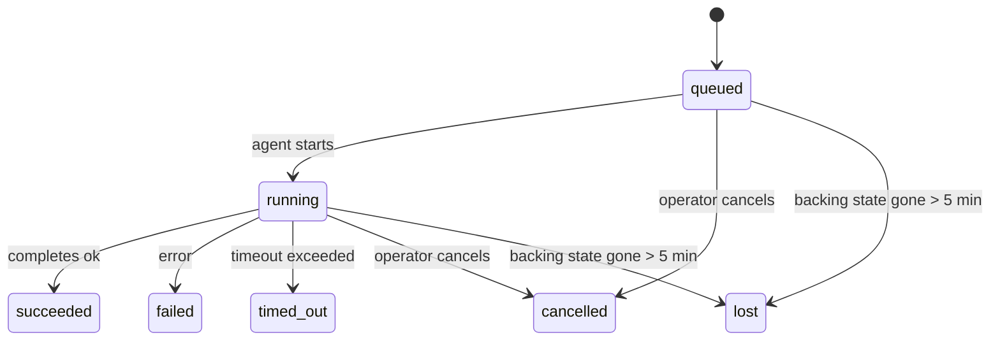

---
read_when:
    - 進行中または最近完了したバックグラウンド作業を検査する
    - デタッチされたエージェント実行の配信失敗をデバッグする
    - バックグラウンド実行とセッション、cron、heartbeat の関係を理解する
sidebarTitle: Background tasks
summary: ACP 実行、サブエージェント、cron 実行、CLI 操作のバックグラウンドタスク追跡
title: バックグラウンドタスク
x-i18n:
    generated_at: "2026-07-05T11:01:08Z"
    model: gpt-5.5
    postprocess_version: locale-links-v1
    provider: openai
    source_hash: 22f81c67fcdb5ef76f42b6afa96f3348614229f2f90dd870f821c32e9cf452a9
    source_path: automation/tasks.md
    workflow: 16
---

<Note>
スケジューリングを探していますか？適切な仕組みを選ぶには [Automation](/ja-JP/automation) を参照してください。このページはバックグラウンド作業のアクティビティ台帳であり、スケジューラーではありません。
</Note>

バックグラウンドタスクは、**メインの会話セッション外**で実行される作業を追跡します。ACP 実行、サブエージェントの生成、Cron ジョブ実行、CLI から開始された操作などです。

タスクは、セッション、Cron ジョブ、Heartbeat を置き換えるものではありません。タスクは、切り離された作業で何が起きたか、いつ起きたか、成功したかどうかを記録する**アクティビティ台帳**です。

<Note>
すべてのエージェント実行がタスクを作成するわけではありません。Heartbeat ターンと通常の対話型チャットは作成しません。すべての Cron 実行、ACP 生成、サブエージェント生成、Gateway からディスパッチされる CLI エージェントコマンドは作成します。
</Note>

## TL;DR

- タスクはスケジューラーではなく**レコード**です。Cron と Heartbeat が作業を_いつ_実行するかを決め、タスクは_何が起きたか_を追跡します。
- ACP、サブエージェント、すべての Cron ジョブ、CLI 操作はタスクを作成します。Heartbeat ターンは作成しません。
- 各タスクは `queued → running → terminal`（succeeded、failed、timed_out、cancelled、または lost）を進みます。
- Cron タスクは、Cron ランタイムがまだジョブを所有している間はライブのままです。インメモリのランタイム状態が失われた場合、タスク保守はタスクを lost とマークする前に、まず永続化された Cron 実行履歴を確認します。
- 完了はプッシュ駆動です。切り離された作業は、完了時に直接通知するか、リクエスト元のセッションまたは Heartbeat を起こせるため、ステータスポーリングループは通常適切な形ではありません。
- 分離された Cron 実行とサブエージェント完了は、最終的なクリーンアップ記録の前に、子セッションで追跡されているブラウザータブやプロセスをベストエフォートでクリーンアップします。
- 分離された Cron 配信は、子孫サブエージェント作業がまだ排出中の間、古い中間の親返信を抑制し、配信前に最終的な子孫出力が届いた場合はそれを優先します。
- 完了通知はチャネルへ直接配信されるか、次の Heartbeat 用にキューに入れられます。
- `openclaw tasks list` はすべてのタスクを表示します。`openclaw tasks audit` は問題を表面化します。
- 終端レコードは 7 日間（`lost` レコードは 24 時間）保持され、その後自動的に削除されます。

## クイックスタート

<Tabs>
  <Tab title="List and filter">
    ```bash
    # List all tasks (newest first)
    openclaw tasks list

    # Filter by runtime or status
    openclaw tasks list --runtime acp
    openclaw tasks list --status running
    ```

  </Tab>
  <Tab title="Inspect">
    ```bash
    # Show details for a specific task (by task ID, run ID, or session key)
    openclaw tasks show <lookup>
    ```
  </Tab>
  <Tab title="Cancel and notify">
    ```bash
    # Cancel a running task (kills the child session)
    openclaw tasks cancel <lookup>

    # Change notification policy for a task
    openclaw tasks notify <lookup> state_changes
    ```

  </Tab>
  <Tab title="Audit and maintenance">
    ```bash
    # Run a health audit
    openclaw tasks audit

    # Preview or apply maintenance
    openclaw tasks maintenance
    openclaw tasks maintenance --apply
    ```

  </Tab>
  <Tab title="Task flow">
    ```bash
    # Inspect TaskFlow state
    openclaw tasks flow list
    openclaw tasks flow show <lookup>
    openclaw tasks flow cancel <lookup>
    ```
  </Tab>
</Tabs>

## タスクを作成するもの

| ソース                 | ランタイム種別 | タスクレコードが作成されるタイミング                                          | デフォルト通知ポリシー |
| ---------------------- | ------------ | ---------------------------------------------------------------------- | --------------------- |
| ACP バックグラウンド実行    | `acp`        | 子 ACP セッションの生成                                           | `done_only`           |
| サブエージェントオーケストレーション | `subagent`   | `sessions_spawn` によるサブエージェントの生成                               | `done_only`           |
| Cron ジョブ（全種類）  | `cron`       | すべての Cron 実行（メインセッションと分離実行）                       | `silent`              |
| CLI 操作         | `cli`        | Gateway 経由で実行される `openclaw agent` コマンド                 | `silent`              |
| エージェントメディアジョブ       | `cli`        | セッションに紐づく `image_generate`/`music_generate`/`video_generate` 実行 | `silent`              |

<AccordionGroup>
  <Accordion title="Notify defaults for cron and media">
    Cron タスク（メインセッションと分離実行）は `silent` 通知ポリシーを使います。追跡用のレコードは作成しますが、それ自体ではタスク通知を生成しません。Cron が配信経路を所有します。

    セッションに紐づく `image_generate`、`music_generate`、`video_generate` 実行も `silent` 通知ポリシーを使います。これらもタスクレコードを作成しますが、完了は内部 wake として元のエージェントセッションへ戻されるため、エージェントがフォローアップメッセージを書き、完成したメディア自体を添付できます。リクエスト元エージェントは通常の可視返信契約に従います。設定されている場合は自動の最終返信、またはセッションがメッセージツール返信を必要とする場合は `message(action="send")` と `NO_REPLY` です。リクエスト元セッションがもうアクティブでない、またはそのアクティブ wake が失敗し、完了エージェントが生成済みメディアの一部または全部を取り逃した場合、OpenClaw は不足しているメディアだけを元のチャネルターゲットへ冪等な直接フォールバックで送信します。

  </Accordion>
  <Accordion title="Concurrent media-generation guardrail">
    セッションに紐づくメディア生成タスクがまだアクティブな間、`image_generate`、`music_generate`、`video_generate` は偶発的な再試行を防ぎます。同じプロンプトまたはリクエストで呼び出しを繰り返すと、重複を開始する代わりに一致するアクティブタスクのステータスを返します。一方で、異なるプロンプトは独自のタスクを開始できます。エージェント側から明示的な進捗またはステータス検索を行いたい場合は、`action: "status"` を使います。
  </Accordion>
  <Accordion title="What does not create tasks">
    - Heartbeat ターン - メインセッション。[Heartbeat](/ja-JP/gateway/heartbeat) を参照
    - 通常の対話型チャットターン
    - 直接の `/command` 応答

  </Accordion>
</AccordionGroup>

## タスクライフサイクル



| ステータス      | 意味                                                               |
| ----------- | --------------------------------------------------------------------------- |
| `queued`    | 作成済みで、エージェントの開始を待機中                                     |
| `running`   | エージェントターンがアクティブに実行中                                            |
| `succeeded` | 正常に完了                                                      |
| `failed`    | エラーで完了                                                     |
| `timed_out` | 設定されたタイムアウトを超過                                             |
| `cancelled` | `openclaw tasks cancel` によりオペレーターが停止した、または実行が中止された |
| `lost`      | ランタイムが 5 分間の猶予後に権威ある裏付け状態を失った  |

遷移は自動的に発生します。エージェント実行ライフサイクルイベント（開始、終了、エラー）がタスクステータスを更新します。手動で管理する必要はありません。

エージェント実行の完了は、アクティブなタスクレコードに対して権威があります。成功した切り離し実行は `succeeded` として確定し、通常の実行エラーは `failed`、タイムアウトは `timed_out`、キャンセルまたは中止の結果は `cancelled` として確定します。タスクが終端に達した後は、後続のライフサイクルシグナルがそれを降格させることはありません。オペレーターにキャンセルされたタスク、またはすでに `failed`/`timed_out`/`lost` のタスクは、その後に成功シグナルが届いてもそのままです。

`lost` はランタイムを考慮します。

- ACP タスク: Gateway 内のライブなインプロセス ACP ターンだけが、実行が生存していることを証明します。永続化されたセッションメタデータだけでは証明しません。オフライン CLI 監査は保守的に動作し、ACP タスクを回収しません。
- サブエージェントタスク: 裏付けとなる子セッションがターゲットエージェントストアから消えた、または再起動リカバリーの墓標を持っています。
- Cron タスク: Cron ランタイムがそのジョブをアクティブとして追跡しなくなり、永続化された Cron 実行履歴にもその実行の終端結果が示されていません。オフライン CLI 監査は、自身の空のインプロセス Cron ランタイム状態を権威として扱いません。
- CLI タスク: 実行 ID またはソース ID を持つタスクはライブ実行コンテキストを使うため、残存する子セッション行やチャットセッション行は、Gateway が所有する実行が消えた後にそれらを生存扱いしません。実行 ID を持たないレガシー CLI タスクは、引き続き子セッションへフォールバックします。Gateway に紐づく `openclaw agent` 実行も実行結果から確定するため、完了済みの実行がスイーパーに `lost` とマークされるまでアクティブのまま残ることはありません。

## 配信と通知

タスクが終端状態に達すると、OpenClaw が通知します。配信経路は 2 つあります。

**直接配信** - タスクにチャネルターゲット（`requesterOrigin`）がある場合、完了メッセージはそのチャネル（Discord、Slack、Telegram など）へ直接送られます。グループとチャネルのタスク完了は、代わりにリクエスト元セッション経由でルーティングされるため、親エージェントが可視返信を書けます。サブエージェント完了では、OpenClaw は利用可能な場合、紐づいたスレッドまたはトピックのルーティングも保持し、直接配信を諦める前に、リクエスト元セッションに保存されたルート（`lastChannel` / `lastTo` / `lastAccountId`）から不足している `to` / アカウントを補えます。

**セッションキュー配信** - 直接配信が失敗した、または origin が設定されていない場合、更新はリクエスト元セッション内のシステムイベントとしてキューに入り、次の Heartbeat で表面化します。

<Tip>
セッションキューに入ったタスク完了は即時 Heartbeat wake をトリガーするため、結果をすぐに確認できます。次にスケジュールされた Heartbeat tick を待つ必要はありません。
</Tip>

つまり通常のワークフローはプッシュベースです。切り離された作業を一度開始し、完了時にランタイムが wake または通知するのに任せます。デバッグ、介入、明示的な監査が必要な場合だけタスク状態をポーリングしてください。

### 通知ポリシー

各タスクについて、どれだけ通知を受けるかを制御します。

| ポリシー                | 配信されるもの                                       |
| --------------------- | ------------------------------------------------------- |
| `done_only`（デフォルト） | 終端状態のみ（succeeded、failed など）           |
| `state_changes`       | すべての状態遷移と進捗更新              |
| `silent`              | 何もなし（Cron、CLI、メディアタスクのデフォルト） |

タスクの実行中にポリシーを変更します。

```bash
openclaw tasks notify <lookup> state_changes
```

## CLI リファレンス

<AccordionGroup>
  <Accordion title="tasks list">
    ```bash
    openclaw tasks list [--runtime <acp|subagent|cron|cli>] [--status <status>] [--json]
    ```

    出力列: Task、Kind、Status、Delivery、Run、Child Session、Summary。引数なしの `openclaw tasks` は `openclaw tasks list` と同じように動作します。

  </Accordion>
  <Accordion title="tasks show">
    ```bash
    openclaw tasks show <lookup> [--json]
    ```

    ルックアップトークンは、タスク ID、実行 ID、またはセッションキーを受け付けます。タイミング、配信状態、エラー、終端サマリーを含む完全なレコードを表示します。

  </Accordion>
  <Accordion title="tasks cancel">
    ```bash
    openclaw tasks cancel <lookup>
    ```

    ACP とサブエージェントタスクでは、これにより子セッションが終了されます。ACP と Cron のキャンセルは、実行中の Gateway（`tasks.cancel`）経由でルーティングされます。CLI で追跡されるタスクでは、キャンセルはタスクレジストリに記録されます（別個の子ランタイムハンドルはありません）。ステータスは `cancelled` に遷移し、該当する場合は配信通知が送信されます。

  </Accordion>
  <Accordion title="tasks notify">
    ```bash
    openclaw tasks notify <lookup> <done_only|state_changes|silent>
    ```
  </Accordion>
  <Accordion title="tasks audit">
    ```bash
    openclaw tasks audit [--severity <warn|error>] [--code <name>] [--limit <n>] [--json]
    ```

    タスク**と** TaskFlow の運用上の問題を 1 つのレポートで表面化します。問題が検出された場合、検出結果は `openclaw status` にも表示されます。

    タスク検出結果:

    | 検出項目                   | 重大度   | トリガー                                                                                                      |
    | ------------------------- | ---------- | ------------------------------------------------------------------------------------------------------------ |
    | `stale_queued`            | warn       | 10 分を超えてキューに入っている                                                                              |
    | `stale_running`           | error      | 30 分を超えて実行中                                                                                          |
    | `lost`                    | warn/error | ランタイムに裏付けられたタスクの所有権が消失した。保持期間中の lost タスクは `cleanupAfter` まで警告になり、その後エラーになる |
    | `delivery_failed`         | warn       | 配信に失敗し、通知ポリシーが `silent` ではない                                                               |
    | `missing_cleanup`         | warn       | クリーンアップのタイムスタンプがない終端タスク                                                               |
    | `inconsistent_timestamps` | warn       | タイムライン違反（たとえば、開始前に終了している）                                                           |

    TaskFlow の検出項目:

    | 検出項目               | 重大度   | トリガー                                                                    |
    | ---------------------- | ---------- | --------------------------------------------------------------------------- |
    | `restore_failed`       | error      | SQLite からのフローレジストリ復元に失敗した                                 |
    | `stale_running`        | error      | 実行中のフローが 30 分を超えて進行していない                                 |
    | `stale_waiting`        | warn       | 待機中のフローが 30 分を超えて進行していない                                 |
    | `stale_blocked`        | warn       | ブロック中のフローが 30 分を超えて進行していない                             |
    | `cancel_stuck`         | warn       | キャンセルが 5 分以上前に要求され、アクティブな子タスクがなく、まだ非終端である |
    | `missing_linked_tasks` | warn/error | リンクされたタスクまたは待機状態がない古い managed フロー                    |
    | `blocked_task_missing` | warn       | ブロック中のフローが、もう存在しないタスク ID を指している                   |

  </Accordion>
  <Accordion title="tasks メンテナンス">
    ```bash
    openclaw tasks maintenance [--json]
    openclaw tasks maintenance --apply [--json]
    ```

    タスク、TaskFlow 状態、古い cron 実行セッションレジストリ行の照合、クリーンアップスタンプ付与、刈り込みをプレビューまたは適用するために使用します。

    照合はランタイムを認識します:

    - ACP タスクには Gateway 内のライブのインプロセス turn が必要です。subagent タスクは、その裏付けとなる子セッションを確認します。
    - restart-recovery tombstone を持つ子セッションの subagent タスクは、復旧可能な裏付けセッションとして扱われるのではなく、lost としてマークされます。
    - Cron タスクは、cron ランタイムがまだジョブを所有しているかを確認し、その後 `lost` にフォールバックする前に、永続化された cron 実行ログ/ジョブ状態から終端ステータスを復旧します。インメモリの cron アクティブジョブセットについては Gateway プロセスだけが権威を持ちます。オフライン CLI 監査は永続履歴を使用しますが、そのローカルセットが空であることだけを理由に cron タスクを lost としてマークすることはありません。
    - 実行 ID を持つ CLI タスクは、子セッションやチャットセッションの行だけではなく、所有しているライブ実行コンテキストを確認します。

    完了時のクリーンアップもランタイムを認識します:

    - subagent の完了では、announce cleanup が続行される前に、子セッションに対して追跡中のブラウザタブ/プロセスをベストエフォートで閉じます。
    - 分離 cron の完了では、実行が完全に終了する前に、cron セッションに対して追跡中のブラウザタブ/プロセスをベストエフォートで閉じます。
    - 分離 cron の配信は、必要に応じて子孫 subagent のフォローアップを待ち、古い親の確認応答テキストを通知するのではなく抑制します。
    - subagent の完了配信では、子の最新の可視 assistant テキストだけを使用します。Tool/toolResult 出力は子の結果テキストに昇格されません。終端失敗実行は、キャプチャされた返信テキストを再生せずに失敗ステータスを通知します。
    - クリーンアップ失敗が実際のタスク結果を覆い隠すことはありません。

    メンテナンスを適用すると、OpenClaw は 7 日より古い `cron:<jobId>:run:<runId>` セッションレジストリ行も削除します。ただし、現在実行中の cron ジョブの行は保持し、非 cron セッション行はそのままにします。

  </Accordion>
  <Accordion title="tasks flow list | show | cancel">
    ```bash
    openclaw tasks flow list [--status <status>] [--json]
    openclaw tasks flow show <lookup> [--json]
    openclaw tasks flow cancel <lookup>
    ```

    フロー検索トークンは、フロー ID または所有者キーを受け付けます。個々のバックグラウンドタスクレコードではなく、オーケストレーションする [Task Flow](/ja-JP/automation/taskflow) を確認したい場合に使用します。

  </Accordion>
</AccordionGroup>

## チャットタスクボード (`/tasks`)

任意のチャットセッションで `/tasks` を使用すると、そのセッションにリンクされたバックグラウンドタスクを確認できます。ボードには、アクティブおよび最近完了したタスクが最大 5 件表示され、ランタイム、ステータス、タイミング、進行状況またはエラーの詳細が含まれます。

現在のセッションに表示可能なリンク済みタスクがない場合、`/tasks` は agent ローカルのタスク数にフォールバックするため、他のセッションの詳細を漏らさずに概要を把握できます。

完全なオペレーター台帳には、CLI を使用します: `openclaw tasks list`。

## ステータス統合（タスク圧力）

`openclaw status` には、一目で確認できるタスク行が含まれます:

```
Tasks    2 active · 1 queued · 1 running · 1 issue · audit clean · 6 tracked
```

概要では、アクティブな作業（`queued` + `running`）、失敗（`failed` + `timed_out` + `lost`）、監査の検出項目、追跡中レコードの合計を数えます。JSON ペイロードでは、ランタイム別（`acp`、`subagent`、`cron`、`cli`）の件数も分解されます。

`/status` と `session_status` ツールはどちらも、クリーンアップを認識したタスクスナップショットを使用します。アクティブなタスクが優先され、期限切れの行は非表示になり、終端タスクは短い最近のウィンドウ（5 分）だけ表示されます。アクティブな作業が残っていない場合は失敗に焦点が当てられます。これにより、ステータスカードは今重要なものに集中します。

## ストレージとメンテナンス

### タスクの保存場所

タスクレコードと配信状態は、共有 OpenClaw SQLite 状態データベースに永続化されます:

```
~/.openclaw/state/openclaw.sqlite   (tables: task_runs, task_delivery_state, flow_runs)
```

`OPENCLAW_STATE_DIR` を設定すると、状態ルート全体（デフォルトは `~/.openclaw`）を別の場所に移動できます。共有データベースパスもそれに合わせて移動します。

レジストリは初回使用時にメモリへ読み込まれ、すべての書き込みを SQLite に永続化するため、Gateway の再起動後もレコードは残ります。WAL の増加は、SQLite のデフォルト autocheckpoint しきい値と定期的な `PASSIVE` checkpoint によって制限されます。シャットダウン時と明示的なメンテナンス checkpoint では `TRUNCATE` を使用するため、通常のクローズではバックグラウンド sweeper がアクティブな reader を待たずに WAL 領域を回収できます。

古いインストールのレガシー sidecar ストア（`tasks/runs.sqlite`、`flows/registry.sqlite`）は、`openclaw doctor` によって共有データベースへインポートされます。

### 自動メンテナンス

sweeper は **60 秒** ごと（最初のパスは Gateway 起動から約 5 秒後）に実行され、4 つのことを処理します:

<Steps>
  <Step title="照合">
    アクティブなタスクが、まだ権威あるランタイムの裏付けを持つかどうかを確認します。ACP タスクにはライブのインプロセス turn が必要で、subagent タスクは子セッション状態を使用し、cron タスクはアクティブジョブ所有権と永続実行履歴を使用し、実行 ID を持つ CLI タスクは所有している実行コンテキストを使用します。裏付け状態が 5 分を超えて消失している場合（子のないネイティブ subagent タスクでは 30 分）、タスクは `lost` としてマークされます。
  </Step>
  <Step title="ACP セッション修復">
    終端または孤立した親所有の one-shot ACP セッションを閉じ、アクティブな会話バインディングが残っていない場合に限り、古い終端または孤立した persistent ACP セッションを閉じます。
  </Step>
  <Step title="クリーンアップスタンプ付与">
    終端タスクに `cleanupAfter` タイムスタンプを設定します（終端時刻 + 保持ウィンドウ）。保持期間中、lost タスクは監査で警告として表示され続けます。`cleanupAfter` の期限が切れた後、またはクリーンアップメタデータが欠落している場合は、エラーになります。
  </Step>
  <Step title="刈り込み">
    `cleanupAfter` 日付を過ぎたレコードを削除します。
  </Step>
</Steps>

<Note>
**保持:** 終端タスクレコードは **7 日間**（`lost` レコードは **24 時間**）保持され、その後自動的に刈り込まれます。設定は不要です。
</Note>

## タスクと他システムの関係

<AccordionGroup>
  <Accordion title="タスクと Task Flow">
    [Task Flow](/ja-JP/automation/taskflow) は、バックグラウンドタスクの上にあるフローオーケストレーション層です。単一のフローは、その存続期間中に managed または mirrored sync モードを使用して複数のタスクを調整できます。個々のタスクレコードを調べるには `openclaw tasks` を使用し、オーケストレーションするフローを調べるには `openclaw tasks flow` を使用します。

  </Accordion>
  <Accordion title="タスクと cron">
    Cron ジョブ定義、ランタイム実行状態、実行履歴は、OpenClaw の共有 SQLite 状態データベースにあります。**すべての** cron 実行は、main-session と isolated の両方で、`silent` 通知ポリシーを持つタスクレコードを作成します。そのため、cron 実行は独自のタスク通知を生成せずに追跡されます。

    [Cron Jobs](/ja-JP/automation/cron-jobs) を参照してください。

  </Accordion>
  <Accordion title="タスクと heartbeat">
    Heartbeat 実行は main-session turn です。タスクレコードは作成しません。タスクが完了すると、heartbeat wake をトリガーして結果をすぐに確認できるようにできます。

    [Heartbeat](/ja-JP/gateway/heartbeat) を参照してください。

  </Accordion>
  <Accordion title="タスクとセッション">
    タスクは、`childSessionKey`（作業が実行される場所）と `requesterSessionKey`（それを開始した人）を参照する場合があります。その `agentId` は作業を実行している agent を識別し、requester フィールドと owner フィールドは起動と制御のコンテキストを保持します。セッションは会話コンテキストであり、タスクはその上にあるアクティビティ追跡です。
  </Accordion>
  <Accordion title="タスクと agent 実行">
    タスクの `runId` は、作業を行っている agent 実行にリンクします。Agent ライフサイクルイベント（開始、終了、エラー）は自動的にタスクステータスを更新します。ライフサイクルを手動で管理する必要はありません。
  </Accordion>
</AccordionGroup>

## 関連

- [自動化](/ja-JP/automation) - すべての自動化メカニズムの概要
- [CLI: タスク](/ja-JP/cli/tasks) - CLI コマンドリファレンス
- [Heartbeat](/ja-JP/gateway/heartbeat) - 定期的な main-session turn
- [スケジュール済みタスク](/ja-JP/automation/cron-jobs) - バックグラウンド作業のスケジューリング
- [Task Flow](/ja-JP/automation/taskflow) - タスクの上位にあるフローオーケストレーション
