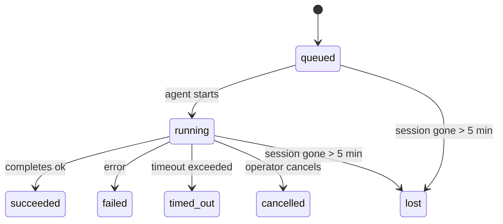

---
read_when:
    - 進行中または最近完了したバックグラウンド作業の確認
    - 分離されたエージェント実行の配信失敗のデバッグ
    - バックグラウンド実行がセッション、Cron、Heartbeat とどのように関係するかを理解する
summary: ACP 実行、サブエージェント、分離された Cron ジョブ、および CLI 操作のバックグラウンドタスク追跡
title: バックグラウンドタスク
x-i18n:
    generated_at: "2026-04-23T13:57:56Z"
    model: gpt-5.4
    provider: openai
    source_hash: 5cd0b0db6c20cc677aa5cc50c42e09043d4354e026ca33c020d804761c331413
    source_path: automation/tasks.md
    workflow: 15
---

# バックグラウンドタスク

> **スケジューリングをお探しですか？** 適切な仕組みを選ぶには [Automation & Tasks](/ja-JP/automation) を参照してください。このページでは、バックグラウンド作業の**追跡**について扱っており、スケジューリングは扱いません。

バックグラウンドタスクは、**メインの会話セッションの外側**で実行される作業を追跡します:
ACP 実行、サブエージェントの起動、分離された Cron ジョブ実行、CLI から開始された操作です。

タスクはセッション、Cron ジョブ、Heartbeat を置き換えるものではありません。これらは、分離された作業で何が起こったか、いつ起こったか、成功したかどうかを記録する**アクティビティ台帳**です。

<Note>
すべてのエージェント実行がタスクを作成するわけではありません。Heartbeat ターンと通常の対話チャットでは作成されません。すべての Cron 実行、ACP 起動、サブエージェント起動、CLI エージェントコマンドでは作成されます。
</Note>

## 要点

- タスクはスケジューラではなく**記録**です。Cron と Heartbeat が作業の実行 _タイミング_ を決め、タスクが _何が起こったか_ を追跡します。
- ACP、サブエージェント、すべての Cron ジョブ、および CLI 操作はタスクを作成します。Heartbeat ターンは作成しません。
- 各タスクは `queued → running → terminal`（succeeded、failed、timed_out、cancelled、または lost）を移動します。
- Cron タスクは、Cron ランタイムがまだそのジョブを所有している間は存続します。チャットに支えられた CLI タスクは、所有する実行コンテキストがまだアクティブな間だけ存続します。
- 完了はプッシュ駆動です。分離された作業は完了時に直接通知するか、要求元のセッション/Heartbeat を起こせるため、通常はステータスをポーリングするループは適切ではありません。
- 分離された Cron 実行とサブエージェント完了では、最終的なクリーンアップ記録の前に、子セッション用に追跡中のブラウザタブ/プロセスをベストエフォートでクリーンアップします。
- 分離された Cron 配信では、子孫サブエージェント作業の排出がまだ続いている間は古い中間の親返信を抑制し、配信前に最終的な子孫出力が届いた場合はそれを優先します。
- 完了通知はチャネルへ直接配信されるか、次の Heartbeat のためにキューに入れられます。
- `openclaw tasks list` はすべてのタスクを表示し、`openclaw tasks audit` は問題を明らかにします。
- 終端レコードは 7 日間保持され、その後自動的に削除されます。

## クイックスタート

```bash
# すべてのタスクを一覧表示（新しい順）
openclaw tasks list

# ランタイムまたはステータスでフィルタ
openclaw tasks list --runtime acp
openclaw tasks list --status running

# 特定のタスクの詳細を表示（ID、run ID、または session key で指定）
openclaw tasks show <lookup>

# 実行中のタスクをキャンセル（子セッションを終了）
openclaw tasks cancel <lookup>

# タスクの通知ポリシーを変更
openclaw tasks notify <lookup> state_changes

# ヘルス監査を実行
openclaw tasks audit

# メンテナンスをプレビューまたは適用
openclaw tasks maintenance
openclaw tasks maintenance --apply

# TaskFlow の状態を確認
openclaw tasks flow list
openclaw tasks flow show <lookup>
openclaw tasks flow cancel <lookup>
```

## タスクを作成するもの

| 発生源                 | ランタイム種別 | タスクレコードが作成されるタイミング                     | デフォルト通知ポリシー |
| ---------------------- | -------------- | -------------------------------------------------------- | ---------------------- |
| ACP バックグラウンド実行 | `acp`          | 子 ACP セッションを起動したとき                          | `done_only`            |
| サブエージェントのオーケストレーション | `subagent`     | `sessions_spawn` によりサブエージェントを起動したとき    | `done_only`            |
| Cron ジョブ（全種類）  | `cron`         | すべての Cron 実行時（メインセッションと分離実行の両方） | `silent`               |
| CLI 操作               | `cli`          | Gateway を経由する `openclaw agent` コマンド             | `silent`               |
| エージェントのメディアジョブ | `cli`          | セッションに支えられた `video_generate` 実行             | `silent`               |

メインセッションの Cron タスクは、デフォルトで `silent` 通知ポリシーを使用します。つまり、追跡用のレコードは作成されますが、通知は生成されません。分離された Cron タスクもデフォルトでは `silent` ですが、自身のセッションで実行されるため、より可視性があります。

セッションに支えられた `video_generate` 実行も `silent` 通知ポリシーを使用します。これらもタスクレコードを作成しますが、完了は内部ウェイクとして元のエージェントセッションに返されるため、エージェント自身がフォローアップメッセージを書き、完成した動画を添付できます。`tools.media.asyncCompletion.directSend` を有効にすると、非同期の `music_generate` および `video_generate` 完了は、まずチャネルへの直接配信を試み、それが失敗した場合に要求元セッションのウェイク経路へフォールバックします。

セッションに支えられた `video_generate` タスクがまだアクティブな間、このツールはガードレールとしても機能します。同じセッション内で `video_generate` を繰り返し呼び出すと、2 つ目の同時生成を開始する代わりに、アクティブなタスクの状態が返されます。エージェント側から明示的に進行状況/状態を確認したい場合は `action: "status"` を使用してください。

**タスクを作成しないもの:**

- Heartbeat ターン — メインセッション。[Heartbeat](/ja-JP/gateway/heartbeat) を参照
- 通常の対話チャットターン
- 直接の `/command` 応答

## タスクのライフサイクル



| ステータス  | 意味                                                                       |
| ----------- | -------------------------------------------------------------------------- |
| `queued`    | 作成済みで、エージェントの開始待ち                                          |
| `running`   | エージェントターンが現在実行中                                              |
| `succeeded` | 正常に完了                                                                  |
| `failed`    | エラーを伴って完了                                                          |
| `timed_out` | 設定されたタイムアウトを超過                                                |
| `cancelled` | オペレーターが `openclaw tasks cancel` で停止                              |
| `lost`      | 5 分の猶予期間後、ランタイムが権威あるバック状態を失った                    |

遷移は自動的に行われます。関連するエージェント実行が終了すると、タスクステータスはそれに合わせて更新されます。

`lost` はランタイム認識です:

- ACP タスク: バックとなる ACP 子セッションのメタデータが消失した。
- サブエージェントタスク: バックとなる子セッションが対象エージェントストアから消失した。
- Cron タスク: Cron ランタイムがそのジョブをアクティブとして追跡しなくなった。
- CLI タスク: 分離された子セッションタスクは子セッションを使用し、チャットに支えられた CLI タスクは代わりに生きている実行コンテキストを使用するため、チャネル/グループ/ダイレクトセッションの行が残っていても存続しません。

## 配信と通知

タスクが終端状態に達すると、OpenClaw が通知します。配信経路は 2 つあります。

**直接配信** — タスクにチャネルの送信先（`requesterOrigin`）がある場合、完了メッセージはそのチャネル（Telegram、Discord、Slack など）へ直接送られます。サブエージェント完了では、OpenClaw は利用可能な場合に紐付けられたスレッド/トピックのルーティングも保持し、直接配信を諦める前に、要求元セッションに保存されたルート（`lastChannel` / `lastTo` / `lastAccountId`）から不足している `to` / アカウントを補える場合があります。

**セッションキュー配信** — 直接配信に失敗したか、送信元が設定されていない場合、更新は要求元セッション内のシステムイベントとしてキューに入り、次の Heartbeat で表示されます。

<Tip>
タスク完了は即座に Heartbeat のウェイクを引き起こすため、結果をすぐに確認できます。次に予定された Heartbeat ティックまで待つ必要はありません。
</Tip>

つまり、通常のワークフローはプッシュベースです。分離された作業を 1 回開始したら、ランタイムに完了時のウェイクまたは通知を任せてください。タスク状態をポーリングするのは、デバッグ、介入、または明示的な監査が必要なときだけにしてください。

### 通知ポリシー

各タスクについてどの程度通知を受けるかを制御します。

| ポリシー              | 配信される内容                                                           |
| --------------------- | ------------------------------------------------------------------------ |
| `done_only` (default) | 終端状態のみ（succeeded、failed など）— **これがデフォルトです**         |
| `state_changes`       | すべての状態遷移と進行状況更新                                           |
| `silent`              | 何も配信しない                                                           |

タスクの実行中にポリシーを変更できます:

```bash
openclaw tasks notify <lookup> state_changes
```

## CLI リファレンス

### `tasks list`

```bash
openclaw tasks list [--runtime <acp|subagent|cron|cli>] [--status <status>] [--json]
```

出力列: Task ID、Kind、Status、Delivery、Run ID、Child Session、Summary。

### `tasks show`

```bash
openclaw tasks show <lookup>
```

lookup トークンには task ID、run ID、または session key を指定できます。タイミング、配信状態、エラー、終端サマリーを含む完全なレコードを表示します。

### `tasks cancel`

```bash
openclaw tasks cancel <lookup>
```

ACP タスクとサブエージェントタスクでは、これにより子セッションを終了します。CLI 追跡タスクでは、キャンセルはタスクレジストリに記録されます（別個の子ランタイムハンドルはありません）。ステータスは `cancelled` に遷移し、該当する場合は配信通知が送られます。

### `tasks notify`

```bash
openclaw tasks notify <lookup> <done_only|state_changes|silent>
```

### `tasks audit`

```bash
openclaw tasks audit [--json]
```

運用上の問題を明らかにします。問題が検出されると、所見は `openclaw status` にも表示されます。

| 所見                      | 重大度 | トリガー                                                |
| ------------------------- | ------ | ------------------------------------------------------ |
| `stale_queued`            | warn   | 10 分以上キュー状態のまま                               |
| `stale_running`           | error  | 30 分以上実行中                                         |
| `lost`                    | error  | ランタイムに支えられたタスク所有状態が消失した          |
| `delivery_failed`         | warn   | 配信が失敗し、通知ポリシーが `silent` ではない          |
| `missing_cleanup`         | warn   | 終端タスクなのにクリーンアップタイムスタンプがない      |
| `inconsistent_timestamps` | warn   | タイムライン違反（たとえば開始前に終了しているなど）    |

### `tasks maintenance`

```bash
openclaw tasks maintenance [--json]
openclaw tasks maintenance --apply [--json]
```

これを使用して、タスクおよび Task Flow 状態に対する整合、クリーンアップ記録、削除をプレビューまたは適用します。

整合はランタイム認識です:

- ACP/サブエージェントタスクは、バックとなる子セッションを確認します。
- Cron タスクは、Cron ランタイムがまだそのジョブを所有しているかを確認します。
- チャットに支えられた CLI タスクは、チャットセッション行だけでなく、所有する生きている実行コンテキストを確認します。

完了時クリーンアップもランタイム認識です:

- サブエージェント完了では、通知クリーンアップの続行前に、子セッション用に追跡中のブラウザタブ/プロセスをベストエフォートで閉じます。
- 分離された Cron 完了では、実行が完全に終了する前に、Cron セッション用に追跡中のブラウザタブ/プロセスをベストエフォートで閉じます。
- 分離された Cron 配信では、必要に応じて子孫サブエージェントの後続処理が落ち着くまで待機し、古い親の確認応答テキストを通知する代わりに抑制します。
- サブエージェント完了配信では、最新の可視アシスタントテキストを優先します。これが空の場合は、サニタイズされた最新の tool/toolResult テキストにフォールバックし、タイムアウトのみのツール呼び出し実行は短い部分進捗サマリーへ要約される場合があります。終端 failed 実行では、キャプチャされた返信テキストを再生せずに失敗状態を通知します。
- クリーンアップ失敗によって、実際のタスク結果が隠されることはありません。

### `tasks flow list|show|cancel`

```bash
openclaw tasks flow list [--status <status>] [--json]
openclaw tasks flow show <lookup> [--json]
openclaw tasks flow cancel <lookup>
```

個々のバックグラウンドタスクレコードではなく、オーケストレーションしている Task Flow 自体に関心がある場合は、これらを使用してください。

## チャットのタスクボード (`/tasks`)

任意のチャットセッションで `/tasks` を使用すると、そのセッションに紐付いたバックグラウンドタスクを確認できます。ボードには、アクティブなタスクと最近完了したタスクが、ランタイム、ステータス、タイミング、進行状況またはエラー詳細とともに表示されます。

現在のセッションに表示可能な紐付けタスクがない場合、`/tasks` はエージェントローカルのタスク数にフォールバックするため、他セッションの詳細を漏らさずに概要を把握できます。

完全なオペレーター台帳については、CLI を使用してください: `openclaw tasks list`。

## ステータス統合（タスク負荷）

`openclaw status` には、ひと目でわかるタスクサマリーが含まれます:

```
Tasks: 3 queued · 2 running · 1 issues
```

このサマリーが報告する内容:

- **active** — `queued` + `running` の件数
- **failures** — `failed` + `timed_out` + `lost` の件数
- **byRuntime** — `acp`、`subagent`、`cron`、`cli` ごとの内訳

`/status` と `session_status` ツールの両方で、クリーンアップ認識のタスクスナップショットが使われます。アクティブなタスクが優先され、古い完了行は非表示になり、最近の失敗はアクティブな作業が何も残っていない場合にのみ表示されます。これにより、ステータスカードは今重要なことに集中できます。

## ストレージとメンテナンス

### タスクの保存場所

タスクレコードは次の SQLite に永続化されます:

```
$OPENCLAW_STATE_DIR/tasks/runs.sqlite
```

レジストリは Gateway 起動時にメモリへ読み込まれ、再起動後も耐久性を保つために書き込みを SQLite に同期します。

### 自動メンテナンス

スイーパーは **60 秒** ごとに実行され、次の 3 つを処理します:

1. **整合** — アクティブなタスクに、まだ権威あるランタイムの裏付けがあるかを確認します。ACP/サブエージェントタスクは子セッション状態を使用し、Cron タスクはアクティブジョブ所有状態を使用し、チャットに支えられた CLI タスクは所有する実行コンテキストを使用します。その裏付け状態が 5 分を超えて失われている場合、タスクは `lost` としてマークされます。
2. **クリーンアップ記録** — 終端タスクに `cleanupAfter` タイムスタンプ（endedAt + 7 日）を設定します。
3. **削除** — `cleanupAfter` 日付を過ぎたレコードを削除します。

**保持期間**: 終端タスクレコードは **7 日間** 保持され、その後自動的に削除されます。設定は不要です。

## タスクと他のシステムの関係

### タスクと Task Flow

[Task Flow](/ja-JP/automation/taskflow) は、バックグラウンドタスクの上位にあるフローオーケストレーション層です。1 つのフローは、その存続期間中に managed または mirrored の sync モードを使用して複数のタスクを調整できます。個々のタスクレコードを確認するには `openclaw tasks` を使い、オーケストレーションしているフローを確認するには `openclaw tasks flow` を使います。

詳細は [Task Flow](/ja-JP/automation/taskflow) を参照してください。

### タスクと Cron

Cron ジョブの**定義**は `~/.openclaw/cron/jobs.json` にあり、ランタイム実行状態はその隣の `~/.openclaw/cron/jobs-state.json` にあります。**すべての** Cron 実行は、メインセッションでも分離実行でもタスクレコードを作成します。メインセッションの Cron タスクはデフォルトで `silent` 通知ポリシーを使用するため、通知を生成せずに追跡されます。

[ Cron Jobs](/ja-JP/automation/cron-jobs) を参照してください。

### タスクと Heartbeat

Heartbeat 実行はメインセッションのターンであり、タスクレコードは作成しません。タスクが完了すると、結果をすぐ確認できるように Heartbeat のウェイクをトリガーできます。

[Heartbeat](/ja-JP/gateway/heartbeat) を参照してください。

### タスクとセッション

タスクは `childSessionKey`（作業が実行される場所）と `requesterSessionKey`（開始した相手）を参照する場合があります。セッションは会話コンテキストであり、タスクはその上にあるアクティビティ追跡です。

### タスクとエージェント実行

タスクの `runId` は、その作業を行うエージェント実行にリンクします。エージェントのライフサイクルイベント（開始、終了、エラー）はタスクステータスを自動的に更新するため、ライフサイクルを手動で管理する必要はありません。

## 関連

- [Automation & Tasks](/ja-JP/automation) — すべての自動化メカニズムの概要
- [Task Flow](/ja-JP/automation/taskflow) — タスクの上位にあるフローオーケストレーション
- [Scheduled Tasks](/ja-JP/automation/cron-jobs) — バックグラウンド作業のスケジューリング
- [Heartbeat](/ja-JP/gateway/heartbeat) — 定期的なメインセッションターン
- [CLI: Tasks](/ja-JP/cli/tasks) — CLI コマンドリファレンス
