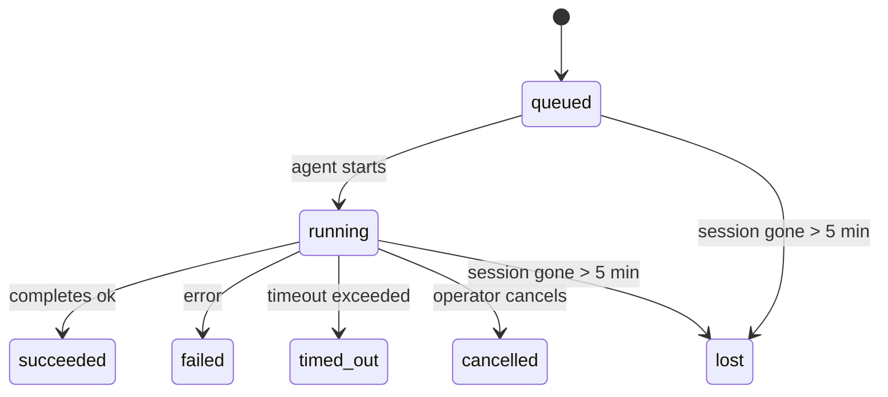

---
read_when:
    - 進行中または最近完了したバックグラウンド作業の確認
    - デタッチされたエージェント実行の配信失敗のデバッグ
    - バックグラウンド実行がセッション、Cron、Heartbeat とどのように関係するかを理解する
sidebarTitle: Background tasks
summary: ACP の実行、サブエージェント、分離された Cron ジョブ、および CLI 操作のバックグラウンドタスク追跡
title: バックグラウンドタスク
x-i18n:
    generated_at: "2026-04-26T11:22:59Z"
    model: gpt-5.4
    provider: openai
    source_hash: 46952a378babdee9f43102bfa71dbd35b6ca7ecb142ffce3785eeb479e19d6b6
    source_path: automation/tasks.md
    workflow: 15
---

<Note>
スケジューリングをお探しですか？適切な仕組みを選ぶには、[Automation & Tasks](/ja-JP/automation) を参照してください。このページはバックグラウンド作業の**追跡**を扱っており、スケジューリングは扱いません。
</Note>

バックグラウンドタスクは、**メインの会話セッションの外部**で実行される作業を追跡します。対象は、ACP の実行、サブエージェントの起動、分離された Cron ジョブ実行、CLI から開始された操作です。

タスクは、セッション、Cron ジョブ、Heartbeat を置き換えるものではありません。タスクは、分離された作業で何が起きたか、いつ起きたか、成功したかどうかを記録する**アクティビティ台帳**です。

<Note>
すべてのエージェント実行がタスクを作成するわけではありません。Heartbeat ターンと通常の対話チャットでは作成されません。すべての Cron 実行、ACP の起動、サブエージェントの起動、CLI エージェントコマンドでは作成されます。
</Note>

## 要点

- タスクはスケジューラではなく**記録**です。Cron と Heartbeat が作業の実行 _タイミング_ を決め、タスクが _何が起きたか_ を追跡します。
- ACP、サブエージェント、すべての Cron ジョブ、CLI 操作はタスクを作成します。Heartbeat ターンは作成しません。
- 各タスクは `queued → running → terminal`（succeeded、failed、timed_out、cancelled、または lost）を遷移します。
- Cron タスクは、Cron ランタイムがそのジョブを引き続き所有している間は存続します。インメモリのランタイム状態が失われた場合、タスクメンテナンスはタスクを lost としてマークする前に、まず永続化された Cron 実行履歴を確認します。
- 完了はプッシュ駆動です。分離された作業は、完了時に直接通知することも、要求元のセッション/Heartbeat を起こすこともできるため、通常はステータスのポーリングループは適切ではありません。
- 分離された Cron 実行とサブエージェント完了は、最終的なクリーンアップ記録処理の前に、その子セッション用に追跡されているブラウザータブ/プロセスをベストエフォートでクリーンアップします。
- 分離された Cron 配信では、子孫サブエージェントの作業がまだ排出中である間は古い中間親返信を抑制し、配信前に最終的な子孫出力が到着した場合はそれを優先します。
- 完了通知は、チャネルに直接配信されるか、次回の Heartbeat 用にキューに入れられます。
- `openclaw tasks list` はすべてのタスクを表示し、`openclaw tasks audit` は問題を表面化します。
- 終端レコードは 7 日間保持され、その後自動的に削除されます。

## クイックスタート

<Tabs>
  <Tab title="一覧表示とフィルタ">
    ```bash
    # すべてのタスクを一覧表示（新しい順）
    openclaw tasks list

    # ランタイムまたはステータスでフィルタ
    openclaw tasks list --runtime acp
    openclaw tasks list --status running
    ```

  </Tab>
  <Tab title="確認">
    ```bash
    # 特定のタスクの詳細を表示（ID、run ID、または session key で指定）
    openclaw tasks show <lookup>
    ```
  </Tab>
  <Tab title="キャンセルと通知">
    ```bash
    # 実行中のタスクをキャンセル（子セッションを終了）
    openclaw tasks cancel <lookup>

    # タスクの通知ポリシーを変更
    openclaw tasks notify <lookup> state_changes
    ```

  </Tab>
  <Tab title="監査とメンテナンス">
    ```bash
    # ヘルス監査を実行
    openclaw tasks audit

    # メンテナンスをプレビューまたは適用
    openclaw tasks maintenance
    openclaw tasks maintenance --apply
    ```

  </Tab>
  <Tab title="TaskFlow">
    ```bash
    # TaskFlow の状態を確認
    openclaw tasks flow list
    openclaw tasks flow show <lookup>
    openclaw tasks flow cancel <lookup>
    ```
  </Tab>
</Tabs>

## 何がタスクを作成するか

| ソース | ランタイム種別 | タスクレコードが作成されるタイミング | デフォルト通知ポリシー |
| ---------------------- | ------------ | ------------------------------------------------------ | --------------------- |
| ACP バックグラウンド実行 | `acp`        | 子 ACP セッションを起動したとき                         | `done_only`           |
| サブエージェントオーケストレーション | `subagent`   | `sessions_spawn` によってサブエージェントを起動したとき | `done_only`           |
| Cron ジョブ（全種類）  | `cron`       | すべての Cron 実行（メインセッションおよび分離実行）    | `silent`              |
| CLI 操作               | `cli`        | Gateway を通じて実行される `openclaw agent` コマンド   | `silent`              |
| エージェントメディアジョブ | `cli`        | セッションに紐づく `video_generate` 実行                | `silent`              |

<AccordionGroup>
  <Accordion title="Cron とメディアの通知デフォルト">
    メインセッションの Cron タスクは、デフォルトで `silent` 通知ポリシーを使用します。つまり、追跡用のレコードは作成されますが、通知は生成されません。分離された Cron タスクもデフォルトでは `silent` ですが、独自のセッションで実行されるため、より見えやすくなります。

    セッションに紐づく `video_generate` 実行も `silent` 通知ポリシーを使用します。これらもタスクレコードを作成しますが、完了は内部ウェイクとして元のエージェントセッションに戻されるため、エージェント自身がフォローアップメッセージを書き、完成した動画を添付できます。`tools.media.asyncCompletion.directSend` を有効にすると、非同期の `music_generate` および `video_generate` 完了は、要求元セッションのウェイク経路にフォールバックする前に、まず直接チャネル配信を試みます。

  </Accordion>
  <Accordion title="同時 video_generate のガードレール">
    セッションに紐づく `video_generate` タスクがまだアクティブな間、このツールはガードレールとしても機能します。同じセッション内で `video_generate` を繰り返し呼び出すと、2 つ目の同時生成を開始する代わりに、アクティブなタスクのステータスを返します。エージェント側から明示的に進捗/ステータスを確認したい場合は、`action: "status"` を使ってください。
  </Accordion>
  <Accordion title="タスクを作成しないもの">
    - Heartbeat ターン — メインセッション。詳細は [Heartbeat](/ja-JP/gateway/heartbeat) を参照
    - 通常の対話チャットターン
    - 直接の `/command` 応答

  </Accordion>
</AccordionGroup>

## タスクのライフサイクル



| ステータス | 意味 |
| ----------- | -------------------------------------------------------------------------- |
| `queued`    | 作成済みで、エージェントの開始待ち                                         |
| `running`   | エージェントターンがアクティブに実行中                                     |
| `succeeded` | 正常に完了                                                                  |
| `failed`    | エラーで完了                                                                |
| `timed_out` | 設定されたタイムアウトを超過                                                |
| `cancelled` | オペレーターが `openclaw tasks cancel` で停止                              |
| `lost`      | 5 分間の猶予期間後に、ランタイムが権威あるバックエンド状態を失った          |

遷移は自動的に発生します。関連するエージェント実行が終了すると、タスクステータスはそれに合わせて更新されます。

エージェント実行の完了は、アクティブなタスクレコードに対して権威を持ちます。成功した分離実行は `succeeded` として確定し、通常の実行エラーは `failed`、タイムアウトや中断の結果は `timed_out` として確定します。オペレーターがすでにそのタスクをキャンセルしていたり、ランタイムがすでに `failed`、`timed_out`、`lost` のようなより強い終端状態を記録していたりする場合、後から成功シグナルが来てもその終端ステータスに格下げは起きません。

`lost` はランタイム認識型です。

- ACP タスク: 対応する ACP 子セッションのメタデータが消失した。
- サブエージェントタスク: 対応する子セッションが対象エージェントストアから消失した。
- Cron タスク: Cron ランタイムがそのジョブをアクティブとして追跡しておらず、その実行の終端結果も永続化された Cron 実行履歴に見つからない。オフラインの CLI 監査は、自身の空のインプロセス Cron ランタイム状態を権威とは見なしません。
- CLI タスク: 分離された子セッションタスクは子セッションを使用します。チャットに紐づく CLI タスクは代わりにライブ実行コンテキストを使用するため、残存する channel/group/direct session 行によって存続しません。Gateway に支えられた `openclaw agent` 実行も、その実行結果から確定されるため、完了した実行が sweeper に `lost` としてマークされるまでアクティブのまま残ることはありません。

## 配信と通知

タスクが終端状態に到達すると、OpenClaw は通知を送ります。配信経路は 2 つあります。

**直接配信** — タスクにチャネル宛先（`requesterOrigin`）がある場合、完了メッセージはそのチャネル（Telegram、Discord、Slack など）に直接送られます。サブエージェント完了では、OpenClaw は利用可能であれば紐付いたスレッド/トピックのルーティングも保持し、直接配信を諦める前に、要求元セッションに保存されたルート（`lastChannel` / `lastTo` / `lastAccountId`）から不足している `to` / account を補完できます。

**セッションキュー配信** — 直接配信に失敗した場合、または origin が設定されていない場合、更新は要求元セッションのシステムイベントとしてキューに入り、次回の Heartbeat で表面化します。

<Tip>
タスク完了は即時の Heartbeat ウェイクをトリガーするため、結果をすぐに確認できます。次回スケジュールされた Heartbeat ティックを待つ必要はありません。
</Tip>

つまり、通常のワークフローはプッシュベースです。分離された作業を一度開始したら、完了時にランタイムがウェイクまたは通知するのに任せます。タスク状態のポーリングは、デバッグ、介入、または明示的な監査が必要な場合にだけ行ってください。

### 通知ポリシー

各タスクについて、どれだけ通知を受けるかを制御します。

| ポリシー | 配信される内容 |
| --------------------- | ----------------------------------------------------------------------- |
| `done_only` (default) | 終端状態のみ（succeeded、failed など）— **これがデフォルトです** |
| `state_changes`       | すべての状態遷移と進捗更新 |
| `silent`              | 何も配信しない |

タスク実行中にポリシーを変更します。

```bash
openclaw tasks notify <lookup> state_changes
```

## CLI リファレンス

<AccordionGroup>
  <Accordion title="tasks list">
    ```bash
    openclaw tasks list [--runtime <acp|subagent|cron|cli>] [--status <status>] [--json]
    ```

    出力列: Task ID、Kind、Status、Delivery、Run ID、Child Session、Summary。

  </Accordion>
  <Accordion title="tasks show">
    ```bash
    openclaw tasks show <lookup>
    ```

    lookup トークンには、タスク ID、run ID、または session key を指定できます。タイミング、配信状態、エラー、終端サマリーを含む完全なレコードを表示します。

  </Accordion>
  <Accordion title="tasks cancel">
    ```bash
    openclaw tasks cancel <lookup>
    ```

    ACP およびサブエージェントタスクでは、これにより子セッションを終了します。CLI 追跡タスクでは、キャンセルはタスクレジストリに記録されます（別個の子ランタイムハンドルはありません）。ステータスは `cancelled` に遷移し、該当する場合は配信通知が送信されます。

  </Accordion>
  <Accordion title="tasks notify">
    ```bash
    openclaw tasks notify <lookup> <done_only|state_changes|silent>
    ```
  </Accordion>
  <Accordion title="tasks audit">
    ```bash
    openclaw tasks audit [--json]
    ```

    運用上の問題を表面化します。問題が検出された場合、検出結果は `openclaw status` にも表示されます。

    | 検出項目 | 重要度 | トリガー |
    | ------------------------- | ---------- | ------------------------------------------------------------------------------------------------------------ |
    | `stale_queued`            | warn       | 10 分を超えて queued のまま |
    | `stale_running`           | error      | 30 分を超えて running のまま |
    | `lost`                    | warn/error | ランタイムに裏付けられたタスク所有権が消失した。失われたタスクは `cleanupAfter` までは警告で保持され、その後はエラーになる |
    | `delivery_failed`         | warn       | 配信に失敗し、通知ポリシーが `silent` ではない |
    | `missing_cleanup`         | warn       | 終端タスクに cleanup タイムスタンプがない |
    | `inconsistent_timestamps` | warn       | タイムラインの矛盾（例: 開始前に終了している） |

  </Accordion>
  <Accordion title="tasks maintenance">
    ```bash
    openclaw tasks maintenance [--json]
    openclaw tasks maintenance --apply [--json]
    ```

    これを使用して、タスクおよび Task Flow 状態の照合、クリーンアップタイムスタンプ付与、削除をプレビューまたは適用します。

    照合はランタイム認識型です。

    - ACP/サブエージェントタスクは、対応する子セッションを確認します。
    - Cron タスクは、Cron ランタイムがまだそのジョブを所有しているかを確認し、その後 `lost` にフォールバックする前に、永続化された Cron 実行ログ/ジョブ状態から終端ステータスを復元します。インメモリの Cron アクティブジョブ集合に対して権威を持つのは Gateway プロセスのみです。オフラインの CLI 監査は永続履歴を使用しますが、そのローカル `Set` が空であることだけを理由に Cron タスクを lost とはマークしません。
    - チャットに紐づく CLI タスクは、チャットセッション行だけでなく、所有するライブ実行コンテキストを確認します。

    完了時のクリーンアップもランタイム認識型です。

    - サブエージェント完了では、通知クリーンアップが続行する前に、子セッション用に追跡されているブラウザータブ/プロセスをベストエフォートで閉じます。
    - 分離された Cron 完了では、実行が完全に終了する前に、Cron セッション用に追跡されているブラウザータブ/プロセスをベストエフォートで閉じます。
    - 分離された Cron 配信では、必要に応じて子孫サブエージェントのフォローアップを待ち、古い親確認テキストを通知する代わりに抑制します。
    - サブエージェント完了配信では、最新の可視 assistant テキストを優先し、それが空の場合はサニタイズ済みの最新 tool/toolResult テキストにフォールバックします。また、タイムアウトのみのツール呼び出し実行は、短い部分進捗サマリーに要約されることがあります。終端 failed 実行では、キャプチャされた返信テキストを再生せずに失敗ステータスを通知します。
    - クリーンアップ失敗によって、実際のタスク結果が隠されることはありません。

  </Accordion>
  <Accordion title="tasks flow list | show | cancel">
    ```bash
    openclaw tasks flow list [--status <status>] [--json]
    openclaw tasks flow show <lookup> [--json]
    openclaw tasks flow cancel <lookup>
    ```

    個々のバックグラウンドタスクレコードではなく、それをオーケストレーションする Task Flow 自体に関心がある場合に使用します。

  </Accordion>
</AccordionGroup>

## チャットタスクボード (`/tasks`)

任意のチャットセッションで `/tasks` を使用すると、そのセッションに関連付けられたバックグラウンドタスクを確認できます。ボードには、アクティブおよび最近完了したタスクが、ランタイム、ステータス、タイミング、進捗またはエラーの詳細とともに表示されます。

現在のセッションに表示可能な関連タスクがない場合、`/tasks` はエージェントローカルのタスク数にフォールバックするため、他セッションの詳細を漏らすことなく概要を確認できます。

完全な運用台帳については、CLI を使用してください: `openclaw tasks list`。

## ステータス統合（タスク負荷）

`openclaw status` には、ひと目でわかるタスクサマリーが含まれます。

```
Tasks: 3 queued · 2 running · 1 issues
```

サマリーは次を報告します。

- **active** — `queued` + `running` の件数
- **failures** — `failed` + `timed_out` + `lost` の件数
- **byRuntime** — `acp`、`subagent`、`cron`、`cli` ごとの内訳

`/status` と `session_status` ツールはどちらも、クリーンアップ認識型のタスクスナップショットを使用します。アクティブなタスクが優先され、古い完了行は非表示になり、最近の失敗はアクティブな作業が残っていない場合にのみ表示されます。これにより、ステータスカードは今重要なものに集中できます。

## ストレージとメンテナンス

### タスクの保存場所

タスクレコードは、次の SQLite に永続化されます。

```
$OPENCLAW_STATE_DIR/tasks/runs.sqlite
```

レジストリは Gateway 起動時にメモリへ読み込まれ、再起動後も耐久性を保つために書き込みを SQLite に同期します。

### 自動メンテナンス

スイーパーは **60 秒** ごとに実行され、3 つのことを処理します。

<Steps>
  <Step title="照合">
    アクティブなタスクに、引き続き権威あるランタイムの裏付けがあるかを確認します。ACP/サブエージェントタスクは子セッション状態、Cron タスクはアクティブジョブ所有権、チャットに紐づく CLI タスクは所有する実行コンテキストを使用します。その裏付け状態が 5 分を超えて失われた場合、タスクは `lost` としてマークされます。
  </Step>
  <Step title="クリーンアップタイムスタンプ付与">
    終端タスクに `cleanupAfter` タイムスタンプ（endedAt + 7 日）を設定します。保持期間中、lost タスクは監査で引き続き警告として表示されます。`cleanupAfter` の期限切れ後、またはクリーンアップメタデータが欠けている場合は、エラーになります。
  </Step>
  <Step title="削除">
    `cleanupAfter` 日付を過ぎたレコードを削除します。
  </Step>
</Steps>

<Note>
**保持期間:** 終端タスクレコードは **7 日間** 保持され、その後自動的に削除されます。設定は不要です。
</Note>

## タスクと他システムの関係

<AccordionGroup>
  <Accordion title="タスクと Task Flow">
    [Task Flow](/ja-JP/automation/taskflow) は、バックグラウンドタスクの上位にあるフローオーケストレーション層です。単一のフローは、その存続期間中に managed または mirrored sync モードを使って複数のタスクを調整できます。個別のタスクレコードを確認するには `openclaw tasks` を使用し、オーケストレーションするフローを確認するには `openclaw tasks flow` を使用します。

    詳細は [Task Flow](/ja-JP/automation/taskflow) を参照してください。

  </Accordion>
  <Accordion title="タスクと cron">
    Cron ジョブの**定義**は `~/.openclaw/cron/jobs.json` にあり、ランタイム実行状態はその隣の `~/.openclaw/cron/jobs-state.json` にあります。**すべての** Cron 実行はタスクレコードを作成します。メインセッションと分離実行の両方が対象です。メインセッションの Cron タスクは、通知を生成せずに追跡するため、デフォルトで `silent` 通知ポリシーを使用します。

    [Cron Jobs](/ja-JP/automation/cron-jobs) を参照してください。

  </Accordion>
  <Accordion title="タスクと heartbeat">
    Heartbeat 実行はメインセッションのターンであり、タスクレコードは作成しません。タスクが完了すると、結果をすぐ見られるように Heartbeat ウェイクをトリガーできます。

    [Heartbeat](/ja-JP/gateway/heartbeat) を参照してください。

  </Accordion>
  <Accordion title="タスクとセッション">
    タスクは `childSessionKey`（作業が実行される場所）と `requesterSessionKey`（それを開始した主体）を参照することがあります。セッションは会話コンテキストであり、タスクはその上にあるアクティビティ追跡です。
  </Accordion>
  <Accordion title="タスクとエージェント実行">
    タスクの `runId` は、その作業を実行するエージェント実行にリンクします。エージェントのライフサイクルイベント（開始、終了、エラー）は自動的にタスクステータスを更新するため、ライフサイクルを手動で管理する必要はありません。
  </Accordion>
</AccordionGroup>

## 関連

- [Automation & Tasks](/ja-JP/automation) — すべての自動化メカニズムの概要
- [CLI: Tasks](/ja-JP/cli/tasks) — CLI コマンドリファレンス
- [Heartbeat](/ja-JP/gateway/heartbeat) — 定期的なメインセッションターン
- [Scheduled Tasks](/ja-JP/automation/cron-jobs) — バックグラウンド作業のスケジューリング
- [Task Flow](/ja-JP/automation/taskflow) — タスクの上位にあるフローオーケストレーション
