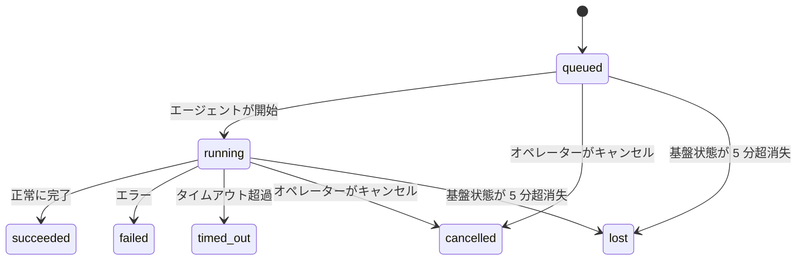

---
read_when:
    - 進行中または最近完了したバックグラウンド処理の確認
    - デタッチされたエージェント実行の配信失敗をデバッグする
    - バックグラウンド実行とセッション、Cron、Heartbeatの関係を理解する
sidebarTitle: Background tasks
summary: ACP 実行、サブエージェント、Cron 実行、CLI 操作のバックグラウンドタスク追跡
title: バックグラウンドタスク
x-i18n:
    generated_at: "2026-07-12T14:17:42Z"
    model: gpt-5.6
    postprocess_version: locale-links-v1
    prompt_version: 15
    provider: openai
    source_hash: 0a945e8103c5df5a64785f326a9d0b08784ac32a2ca6fa3d4c399d75fc54be2b
    source_path: automation/tasks.md
    workflow: 16
---

<Note>
スケジュール設定をお探しですか？適切な仕組みを選択するには、[自動化](/ja-JP/automation)を参照してください。このページはバックグラウンド作業のアクティビティ台帳であり、スケジューラーではありません。
</Note>

バックグラウンドタスクは、**メインの会話セッション外**で実行される作業（ACP 実行、サブエージェントの起動、Cron ジョブの実行、CLI から開始された操作）を追跡します。

タスクはセッション、Cron ジョブ、Heartbeat の代わりには**なりません**。タスクは、切り離された作業で何がいつ行われ、成功したかどうかを記録する**アクティビティ台帳**です。

<Note>
すべてのエージェント実行でタスクが作成されるわけではありません。Heartbeat ターンや通常の対話型チャットでは作成されません。すべての Cron 実行、ACP の起動、サブエージェントの起動、Gateway からディスパッチされた CLI エージェントコマンドでは作成されます。
</Note>

## 要点

- タスクはスケジューラーではなく**記録**です。Cron と Heartbeat が作業を実行する_タイミング_を決定し、タスクが_何が起きたか_を追跡します。
- ACP、サブエージェント、すべての Cron ジョブ、CLI 操作はタスクを作成します。Heartbeat ターンは作成しません。
- 各タスクは `queued → running → terminal`（succeeded、failed、timed_out、cancelled、lost のいずれか）の順に遷移します。
- Cron ランタイムがジョブを所有している間、Cron タスクはアクティブなままです。メモリ内のランタイム状態が失われた場合、タスクのメンテナンスは、タスクを lost とマークする前に永続的な Cron 実行履歴を確認します。
- 完了処理はプッシュ駆動です。切り離された作業は、完了時に直接通知するか、リクエスターのセッションまたは Heartbeat を起動できるため、通常、ステータスのポーリングループは適切ではありません。
- 分離された Cron 実行とサブエージェントの完了では、最終的なクリーンアップの記録処理前に、子セッションで追跡されているブラウザタブやプロセスをベストエフォートでクリーンアップします。
- 分離された Cron の配信では、子孫サブエージェントの作業がまだ完了処理中である間、古い途中経過の親応答を抑制し、配信前に最終的な子孫出力が届いた場合はそれを優先します。
- 完了通知はチャネルに直接配信されるか、次回の Heartbeat 用にキューへ追加されます。
- `openclaw tasks list` はすべてのタスクを表示し、`openclaw tasks audit` は問題を明らかにします。
- 終端状態の記録は 7 日間（`lost` の記録は 24 時間）保持された後、自動的に削除されます。

## クイックスタート

<Tabs>
  <Tab title="一覧表示と絞り込み">
    ```bash
    # すべてのタスクを一覧表示（新しい順）
    openclaw tasks list

    # ランタイムまたはステータスで絞り込み
    openclaw tasks list --runtime acp
    openclaw tasks list --status running
    ```

  </Tab>
  <Tab title="詳細確認">
    ```bash
    # 特定のタスクの詳細を表示（タスク ID、実行 ID、またはセッションキーで指定）
    openclaw tasks show <lookup>
    ```
  </Tab>
  <Tab title="キャンセルと通知">
    ```bash
    # 実行中のタスクをキャンセル（子セッションを終了）
    openclaw tasks cancel <lookup>

    # タスクの通知ポリシーを変更
    openclaw tasks notify <lookup> state_changes
    ```

  </Tab>
  <Tab title="監査とメンテナンス">
    ```bash
    # 健全性監査を実行
    openclaw tasks audit

    # メンテナンスをプレビューまたは適用
    openclaw tasks maintenance
    openclaw tasks maintenance --apply
    ```

  </Tab>
  <Tab title="タスクフロー">
    ```bash
    # TaskFlow の状態を確認
    openclaw tasks flow list
    openclaw tasks flow show <lookup>
    openclaw tasks flow cancel <lookup>
    ```
  </Tab>
</Tabs>

## タスクが作成される条件

| ソース                 | ランタイム種別 | タスク記録が作成されるタイミング                                          | デフォルトの通知ポリシー |
| ---------------------- | ------------ | ---------------------------------------------------------------------- | --------------------- |
| ACP バックグラウンド実行    | `acp`        | 子 ACP セッションを起動したとき                                           | `done_only`           |
| サブエージェントのオーケストレーション | `subagent`   | `sessions_spawn` を介してサブエージェントを起動したとき                               | `done_only`           |
| Cron ジョブ（全種類）  | `cron`       | Cron が実行されるたび（メインセッションおよび分離セッション）                       | `silent`              |
| CLI 操作         | `cli`        | Gateway を介して実行される `openclaw agent` コマンド                 | `silent`              |
| エージェントのメディアジョブ       | `cli`        | セッションに紐づく `image_generate`/`music_generate`/`video_generate` の実行 | `silent`              |

<AccordionGroup>
  <Accordion title="Cron とメディアの通知デフォルト">
    Cron タスク（メインセッションおよび分離セッション）は `silent` 通知ポリシーを使用します。追跡用の記録は作成しますが、タスク自体の通知は生成しません。配信経路は Cron が所有します。

    セッションに紐づく `image_generate`、`music_generate`、`video_generate` の実行も `silent` 通知ポリシーを使用します。これらもタスク記録を作成しますが、完了は内部ウェイクとして元のエージェントセッションに返されるため、エージェント自身がフォローアップメッセージを作成し、完成したメディアを添付できます。リクエスターエージェントは通常の表示応答契約に従います。設定されている場合は自動で最終応答を返し、セッションでメッセージツールによる応答が必要な場合は `message(action="send")` と `NO_REPLY` を使用します。リクエスターセッションがアクティブでなくなっているか、アクティブなウェイクに失敗し、完了エージェントが生成されたメディアの一部または全部を見落とした場合、OpenClaw は不足しているメディアのみを含む冪等な直接フォールバックを元のチャネルターゲットへ送信します。

  </Accordion>
  <Accordion title="メディア同時生成のガードレール">
    セッションに紐づくメディア生成タスクがまだアクティブな間、`image_generate`、`music_generate`、`video_generate` は意図しない再試行を防ぎます。同じプロンプトまたはリクエストで呼び出しを繰り返すと、重複したタスクを開始せず、一致するアクティブなタスクのステータスを返します。一方、異なるプロンプトでは独自のタスクを開始できます。エージェント側から進捗またはステータスを明示的に照会する場合は、`action: "status"` を使用します。
  </Accordion>
  <Accordion title="タスクを作成しないもの">
    - Heartbeat ターン（メインセッション）。[Heartbeat](/ja-JP/gateway/heartbeat)を参照
    - 通常の対話型チャットターン
    - 直接の `/command` 応答

  </Accordion>
</AccordionGroup>

## タスクのライフサイクル



| ステータス      | 意味                                                               |
| ----------- | --------------------------------------------------------------------------- |
| `queued`    | 作成済みで、エージェントの開始を待機中                                     |
| `running`   | エージェントターンを実行中                                            |
| `succeeded` | 正常に完了                                                      |
| `failed`    | エラーを伴って完了                                                     |
| `timed_out` | 設定されたタイムアウトを超過                                             |
| `cancelled` | オペレーターが `openclaw tasks cancel` で停止したか、実行が中止された |
| `lost`      | 5 分間の猶予期間後にランタイムが信頼できる基盤状態を失った  |

遷移は自動的に発生します。エージェント実行のライフサイクルイベント（開始、終了、エラー）がタスクのステータスを更新するため、手動で管理する必要はありません。

アクティブなタスク記録では、エージェント実行の完了が信頼できる情報源です。切り離された実行が成功すると `succeeded`、通常の実行エラーでは `failed`、タイムアウトでは `timed_out`、キャンセルまたは中止では `cancelled` として確定します。タスクが終端状態になった後は、後続のライフサイクルシグナルによって状態が格下げされることはありません。オペレーターがキャンセルしたタスクや、すでに `failed`/`timed_out`/`lost` になっているタスクは、その後に成功シグナルが届いてもその状態を維持します。

`lost` の判定はランタイムを考慮します。

- ACP タスク: Gateway プロセス内で実行中の ACP ターンだけが、実行が稼働中であることを証明します。永続化されたセッションメタデータだけでは証明になりません。オフラインの CLI 監査は保守的に動作し、ACP タスクを回収することはありません。
- サブエージェントタスク: 基盤となる子セッションが対象エージェントのストアから消失した場合（または再起動復旧用のトゥームストーンを持つ場合）。
- Cron タスク: Cron ランタイムがジョブをアクティブとして追跡しなくなり、永続的な Cron 実行履歴にもその実行の終端結果がない場合。オフラインの CLI 監査は、自身の空のプロセス内 Cron ランタイム状態を信頼できる情報源として扱いません。
- CLI タスク: 実行 ID またはソース ID を持つタスクは、稼働中の実行コンテキストを使用します。そのため、残存する子セッションやチャットセッションの行があっても、Gateway が所有する実行が消失した後にタスクが稼働中として維持されることはありません。実行識別子のないレガシー CLI タスクでは、引き続き子セッションにフォールバックします。Gateway を介した `openclaw agent` の実行も実行結果から確定されるため、完了した実行がスイーパーによって `lost` とマークされるまでアクティブなままになることはありません。

## 配信と通知

タスクが終端状態になると、OpenClaw が通知します。配信経路は 2 つあります。

**直接配信** - タスクにチャネルターゲット（`requesterOrigin`）がある場合、完了メッセージはそのチャネル（Discord、Slack、Telegram など）に直接送られます。ただし、グループおよびチャネルのタスク完了はリクエスターセッションを介してルーティングされ、親エージェントが表示用の応答を作成できるようにします。サブエージェントの完了では、利用可能な場合、OpenClaw は紐づけられたスレッドまたはトピックのルーティングも維持します。また、直接配信を断念する前に、リクエスターセッションに保存された経路（`lastChannel` / `lastTo` / `lastAccountId`）から不足している `to` / アカウントを補完できます。

**セッションキュー配信** - 直接配信に失敗した場合、または送信元が設定されていない場合、更新はリクエスターのセッションにシステムイベントとしてキューイングされ、次回の Heartbeat で表示されます。

<Tip>
セッションにキューイングされたタスク完了は即時に Heartbeat のウェイクをトリガーするため、結果をすぐに確認できます。次にスケジュールされた Heartbeat のタイミングまで待つ必要はありません。
</Tip>

つまり、通常のワークフローはプッシュベースです。切り離された作業を一度開始したら、完了時にランタイムがウェイクまたは通知するのを待ちます。タスクの状態をポーリングするのは、デバッグ、介入、または明示的な監査が必要な場合だけにしてください。

### 通知ポリシー

各タスクについて、受け取る通知の量を制御します。

| ポリシー                | 配信内容                                       |
| --------------------- | ------------------------------------------------------- |
| `done_only`（デフォルト） | 終端状態のみ（succeeded、failed など）           |
| `state_changes`       | すべての状態遷移と進捗更新              |
| `silent`              | 一切なし（Cron、CLI、メディアタスクのデフォルト） |

タスクの実行中にポリシーを変更します。

```bash
openclaw tasks notify <lookup> state_changes
```

## CLI リファレンス

<AccordionGroup>
  <Accordion title="tasks list">
    ```bash
    openclaw tasks list [--runtime <acp|subagent|cron|cli>] [--status <status>] [--json]
    ```

    出力列: Task、Kind、Status、Delivery、Run、Child Session、Summary。引数なしの `openclaw tasks` は `openclaw tasks list` と同様に動作します。

  </Accordion>
  <Accordion title="tasks show">
    ```bash
    openclaw tasks show <lookup> [--json]
    ```

    検索トークンには、タスク ID、実行 ID、またはセッションキーを指定できます。タイミング、配信状態、エラー、終端時の要約を含む完全な記録を表示します。

  </Accordion>
  <Accordion title="tasks cancel">
    ```bash
    openclaw tasks cancel <lookup>
    ```

    ACP タスクとサブエージェントタスクでは、子セッションを終了します。ACP と Cron のキャンセルは、実行中の Gateway（`tasks.cancel`）を介してルーティングされます。CLI で追跡されるタスクでは、キャンセルがタスクレジストリに記録されます（個別の子ランタイムハンドルはありません）。ステータスは `cancelled` に遷移し、該当する場合は配信通知が送信されます。

  </Accordion>
  <Accordion title="tasks notify">
    ```bash
    openclaw tasks notify <lookup> <done_only|state_changes|silent>
    ```
  </Accordion>
  <Accordion title="tasks audit">
    ```bash
    openclaw tasks audit [--severity <warn|error>] [--code <name>] [--limit <n>] [--json]
    ```

    タスクと TaskFlow の運用上の問題を 1 つのレポートで明らかにします。問題が検出された場合、検出結果は `openclaw status` にも表示されます。

    タスクの検出結果:

    | 検出事項                  | 重大度     | トリガー                                                                                                     |
    | ------------------------- | ---------- | ------------------------------------------------------------------------------------------------------------ |
    | `stale_queued`            | 警告       | キューに入ってから10分以上経過                                                                               |
    | `stale_running`           | エラー     | 実行開始から30分以上経過                                                                                     |
    | `lost`                    | 警告/エラー | ランタイムに基づくタスクの所有権が消失。保持中の lost タスクは `cleanupAfter` までは警告となり、その後エラーになる |
    | `delivery_failed`         | 警告       | 配信に失敗し、通知ポリシーが `silent` ではない                                                               |
    | `missing_cleanup`         | 警告       | 終了済みタスクにクリーンアップのタイムスタンプがない                                                         |
    | `inconsistent_timestamps` | 警告       | タイムライン違反（たとえば開始前に終了している）                                                             |

    TaskFlow の検出事項:

    | 検出事項               | 重大度     | トリガー                                                                    |
    | ---------------------- | ---------- | --------------------------------------------------------------------------- |
    | `restore_failed`       | エラー     | SQLite からのフローレジストリの復元に失敗                                    |
    | `stale_running`        | エラー     | 実行中のフローが30分以上進行していない                                       |
    | `stale_waiting`        | 警告       | 待機中のフローが30分以上進行していない                                       |
    | `stale_blocked`        | 警告       | ブロック中のフローが30分以上進行していない                                   |
    | `cancel_stuck`         | 警告       | キャンセル要求から5分以上経過し、アクティブな子タスクがないにもかかわらず、まだ終了状態ではない |
    | `missing_linked_tasks` | 警告/エラー | リンクされたタスクまたは待機状態がない、停止した管理対象フロー                |
    | `blocked_task_missing` | 警告       | ブロック中のフローが、すでに存在しないタスク ID を参照している                |

  </Accordion>
  <Accordion title="tasks maintenance">
    ```bash
    openclaw tasks maintenance [--json]
    openclaw tasks maintenance --apply [--json]
    ```

    タスク、TaskFlow の状態、および古くなった Cron 実行セッションレジストリ行に対する調整、クリーンアップ日時の設定、プルーニングをプレビューまたは適用するには、これを使用します。

    調整ではランタイムが考慮されます:

    - ACP タスクには Gateway 内で実行中のインプロセスターンが必要です。サブエージェントタスクでは、基盤となる子セッションを確認します。
    - 子セッションに再起動復旧用のトゥームストーンがあるサブエージェントタスクは、復旧可能な基盤セッションとして扱われず、lost としてマークされます。
    - Cron タスクでは、Cron ランタイムがまだジョブを所有しているかを確認し、`lost` にフォールバックする前に、永続化された Cron 実行ログまたはジョブ状態から終了ステータスを復元します。メモリ内の Cron アクティブジョブセットについて信頼できるのは Gateway プロセスだけです。オフラインの CLI 監査では永続的な履歴を使用しますが、そのローカルセットが空であることだけを理由に Cron タスクを lost としてマークすることはありません。
    - 実行 ID を持つ CLI タスクでは、子セッション行やチャットセッション行だけでなく、その実行を所有するライブ実行コンテキストを確認します。

    完了時のクリーンアップでもランタイムが考慮されます:

    - サブエージェントの完了時には、通知のクリーンアップを続行する前に、子セッションで追跡されているブラウザタブとプロセスをベストエフォートで閉じます。
    - 分離された Cron の完了時には、実行が完全に終了する前に、Cron セッションで追跡されているブラウザタブとプロセスをベストエフォートで閉じます。
    - 分離された Cron の配信では、必要に応じて子孫サブエージェントの後続処理が終わるまで待機し、古くなった親の確認応答テキストを通知せず抑制します。
    - サブエージェント完了時の配信では、子の最新の表示可能なアシスタントテキストのみを使用します。tool/toolResult の出力が子の結果テキストとして使用されることはありません。終了した失敗実行では、取得済みの返信テキストを再生せず、失敗ステータスを通知します。
    - クリーンアップの失敗によって、実際のタスク結果が隠されることはありません。

    メンテナンスを適用すると、OpenClaw は7日より古い `cron:<jobId>:run:<runId>` セッションレジストリ行も削除します。ただし、現在実行中の Cron ジョブの行は保持し、Cron 以外のセッション行には変更を加えません。

  </Accordion>
  <Accordion title="tasks flow list | show | cancel">
    ```bash
    openclaw tasks flow list [--status <status>] [--json]
    openclaw tasks flow show <lookup> [--json]
    openclaw tasks flow cancel <lookup>
    ```

    フロー検索トークンには、フロー ID または所有者キーを指定できます。個別のバックグラウンドタスクレコードではなく、それらをオーケストレーションする[タスクフロー](/ja-JP/automation/taskflow)を確認したい場合に使用します。

  </Accordion>
</AccordionGroup>

## チャットのタスクボード（`/tasks`）

任意のチャットセッションで `/tasks` を使用すると、そのセッションにリンクされたバックグラウンドタスクを確認できます。ボードには、アクティブなタスクと最近完了したタスクが最大5件表示され、ランタイム、ステータス、タイミング、進捗またはエラーの詳細を確認できます。

現在のセッションに表示可能なリンク済みタスクがない場合、`/tasks` はエージェントローカルのタスク数にフォールバックするため、他のセッションの詳細を漏らすことなく概要を確認できます。

オペレーター向けの完全な台帳を確認するには、CLI の `openclaw tasks list` を使用します。

### Control UI

Web の Control UI には、サイドバーに **Tasks** ページがあり、アクティブなバックグラウンドタスクと最近のバックグラウンドタスクがリアルタイムで表示されます。進捗の確認、リンクされたセッションの表示、台帳の更新、キュー内または実行中のタスクのキャンセルに使用します。

チャットペインには、そのペインのエージェントを対象とした折りたたみ可能な **Background tasks** レールもあります。実行中のタスクとサブエージェントには停止コントロールが表示され、完了済みセクションと、各タスクの子セッションを開く View transcript リンクもあります。ペインヘッダーのアクティビティ切り替えボタン（または単一ペインチャットのフローティングアクティビティボタン）から開きます。

## ステータス統合（タスク負荷）

`openclaw status` には、タスクの概要をひと目で確認できる行が含まれます:

```
タスク    2件アクティブ · 1件キュー内 · 1件実行中 · 1件の問題 · 監査は正常 · 6件追跡中
```

この概要では、アクティブな作業（`queued` + `running`）、失敗（`failed` + `timed_out` + `lost`）、監査の検出事項、追跡中のレコード総数を集計します。JSON ペイロードでは、ランタイム（`acp`、`subagent`、`cron`、`cli`）ごとの件数も確認できます。

`/status` と `session_status` ツールはどちらも、クリーンアップを考慮したタスクスナップショットを使用します。アクティブなタスクが優先され、期限切れの行は非表示になり、終了済みタスクは最近の短い期間（5分間）だけ表示されます。アクティブな作業が残っていない場合は失敗が強調されます。これにより、ステータスカードには現在重要な情報だけが表示されます。

## ストレージとメンテナンス

### タスクの保存場所

タスクレコードと配信状態は、OpenClaw の共有 SQLite 状態データベースに永続化されます:

```
~/.openclaw/state/openclaw.sqlite   (テーブル: task_runs, task_delivery_state, flow_runs)
```

状態ルート全体（デフォルトは `~/.openclaw`）を別の場所へ移動するには、`OPENCLAW_STATE_DIR` を設定します。共有データベースのパスも一緒に移動します。

レジストリは初回使用時にメモリへ読み込まれ、すべての書き込みが SQLite に永続化されるため、Gateway の再起動後もレコードが保持されます。WAL の増加量は、SQLite のデフォルトの自動チェックポイントしきい値と定期的な `PASSIVE` チェックポイントによって制限されます。シャットダウン時と明示的なメンテナンス時のチェックポイントには `TRUNCATE` が使用されるため、通常の終了処理では、バックグラウンドスイーパーをアクティブなリーダーの待機状態にすることなく WAL の領域を回収できます。

古いインストール環境の従来のサイドカーストア（`tasks/runs.sqlite`、`flows/registry.sqlite`）は、`openclaw doctor` によって共有データベースへインポートされます。

### 自動メンテナンス

スイーパーは **60秒** ごと（初回は Gateway 起動から約5秒後）に実行され、次の4つを処理します:

<Steps>
  <Step title="調整">
    アクティブなタスクに、信頼できるランタイム上の基盤がまだ存在するかを確認します。ACP タスクには実行中のインプロセスターンが必要で、サブエージェントタスクでは子セッションの状態、Cron タスクではアクティブジョブの所有権と永続的な実行履歴、実行 ID を持つ CLI タスクではその実行を所有するコンテキストを使用します。基盤の状態が5分以上（子を持たないネイティブなサブエージェントタスクでは30分以上）失われている場合、タスクは `lost` としてマークされます。
  </Step>
  <Step title="ACP セッションの修復">
    終了済みまたは孤立した、親所有のワンショット ACP セッションを閉じます。また、アクティブな会話バインディングが残っていない場合に限り、古くなった終了済みまたは孤立した永続 ACP セッションを閉じます。
  </Step>
  <Step title="クリーンアップ日時の設定">
    終了済みタスクに `cleanupAfter` タイムスタンプ（終了時刻 + 保持期間）を設定します。保持期間中、lost タスクは監査で警告として表示されます。`cleanupAfter` の期限が切れた後、またはクリーンアップメタデータがない場合は、エラーになります。
  </Step>
  <Step title="プルーニング">
    `cleanupAfter` の日時を過ぎたレコードを削除します。
  </Step>
</Steps>

<Note>
**保持期間:** 終了済みタスクのレコードは **7日間**（`lost` レコードは **24時間**）保持され、その後自動的にプルーニングされます。設定は不要です。
</Note>

## タスクと他のシステムの関係

<AccordionGroup>
  <Accordion title="タスクとタスクフロー">
    [タスクフロー](/ja-JP/automation/taskflow)は、バックグラウンドタスクの上位にあるフローオーケストレーションレイヤーです。1つのフローが、そのライフサイクルを通じて、管理同期モードまたはミラー同期モードを使用し、複数のタスクを調整する場合があります。個別のタスクレコードを確認するには `openclaw tasks` を、オーケストレーションするフローを確認するには `openclaw tasks flow` を使用します。

  </Accordion>
  <Accordion title="タスクと Cron">
    Cron ジョブ定義、ランタイム実行状態、実行履歴は、OpenClaw の共有 SQLite 状態データベースに保存されます。**すべての** Cron 実行では、メインセッションと分離セッションの両方で、通知ポリシーが `silent` のタスクレコードが作成されます。そのため、Cron 実行自体のタスク通知を生成せずに追跡できます。

    [Cron ジョブ](/ja-JP/automation/cron-jobs)を参照してください。

  </Accordion>
  <Accordion title="タスクと Heartbeat">
    Heartbeat の実行はメインセッションのターンであり、タスクレコードは作成されません。タスクが完了すると、Heartbeat のウェイクをトリガーし、結果をすぐに確認できるようにすることができます。

    [Heartbeat](/ja-JP/gateway/heartbeat)を参照してください。

  </Accordion>
  <Accordion title="タスクとセッション">
    タスクは `childSessionKey`（作業を実行する場所）と `requesterSessionKey`（作業を開始した主体）を参照する場合があります。`agentId` は作業を実行するエージェントを識別し、要求者フィールドと所有者フィールドは起動および制御のコンテキストを保持します。セッションは会話のコンテキストであり、タスクはその上位にあるアクティビティ追跡です。
  </Accordion>
  <Accordion title="タスクとエージェント実行">
    タスクの `runId` は、その作業を実行しているエージェント実行にリンクします。エージェントのライフサイクルイベント（開始、終了、エラー）によってタスクのステータスが自動的に更新されるため、ライフサイクルを手動で管理する必要はありません。
  </Accordion>
</AccordionGroup>

## 関連項目

- [自動化](/ja-JP/automation) - すべての自動化メカニズムの概要
- [CLI: タスク](/ja-JP/cli/tasks) - CLI コマンドリファレンス
- [Heartbeat](/ja-JP/gateway/heartbeat) - メインセッションの定期的なターン
- [スケジュールされたタスク](/ja-JP/automation/cron-jobs) - バックグラウンド作業のスケジュール
- [タスクフロー](/ja-JP/automation/taskflow) - タスクの上位にあるフローオーケストレーション
