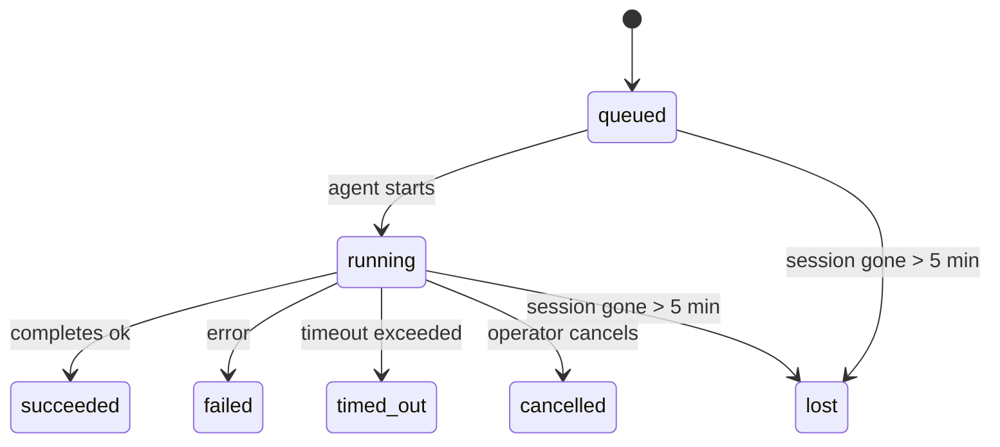

---
read_when:
    - 進行中または最近完了したバックグラウンド作業を確認する
    - デタッチされたエージェント実行の配信失敗をデバッグする
    - バックグラウンド実行とセッション、Cron、Heartbeat の関係を理解する
sidebarTitle: Background tasks
summary: ACP 実行、サブエージェント、隔離された Cron ジョブ、CLI 操作のバックグラウンドタスク追跡
title: バックグラウンドタスク
x-i18n:
    generated_at: "2026-05-05T01:44:24Z"
    model: gpt-5.5
    provider: openai
    source_hash: 60d6ea6178535b19b95d761b8e8b05a665234584ae69852fd21097988aa32991
    source_path: automation/tasks.md
    workflow: 16
---

<Note>
スケジュール設定を探していますか？適切な仕組みの選択については、[自動化とタスク](/ja-JP/automation)を参照してください。このページはバックグラウンド作業のアクティビティ台帳であり、スケジューラーではありません。
</Note>

バックグラウンドタスクは、**メインの会話セッション外**で実行される作業を追跡します: ACP 実行、サブエージェントの起動、分離された Cron ジョブ実行、CLI から開始された操作です。

タスクは、セッション、Cron ジョブ、Heartbeat を置き換えるものではありません。タスクは、どの切り離された作業がいつ発生し、成功したかどうかを記録する**アクティビティ台帳**です。

<Note>
すべてのエージェント実行がタスクを作成するわけではありません。Heartbeat ターンと通常の対話型チャットは作成しません。すべての Cron 実行、ACP 起動、サブエージェント起動、CLI エージェントコマンドは作成します。
</Note>

## TL;DR

- タスクはスケジューラーではなく**記録**です。Cron と Heartbeat が作業を_いつ_実行するかを決定し、タスクは_何が起きたか_を追跡します。
- ACP、サブエージェント、すべての Cron ジョブ、CLI 操作はタスクを作成します。Heartbeat ターンは作成しません。
- 各タスクは `queued → running → terminal` (succeeded、failed、timed_out、cancelled、または lost) を通過します。
- Cron タスクは、Cron ランタイムがまだジョブを所有している間はライブのままです。
  インメモリのランタイム状態がなくなった場合、タスクメンテナンスはタスクを lost としてマークする前に、まず永続化された Cron 実行履歴を確認します。
- 完了はプッシュ駆動です。切り離された作業は完了時に直接通知するか、
  リクエスターのセッション/Heartbeat を起こすことができるため、ステータスポーリングループは通常適切な形ではありません。
- 分離された Cron 実行とサブエージェント完了は、最終クリーンアップの記録処理の前に、その子セッションで追跡されているブラウザータブ/プロセスをベストエフォートでクリーンアップします。
- 分離された Cron 配信は、子孫サブエージェント作業がまだ排出中の間、古い中間の親返信を抑制し、配信前に到着した場合は最終的な子孫出力を優先します。
- 完了通知はチャネルへ直接配信されるか、次の Heartbeat 用にキューへ入れられます。
- `openclaw tasks list` はすべてのタスクを表示します。`openclaw tasks audit` は問題を表面化します。
- 終端レコードは 7 日間保持され、その後自動的に削除されます。

## クイックスタート

<Tabs>
  <Tab title="一覧表示とフィルター">
    ```bash
    # List all tasks (newest first)
    openclaw tasks list

    # Filter by runtime or status
    openclaw tasks list --runtime acp
    openclaw tasks list --status running
    ```

  </Tab>
  <Tab title="調査">
    ```bash
    # Show details for a specific task (by ID, run ID, or session key)
    openclaw tasks show <lookup>
    ```
  </Tab>
  <Tab title="キャンセルと通知">
    ```bash
    # Cancel a running task (kills the child session)
    openclaw tasks cancel <lookup>

    # Change notification policy for a task
    openclaw tasks notify <lookup> state_changes
    ```

  </Tab>
  <Tab title="監査とメンテナンス">
    ```bash
    # Run a health audit
    openclaw tasks audit

    # Preview or apply maintenance
    openclaw tasks maintenance
    openclaw tasks maintenance --apply
    ```

  </Tab>
  <Tab title="タスクフロー">
    ```bash
    # Inspect TaskFlow state
    openclaw tasks flow list
    openclaw tasks flow show <lookup>
    openclaw tasks flow cancel <lookup>
    ```
  </Tab>
</Tabs>

## タスクを作成するもの

| ソース                 | ランタイム種別 | タスクレコードが作成されるタイミング                          | デフォルトの通知ポリシー |
| ---------------------- | ------------ | ------------------------------------------------------ | --------------------- |
| ACP バックグラウンド実行    | `acp`        | 子 ACP セッションを起動する                           | `done_only`           |
| サブエージェントオーケストレーション | `subagent`   | `sessions_spawn` でサブエージェントを起動する               | `done_only`           |
| Cron ジョブ (すべての種別)  | `cron`       | すべての Cron 実行 (メインセッションと分離実行)       | `silent`              |
| CLI 操作         | `cli`        | Gateway 経由で実行される `openclaw agent` コマンド | `silent`              |
| エージェントメディアジョブ       | `cli`        | セッションに支えられた `music_generate`/`video_generate` 実行  | `silent`              |

<AccordionGroup>
  <Accordion title="Cron とメディアの通知デフォルト">
    メインセッションの Cron タスクはデフォルトで `silent` 通知ポリシーを使用します。追跡用のレコードは作成しますが、通知は生成しません。分離された Cron タスクもデフォルトは `silent` ですが、独自のセッションで実行されるため、より見えやすくなります。

    セッションに支えられた `music_generate` と `video_generate` 実行も `silent` 通知ポリシーを使用します。それでもタスクレコードは作成されますが、完了は内部 wake として元のエージェントセッションに戻されるため、エージェントがフォローアップメッセージを書き、完成したメディアを自分で添付できます。グループ/チャネルの完了は通常の可視返信ポリシーに従うため、ソース配信が必要な場合、エージェントはメッセージツールを使用します。

  </Accordion>
  <Accordion title="同時 video_generate ガードレール">
    セッションに支えられた `video_generate` タスクがまだアクティブな間、そのツールはガードレールとしても機能します。同じセッション内で繰り返された `video_generate` 呼び出しは、2 つ目の同時生成を開始する代わりに、アクティブなタスクステータスを返します。エージェント側から明示的な進捗/ステータス検索が必要な場合は、`action: "status"` を使用してください。
  </Accordion>
  <Accordion title="タスクを作成しないもの">
    - Heartbeat ターン — メインセッション。[Heartbeat](/ja-JP/gateway/heartbeat)を参照
    - 通常の対話型チャットターン
    - 直接の `/command` 応答

  </Accordion>
</AccordionGroup>

## タスクライフサイクル



| ステータス      | 意味                                                              |
| ----------- | -------------------------------------------------------------------------- |
| `queued`    | 作成済みで、エージェントの開始待ち                                    |
| `running`   | エージェントターンがアクティブに実行中                                           |
| `succeeded` | 正常に完了                                                     |
| `failed`    | エラーで完了                                                    |
| `timed_out` | 設定されたタイムアウトを超過                                            |
| `cancelled` | `openclaw tasks cancel` によりオペレーターが停止                        |
| `lost`      | 5 分の猶予期間後に、ランタイムが権威ある裏付け状態を失った |

遷移は自動的に発生します。関連付けられたエージェント実行が終了すると、タスクステータスはそれに合わせて更新されます。

エージェント実行の完了は、アクティブなタスクレコードに対して権威があります。成功した切り離し実行は `succeeded` として確定し、通常の実行エラーは `failed` として確定し、タイムアウトまたは中止の結果は `timed_out` として確定します。オペレーターがすでにタスクをキャンセルしている場合、またはランタイムがすでに `failed`、`timed_out`、`lost` などのより強い終端状態を記録している場合、後からの成功シグナルがその終端ステータスを格下げすることはありません。

`lost` はランタイムを認識します:

- ACP タスク: 裏付けとなる ACP 子セッションメタデータが消えました。
- サブエージェントタスク: 裏付けとなる子セッションがターゲットエージェントストアから消えました。
- Cron タスク: Cron ランタイムがそのジョブをアクティブとして追跡しなくなり、永続化された
  Cron 実行履歴にもその実行の終端結果が表示されません。オフライン CLI
  監査は、自身の空のインプロセス Cron ランタイム状態を権威として扱いません。
- CLI タスク: 分離された子セッションタスクは子セッションを使用します。チャットに支えられた
  CLI タスクは代わりにライブ実行コンテキストを使用するため、残存する
  チャネル/グループ/ダイレクトセッション行がそれらを生存状態に保つことはありません。Gateway に支えられた
  `openclaw agent` 実行も実行結果から確定するため、完了した実行がスイーパーに `lost` とマークされるまでアクティブのまま残ることはありません。

## 配信と通知

タスクが終端状態に達すると、OpenClaw が通知します。配信経路は 2 つあります:

**直接配信** — タスクにチャネルターゲット (`requesterOrigin`) がある場合、完了メッセージはそのチャネル (Telegram、Discord、Slack など) に直接送られます。サブエージェント完了では、OpenClaw は利用可能な場合にバインド済みスレッド/トピックルーティングも保持し、直接配信を諦める前に、リクエスターセッションに保存されたルート (`lastChannel` / `lastTo` / `lastAccountId`) から欠けている `to` / アカウントを補完できます。

**セッションキュー配信** — 直接配信が失敗した場合、または origin が設定されていない場合、更新はリクエスターのセッション内のシステムイベントとしてキューに入り、次の Heartbeat で表示されます。

<Tip>
タスク完了は即時の Heartbeat wake をトリガーするため、結果をすぐに確認できます。次に予定された Heartbeat tick を待つ必要はありません。
</Tip>

つまり、通常のワークフローはプッシュベースです。切り離された作業を一度開始し、その後は完了時にランタイムが wake または通知するのに任せます。デバッグ、介入、明示的な監査が必要な場合にのみタスク状態をポーリングしてください。

### 通知ポリシー

各タスクについて、どれだけ通知を受け取るかを制御します:

| ポリシー                | 配信されるもの                                                       |
| --------------------- | ----------------------------------------------------------------------- |
| `done_only` (デフォルト) | 終端状態 (succeeded、failed など) のみ — **これがデフォルトです** |
| `state_changes`       | すべての状態遷移と進捗更新                              |
| `silent`              | 何も配信しない                                                          |

タスク実行中にポリシーを変更します:

```bash
openclaw tasks notify <lookup> state_changes
```

## CLI リファレンス

<AccordionGroup>
  <Accordion title="tasks list">
    ```bash
    openclaw tasks list [--runtime <acp|subagent|cron|cli>] [--status <status>] [--json]
    ```

    出力列: タスク ID、種類、ステータス、配信、実行 ID、子セッション、概要。

  </Accordion>
  <Accordion title="tasks show">
    ```bash
    openclaw tasks show <lookup>
    ```

    検索トークンには、タスク ID、実行 ID、またはセッションキーを指定できます。タイミング、配信状態、エラー、終端概要を含む完全なレコードを表示します。

  </Accordion>
  <Accordion title="tasks cancel">
    ```bash
    openclaw tasks cancel <lookup>
    ```

    ACP とサブエージェントタスクでは、これは子セッションを終了します。CLI 追跡タスクでは、キャンセルはタスクレジストリに記録されます (個別の子ランタイムハンドルはありません)。ステータスは `cancelled` に遷移し、該当する場合は配信通知が送信されます。

  </Accordion>
  <Accordion title="tasks notify">
    ```bash
    openclaw tasks notify <lookup> <done_only|state_changes|silent>
    ```
  </Accordion>
  <Accordion title="tasks audit">
    ```bash
    openclaw tasks audit [--json]
    ```

    運用上の問題を表面化します。問題が検出された場合、所見は `openclaw status` にも表示されます。

    | 検出項目                  | 重大度     | トリガー                                                                                                     |
    | ------------------------- | ---------- | ------------------------------------------------------------------------------------------------------------ |
    | `stale_queued`            | warn       | 10分を超えてキューに入っている                                                                               |
    | `stale_running`           | error      | 30分を超えて実行中                                                                                           |
    | `lost`                    | warn/error | ランタイムに裏付けられたタスク所有権が消失した。保持中の lost タスクは `cleanupAfter` までは警告、その後はエラーになる |
    | `delivery_failed`         | warn       | 配信に失敗し、通知ポリシーが `silent` ではない                                                               |
    | `missing_cleanup`         | warn       | クリーンアップタイムスタンプのない終端タスク                                                                 |
    | `inconsistent_timestamps` | warn       | タイムライン違反（たとえば開始前に終了している）                                                             |

  </Accordion>
  <Accordion title="tasks maintenance">
    ```bash
    openclaw tasks maintenance [--json]
    openclaw tasks maintenance --apply [--json]
    ```

    これを使って、タスクと Task Flow 状態の照合、クリーンアップスタンプ付け、枝刈りをプレビューまたは適用します。

    照合はランタイムを認識します。

    - ACP/サブエージェントタスクは、裏付けとなる子セッションを確認します。
    - 子セッションに再起動リカバリの墓標があるサブエージェントタスクは、復旧可能な裏付けセッションとして扱われるのではなく、lost としてマークされます。
    - Cron タスクは、cron ランタイムがまだジョブを所有しているかを確認し、その後 `lost` にフォールバックする前に、永続化された cron 実行ログ/ジョブ状態から終端ステータスを復元します。メモリ内の cron アクティブジョブセットについては Gateway プロセスだけが権威を持ちます。オフライン CLI 監査は永続履歴を使いますが、そのローカル Set が空であることだけを理由に cron タスクを lost としてマークしません。
    - チャットに裏付けられた CLI タスクは、チャットセッション行だけでなく、所有元のライブ実行コンテキストを確認します。

    完了時のクリーンアップもランタイムを認識します。

    - サブエージェント完了では、通知クリーンアップを続行する前に、子セッションで追跡されているブラウザータブ/プロセスをベストエフォートで閉じます。
    - 分離 cron 完了では、実行が完全に終了する前に、cron セッションで追跡されているブラウザータブ/プロセスをベストエフォートで閉じます。
    - 分離 cron 配信は、必要に応じて子孫サブエージェントのフォローアップを待ち、古い親確認テキストを通知する代わりに抑制します。
    - サブエージェント完了配信は、最新の表示可能なアシスタントテキストを優先します。それが空の場合は、サニタイズされた最新の tool/toolResult テキストにフォールバックし、タイムアウトのみのツール呼び出し実行は短い部分進捗サマリーに折りたたまれることがあります。終端の失敗実行は、取得された返信テキストを再生せずに失敗ステータスを通知します。
    - クリーンアップ失敗が実際のタスク結果を隠すことはありません。

  </Accordion>
  <Accordion title="tasks flow list | show | cancel">
    ```bash
    openclaw tasks flow list [--status <status>] [--json]
    openclaw tasks flow show <lookup> [--json]
    openclaw tasks flow cancel <lookup>
    ```

    個別のバックグラウンドタスクレコードではなく、オーケストレーションしている Task Flow を確認したい場合に使用します。

  </Accordion>
</AccordionGroup>

## チャットタスクボード（`/tasks`）

任意のチャットセッションで `/tasks` を使うと、そのセッションにリンクされたバックグラウンドタスクを確認できます。ボードには、アクティブなタスクと最近完了したタスクが、ランタイム、ステータス、タイミング、進捗またはエラーの詳細とともに表示されます。

現在のセッションに表示可能なリンク済みタスクがない場合、`/tasks` はエージェントローカルのタスク数にフォールバックするため、他のセッションの詳細を漏らすことなく概要を得られます。

完全なオペレーター台帳には CLI を使用します: `openclaw tasks list`。

## ステータス連携（タスク負荷）

`openclaw status` には、一目でわかるタスクサマリーが含まれます。

```
Tasks: 3 queued · 2 running · 1 issues
```

サマリーは次を報告します。

- **active** — `queued` + `running` の数
- **failures** — `failed` + `timed_out` + `lost` の数
- **byRuntime** — `acp`、`subagent`、`cron`、`cli` 別の内訳

`/status` と `session_status` ツールはどちらも、クリーンアップを認識するタスクスナップショットを使用します。アクティブなタスクが優先され、古い完了行は非表示になり、最近の失敗はアクティブな作業が残っていない場合にのみ表示されます。これにより、ステータスカードは現在重要なことに集中できます。

## ストレージとメンテナンス

### タスクの保存場所

タスクレコードは SQLite の次の場所に永続化されます。

```
$OPENCLAW_STATE_DIR/tasks/runs.sqlite
```

レジストリは Gateway 起動時にメモリへ読み込まれ、再起動をまたいだ耐久性のために書き込みを SQLite に同期します。
Gateway は、SQLite のデフォルトの自動チェックポイントしきい値に加え、定期的およびシャットダウン時の `TRUNCATE` チェックポイントを使って、SQLite の先行書き込みログを制限します。

### 自動メンテナンス

スイーパーは **60秒** ごとに実行され、4つのことを処理します。

<Steps>
  <Step title="Reconciliation">
    アクティブなタスクに、権威あるランタイムの裏付けがまだあるかを確認します。ACP/サブエージェントタスクは子セッション状態を使い、cron タスクはアクティブジョブ所有権を使い、チャットに裏付けられた CLI タスクは所有元の実行コンテキストを使います。その裏付け状態が5分を超えて消えている場合、タスクは `lost` としてマークされます。
  </Step>
  <Step title="ACP session repair">
    終端または孤立した親所有の単発 ACP セッションを閉じます。また、アクティブな会話バインディングが残っていない場合に限り、古い終端または孤立した永続 ACP セッションを閉じます。
  </Step>
  <Step title="Cleanup stamping">
    終端タスクに `cleanupAfter` タイムスタンプ（endedAt + 7日）を設定します。保持期間中、lost タスクは監査で引き続き警告として表示されます。`cleanupAfter` が期限切れになった後、またはクリーンアップメタデータがない場合は、エラーになります。
  </Step>
  <Step title="Pruning">
    `cleanupAfter` 日付を過ぎたレコードを削除します。
  </Step>
</Steps>

<Note>
**保持:** 終端タスクレコードは **7日間** 保持され、その後自動的に枝刈りされます。設定は不要です。
</Note>

## タスクと他のシステムの関係

<AccordionGroup>
  <Accordion title="Tasks and Task Flow">
    [Task Flow](/ja-JP/automation/taskflow) は、バックグラウンドタスクの上にあるフローオーケストレーション層です。1つのフローは、その存続期間中に管理モードまたはミラー同期モードを使って複数のタスクを調整できます。個別のタスクレコードを調べるには `openclaw tasks` を使い、オーケストレーションしているフローを調べるには `openclaw tasks flow` を使います。

    詳細は [Task Flow](/ja-JP/automation/taskflow) を参照してください。

  </Accordion>
  <Accordion title="Tasks and cron">
    cron ジョブの**定義**は `~/.openclaw/cron/jobs.json` にあります。ランタイム実行状態は、その横の `~/.openclaw/cron/jobs-state.json` にあります。**すべての** cron 実行はタスクレコードを作成します。メインセッションと分離セッションの両方です。メインセッションの cron タスクはデフォルトで `silent` 通知ポリシーを使うため、通知を生成せずに追跡されます。

    [Cron ジョブ](/ja-JP/automation/cron-jobs) を参照してください。

  </Accordion>
  <Accordion title="Tasks and heartbeat">
    Heartbeat 実行はメインセッションのターンです。タスクレコードは作成しません。タスクが完了すると、Heartbeat ウェイクをトリガーして、結果をすばやく確認できるようにできます。

    [Heartbeat](/ja-JP/gateway/heartbeat) を参照してください。

  </Accordion>
  <Accordion title="Tasks and sessions">
    タスクは `childSessionKey`（作業が実行される場所）と `requesterSessionKey`（開始した主体）を参照する場合があります。セッションは会話コンテキストであり、タスクはその上にあるアクティビティ追跡です。
  </Accordion>
  <Accordion title="Tasks and agent runs">
    タスクの `runId` は、作業を行うエージェント実行にリンクします。エージェントのライフサイクルイベント（開始、終了、エラー）はタスクステータスを自動的に更新します。ライフサイクルを手動で管理する必要はありません。
  </Accordion>
</AccordionGroup>

## 関連

- [自動化とタスク](/ja-JP/automation) — すべての自動化メカニズムの概要
- [CLI: タスク](/ja-JP/cli/tasks) — CLI コマンドリファレンス
- [Heartbeat](/ja-JP/gateway/heartbeat) — 定期的なメインセッションターン
- [スケジュール済みタスク](/ja-JP/automation/cron-jobs) — バックグラウンド作業のスケジュール
- [Task Flow](/ja-JP/automation/taskflow) — タスクの上にあるフローオーケストレーション
