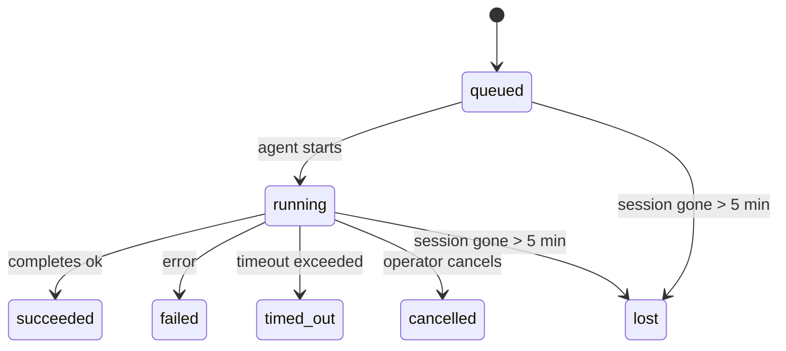

---
read_when:
    - 進行中または最近完了したバックグラウンド作業の確認
    - デタッチされたエージェント実行の配信失敗をデバッグする
    - バックグラウンド実行がセッション、Cron、Heartbeat とどのように関連するかを理解する
sidebarTitle: Background tasks
summary: ACP 実行、サブエージェント、分離された Cron ジョブ、CLI 操作のバックグラウンドタスク追跡
title: バックグラウンドタスク
x-i18n:
    generated_at: "2026-05-07T13:13:32Z"
    model: gpt-5.5
    provider: openai
    source_hash: a91a04ef6142e488d2fbc459d2c663afb93816a58fe9f52e0a51420703ea2d4d
    source_path: automation/tasks.md
    workflow: 16
---

<Note>
スケジュール設定を探していますか？適切な仕組みを選ぶには[自動化とタスク](/ja-JP/automation)を参照してください。このページはバックグラウンド作業のアクティビティ台帳であり、スケジューラーではありません。
</Note>

バックグラウンドタスクは、**メインの会話セッションの外部**で実行される作業を追跡します。ACP 実行、サブエージェントの生成、分離された cron ジョブ実行、CLI から開始された操作が含まれます。

タスクはセッション、cron ジョブ、Heartbeat を置き換えるものではありません。切り離された作業で何が起きたか、いつ起きたか、成功したかどうかを記録する**アクティビティ台帳**です。

<Note>
すべてのエージェント実行がタスクを作成するわけではありません。Heartbeat ターンと通常の対話チャットは作成しません。すべての cron 実行、ACP 生成、サブエージェント生成、CLI エージェントコマンドは作成します。
</Note>

## 要点

- タスクはスケジューラーではなく**記録**です。cron と Heartbeat が作業を_いつ_実行するかを決め、タスクは_何が起きたか_を追跡します。
- ACP、サブエージェント、すべての cron ジョブ、CLI 操作はタスクを作成します。Heartbeat ターンは作成しません。
- 各タスクは `queued → running → terminal`（succeeded、failed、timed_out、cancelled、または lost）を進みます。
- Cron タスクは、cron ランタイムがまだジョブを所有している間はライブのままです。
  インメモリのランタイム状態がなくなった場合、タスクメンテナンスはタスクを lost としてマークする前に、まず永続化された cron 実行履歴を確認します。
- 完了はプッシュ駆動です。切り離された作業は完了時に直接通知するか、
  リクエスターのセッション/Heartbeat をウェイクできるため、ステータスのポーリングループは
  たいてい適切な形ではありません。
- 分離された cron 実行とサブエージェント完了は、最終的なクリーンアップの記録処理の前に、子セッションの追跡済みブラウザータブ/プロセスをベストエフォートでクリーンアップします。
- 分離された cron 配信は、子孫サブエージェントの作業がまだ排出中の間、古い中間の親返信を抑制し、配信前に最終的な子孫出力が到着した場合はそれを優先します。
- 完了通知はチャンネルへ直接配信されるか、次の Heartbeat のためにキューに入れられます。
- `openclaw tasks list` はすべてのタスクを表示します。`openclaw tasks audit` は問題を明らかにします。
- 終端レコードは 7 日間保持され、その後自動的に削除されます。

## クイックスタート

<Tabs>
  <Tab title="一覧表示とフィルター">
    ```bash
    # List all tasks (newest first)
    openclaw tasks list

    # Filter by runtime or status
    openclaw tasks list --runtime acp
    openclaw tasks list --status running
    ```

  </Tab>
  <Tab title="詳細確認">
    ```bash
    # Show details for a specific task (by ID, run ID, or session key)
    openclaw tasks show <lookup>
    ```
  </Tab>
  <Tab title="キャンセルと通知">
    ```bash
    # Cancel a running task (kills the child session)
    openclaw tasks cancel <lookup>

    # Change notification policy for a task
    openclaw tasks notify <lookup> state_changes
    ```

  </Tab>
  <Tab title="監査とメンテナンス">
    ```bash
    # Run a health audit
    openclaw tasks audit

    # Preview or apply maintenance
    openclaw tasks maintenance
    openclaw tasks maintenance --apply
    ```

  </Tab>
  <Tab title="タスクフロー">
    ```bash
    # Inspect TaskFlow state
    openclaw tasks flow list
    openclaw tasks flow show <lookup>
    openclaw tasks flow cancel <lookup>
    ```
  </Tab>
</Tabs>

## タスクを作成するもの

| ソース                 | ランタイム種別 | タスクレコードが作成されるタイミング                          | 既定の通知ポリシー |
| ---------------------- | ------------ | ------------------------------------------------------ | --------------------- |
| ACP バックグラウンド実行    | `acp`        | 子 ACP セッションの生成                           | `done_only`           |
| サブエージェントオーケストレーション | `subagent`   | `sessions_spawn` によるサブエージェントの生成               | `done_only`           |
| Cron ジョブ（すべての種別）  | `cron`       | すべての cron 実行（メインセッションと分離）       | `silent`              |
| CLI 操作         | `cli`        | Gateway 経由で実行される `openclaw agent` コマンド | `silent`              |
| エージェントのメディアジョブ       | `cli`        | セッションを背後に持つ `music_generate`/`video_generate` 実行  | `silent`              |

<AccordionGroup>
  <Accordion title="cron とメディアの通知既定値">
    メインセッションの cron タスクは既定で `silent` 通知ポリシーを使用します。追跡用のレコードは作成しますが、通知は生成しません。分離された cron タスクも既定は `silent` ですが、独自のセッションで実行されるため、より見えやすくなります。

    セッションを背後に持つ `music_generate` と `video_generate` の実行も `silent` 通知ポリシーを使用します。タスクレコードは引き続き作成されますが、完了は内部ウェイクとして元のエージェントセッションに戻されるため、エージェントがフォローアップメッセージを書き、完成したメディアを自分で添付できます。グループ/チャンネルの完了は通常の表示返信ポリシーに従うため、ソース配信で必要な場合、エージェントはメッセージツールを使用します。ツールのみの経路で完了エージェントがメッセージツール配信の証拠を生成できない場合、OpenClaw はメディアを非公開のままにせず、完了フォールバックを元のチャンネルへ直接送信します。

  </Accordion>
  <Accordion title="同時 video_generate ガードレール">
    セッションを背後に持つ `video_generate` タスクがまだアクティブな間、このツールはガードレールとしても機能します。同じセッションで `video_generate` を繰り返し呼び出すと、2 つ目の同時生成を開始する代わりに、アクティブなタスクのステータスを返します。エージェント側から明示的に進捗/ステータスを確認したい場合は `action: "status"` を使用してください。
  </Accordion>
  <Accordion title="タスクを作成しないもの">
    - Heartbeat ターン - メインセッション。[Heartbeat](/ja-JP/gateway/heartbeat)を参照
    - 通常の対話チャットターン
    - 直接の `/command` 応答

  </Accordion>
</AccordionGroup>

## タスクのライフサイクル



| ステータス      | 意味                                                              |
| ----------- | -------------------------------------------------------------------------- |
| `queued`    | 作成済みで、エージェントの開始待ち                                    |
| `running`   | エージェントターンがアクティブに実行中                                           |
| `succeeded` | 正常に完了                                                     |
| `failed`    | エラーで完了                                                    |
| `timed_out` | 設定されたタイムアウトを超過                                            |
| `cancelled` | `openclaw tasks cancel` によりオペレーターが停止                        |
| `lost`      | ランタイムが 5 分の猶予期間後に権威ある裏付け状態を失った |

遷移は自動的に発生します。関連するエージェント実行が終了すると、タスクのステータスはそれに合わせて更新されます。

アクティブなタスクレコードでは、エージェント実行の完了が権威となります。成功した切り離し実行は `succeeded` として確定し、通常の実行エラーは `failed` として確定し、タイムアウトまたは中止の結果は `timed_out` として確定します。オペレーターがすでにタスクをキャンセルしている場合、またはランタイムが `failed`、`timed_out`、`lost` などのより強い終端状態をすでに記録している場合、後続の成功シグナルはその終端ステータスを格下げしません。

`lost` はランタイムを意識します。

- ACP タスク: 裏付けとなる ACP 子セッションのメタデータが消えた。
- サブエージェントタスク: 裏付けとなる子セッションが対象エージェントストアから消えた。
- Cron タスク: cron ランタイムがそのジョブをアクティブとして追跡しておらず、永続化された
  cron 実行履歴にもその実行の終端結果がない。オフライン CLI
  監査は、自身の空のインプロセス cron ランタイム状態を権威として扱いません。
- CLI タスク: 実行 ID/ソース ID を持つタスクはライブ実行コンテキストを使用するため、
  Gateway が所有する実行が消えた後、残っている子セッション行やチャットセッション行によって
  それらが生存中に保たれることはありません。実行 ID を持たないレガシー CLI タスクは、引き続き
  子セッションにフォールバックします。Gateway を背後に持つ `openclaw agent` 実行も
  実行結果から確定するため、完了した実行がスイーパーにより `lost`
  とマークされるまでアクティブなままになることはありません。

## 配信と通知

タスクが終端状態に達すると、OpenClaw が通知します。配信経路は 2 つあります。

**直接配信** - タスクにチャンネルターゲット（`requesterOrigin`）がある場合、完了メッセージはそのチャンネル（Telegram、Discord、Slack など）へ直接送られます。サブエージェント完了では、OpenClaw は利用可能な場合にバインドされたスレッド/トピックのルーティングも保持し、直接配信を断念する前に、リクエスターセッションに保存された経路（`lastChannel` / `lastTo` / `lastAccountId`）から欠落している `to` / アカウントを補完できます。

**セッションキュー配信** - 直接配信が失敗した場合、または origin が設定されていない場合、更新はリクエスターのセッション内でシステムイベントとしてキューに入れられ、次の Heartbeat で表示されます。

<Tip>
タスク完了は即時の Heartbeat ウェイクをトリガーするため、結果をすぐに確認できます。次にスケジュールされた Heartbeat tick を待つ必要はありません。
</Tip>

つまり、通常のワークフローはプッシュベースです。切り離された作業を一度開始し、その後は完了時にランタイムがウェイクまたは通知するのに任せます。デバッグ、介入、明示的な監査が必要な場合にのみタスク状態をポーリングしてください。

### 通知ポリシー

各タスクについて受け取る通知量を制御します。

| ポリシー                | 配信されるもの                                                       |
| --------------------- | ----------------------------------------------------------------------- |
| `done_only`（既定） | 終端状態（succeeded、failed など）のみ - **これが既定です** |
| `state_changes`       | すべての状態遷移と進捗更新                              |
| `silent`              | 何も配信しない                                                          |

タスクの実行中にポリシーを変更します。

```bash
openclaw tasks notify <lookup> state_changes
```

## CLI リファレンス

<AccordionGroup>
  <Accordion title="tasks list">
    ```bash
    openclaw tasks list [--runtime <acp|subagent|cron|cli>] [--status <status>] [--json]
    ```

    出力列: タスク ID、種類、ステータス、配信、実行 ID、子セッション、概要。

  </Accordion>
  <Accordion title="tasks show">
    ```bash
    openclaw tasks show <lookup>
    ```

    ルックアップトークンにはタスク ID、実行 ID、またはセッションキーを指定できます。タイミング、配信状態、エラー、終端概要を含む完全なレコードを表示します。

  </Accordion>
  <Accordion title="tasks cancel">
    ```bash
    openclaw tasks cancel <lookup>
    ```

    ACP とサブエージェントタスクでは、これにより子セッションが終了します。CLI 追跡タスクでは、キャンセルはタスクレジストリに記録されます（個別の子ランタイムハンドルはありません）。ステータスは `cancelled` に遷移し、該当する場合は配信通知が送信されます。

  </Accordion>
  <Accordion title="tasks notify">
    ```bash
    openclaw tasks notify <lookup> <done_only|state_changes|silent>
    ```
  </Accordion>
  <Accordion title="tasks audit">
    ```bash
    openclaw tasks audit [--json]
    ```

    運用上の問題を表示します。問題が検出されると、検出事項は `openclaw status` にも表示されます。

    | 検出項目                   | 重要度   | トリガー                                                                                                      |
    | ------------------------- | ---------- | ------------------------------------------------------------------------------------------------------------ |
    | `stale_queued`            | 警告       | 10 分を超えてキュー済み                                                                              |
    | `stale_running`           | エラー      | 30 分を超えて実行中                                                                             |
    | `lost`                    | 警告/エラー | ランタイムに裏付けられたタスク所有権が消失した。保持されている lost タスクは `cleanupAfter` までは警告になり、その後エラーになる |
    | `delivery_failed`         | 警告       | 配信に失敗し、通知ポリシーが `silent` ではない                                                            |
    | `missing_cleanup`         | 警告       | クリーンアップタイムスタンプがない終端タスク                                                                      |
    | `inconsistent_timestamps` | 警告       | タイムライン違反（たとえば開始前に終了している）                                                        |

  </Accordion>
  <Accordion title="tasks maintenance">
    ```bash
    openclaw tasks maintenance [--json]
    openclaw tasks maintenance --apply [--json]
    ```

    タスクと Task Flow 状態の照合、クリーンアップのタイムスタンプ付け、刈り込みをプレビューまたは適用するために使用します。

    照合はランタイムを考慮します。

    - ACP/subagent タスクは、その裏付けとなる子セッションを確認します。
    - 子セッションに再起動リカバリの tombstone がある subagent タスクは、リカバリ可能な裏付けセッションとして扱われるのではなく、lost としてマークされます。
    - Cron タスクは、cron ランタイムがまだジョブを所有しているかを確認し、その後 `lost` にフォールバックする前に、永続化された cron 実行ログ/ジョブ状態から終端ステータスを復元します。メモリ内の cron アクティブジョブセットについて権威があるのは Gateway プロセスのみです。オフライン CLI 監査は永続化された履歴を使用しますが、そのローカル Set が空であることだけを理由に cron タスクを lost としてマークすることはありません。
    - 実行 ID を持つ CLI タスクは、子セッションまたはチャットセッションの行だけでなく、所有しているライブ実行コンテキストを確認します。

    完了時のクリーンアップもランタイムを考慮します。

    - subagent の完了時には、通知クリーンアップを続行する前に、子セッションで追跡されているブラウザータブ/プロセスをベストエフォートで閉じます。
    - 分離 cron の完了時には、実行が完全に終了する前に、cron セッションで追跡されているブラウザータブ/プロセスをベストエフォートで閉じます。
    - 分離 cron の配信では、必要に応じて子孫 subagent のフォローアップを待ち、古くなった親の確認応答テキストを通知する代わりに抑制します。
    - subagent の完了配信では、最新の表示可能なアシスタントテキストが優先されます。それが空の場合は、サニタイズ済みの最新 tool/toolResult テキストにフォールバックし、タイムアウトのみのツール呼び出し実行は短い部分進捗サマリーにまとめられることがあります。終端の失敗実行は、キャプチャ済みの返信テキストを再生せずに失敗ステータスを通知します。
    - クリーンアップの失敗が実際のタスク結果を覆い隠すことはありません。

  </Accordion>
  <Accordion title="tasks flow list | show | cancel">
    ```bash
    openclaw tasks flow list [--status <status>] [--json]
    openclaw tasks flow show <lookup> [--json]
    openclaw tasks flow cancel <lookup>
    ```

    個別のバックグラウンドタスクレコードではなく、オーケストレーションする Task Flow を重視する場合に使用します。

  </Accordion>
</AccordionGroup>

## チャットタスクボード（`/tasks`）

任意のチャットセッションで `/tasks` を使用すると、そのセッションにリンクされたバックグラウンドタスクを確認できます。ボードには、アクティブなタスクと最近完了したタスクが、ランタイム、ステータス、タイミング、進捗またはエラー詳細とともに表示されます。

現在のセッションに表示可能なリンク済みタスクがない場合、`/tasks` はエージェントローカルのタスク数にフォールバックするため、他のセッションの詳細を漏らさずに概要を把握できます。

オペレーター台帳全体については、CLI を使用します: `openclaw tasks list`。

## ステータス統合（タスク負荷）

`openclaw status` には、ひと目でわかるタスクサマリーが含まれます。

```
Tasks: 3 queued · 2 running · 1 issues
```

サマリーは次を報告します。

- **active** - `queued` + `running` の数
- **failures** - `failed` + `timed_out` + `lost` の数
- **byRuntime** - `acp`、`subagent`、`cron`、`cli` ごとの内訳

`/status` と `session_status` ツールはいずれも、クリーンアップを考慮したタスクスナップショットを使用します。アクティブなタスクが優先され、古い完了行は非表示になり、最近の失敗はアクティブな作業が残っていない場合にのみ表示されます。これにより、ステータスカードは今重要なことに集中できます。

## ストレージとメンテナンス

### タスクの保存場所

タスクレコードは SQLite の次の場所に永続化されます。

```
$OPENCLAW_STATE_DIR/tasks/runs.sqlite
```

レジストリは Gateway 起動時にメモリへ読み込まれ、再起動をまたいだ耐久性のために書き込みを SQLite に同期します。
Gateway は、SQLite のデフォルトの
自動チェックポイントしきい値に加え、定期およびシャットダウン時の `TRUNCATE` チェックポイントを使用して、SQLite の先行書き込みログを一定範囲に保ちます。

### 自動メンテナンス

スイーパーは **60 秒** ごとに実行され、4 つの処理を行います。

<Steps>
  <Step title="照合">
    アクティブなタスクに、権威あるランタイムの裏付けがまだあるかを確認します。ACP/subagent タスクは子セッション状態を使用し、cron タスクはアクティブジョブ所有権を使用し、実行 ID を持つ CLI タスクは所有している実行コンテキストを使用します。その裏付け状態が 5 分を超えて失われている場合、タスクは `lost` としてマークされます。
  </Step>
  <Step title="ACP セッション修復">
    終端または孤立した親所有のワンショット ACP セッションを閉じます。また、アクティブな会話バインディングが残っていない場合に限り、古くなった終端または孤立した永続 ACP セッションを閉じます。
  </Step>
  <Step title="クリーンアップのタイムスタンプ付け">
    終端タスクに `cleanupAfter` タイムスタンプを設定します（endedAt + 7 日）。保持期間中、lost タスクは監査で警告として引き続き表示されます。`cleanupAfter` の期限切れ後、またはクリーンアップメタデータが欠落している場合は、エラーになります。
  </Step>
  <Step title="刈り込み">
    `cleanupAfter` 日付を過ぎたレコードを削除します。
  </Step>
</Steps>

<Note>
**保持期間:** 終端タスクレコードは **7 日間** 保持され、その後自動的に刈り込まれます。設定は不要です。
</Note>

## タスクと他システムの関係

<AccordionGroup>
  <Accordion title="タスクと Task Flow">
    [Task Flow](/ja-JP/automation/taskflow) は、バックグラウンドタスクの上位にあるフローオーケストレーションレイヤーです。1 つのフローは、その有効期間中に managed または mirrored の同期モードを使用して複数のタスクを調整できます。個別のタスクレコードを調べるには `openclaw tasks` を使用し、オーケストレーションするフローを調べるには `openclaw tasks flow` を使用します。

    詳細は [Task Flow](/ja-JP/automation/taskflow) を参照してください。

  </Accordion>
  <Accordion title="タスクと cron">
    cron ジョブの**定義**は `~/.openclaw/cron/jobs.json` にあり、ランタイム実行状態は隣の `~/.openclaw/cron/jobs-state.json` にあります。**すべての** cron 実行は、メインセッションと分離セッションの両方でタスクレコードを作成します。メインセッションの cron タスクは、通知を生成せずに追跡するため、デフォルトで `silent` 通知ポリシーになります。

    [Cron ジョブ](/ja-JP/automation/cron-jobs) を参照してください。

  </Accordion>
  <Accordion title="タスクと Heartbeat">
    Heartbeat 実行はメインセッションのターンであり、タスクレコードを作成しません。タスクが完了すると、Heartbeat のウェイクをトリガーして、結果をすばやく確認できるようにできます。

    [Heartbeat](/ja-JP/gateway/heartbeat) を参照してください。

  </Accordion>
  <Accordion title="タスクとセッション">
    タスクは `childSessionKey`（作業が実行される場所）と `requesterSessionKey`（開始した人）を参照する場合があります。セッションは会話コンテキストであり、タスクはその上のアクティビティ追跡です。
  </Accordion>
  <Accordion title="タスクとエージェント実行">
    タスクの `runId` は、作業を行っているエージェント実行にリンクします。エージェントのライフサイクルイベント（開始、終了、エラー）はタスクステータスを自動的に更新するため、ライフサイクルを手動で管理する必要はありません。
  </Accordion>
</AccordionGroup>

## 関連

- [自動化とタスク](/ja-JP/automation) - すべての自動化メカニズムの概要
- [CLI: タスク](/ja-JP/cli/tasks) - CLI コマンドリファレンス
- [Heartbeat](/ja-JP/gateway/heartbeat) - 定期的なメインセッションのターン
- [スケジュール済みタスク](/ja-JP/automation/cron-jobs) - バックグラウンド作業のスケジューリング
- [Task Flow](/ja-JP/automation/taskflow) - タスクの上位にあるフローオーケストレーション
