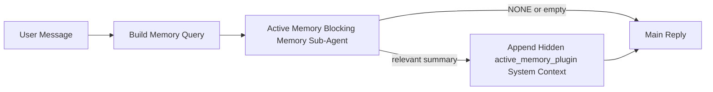

---
read_when:
    - アクティブメモリが何のためのものかを理解したい場合
    - 会話型エージェントでアクティブメモリを有効にしたい場合
    - アクティブメモリをどこでも有効にすることなく、その動作を調整したい場合
summary: 対話型チャットセッションに関連するメモリを注入する、プラグイン所有のブロッキングメモリサブエージェント
title: アクティブメモリ
x-i18n:
    generated_at: "2026-04-10T04:43:44Z"
    model: gpt-5.4
    provider: openai
    source_hash: 6a51437df4ae4d9d57764601dfcfcdadb269e2895bf49dc82b9f496c1b3cb341
    source_path: concepts/active-memory.md
    workflow: 15
---

# アクティブメモリ

アクティブメモリは、対象となる会話セッションでメインの返信の前に実行される、オプションのプラグイン所有のブロッキングメモリサブエージェントです。

これは、ほとんどのメモリシステムが高機能であっても受動的だから存在します。メモリをいつ検索するかをメインエージェントの判断に委ねたり、ユーザーが「これを覚えて」や「メモリを検索して」のように言うことに頼ったりします。その時点では、メモリが返信を自然に感じさせられたはずの瞬間は、すでに過ぎています。

アクティブメモリは、メインの返信が生成される前に、関連するメモリをシステムが提示するための限定された1回の機会を与えます。

## これをエージェントに貼り付ける

自己完結型で安全なデフォルト設定によりアクティブメモリを有効にしたい場合は、これをエージェントに貼り付けてください。

```json5
{
  plugins: {
    entries: {
      "active-memory": {
        enabled: true,
        config: {
          enabled: true,
          agents: ["main"],
          allowedChatTypes: ["direct"],
          modelFallbackPolicy: "default-remote",
          queryMode: "recent",
          promptStyle: "balanced",
          timeoutMs: 15000,
          maxSummaryChars: 220,
          persistTranscripts: false,
          logging: true,
        },
      },
    },
  },
}
```

これにより、`main`エージェントでプラグインが有効になり、デフォルトではダイレクトメッセージ形式のセッションのみに制限され、まず現在のセッションモデルを継承し、明示的または継承されたモデルが利用できない場合でも組み込みのリモートフォールバックを使用できます。

その後、Gatewayを再起動します。

```bash
node scripts/run-node.mjs gateway --profile dev
```

会話でライブ確認するには、次を使用します。

```text
/verbose on
```

## アクティブメモリを有効にする

最も安全な設定は次のとおりです。

1. プラグインを有効にする
2. 1つの会話型エージェントを対象にする
3. 調整中のみログを有効にしておく

`openclaw.json`では次から始めてください。

```json5
{
  plugins: {
    entries: {
      "active-memory": {
        enabled: true,
        config: {
          agents: ["main"],
          allowedChatTypes: ["direct"],
          modelFallbackPolicy: "default-remote",
          queryMode: "recent",
          promptStyle: "balanced",
          timeoutMs: 15000,
          maxSummaryChars: 220,
          persistTranscripts: false,
          logging: true,
        },
      },
    },
  },
}
```

その後、Gatewayを再起動します。

```bash
node scripts/run-node.mjs gateway --profile dev
```

これが意味すること:

- `plugins.entries.active-memory.enabled: true` はプラグインを有効にします
- `config.agents: ["main"]` は `main` エージェントのみをアクティブメモリの対象にします
- `config.allowedChatTypes: ["direct"]` は、デフォルトでアクティブメモリをダイレクトメッセージ形式のセッションのみに制限します
- `config.model` が未設定の場合、アクティブメモリはまず現在のセッションモデルを継承します
- `config.modelFallbackPolicy: "default-remote"` は、明示的または継承されたモデルが利用できない場合のデフォルトとして、組み込みのリモートフォールバックを維持します
- `config.promptStyle: "balanced"` は、`recent` モードのデフォルトの汎用プロンプトスタイルを使用します
- アクティブメモリは、対象となる対話型の永続チャットセッションでのみ引き続き実行されます

## 確認方法

アクティブメモリは、モデルに対して非表示のシステムコンテキストを注入します。クライアントに生の `<active_memory_plugin>...</active_memory_plugin>` タグを公開することはありません。

## セッショントグル

設定を編集せずに現在のチャットセッションでアクティブメモリを一時停止または再開したい場合は、プラグインコマンドを使用します。

```text
/active-memory status
/active-memory off
/active-memory on
```

これはセッション単位です。`plugins.entries.active-memory.enabled`、エージェント対象設定、その他のグローバル設定は変更しません。

設定を書き込み、すべてのセッションでアクティブメモリを一時停止または再開したい場合は、明示的なグローバル形式を使用します。

```text
/active-memory status --global
/active-memory off --global
/active-memory on --global
```

グローバル形式は `plugins.entries.active-memory.config.enabled` に書き込みます。`plugins.entries.active-memory.enabled` は有効のままにするため、後でコマンドを使ってアクティブメモリを再度有効にできます。

ライブセッションでアクティブメモリが何をしているか確認したい場合は、そのセッションで詳細モードを有効にします。

```text
/verbose on
```

詳細を有効にすると、OpenClawは次を表示できます。

- `Active Memory: ok 842ms recent 34 chars` のようなアクティブメモリのステータス行
- `Active Memory Debug: Lemon pepper wings with blue cheese.` のような読みやすいデバッグ要約

これらの行は、非表示のシステムコンテキストに渡される同じアクティブメモリパスから導出されますが、生のプロンプトマークアップを公開する代わりに人間向けに整形されています。

デフォルトでは、ブロッキングメモリサブエージェントのトランスクリプトは一時的であり、実行完了後に削除されます。

フローの例:

```text
/verbose on
what wings should i order?
```

表示される返信の想定形:

```text
...normal assistant reply...

🧩 Active Memory: ok 842ms recent 34 chars
🔎 Active Memory Debug: Lemon pepper wings with blue cheese.
```

## 実行されるタイミング

アクティブメモリは2つのゲートを使用します。

1. **設定によるオプトイン**  
   プラグインが有効であり、現在のエージェントIDが `plugins.entries.active-memory.config.agents` に含まれている必要があります。
2. **厳格な実行時適格性**  
   有効化され対象指定されていても、アクティブメモリは対象となる対話型の永続チャットセッションでのみ実行されます。

実際のルールは次のとおりです。

```text
plugin enabled
+
agent id targeted
+
allowed chat type
+
eligible interactive persistent chat session
=
active memory runs
```

これらのいずれかが満たされない場合、アクティブメモリは実行されません。

## セッションタイプ

`config.allowedChatTypes` は、どの種類の会話でアクティブメモリを実行できるかを制御します。

デフォルトは次のとおりです。

```json5
allowedChatTypes: ["direct"]
```

これは、アクティブメモリがデフォルトではダイレクトメッセージ形式のセッションで実行され、グループやチャンネルのセッションでは明示的にオプトインしない限り実行されないことを意味します。

例:

```json5
allowedChatTypes: ["direct"]
```

```json5
allowedChatTypes: ["direct", "group"]
```

```json5
allowedChatTypes: ["direct", "group", "channel"]
```

## 実行される場所

アクティブメモリは会話を豊かにする機能であり、プラットフォーム全体の推論機能ではありません。

| Surface                                                             | アクティブメモリは実行されるか                             |
| ------------------------------------------------------------------- | ---------------------------------------------------------- |
| Control UI / web chat persistent sessions                           | はい。プラグインが有効で、エージェントが対象なら実行されます |
| Other interactive channel sessions on the same persistent chat path | はい。プラグインが有効で、エージェントが対象なら実行されます |
| Headless one-shot runs                                              | いいえ                                                     |
| Heartbeat/background runs                                           | いいえ                                                     |
| Generic internal `agent-command` paths                              | いいえ                                                     |
| Sub-agent/internal helper execution                                 | いいえ                                                     |

## 使用する理由

アクティブメモリは次のような場合に使用してください。

- セッションが永続的でユーザー向けである
- エージェントが検索すべき意味のある長期メモリを持っている
- 生のプロンプトの決定性よりも、一貫性とパーソナライズが重要である

特に次の用途に適しています。

- 安定した好み
- 繰り返される習慣
- 自然に表面化すべき長期的なユーザーコンテキスト

次の用途には適しません。

- 自動化
- 内部ワーカー
- 単発のAPIタスク
- 非表示のパーソナライズが意外に感じられる場所

## 仕組み

実行時の形は次のとおりです。



ブロッキングメモリサブエージェントが使用できるのは次のみです。

- `memory_search`
- `memory_get`

接続が弱い場合は、`NONE` を返す必要があります。

## クエリモード

`config.queryMode` は、ブロッキングメモリサブエージェントがどれだけ会話を参照するかを制御します。

## プロンプトスタイル

`config.promptStyle` は、メモリを返すかどうかを判断するときに、ブロッキングメモリサブエージェントがどれだけ積極的または厳格であるかを制御します。

利用可能なスタイル:

- `balanced`: `recent` モード向けの汎用デフォルト
- `strict`: 最も慎重。近くのコンテキストからのにじみを極力少なくしたい場合に最適
- `contextual`: 最も継続性を重視。会話履歴の重要度を高くしたい場合に最適
- `recall-heavy`: 弱めだが妥当な一致でもメモリを表面化しやすい
- `precision-heavy`: 一致が明白でない限り、積極的に `NONE` を優先する
- `preference-only`: お気に入り、習慣、ルーティン、好み、繰り返される個人的事実に最適化されている

`config.promptStyle` が未設定の場合のデフォルト対応:

```text
message -> strict
recent -> balanced
full -> contextual
```

`config.promptStyle` を明示的に設定した場合は、そのオーバーライドが優先されます。

例:

```json5
promptStyle: "preference-only"
```

## モデルフォールバックポリシー

`config.model` が未設定の場合、アクティブメモリは次の順序でモデルを解決しようとします。

```text
explicit plugin model
-> current session model
-> agent primary model
-> optional built-in remote fallback
```

`config.modelFallbackPolicy` は最後のステップを制御します。

デフォルト:

```json5
modelFallbackPolicy: "default-remote"
```

その他のオプション:

```json5
modelFallbackPolicy: "resolved-only"
```

明示的または継承されたモデルが利用できない場合に、組み込みのリモートデフォルトへフォールバックする代わりにアクティブメモリでリコールをスキップしたい場合は、`resolved-only` を使用してください。

## 高度なエスケープハッチ

これらのオプションは、意図的に推奨設定には含めていません。

`config.thinking` は、ブロッキングメモリサブエージェントの thinking レベルを上書きできます。

```json5
thinking: "medium"
```

デフォルト:

```json5
thinking: "off"
```

これはデフォルトでは有効にしないでください。アクティブメモリは返信経路で実行されるため、thinking 時間が増えるとそのままユーザーに見えるレイテンシが増加します。

`config.promptAppend` は、デフォルトのアクティブメモリプロンプトの後、会話コンテキストの前に追加のオペレーター指示を加えます。

```json5
promptAppend: "Prefer stable long-term preferences over one-off events."
```

`config.promptOverride` は、デフォルトのアクティブメモリプロンプトを置き換えます。OpenClawはその後も会話コンテキストを追加します。

```json5
promptOverride: "You are a memory search agent. Return NONE or one compact user fact."
```

プロンプトのカスタマイズは、別のリコール契約を意図的にテストしている場合を除き、推奨されません。デフォルトのプロンプトは、メインモデル向けに `NONE` かコンパクトなユーザー事実コンテキストを返すよう調整されています。

### `message`

最新のユーザーメッセージのみが送信されます。

```text
Latest user message only
```

次のような場合に使用してください。

- 最も高速な動作がほしい
- 安定した好みのリコールを最も強く優先したい
- フォローアップのターンで会話コンテキストが不要

推奨タイムアウト:

- `3000`〜`5000` msあたりから始める

### `recent`

最新のユーザーメッセージに加え、直近の小さな会話テールが送信されます。

```text
Recent conversation tail:
user: ...
assistant: ...
user: ...

Latest user message:
...
```

次のような場合に使用してください。

- 速度と会話の文脈把握のより良いバランスがほしい
- フォローアップの質問が直近の数ターンに依存することが多い

推奨タイムアウト:

- `15000` msあたりから始める

### `full`

会話全体がブロッキングメモリサブエージェントに送信されます。

```text
Full conversation context:
user: ...
assistant: ...
user: ...
...
```

次のような場合に使用してください。

- レイテンシよりも最高のリコール品質が重要
- 会話に、スレッドのかなり前方にある重要な前提が含まれている

推奨タイムアウト:

- `message` や `recent` より十分に大きくする
- スレッドサイズに応じて `15000` ms以上から始める

一般に、タイムアウトはコンテキストサイズに応じて増やす必要があります。

```text
message < recent < full
```

## トランスクリプトの永続化

アクティブメモリのブロッキングメモリサブエージェント実行では、ブロッキングメモリサブエージェント呼び出し中に実際の `session.jsonl` トランスクリプトが作成されます。

デフォルトでは、そのトランスクリプトは一時的です:

- 一時ディレクトリに書き込まれます
- ブロッキングメモリサブエージェント実行のためだけに使用されます
- 実行終了直後に削除されます

デバッグや確認のためにそれらのブロッキングメモリサブエージェントのトランスクリプトをディスク上に保持したい場合は、永続化を明示的に有効にします。

```json5
{
  plugins: {
    entries: {
      "active-memory": {
        enabled: true,
        config: {
          agents: ["main"],
          persistTranscripts: true,
          transcriptDir: "active-memory",
        },
      },
    },
  },
}
```

有効にすると、アクティブメモリはトランスクリプトを、メインのユーザー会話トランスクリプトパスではなく、対象エージェントのセッションフォルダー配下の別ディレクトリに保存します。

デフォルトのレイアウトは概念的には次のとおりです。

```text
agents/<agent>/sessions/active-memory/<blocking-memory-sub-agent-session-id>.jsonl
```

相対サブディレクトリは `config.transcriptDir` で変更できます。

これは慎重に使用してください。

- ブロッキングメモリサブエージェントのトランスクリプトは、セッションが多忙だとすぐに蓄積する可能性があります
- `full` クエリモードでは大量の会話コンテキストが重複する可能性があります
- これらのトランスクリプトには、非表示のプロンプトコンテキストと想起されたメモリが含まれます

## 設定

アクティブメモリの設定はすべて次の配下にあります。

```text
plugins.entries.active-memory
```

最も重要なフィールドは次のとおりです。

| Key                         | Type                                                                                                 | 意味                                                                                                   |
| --------------------------- | ---------------------------------------------------------------------------------------------------- | ------------------------------------------------------------------------------------------------------ |
| `enabled`                   | `boolean`                                                                                            | プラグイン自体を有効にします                                                                           |
| `config.agents`             | `string[]`                                                                                           | アクティブメモリを使用できるエージェントID                                                             |
| `config.model`              | `string`                                                                                             | オプションのブロッキングメモリサブエージェントモデル参照。未設定時、アクティブメモリは現在のセッションモデルを使用します |
| `config.queryMode`          | `"message" \| "recent" \| "full"`                                                                    | ブロッキングメモリサブエージェントがどれだけ会話を参照するかを制御します                               |
| `config.promptStyle`        | `"balanced" \| "strict" \| "contextual" \| "recall-heavy" \| "precision-heavy" \| "preference-only"` | メモリを返すかどうかを判断するときの、ブロッキングメモリサブエージェントの積極性または厳格さを制御します |
| `config.thinking`           | `"off" \| "minimal" \| "low" \| "medium" \| "high" \| "xhigh" \| "adaptive"`                         | ブロッキングメモリサブエージェント向けの高度な thinking 上書き。速度重視のためデフォルトは `off`       |
| `config.promptOverride`     | `string`                                                                                             | 高度な完全プロンプト置換。通常の使用には非推奨                                                         |
| `config.promptAppend`       | `string`                                                                                             | デフォルトまたは上書きされたプロンプトに追加される高度な追加指示                                       |
| `config.timeoutMs`          | `number`                                                                                             | ブロッキングメモリサブエージェントのハードタイムアウト                                                 |
| `config.maxSummaryChars`    | `number`                                                                                             | active-memory 要約で許可される総文字数の最大値                                                         |
| `config.logging`            | `boolean`                                                                                            | 調整中にアクティブメモリのログを出力します                                                             |
| `config.persistTranscripts` | `boolean`                                                                                            | 一時ファイルを削除せず、ブロッキングメモリサブエージェントのトランスクリプトをディスク上に保持します   |
| `config.transcriptDir`      | `string`                                                                                             | エージェントのセッションフォルダー配下の、ブロッキングメモリサブエージェント用相対トランスクリプトディレクトリ |

便利な調整用フィールド:

| Key                           | Type     | 意味                                                              |
| ----------------------------- | -------- | ----------------------------------------------------------------- |
| `config.maxSummaryChars`      | `number` | active-memory 要約で許可される総文字数の最大値                    |
| `config.recentUserTurns`      | `number` | `queryMode` が `recent` のときに含める過去のユーザーターン数      |
| `config.recentAssistantTurns` | `number` | `queryMode` が `recent` のときに含める過去のアシスタントターン数  |
| `config.recentUserChars`      | `number` | 各最近のユーザーターンあたりの最大文字数                          |
| `config.recentAssistantChars` | `number` | 各最近のアシスタントターンあたりの最大文字数                      |
| `config.cacheTtlMs`           | `number` | 同一クエリの繰り返しに対するキャッシュ再利用                      |

## 推奨設定

`recent` から始めてください。

```json5
{
  plugins: {
    entries: {
      "active-memory": {
        enabled: true,
        config: {
          agents: ["main"],
          queryMode: "recent",
          promptStyle: "balanced",
          timeoutMs: 15000,
          maxSummaryChars: 220,
          logging: true,
        },
      },
    },
  },
}
```

調整中にライブの挙動を確認したい場合は、別の active-memory デバッグコマンドを探すのではなく、セッション内で `/verbose on` を使用してください。

その後、次に移行します。

- より低いレイテンシがほしい場合は `message`
- 追加のコンテキストが、より遅いブロッキングメモリサブエージェントに見合うと判断した場合は `full`

## デバッグ

アクティブメモリが想定した場所で表示されない場合:

1. `plugins.entries.active-memory.enabled` でプラグインが有効になっていることを確認します。
2. 現在のエージェントIDが `config.agents` に含まれていることを確認します。
3. 対話型の永続チャットセッション経由でテストしていることを確認します。
4. `config.logging: true` を有効にして、Gatewayログを確認します。
5. `openclaw memory status --deep` でメモリ検索自体が動作していることを確認します。

メモリヒットのノイズが多い場合は、次を厳しくします。

- `maxSummaryChars`

アクティブメモリが遅すぎる場合:

- `queryMode` を下げる
- `timeoutMs` を下げる
- 最近のターン数を減らす
- ターンごとの文字数上限を減らす

## 関連ページ

- [メモリ検索](/ja-JP/concepts/memory-search)
- [メモリ設定リファレンス](/ja-JP/reference/memory-config)
- [Plugin SDK セットアップ](/ja-JP/plugins/sdk-setup)
