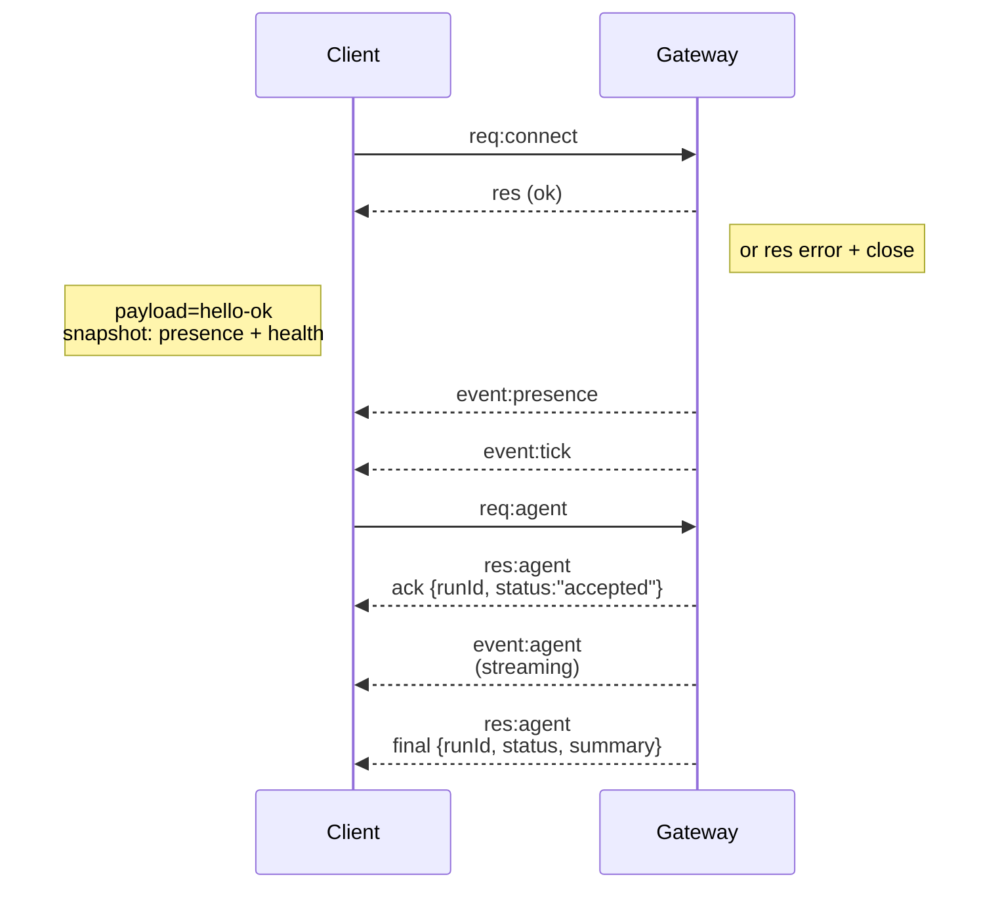

---
read_when:
    - Gateway プロトコル、クライアント、またはトランスポートで作業する
summary: WebSocket Gateway のアーキテクチャ、コンポーネント、クライアントフロー
title: Gateway アーキテクチャ
x-i18n:
    generated_at: "2026-07-05T11:16:15Z"
    model: gpt-5.5
    postprocess_version: locale-links-v1
    provider: openai
    source_hash: f8054bd87f738b957c24f8d6965d55365de2293d44902530a9ba778afa597cc7
    source_path: concepts/architecture.md
    workflow: 16
---

## 概要

- 単一の長寿命な **Gateway** が、すべてのメッセージングサーフェス（Baileys 経由の WhatsApp、grammY 経由の Telegram、Slack、Discord、Signal、iMessage、WebChat）を所有します。
- コントロールプレーンのクライアント（macOS アプリ、CLI、Web UI、自動化）は、設定されたバインドホスト（デフォルトは `127.0.0.1:18789`）上の **WebSocket** を介して Gateway に接続します。
- **Node**（macOS/iOS/Android/ヘッドレス）も **WebSocket** を介して接続しますが、明示的な caps/commands とともに `role: node` を宣言します。
- ホストごとに 1 つの Gateway です。WhatsApp セッションを開く唯一の場所です。
- **キャンバスホスト** は、Gateway HTTP サーバーによって次の配下で提供されます。
  - `/__openclaw__/canvas/`（エージェントが編集可能な HTML/CSS/JS）
  - `/__openclaw__/a2ui/`（A2UI ホスト）

  Gateway と同じポート（デフォルトは `18789`）を使用します。

## コンポーネントとフロー

### Gateway（デーモン）

- プロバイダー接続を維持します。
- 型付き WS API（リクエスト、レスポンス、サーバープッシュイベント）を公開します。
- 受信フレームを JSON Schema に対して検証します。
- `agent`、`chat`、`presence`、`health`、`heartbeat`、`cron` などのイベントを発行します。

### クライアント（mac アプリ / CLI / Web 管理）

- クライアントごとに 1 つの WS 接続です。
- リクエスト（`health`、`status`、`send`、`agent`、`system-presence`）を送信します。
- イベント（`tick`、`agent`、`presence`、`shutdown`）を購読します。

### Node（macOS / iOS / Android / ヘッドレス）

- `role: node` で **同じ WS サーバー** に接続します。
- `connect` でデバイス ID を提供します。ペアリングは **デバイスベース**（ロール `node`）で、承認はデバイスペアリングストア内にあります。
- `canvas.*`、`camera.*`、`screen.record`、`location.get` などのコマンドを公開します。

プロトコルの詳細: [Gateway プロトコル](/ja-JP/gateway/protocol)

### WebChat

- チャット履歴と送信に Gateway WS API を使用する静的 UI です。
- リモート構成では、他のクライアントと同じ SSH/Tailscale トンネルを通じて接続します。

## 接続ライフサイクル（単一クライアント）



## ワイヤープロトコル（概要）

- トランスポート: WebSocket、JSON ペイロードを含むテキストフレーム。
- 最初のフレームは **必ず** `connect` でなければなりません。
- ハンドシェイク後:
  - リクエスト: `{type:"req", id, method, params}` → `{type:"res", id, ok, payload|error}`
  - イベント: `{type:"event", event, payload, seq?, stateVersion?}`
- `hello-ok.features.methods` / `events` は検出用メタデータであり、呼び出し可能なすべてのヘルパールートを生成してダンプしたものではありません。
- 共有シークレット認証は、設定された Gateway 認証モードに応じて、`connect.params.auth.token` または `connect.params.auth.password` を使用します。
- Tailscale Serve（`gateway.auth.allowTailscale: true`）や非ループバックの `gateway.auth.mode: "trusted-proxy"` など、ID を持つモードでは、`connect.params.auth.*` の代わりにリクエストヘッダーから認証を満たします。
- プライベート入口の `gateway.auth.mode: "none"` は共有シークレット認証を完全に無効にします。そのモードは公開または信頼できない入口では無効のままにしてください。
- 副作用のあるメソッド（`send`、`agent`）を安全に再試行するには冪等性キーが必要です。サーバーは短命の重複排除キャッシュを保持します。
- Node は `connect` に `role: "node"` と caps/commands/permissions を含める必要があります。

## ペアリングとローカル信頼

- すべての WS クライアント（オペレーター + Node）は、`connect` に **デバイス ID** を含めます。
- 新しいデバイス ID にはペアリング承認が必要です。Gateway は以降の接続用に **デバイストークン** を発行します。
- 直接の local loopback 接続は、同一ホストでの UX を滑らかに保つために自動承認できます。
- OpenClaw には、信頼された共有シークレットヘルパーフロー用に、限定されたバックエンド/コンテナローカルの自己接続パスもあります。
- 同一ホストの tailnet バインドを含む Tailnet および LAN 接続では、引き続き明示的なペアリング承認が必要です。
- すべての接続は `connect.challenge` nonce に署名する必要があります。署名ペイロード `v3` は `platform` と `deviceFamily` もバインドします。Gateway は再接続時にペアリング済みメタデータを固定し、メタデータ変更には修復ペアリングを要求します。
- **非ローカル** 接続には引き続き明示的な承認が必要です。
- Gateway 認証（`gateway.auth.*`）は、ローカルかリモートかにかかわらず **すべての** 接続に引き続き適用されます。

詳細: [Gateway プロトコル](/ja-JP/gateway/protocol)、[ペアリング](/ja-JP/channels/pairing)、[セキュリティ](/ja-JP/gateway/security)。

## プロトコルの型付けとコード生成

- TypeBox スキーマがプロトコルを定義します。
- JSON Schema はそれらのスキーマから生成されます。
- Swift モデルは JSON Schema から生成されます。

## リモートアクセス

- 推奨: Tailscale または VPN。
- 代替: SSH トンネル

  ```bash
  ssh -N -L 18789:127.0.0.1:18789 user@gateway-host
  ```

- 同じハンドシェイクと認証トークンがトンネル越しにも適用されます。
- リモート構成では、WS 用に TLS と任意のピンニングを有効にできます。

## 運用スナップショット

- 起動: `openclaw gateway`（フォアグラウンド、ログは stdout）。
- ヘルス: WS 経由の `health`（`hello-ok` にも含まれます）。
- 監視: 自動再起動には launchd/systemd。

## 不変条件

- ちょうど 1 つの Gateway が、ホストごとに単一の Baileys セッションを制御します。
- ハンドシェイクは必須です。JSON ではない最初のフレーム、または `connect` ではない最初のフレームはハードクローズされます。
- イベントは再生されません。クライアントは欠落時に更新する必要があります。

## 関連

- [エージェントループ](/ja-JP/concepts/agent-loop) — 詳細なエージェント実行サイクル
- [Gateway プロトコル](/ja-JP/gateway/protocol) — WebSocket プロトコル契約
- [キュー](/ja-JP/concepts/queue) — コマンドキューと並行処理
- [セキュリティ](/ja-JP/gateway/security) — 信頼モデルと堅牢化
