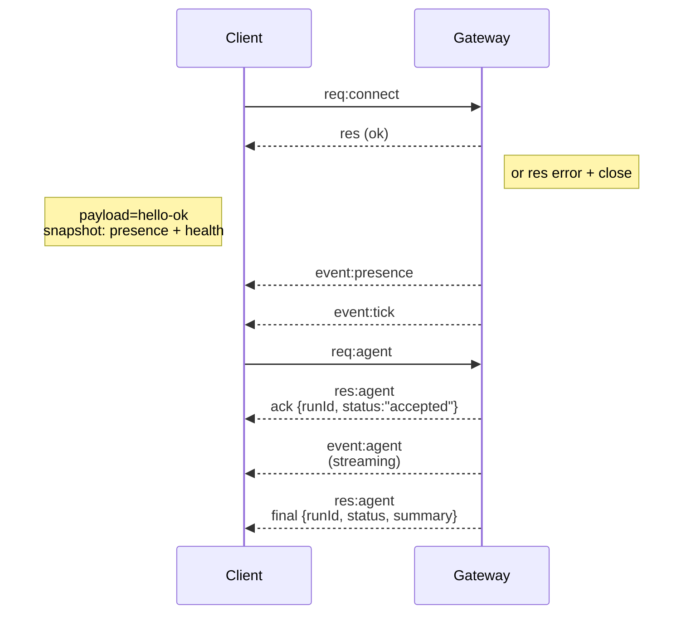

---
read_when:
    - Gatewayプロトコル、クライアント、またはトランスポートの作業をしている
summary: WebSocket Gatewayのアーキテクチャ、コンポーネント、クライアントフロー
title: Gatewayアーキテクチャ
x-i18n:
    generated_at: "2026-04-24T04:52:38Z"
    model: gpt-5.4
    provider: openai
    source_hash: 91c553489da18b6ad83fc860014f5bfb758334e9789cb7893d4d00f81c650f02
    source_path: concepts/architecture.md
    workflow: 15
---

## 概要

- 単一の長寿命 **Gateway** が、すべてのメッセージングサーフェス（Baileys経由のWhatsApp、grammY経由のTelegram、Slack、Discord、Signal、iMessage、WebChat）を所有します。
- コントロールプレーンのクライアント（macOSアプリ、CLI、Web UI、自動化）は、設定されたbind host上の **WebSocket** 経由でGatewayに接続します（デフォルトは `127.0.0.1:18789`）。
- **Nodes**（macOS/iOS/Android/headless）も **WebSocket** 経由で接続しますが、明示的なcaps/commandsを持つ `role: node` を宣言します。
- ホストごとに1つのGatewayのみであり、WhatsAppセッションを開くのはそこだけです。
- **canvas host** は、Gateway HTTPサーバー配下の次の場所で提供されます:
  - `/__openclaw__/canvas/`（エージェントが編集可能なHTML/CSS/JS）
  - `/__openclaw__/a2ui/`（A2UI host）
    これはGatewayと同じポートを使用します（デフォルト `18789`）。

## コンポーネントとフロー

### Gateway（デーモン）

- プロバイダ接続を維持します。
- 型付きWS API（リクエスト、レスポンス、サーバープッシュイベント）を公開します。
- 受信フレームをJSON Schemaに対して検証します。
- `agent`、`chat`、`presence`、`health`、`heartbeat`、`cron` のようなイベントを送出します。

### クライアント（macアプリ / CLI / Web管理UI）

- クライアントごとに1つのWS接続。
- リクエスト（`health`、`status`、`send`、`agent`、`system-presence`）を送信します。
- イベント（`tick`、`agent`、`presence`、`shutdown`）を購読します。

### Nodes（macOS / iOS / Android / headless）

- **同じWSサーバー** に `role: node` で接続します。
- `connect` でデバイスidentityを提供します。ペアリングは**デバイスベース**（role `node`）であり、承認はデバイスペアリングストアに保存されます。
- `canvas.*`、`camera.*`、`screen.record`、`location.get` のようなコマンドを公開します。

プロトコルの詳細:

- [Gatewayプロトコル](/ja-JP/gateway/protocol)

### WebChat

- チャット履歴と送信のためにGateway WS APIを使う静的UIです。
- リモート構成では、他のクライアントと同じSSH/Tailscaleトンネルを通じて接続します。

## 接続ライフサイクル（単一クライアント）



## ワイヤプロトコル（要約）

- トランスポート: WebSocket、JSONペイロードを持つテキストフレーム。
- 最初のフレームは**必ず** `connect` でなければなりません。
- ハンドシェイク後:
  - リクエスト: `{type:"req", id, method, params}` → `{type:"res", id, ok, payload|error}`
  - イベント: `{type:"event", event, payload, seq?, stateVersion?}`
- `hello-ok.features.methods` / `events` は検出用メタデータであり、呼び出し可能なすべてのヘルパールートの自動生成ダンプではありません。
- 共有シークレット認証では、設定されたgateway auth modeに応じて `connect.params.auth.token` または `connect.params.auth.password` を使います。
- Tailscale Serve（`gateway.auth.allowTailscale: true`）や非loopbackの `gateway.auth.mode: "trusted-proxy"` のようなidentityを伴うモードでは、`connect.params.auth.*` ではなくリクエストヘッダーから認証を満たします。
- プライベート受信の `gateway.auth.mode: "none"` は共有シークレット認証を完全に無効にします。このモードは公開/信頼されていない受信では無効のままにしてください。
- 副作用を持つメソッド（`send`、`agent`）では、安全に再試行するために冪等キーが必要です。サーバーは短期間の重複排除キャッシュを保持します。
- Nodesは `connect` に `role: "node"` と、caps/commands/permissions を含める必要があります。

## ペアリング + ローカル信頼

- すべてのWSクライアント（operator + node）は、`connect` に**デバイスidentity**を含めます。
- 新しいデバイスIDにはペアリング承認が必要です。Gatewayは後続接続用の**デバイストークン**を発行します。
- 直接のlocal loopback接続は、同一ホストUXをスムーズに保つために自動承認できます。
- OpenClawには、信頼された共有シークレットのヘルパーフロー向けに、狭く制限されたbackend/container-local self-connect経路もあります。
- 同一ホストのtailnet bindを含むtailnetおよびLAN接続には、引き続き明示的なペアリング承認が必要です。
- すべての接続は `connect.challenge` nonce に署名しなければなりません。
- 署名ペイロード `v3` は `platform` + `deviceFamily` も束縛します。gatewayは再接続時にペアリング済みメタデータを固定し、メタデータ変更時には修復ペアリングを要求します。
- **ローカル以外の**接続には、引き続き明示的な承認が必要です。
- Gateway認証（`gateway.auth.*`）は、ローカルでもリモートでも**すべての**接続に引き続き適用されます。

詳細: [Gatewayプロトコル](/ja-JP/gateway/protocol)、[ペアリング](/ja-JP/channels/pairing)、
[セキュリティ](/ja-JP/gateway/security)。

## プロトコルの型付けとコード生成

- TypeBox schemaがプロトコルを定義します。
- JSON Schemaはそれらのschemaから生成されます。
- SwiftモデルはJSON Schemaから生成されます。

## リモートアクセス

- 推奨: Tailscale またはVPN。
- 代替: SSHトンネル

  ```bash
  ssh -N -L 18789:127.0.0.1:18789 user@host
  ```

- トンネル越しでも同じハンドシェイク + auth tokenが適用されます。
- リモート構成では、WS用のTLS + 任意のpinningを有効にできます。

## 運用スナップショット

- 起動: `openclaw gateway`（フォアグラウンド、ログはstdoutへ）。
- Health: WS経由の `health`（`hello-ok` にも含まれます）。
- 監視: 自動再起動には launchd/systemd。

## 不変条件

- 各ホストで、単一のBaileysセッションを制御するGatewayは必ず1つです。
- ハンドシェイクは必須です。JSON以外、または最初のフレームがconnectでない場合は即時クローズされます。
- イベントは再送されません。欠落があればクライアントは再取得しなければなりません。

## 関連

- [Agent Loop](/ja-JP/concepts/agent-loop) — 詳細なエージェント実行サイクル
- [Gatewayプロトコル](/ja-JP/gateway/protocol) — WebSocketプロトコル契約
- [Queue](/ja-JP/concepts/queue) — コマンドキューと並行性
- [セキュリティ](/ja-JP/gateway/security) — 信頼モデルとハードニング
