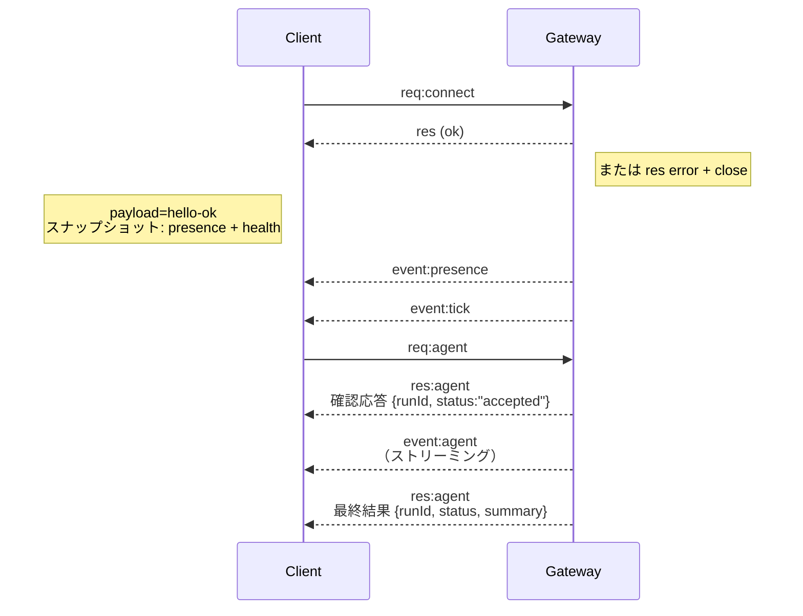

---
read_when:
    - Gateway プロトコル、クライアント、またはトランスポートに取り組む
summary: WebSocket Gateway のアーキテクチャ、コンポーネント、クライアントフロー
title: Gateway アーキテクチャ
x-i18n:
    generated_at: "2026-07-11T22:05:26Z"
    model: gpt-5.6
    postprocess_version: locale-links-v1
    provider: openai
    source_hash: f8054bd87f738b957c24f8d6965d55365de2293d44902530a9ba778afa597cc7
    source_path: concepts/architecture.md
    workflow: 16
---

## 概要

- 単一の長時間稼働する **Gateway** が、すべてのメッセージング接続先（Baileys 経由の WhatsApp、grammY 経由の Telegram、Slack、Discord、Signal、iMessage、WebChat）を管理します。
- コントロールプレーンのクライアント（macOS アプリ、CLI、Web UI、自動化）は、設定されたバインドホスト（デフォルトは `127.0.0.1:18789`）上の **WebSocket** を介して Gateway に接続します。
- **Node**（macOS/iOS/Android/ヘッドレス）も **WebSocket** を介して接続しますが、明示的な機能／コマンドとともに `role: node` を宣言します。
- ホストごとに Gateway は 1 つです。WhatsApp セッションを開くのは Gateway だけです。
- **キャンバスホスト**は、Gateway の HTTP サーバーによって以下のパスで提供されます。
  - `/__openclaw__/canvas/`（エージェントが編集可能な HTML/CSS/JS）
  - `/__openclaw__/a2ui/`（A2UI ホスト）

  Gateway と同じポート（デフォルトは `18789`）を使用します。

## コンポーネントとフロー

### Gateway（デーモン）

- プロバイダー接続を維持します。
- 型付き WS API（リクエスト、レスポンス、サーバープッシュイベント）を公開します。
- 受信フレームを JSON Schema に照らして検証します。
- `agent`、`chat`、`presence`、`health`、`heartbeat`、`cron` などのイベントを発行します。

### クライアント（Mac アプリ／CLI／Web 管理画面）

- クライアントごとに 1 つの WS 接続を使用します。
- リクエスト（`health`、`status`、`send`、`agent`、`system-presence`）を送信します。
- イベント（`tick`、`agent`、`presence`、`shutdown`）を購読します。

### Node（macOS／iOS／Android／ヘッドレス）

- `role: node` を使用して **同じ WS サーバー**に接続します。
- `connect` でデバイス ID を提供します。ペアリングは**デバイスベース**（ロールは `node`）で、承認情報はデバイスペアリングストアに保持されます。
- `canvas.*`、`camera.*`、`screen.record`、`location.get` などのコマンドを公開します。

プロトコルの詳細：[Gateway プロトコル](/ja-JP/gateway/protocol)

### WebChat

- チャット履歴の取得と送信に Gateway WS API を使用する静的 UI です。
- リモート構成では、ほかのクライアントと同じ SSH/Tailscale トンネルを介して接続します。

## 接続ライフサイクル（単一クライアント）



## ワイヤープロトコル（概要）

- トランスポート：JSON ペイロードを含むテキストフレームを使用する WebSocket。
- 最初のフレームは**必ず** `connect` でなければなりません。
- ハンドシェイク後：
  - リクエスト：`{type:"req", id, method, params}` → `{type:"res", id, ok, payload|error}`
  - イベント：`{type:"event", event, payload, seq?, stateVersion?}`
- `hello-ok.features.methods` / `events` は検出用メタデータであり、呼び出し可能なすべてのヘルパールートを生成した一覧ではありません。
- 共有シークレット認証では、設定された Gateway 認証モードに応じて `connect.params.auth.token` または `connect.params.auth.password` を使用します。
- Tailscale Serve（`gateway.auth.allowTailscale: true`）や、local loopback 以外での `gateway.auth.mode: "trusted-proxy"` など、ID 情報を伴うモードでは、`connect.params.auth.*` の代わりにリクエストヘッダーから認証を満たします。
- プライベートな受信経路での `gateway.auth.mode: "none"` は、共有シークレット認証を完全に無効化します。公開または信頼できない受信経路では、このモードを使用しないでください。
- 安全に再試行できるよう、副作用のあるメソッド（`send`、`agent`）には冪等性キーが必要です。サーバーは短時間有効な重複排除キャッシュを保持します。
- Node は、`connect` に `role: "node"` と機能／コマンド／権限を含める必要があります。

## ペアリングとローカルの信頼

- すべての WS クライアント（オペレーターと Node）は、`connect` に**デバイス ID**を含めます。
- 新しいデバイス ID にはペアリング承認が必要です。Gateway は以降の接続用に**デバイストークン**を発行します。
- 同一ホストでの操作性を損なわないよう、直接の local loopback 接続は自動承認できます。
- OpenClaw には、信頼された共有シークレットのヘルパーフロー向けに、バックエンド／コンテナローカルからの限定的な自己接続経路もあります。
- 同一ホストの Tailnet バインドを含む Tailnet および LAN 接続には、引き続き明示的なペアリング承認が必要です。
- すべての接続は `connect.challenge` の nonce に署名する必要があります。署名ペイロード `v3` は `platform` と `deviceFamily` にも紐付けられます。Gateway は再接続時にペアリング済みメタデータを固定し、メタデータを変更する場合は修復ペアリングを要求します。
- **ローカル以外**からの接続には、引き続き明示的な承認が必要です。
- Gateway 認証（`gateway.auth.*`）は、ローカルかリモートかにかかわらず、**すべて**の接続に適用されます。

詳細：[Gateway プロトコル](/ja-JP/gateway/protocol)、[ペアリング](/ja-JP/channels/pairing)、
[セキュリティ](/ja-JP/gateway/security)。

## プロトコルの型定義とコード生成

- TypeBox スキーマでプロトコルを定義します。
- これらのスキーマから JSON Schema を生成します。
- JSON Schema から Swift モデルを生成します。

## リモートアクセス

- 推奨：Tailscale または VPN。
- 代替手段：SSH トンネル

  ```bash
  ssh -N -L 18789:127.0.0.1:18789 user@gateway-host
  ```

- トンネル経由でも、同じハンドシェイクと認証トークンが適用されます。
- リモート構成では、WS に対して TLS と任意のピン留めを有効にできます。

## 運用の概要

- 起動：`openclaw gateway`（フォアグラウンドで実行し、標準出力にログを出力）。
- ヘルスチェック：WS 経由の `health`（`hello-ok` にも含まれます）。
- 監視：自動再起動には launchd/systemd を使用します。

## 不変条件

- ホストごとに、単一の Baileys セッションを制御する Gateway は厳密に 1 つです。
- ハンドシェイクは必須です。JSON 以外のフレーム、または最初のフレームが `connect` でない場合は、即座に接続を終了します。
- イベントは再送されません。欠落がある場合、クライアントは情報を更新する必要があります。

## 関連項目

- [エージェントループ](/ja-JP/concepts/agent-loop) — エージェント実行サイクルの詳細
- [Gateway プロトコル](/ja-JP/gateway/protocol) — WebSocket プロトコルの契約
- [キュー](/ja-JP/concepts/queue) — コマンドキューと並行処理
- [セキュリティ](/ja-JP/gateway/security) — 信頼モデルと堅牢化
