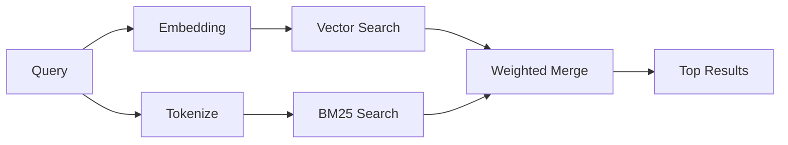

---
read_when:
    - '`memory_search` の仕組みを理解したい場合'
    - 埋め込みプロバイダを選びたい場合
    - 検索品質を調整したい場合
summary: 埋め込みとハイブリッド検索を使って memory search が関連するノートを見つける仕組み
title: Memory search
x-i18n:
    generated_at: "2026-04-24T04:53:54Z"
    model: gpt-5.4
    provider: openai
    source_hash: 04db62e519a691316ce40825c082918094bcaa9c36042cc8101c6504453d238e
    source_path: concepts/memory-search.md
    workflow: 15
---

`memory_search` は、元の文言と表現が異なっていても、メモリファイルから関連するノートを見つけます。これは、メモリを小さなチャンクにインデックス化し、埋め込み、キーワード、またはその両方を使って検索することで動作します。

## クイックスタート

GitHub Copilot サブスクリプション、OpenAI、Gemini、Voyage、または Mistral
の API キーが設定されていれば、memory search は自動的に動作します。プロバイダを明示的に設定するには:

```json5
{
  agents: {
    defaults: {
      memorySearch: {
        provider: "openai", // または "gemini", "local", "ollama" など
      },
    },
  },
}
```

API キーなしでローカル埋め込みを使う場合は `provider: "local"` を使ってください（`node-llama-cpp` が必要）。

## サポートされるプロバイダ

| プロバイダ       | ID               | API キーが必要 | 注記                                                     |
| ---------------- | ---------------- | -------------- | -------------------------------------------------------- |
| Bedrock          | `bedrock`        | No             | AWS 認証情報チェーンが解決されると自動検出されます       |
| Gemini           | `gemini`         | Yes            | 画像/音声インデックスをサポートします                    |
| GitHub Copilot   | `github-copilot` | No             | 自動検出され、Copilot サブスクリプションを使います       |
| Local            | `local`          | No             | GGUF モデル、約 0.6 GB のダウンロード                     |
| Mistral          | `mistral`        | Yes            | 自動検出されます                                         |
| Ollama           | `ollama`         | No             | ローカル。明示的に設定する必要があります                 |
| OpenAI           | `openai`         | Yes            | 自動検出され、高速です                                   |
| Voyage           | `voyage`         | Yes            | 自動検出されます                                         |

## 検索の仕組み

OpenClaw は 2 つの検索経路を並列で実行し、その結果をマージします:



- **ベクトル検索** は、意味が似ているノートを見つけます（「gateway host」が
  「OpenClaw を実行しているマシン」に一致するなど）。
- **BM25 キーワード検索** は、厳密一致を見つけます（ID、エラー文字列、設定キーなど）。

一方の経路しか使えない場合（埋め込みなし、または FTS なし）は、使える方だけが実行されます。

埋め込みが利用できない場合でも、OpenClaw は生の完全一致順序のみにフォールバックするのではなく、FTS 結果に対して語彙ベースのランキングを引き続き使います。この劣化モードでは、クエリ語のカバレッジが強いチャンクや関連するファイルパスが強化されるため、`sqlite-vec` や埋め込みプロバイダがなくても有用なリコールを維持できます。

## 検索品質の改善

ノート履歴が大きい場合に役立つ任意機能が 2 つあります:

### 時間減衰

古いノートは徐々にランキング重みを失い、最近の情報が先に出やすくなります。
デフォルトの半減期 30 日では、先月のノートは元の重みの 50% で評価されます。
`MEMORY.md` のような恒常的なファイルには減衰が適用されません。

<Tip>
数か月分の日次ノートがあり、古い情報が最近のコンテキストより上位に出続ける場合は、
時間減衰を有効にしてください。
</Tip>

### MMR（多様性）

重複した結果を減らします。5 つのノートすべてが同じルーター設定に言及している場合、
MMR はトップ結果が同じ内容を繰り返すのではなく、異なる話題をカバーするようにします。

<Tip>
`memory_search` が異なる日次ノートからほぼ重複のスニペットばかり返す場合は、
MMR を有効にしてください。
</Tip>

### 両方を有効にする

```json5
{
  agents: {
    defaults: {
      memorySearch: {
        query: {
          hybrid: {
            mmr: { enabled: true },
            temporalDecay: { enabled: true },
          },
        },
      },
    },
  },
}
```

## マルチモーダルメモリ

Gemini Embedding 2 を使うと、Markdown と一緒に画像や音声ファイルも
インデックス化できます。検索クエリ自体はテキストのままですが、視覚・音声コンテンツにも一致します。セットアップについては [Memory configuration reference](/ja-JP/reference/memory-config) を参照してください。

## セッションメモリ検索

任意でセッショントランスクリプトをインデックス化して、`memory_search` が
過去の会話を思い出せるようにできます。これは
`memorySearch.experimental.sessionMemory` によるオプトインです。詳細は
[configuration reference](/ja-JP/reference/memory-config) を参照してください。

## トラブルシューティング

**結果が出ない場合**: インデックスを確認するには `openclaw memory status` を実行してください。空であれば
`openclaw memory index --force` を実行してください。

**キーワード一致しか出ない場合**: 埋め込みプロバイダが設定されていない可能性があります。`openclaw memory status --deep`
を確認してください。

**CJK テキストが見つからない場合**: 次で FTS インデックスを再構築してください:
`openclaw memory index --force`。

## 参考情報

- [Active Memory](/ja-JP/concepts/active-memory) -- 対話型チャットセッション向けのサブエージェントメモリ
- [Memory](/ja-JP/concepts/memory) -- ファイルレイアウト、バックエンド、ツール
- [Memory configuration reference](/ja-JP/reference/memory-config) -- すべての設定項目

## 関連

- [Memory overview](/ja-JP/concepts/memory)
- [Active memory](/ja-JP/concepts/active-memory)
- [Builtin memory engine](/ja-JP/concepts/memory-builtin)
