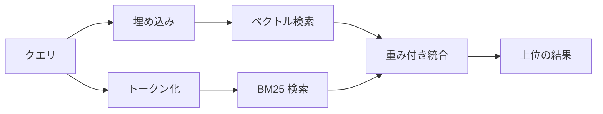

---
read_when:
    - memory_search の仕組みを理解したい場合
    - 埋め込みプロバイダーを選択する場合
    - 検索品質を調整したい場合
summary: 埋め込みとハイブリッド検索を使用して、メモリ検索が関連するノートを見つける仕組み
title: メモリ検索
x-i18n:
    generated_at: "2026-07-12T14:24:55Z"
    model: gpt-5.6
    postprocess_version: locale-links-v1
    prompt_version: 15
    provider: openai
    source_hash: 2ae0830843fba28c24159d85425240051fb8caf086cd0563d3091890045dcfad
    source_path: concepts/memory-search.md
    workflow: 16
---

`memory_search` は、元のテキストと表現が異なる場合でも、メモリファイルから関連するノートを見つけます。メモリを小さな断片に分割し、埋め込み、キーワード、またはその両方を使用して検索します。

## クイックスタート

OpenClaw はデフォルトで OpenAI の埋め込みを使用します。別のプロバイダーを使用するには、明示的に設定します。

```json5
{
  agents: {
    defaults: {
      memorySearch: {
        provider: "openai", // または "gemini", "voyage", "mistral", "bedrock", "local", "ollama", "lmstudio", "github-copilot", "openai-compatible"
      },
    },
  },
}
```

`provider` は、メモリ埋め込みアダプターを持つ `"ollama"` または別のプロバイダー ID が、そのエントリの `api` に設定されている限り、カスタムの `models.providers.<id>` エントリ（例: `ollama-5080`）を参照することもできます。

API キーなしでローカル埋め込みを使用するには、公式の llama.cpp プロバイダー Plugin をインストールし、`provider: "local"` を設定します。

```bash
openclaw plugins install @openclaw/llama-cpp-provider
```

ソースチェックアウトでは、引き続きネイティブビルドの承認が必要です。`pnpm approve-builds` を実行してから、`pnpm rebuild node-llama-cpp` を実行します。

一部の OpenAI 互換埋め込みエンドポイントでは、検索用の `"query"`、インデックス化されたチャンク用の `"document"`/`"passage"` など、非対称な `input_type` ラベルが必要です。これらは `queryInputType` と `documentInputType` で設定します。詳細は[メモリ設定リファレンス](/ja-JP/reference/memory-config#provider-specific-config)を参照してください。

## 対応プロバイダー

| プロバイダー      | ID                  | API キーが必要 | 注記                                   |
| ----------------- | ------------------- | -------------- | -------------------------------------- |
| Bedrock           | `bedrock`           | いいえ         | AWS 認証情報チェーンを使用             |
| DeepInfra         | `deepinfra`         | はい           | デフォルトモデル `BAAI/bge-m3`         |
| Gemini            | `gemini`            | はい           | 画像と音声のインデックス化に対応       |
| GitHub Copilot    | `github-copilot`    | いいえ         | Copilot サブスクリプションを使用       |
| ローカル          | `local`             | いいえ         | GGUF モデル、約 0.6 GB を自動ダウンロード |
| LM Studio         | `lmstudio`          | いいえ         | ローカル/セルフホスト型サーバー        |
| Mistral           | `mistral`           | はい           |                                        |
| Ollama            | `ollama`            | いいえ         | ローカル/セルフホスト型サーバー        |
| OpenAI            | `openai`            | はい           | デフォルト                             |
| OpenAI 互換       | `openai-compatible` | 通常は必要     | 汎用 `/v1/embeddings` エンドポイント   |
| Voyage            | `voyage`            | はい           |                                        |

## 検索の仕組み

OpenClaw は 2 つの検索経路を並列で実行し、結果を統合します。



- **ベクトル検索**は類似した意味を照合します（「gateway host」は「OpenClaw を実行しているマシン」と一致します）。
- **BM25 キーワード検索**は完全一致する用語（ID、エラー文字列、設定キー）を照合します。
- **ファイル名検索**は、ノート本文とは別にパスをインデックス化します。完全なフルパス、ベース名、ファイル名の語幹は部分的なパス一致より上位にランクされますが、スニペットと本文のキーワードスコアは引き続きノートの内容から算出されます。

一方の経路のみが利用可能な場合は、その経路だけが実行されます。

**FTS のみのモード。** 埋め込みを意図的に無効化し、キーワードのみで検索するには、`provider: "none"` を設定します。`provider` を未設定にするか `"auto"` に設定した場合も、埋め込み認証が構成されていなければ、エラーを発生させずにキーワードのみのランキングへフォールバックします。`provider: "local"`（GGUF/llama.cpp プロバイダー）が失敗した場合も同様です。

**明示的に指定したプロバイダーが利用できない場合。** その他のプロバイダー（例: `openai`、`ollama`、`gemini`）を明示的に指定し、リクエスト時に利用できなくなった場合（認証不備、ネットワーク障害）、`memory_search` は暗黙的に FTS のみの結果へデグレードするのではなく、メモリが利用できないことを報告します。これにより、設定済みプロバイダーの障害が明示されます。意図的に FTS のみで想起するには `provider: "none"` を設定し、セマンティックランキングを復元するにはプロバイダー/認証設定を修正してください。

## 検索品質の向上

大規模なノート履歴には、2 つのオプション機能が役立ちます。

### 時間減衰

古いノートのランキング重みは徐々に低下し、最近の情報が最初に表示されるようになります。デフォルトの半減期は 30 日で、先月のノートのスコアは元の重みの 50% になります。`MEMORY.md` と `memory/` 配下の日付なしファイルは常に有効で、減衰しません。減衰するのは、日付付きの `memory/YYYY-MM-DD.md` ファイルのみです。

<Tip>
エージェントに数か月分の日次ノートがあり、古い情報が最近のコンテキストより上位に表示され続ける場合は、これを有効にしてください。
</Tip>

### MMR（多様性）

重複した結果を減らします。5 つのノートすべてに同じルーター設定への言及がある場合、MMR により、同じ内容を繰り返すのではなく、上位の結果が異なるトピックを網羅するようになります。

<Tip>
`memory_search` が異なる日次ノートからほぼ重複したスニペットを返し続ける場合は、これを有効にしてください。
</Tip>

### 両方を有効化

```json5
{
  agents: {
    defaults: {
      memorySearch: {
        query: {
          hybrid: {
            mmr: { enabled: true },
            temporalDecay: { enabled: true },
          },
        },
      },
    },
  },
}
```

## マルチモーダルメモリ

`gemini-embedding-2-preview` では、Markdown とともに画像や音声をインデックス化できます。これは `memorySearch.extraPaths` 配下のファイルにのみ適用されます。デフォルトのメモリルート（`MEMORY.md`、`memory/*.md`）は Markdown のみのままです。検索クエリは引き続きテキストですが、視覚コンテンツや音声コンテンツと照合されます。設定については、[メモリ設定リファレンス](/ja-JP/reference/memory-config#multimodal-memory-gemini)を参照してください。

## セッションメモリ検索

セッショントランスクリプトから完全一致の全文想起を行うには、[`sessions_search`](/ja-JP/concepts/session-search) を使用し、その後 `sessions_history` で結果を開きます。セッションメモリ検索は、セマンティックな実験的補完機能として引き続き利用できます。

必要に応じてセッショントランスクリプトをインデックス化し、`memory_search` で以前の会話を想起できるようにします。これはオプトインです。`experimental.sessionMemory: true` を設定し、`sources` に `"sessions"` を追加します（デフォルトの `sources` は `["memory"]`）。

セッションの検索結果は `tools.sessions.visibility` に従います。デフォルトの `"tree"` では、現在のセッションと、そのセッションが生成したセッションのみが公開されます。別のセッションから、関連のない同一エージェントのセッション（例: DM から Gateway によってディスパッチされたセッション）を想起するには、可視性を `"agent"` に拡大します。

QMD バックエンドを使用する場合は、トランスクリプトが QMD コレクションへエクスポートされるように、`memory.qmd.sessions.enabled: true` も設定します。`experimental.sessionMemory` と `sources` だけでは、トランスクリプトは QMD にエクスポートされません。詳細は[設定リファレンス](/ja-JP/reference/memory-config#session-memory-search-experimental)を参照してください。

## トラブルシューティング

**結果がありませんか？** `openclaw memory status` を実行してインデックスを確認してください。空の場合は、`openclaw memory index --force` を実行します。

**キーワード一致しかありませんか？** 埋め込みプロバイダーが構成されていない可能性があります。`openclaw memory status --deep` を確認してください。

**ローカル埋め込みがタイムアウトしますか？** `ollama`、`lmstudio`、`local` は、デフォルトで長めのインラインバッチタイムアウトを使用します。ホストの処理が遅いだけの場合は、`agents.defaults.memorySearch.sync.embeddingBatchTimeoutSeconds` を設定し、`openclaw memory index --force` を再実行してください。

**CJK テキストが見つかりませんか？** `openclaw memory index --force` を使用して FTS インデックスを再構築してください。

## 関連項目

- [メモリの概要](/ja-JP/concepts/memory)
- [Active Memory](/ja-JP/concepts/active-memory)
- [組み込みメモリエンジン](/ja-JP/concepts/memory-builtin)
- [メモリ設定リファレンス](/ja-JP/reference/memory-config)
