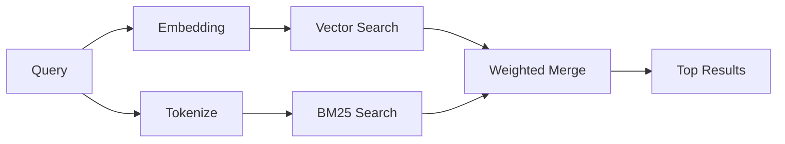

---
read_when:
    - memory_search の仕組みを理解したい
    - 埋め込みプロバイダーを選択したい場合
    - 検索品質を調整したい場合
summary: メモリ検索が埋め込みとハイブリッド検索を使用して関連するメモを見つける仕組み
title: メモリ検索
x-i18n:
    generated_at: "2026-05-02T04:53:31Z"
    model: gpt-5.5
    provider: openai
    source_hash: 2a71fb0809d5c70689e8046f854e4b4b4e79f45769ac2964e40a762ebb4e91a8
    source_path: concepts/memory-search.md
    workflow: 16
---

`memory_search` は、表現が元のテキストと異なる場合でも、メモリファイルから関連するノートを見つけます。メモリを小さなチャンクにインデックス化し、埋め込み、キーワード、またはその両方を使って検索します。

## クイックスタート

GitHub Copilot サブスクリプション、OpenAI、Gemini、Voyage、または Mistral
API キーを設定している場合、メモリ検索は自動的に動作します。プロバイダーを明示的に設定するには:

```json5
{
  agents: {
    defaults: {
      memorySearch: {
        provider: "openai", // or "gemini", "local", "ollama", etc.
      },
    },
  },
}
```

複数エンドポイント構成では、`provider` に `ollama-5080` などのカスタム
`models.providers.<id>` エントリも指定できます。そのプロバイダーが
`api: "ollama"` または別の埋め込みアダプター所有者を設定している場合です。

API キーなしのローカル埋め込みには、`provider: "local"` を設定します。ソースチェックアウトでは、引き続きネイティブビルドの承認が必要な場合があります: `pnpm approve-builds` の後に
`pnpm rebuild node-llama-cpp` を実行します。

一部の OpenAI 互換埋め込みエンドポイントでは、検索には
`input_type: "query"`、インデックス化されたチャンクには `input_type: "document"` または `"passage"` のような非対称ラベルが必要です。これらは `memorySearch.queryInputType` と
`memorySearch.documentInputType` で設定します。詳しくは [メモリ設定リファレンス](/ja-JP/reference/memory-config#provider-specific-config) を参照してください。

## 対応プロバイダー

| プロバイダー   | ID               | API キーが必要 | 注記                                                 |
| -------------- | ---------------- | -------------- | ---------------------------------------------------- |
| Bedrock        | `bedrock`        | いいえ         | AWS 認証情報チェーンが解決されると自動検出されます  |
| Gemini         | `gemini`         | はい           | 画像/音声のインデックス化に対応                     |
| GitHub Copilot | `github-copilot` | いいえ         | 自動検出され、Copilot サブスクリプションを使用      |
| Local          | `local`          | いいえ         | GGUF モデル、約 0.6 GB のダウンロード               |
| Mistral        | `mistral`        | はい           | 自動検出                                             |
| Ollama         | `ollama`         | いいえ         | ローカル。明示的に設定する必要があります            |
| OpenAI         | `openai`         | はい           | 自動検出、高速                                       |
| Voyage         | `voyage`         | はい           | 自動検出                                             |

## 検索の仕組み

OpenClaw は 2 つの取得経路を並列に実行し、結果をマージします:



- **ベクトル検索** は、意味が似ているノートを見つけます（"gateway host" は
  "the machine running OpenClaw" に一致します）。
- **BM25 キーワード検索** は、完全一致を見つけます（ID、エラー文字列、設定キー）。

片方の経路だけが利用可能な場合（埋め込みがない、または FTS がない）、もう片方だけが実行されます。

埋め込みが利用できない場合でも、OpenClaw は未加工の完全一致順序のみにフォールバックするのではなく、FTS 結果に対して字句ランキングを使用します。この縮退モードでは、クエリ語のカバレッジが強く、関連するファイルパスを持つチャンクがブーストされるため、`sqlite-vec` や埋め込みプロバイダーがなくても有用な再現率を維持できます。

## 検索品質の改善

ノート履歴が大きい場合に役立つ 2 つの任意機能があります:

### 時間減衰

古いノートはランキングの重みを徐々に失うため、最近の情報が先に表示されます。
デフォルトの半減期 30 日では、先月のノートは元の重みの 50% でスコアリングされます。`MEMORY.md` のような常緑ファイルは減衰されません。

<Tip>
エージェントに数か月分の日次ノートがあり、古い情報が最近のコンテキストより上位に出続ける場合は、時間減衰を有効にしてください。
</Tip>

### MMR（多様性）

重複した結果を減らします。5 つのノートがすべて同じルーター設定に言及している場合、MMR により、上位結果が繰り返しではなく異なるトピックを網羅するようになります。

<Tip>
`memory_search` が異なる日次ノートからほぼ重複したスニペットを返し続ける場合は、MMR を有効にしてください。
</Tip>

### 両方を有効にする

```json5
{
  agents: {
    defaults: {
      memorySearch: {
        query: {
          hybrid: {
            mmr: { enabled: true },
            temporalDecay: { enabled: true },
          },
        },
      },
    },
  },
}
```

## マルチモーダルメモリ

Gemini Embedding 2 を使用すると、Markdown と一緒に画像や音声ファイルをインデックス化できます。検索クエリはテキストのままですが、視覚および音声コンテンツに照合されます。設定については [メモリ設定リファレンス](/ja-JP/reference/memory-config) を参照してください。

## セッションメモリ検索

任意でセッショントランスクリプトをインデックス化し、`memory_search` が以前の会話を思い出せるようにできます。これは
`memorySearch.experimental.sessionMemory` によるオプトインです。詳しくは
[設定リファレンス](/ja-JP/reference/memory-config) を参照してください。

## トラブルシューティング

**結果がありませんか?** インデックスを確認するには `openclaw memory status` を実行します。空の場合は、
`openclaw memory index --force` を実行します。

**キーワード一致のみですか?** 埋め込みプロバイダーが設定されていない可能性があります。
`openclaw memory status --deep` を確認してください。

**ローカル埋め込みがタイムアウトしますか?** `ollama`、`lmstudio`、`local` はデフォルトで長めのインラインバッチタイムアウトを使用します。ホストが単に遅い場合は、
`agents.defaults.memorySearch.sync.embeddingBatchTimeoutSeconds` を設定し、
`openclaw memory index --force` を再実行します。

**CJK テキストが見つかりませんか?** FTS インデックスを
`openclaw memory index --force` で再構築してください。

## 参考資料

- [Active Memory](/ja-JP/concepts/active-memory) -- 対話型チャットセッション用のサブエージェントメモリ
- [メモリ](/ja-JP/concepts/memory) -- ファイルレイアウト、バックエンド、ツール
- [メモリ設定リファレンス](/ja-JP/reference/memory-config) -- すべての設定ノブ

## 関連

- [メモリ概要](/ja-JP/concepts/memory)
- [Active Memory](/ja-JP/concepts/active-memory)
- [組み込みメモリエンジン](/ja-JP/concepts/memory-builtin)
