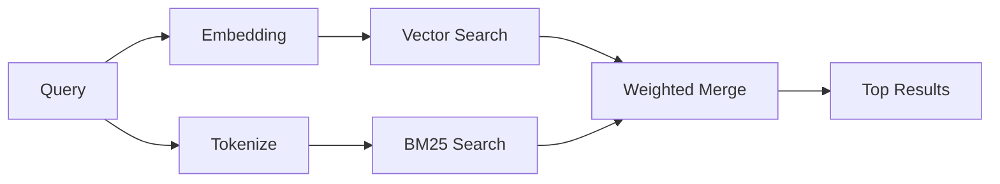

---
read_when:
    - '`memory_search` がどのように機能するかを理解したい'
    - 埋め込みプロバイダーを選択したい
    - 検索品質を調整したい場合
summary: メモリ検索が埋め込みとハイブリッド検索を使って関連するノートを見つける仕組み
title: メモリ検索
x-i18n:
    generated_at: "2026-04-30T05:08:30Z"
    model: gpt-5.5
    provider: openai
    source_hash: 3e6c44d90f49a797bda01b9a575928c128a334f89ae14fc3620e65562a866aa9
    source_path: concepts/memory-search.md
    workflow: 16
---

`memory_search` は、元のテキストと表現が異なる場合でも、memory ファイルから関連するメモを見つけます。memory を小さなチャンクに分割してインデックス化し、埋め込み、キーワード、またはその両方を使って検索します。

## クイックスタート

GitHub Copilot サブスクリプション、OpenAI、Gemini、Voyage、または Mistral の API キーが設定されている場合、memory 検索は自動的に動作します。プロバイダーを明示的に設定するには:

```json5
{
  agents: {
    defaults: {
      memorySearch: {
        provider: "openai", // or "gemini", "local", "ollama", etc.
      },
    },
  },
}
```

複数エンドポイント構成では、そのプロバイダーが `api: "ollama"` または別の埋め込みアダプター所有者を設定している場合、`provider` に `ollama-5080` などのカスタム `models.providers.<id>` エントリも指定できます。

API キーなしでローカル埋め込みを使うには、任意の `node-llama-cpp` ランタイムパッケージを OpenClaw の隣にインストールし、`provider: "local"` を使います。

一部の OpenAI 互換埋め込みエンドポイントでは、検索用に `input_type: "query"`、インデックス化されたチャンク用に `input_type: "document"` または `"passage"` のような非対称ラベルが必要です。これらは `memorySearch.queryInputType` と `memorySearch.documentInputType` で設定します。[Memory 設定リファレンス](/ja-JP/reference/memory-config#provider-specific-config)を参照してください。

## サポートされるプロバイダー

| プロバイダー | ID | API キーが必要 | メモ |
| -------------- | ---------------- | ------------- | ---------------------------------------------------- |
| Bedrock | `bedrock` | いいえ | AWS 認証情報チェーンが解決されると自動検出されます |
| Gemini | `gemini` | はい | 画像/音声のインデックス化をサポートします |
| GitHub Copilot | `github-copilot` | いいえ | 自動検出され、Copilot サブスクリプションを使います |
| Local | `local` | いいえ | GGUF モデル、約 0.6 GB のダウンロード |
| Mistral | `mistral` | はい | 自動検出されます |
| Ollama | `ollama` | いいえ | ローカル。明示的に設定する必要があります |
| OpenAI | `openai` | はい | 自動検出され、高速です |
| Voyage | `voyage` | はい | 自動検出されます |

## 検索の仕組み

OpenClaw は 2 つの取得経路を並列に実行し、結果をマージします:



- **ベクトル検索** は、意味が似ているメモを見つけます（「gateway host」は「OpenClaw を実行しているマシン」と一致します）。
- **BM25 キーワード検索** は、完全一致を見つけます（ID、エラー文字列、config キー）。

片方の経路だけが利用可能な場合（埋め込みがない、または FTS がない）、もう片方だけが実行されます。

埋め込みが利用できない場合でも、OpenClaw は FTS 結果に対して、単なる生の完全一致順序へフォールバックするのではなく、語彙ランキングを使用します。この縮退モードでは、クエリ語のカバレッジが強く関連するファイルパスを持つチャンクが優先されるため、`sqlite-vec` や埋め込みプロバイダーがなくても有用な再現率を維持できます。

## 検索品質の改善

大きなメモ履歴がある場合、2 つの任意機能が役立ちます:

### 時間減衰

古いメモは徐々にランキングの重みを失い、最近の情報が先に表示されます。デフォルトの半減期 30 日では、先月のメモは元の重みの 50% でスコア付けされます。`MEMORY.md` のようなエバーグリーンファイルは減衰されません。

<Tip>
エージェントに数か月分の日次メモがあり、古い情報が最近のコンテキストより上位に出続ける場合は、時間減衰を有効にしてください。
</Tip>

### MMR（多様性）

冗長な結果を減らします。5 つのメモがすべて同じルーター設定に触れている場合、MMR は上位結果が繰り返しではなく異なるトピックをカバーするようにします。

<Tip>
`memory_search` が異なる日次メモからほぼ重複するスニペットを返し続ける場合は、MMR を有効にしてください。
</Tip>

### 両方を有効化

```json5
{
  agents: {
    defaults: {
      memorySearch: {
        query: {
          hybrid: {
            mmr: { enabled: true },
            temporalDecay: { enabled: true },
          },
        },
      },
    },
  },
}
```

## マルチモーダル memory

Gemini Embedding 2 では、Markdown と並べて画像や音声ファイルをインデックス化できます。検索クエリはテキストのままですが、視覚および音声コンテンツと照合されます。セットアップについては [Memory 設定リファレンス](/ja-JP/reference/memory-config)を参照してください。

## セッション memory 検索

任意でセッショントランスクリプトをインデックス化し、`memory_search` が以前の会話を思い出せるようにできます。これは `memorySearch.experimental.sessionMemory` によるオプトインです。詳細は[設定リファレンス](/ja-JP/reference/memory-config)を参照してください。

## トラブルシューティング

**結果がありませんか？** `openclaw memory status` を実行してインデックスを確認してください。空の場合は、`openclaw memory index --force` を実行します。

**キーワード一致だけですか？** 埋め込みプロバイダーが設定されていない可能性があります。`openclaw memory status --deep` を確認してください。

**ローカル埋め込みがタイムアウトしますか？** `ollama`、`lmstudio`、`local` はデフォルトでより長いインラインバッチタイムアウトを使用します。ホストが単に遅い場合は、`agents.defaults.memorySearch.sync.embeddingBatchTimeoutSeconds` を設定し、`openclaw memory index --force` を再実行してください。

**CJK テキストが見つかりませんか？** `openclaw memory index --force` で FTS インデックスを再構築してください。

## 関連情報

- [Active Memory](/ja-JP/concepts/active-memory) -- インタラクティブなチャットセッション向けのサブエージェント memory
- [Memory](/ja-JP/concepts/memory) -- ファイルレイアウト、バックエンド、ツール
- [Memory 設定リファレンス](/ja-JP/reference/memory-config) -- すべての config ノブ

## 関連

- [Memory 概要](/ja-JP/concepts/memory)
- [Active Memory](/ja-JP/concepts/active-memory)
- [組み込み memory エンジン](/ja-JP/concepts/memory-builtin)
