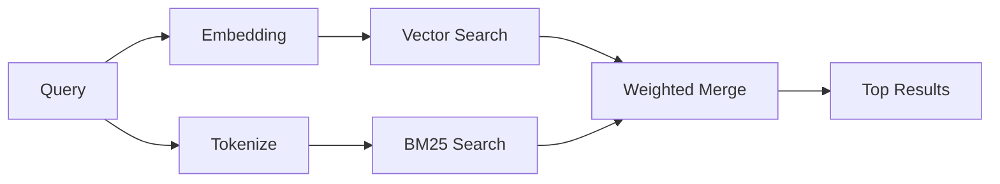

---
read_when:
    - memory_search の仕組みを理解したい
    - 埋め込みプロバイダーを選択する
    - 検索品質を調整したい
summary: 埋め込みとハイブリッド検索を使用してメモリ検索が関連するメモを見つける仕組み
title: メモリ検索
x-i18n:
    generated_at: "2026-06-28T22:33:25Z"
    model: gpt-5.5
    postprocess_version: locale-links-v1
    provider: openai
    source_hash: 32ffb9d996851566eb92b7812c5425f545ecbb5387a0a445686df35a6c8ae143
    source_path: concepts/memory-search.md
    workflow: 16
---

`memory_search` は、元のテキストと表現が異なる場合でも、メモリファイルから関連するノートを見つけます。これは、メモリを小さなチャンクにインデックス化し、埋め込み、キーワード、またはその両方を使って検索することで動作します。

## クイックスタート

メモリ検索はデフォルトで OpenAI の埋め込みを使用します。別の埋め込みバックエンドを使うには、プロバイダーを明示的に設定します。

```json5
{
  agents: {
    defaults: {
      memorySearch: {
        provider: "openai", // or "gemini", "local", "ollama", "openai-compatible", etc.
      },
    },
  },
}
```

メモリ専用プロバイダーを含むマルチエンドポイント構成では、`provider` は `ollama-5080` のようなカスタム `models.providers.<id>` エントリにもできます。そのプロバイダーが `api: "ollama"` または別のメモリ埋め込みアダプター所有者を設定している場合です。

API キーなしでローカル埋め込みを使うには、`@openclaw/llama-cpp-provider` をインストールし、`provider: "local"` を設定します。ソースチェックアウトでは、ネイティブビルドの承認が引き続き必要な場合があります: `pnpm approve-builds` の後に `pnpm rebuild node-llama-cpp` を実行します。

一部の OpenAI 互換埋め込みエンドポイントでは、検索には `input_type: "query"`、インデックス化されたチャンクには `input_type: "document"` または `"passage"` のような非対称ラベルが必要です。これらは `memorySearch.queryInputType` と `memorySearch.documentInputType` で設定します。[メモリ構成リファレンス](/ja-JP/reference/memory-config#provider-specific-config)を参照してください。

## サポートされるプロバイダー

| プロバイダー | ID | API キーが必要 | 注記 |
| ----------------- | ------------------- | ------------- | ----------------------------- |
| Bedrock | `bedrock` | いいえ | AWS 認証情報チェーンを使用 |
| DeepInfra | `deepinfra` | はい | デフォルト: `BAAI/bge-m3` |
| Gemini | `gemini` | はい | 画像/音声のインデックス化に対応 |
| GitHub Copilot | `github-copilot` | いいえ | Copilot サブスクリプションを使用 |
| Local | `local` | いいえ | GGUF モデル、約 0.6 GB のダウンロード |
| Mistral | `mistral` | はい | |
| Ollama | `ollama` | いいえ | ローカル/セルフホスト |
| OpenAI | `openai` | はい | デフォルト |
| OpenAI-compatible | `openai-compatible` | 通常は必要 | 汎用 `/v1/embeddings` |
| Voyage | `voyage` | はい | |

## 検索の仕組み

OpenClaw は 2 つの取得パスを並列で実行し、結果をマージします。



- **ベクトル検索**は、意味が似ているノートを見つけます（"gateway host" は "the machine running OpenClaw" に一致します）。
- **BM25 キーワード検索**は、完全一致（ID、エラー文字列、構成キー）を見つけます。

一方のパスだけが利用可能な場合、もう一方だけで実行されます。意図的な FTS 専用モード（`provider: "none"`）と自動/デフォルトのプロバイダー選択では、埋め込みが利用できない場合でも語彙ランキングを使用できます。

明示的な非ローカル埋め込みプロバイダーは別です。`memorySearch.provider` を具体的なリモートバックエンド付きプロバイダーに設定し、そのプロバイダーが実行時に利用できない場合、`memory_search` は FTS 専用結果を黙って使用するのではなく、メモリが利用不可であると報告します。これにより、壊れた構成済みセマンティックプロバイダーが可視化されます。意図的に FTS 専用の想起を行うには `provider: "none"` を設定するか、プロバイダー/認証構成を修正してセマンティックランキングを復元します。

## 検索品質の改善

大きなノート履歴がある場合、2 つのオプション機能が役立ちます。

### 時間減衰

古いノートは徐々にランキングの重みを失い、最近の情報が先に表示されます。デフォルトの半減期 30 日では、先月のノートは元の重みの 50% のスコアになります。`MEMORY.md` のような常緑ファイルは減衰されません。

<Tip>
エージェントに数か月分の日次ノートがあり、古い情報が最近のコンテキストより上位に出続ける場合は、時間減衰を有効にします。
</Tip>

### MMR（多様性）

冗長な結果を減らします。5 つのノートがすべて同じルーター構成に言及している場合、MMR により、上位結果は繰り返しではなく異なるトピックをカバーするようになります。

<Tip>
`memory_search` が異なる日次ノートからほぼ重複するスニペットを返し続ける場合は、MMR を有効にします。
</Tip>

### 両方を有効にする

```json5
{
  agents: {
    defaults: {
      memorySearch: {
        query: {
          hybrid: {
            mmr: { enabled: true },
            temporalDecay: { enabled: true },
          },
        },
      },
    },
  },
}
```

## マルチモーダルメモリ

Gemini Embedding 2 では、Markdown と並べて画像や音声ファイルをインデックス化できます。検索クエリはテキストのままですが、視覚および音声コンテンツと照合されます。設定については、[メモリ構成リファレンス](/ja-JP/reference/memory-config)を参照してください。

## セッションメモリ検索

必要に応じてセッショントランスクリプトをインデックス化し、`memory_search` が以前の会話を想起できるようにできます。これは `memorySearch.experimental.sessionMemory` と `sources: ["sessions"]` によるオプトインです。デフォルトのソースリストはメモリのみです。実験的フラグはセッショントランスクリプトのインデックス化を有効にし、`sources` はセッションチャンクを検索するかどうかを制御します。

セッションヒットは `tools.sessions.visibility` に従います。デフォルトの `tree` 設定では、現在のセッションとそれが生成したセッションだけが公開されます。別の DM セッションから、同じエージェントの無関係な gateway ディスパッチセッションを想起するには、意図的に可視性を `agent` に広げます。

QMD を使用する場合は、トランスクリプトが QMD コレクションにエクスポートされるように `memory.qmd.sessions.enabled: true` も設定します。詳細は[構成リファレンス](/ja-JP/reference/memory-config)を参照してください。

## トラブルシューティング

**結果がありませんか？** `openclaw memory status` を実行してインデックスを確認します。空の場合は、`openclaw memory index --force` を実行します。

**キーワード一致だけですか？** 埋め込みプロバイダーが構成されていない可能性があります。`openclaw memory status --deep` を確認してください。

**ローカル埋め込みがタイムアウトしますか？** `ollama`、`lmstudio`、`local` はデフォルトで長めのインラインバッチタイムアウトを使用します。ホストが単に遅い場合は、`agents.defaults.memorySearch.sync.embeddingBatchTimeoutSeconds` を設定し、`openclaw memory index --force` を再実行します。

**CJK テキストが見つかりませんか？** `openclaw memory index --force` で FTS インデックスを再構築します。

## 関連資料

- [Active Memory](/ja-JP/concepts/active-memory) -- インタラクティブチャットセッション用のサブエージェントメモリ
- [Memory](/ja-JP/concepts/memory) -- ファイルレイアウト、バックエンド、ツール
- [メモリ構成リファレンス](/ja-JP/reference/memory-config) -- すべての構成ノブ

## 関連

- [メモリ概要](/ja-JP/concepts/memory)
- [Active Memory](/ja-JP/concepts/active-memory)
- [組み込みメモリエンジン](/ja-JP/concepts/memory-builtin)
