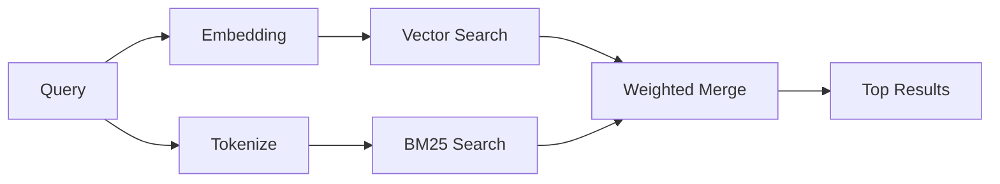

---
read_when:
    - memory_search の仕組みを理解したい場合
    - 埋め込みプロバイダーを選択したい場合
    - 検索品質を調整したい場合
summary: メモリ検索が埋め込みとハイブリッド検索を使用して関連するノートを見つける仕組み
title: メモリ検索
x-i18n:
    generated_at: "2026-04-30T16:27:55Z"
    model: gpt-5.5
    provider: openai
    source_hash: 7f40bbe32453a28070ffc67f19a4c06e2fe59a24237a2aef353f4b9b8260bcf2
    source_path: concepts/memory-search.md
    workflow: 16
---

`memory_search` は、元のテキストと表現が異なる場合でも、メモリファイルから関連するノートを見つけます。メモリを小さなチャンクにインデックス化し、埋め込み、キーワード、またはその両方を使って検索します。

## クイックスタート

GitHub Copilot サブスクリプション、OpenAI、Gemini、Voyage、または Mistral
APIキーが設定されている場合、メモリ検索は自動的に動作します。プロバイダーを明示的に設定するには:

```json5
{
  agents: {
    defaults: {
      memorySearch: {
        provider: "openai", // or "gemini", "local", "ollama", etc.
      },
    },
  },
}
```

マルチエンドポイント構成では、そのプロバイダーが `api: "ollama"` または別の埋め込みアダプター所有者を設定している場合、`provider` は `ollama-5080` のようなカスタム
`models.providers.<id>` エントリにもできます。

APIキーなしでローカル埋め込みを使うには、`provider: "local"` を設定します。パッケージ版インストールでは、OpenClaw の管理対象 Plugin
runtime-deps ツリー内にネイティブの `node-llama-cpp` ランタイムが保持されます。そのツリーの修復が必要な場合は、`openclaw doctor --fix` を実行してください。

一部の OpenAI 互換の埋め込みエンドポイントでは、検索には `input_type: "query"`、インデックス化されたチャンクには `input_type: "document"` または `"passage"` のような非対称ラベルが必要です。これらは `memorySearch.queryInputType` と
`memorySearch.documentInputType` で設定します。[メモリ設定リファレンス](/ja-JP/reference/memory-config#provider-specific-config)を参照してください。

## 対応プロバイダー

| プロバイダー   | ID               | APIキーが必要 | 注記                                                 |
| -------------- | ---------------- | ------------- | ---------------------------------------------------- |
| Bedrock        | `bedrock`        | いいえ        | AWS 認証情報チェーンが解決されると自動検出される    |
| Gemini         | `gemini`         | はい          | 画像/音声のインデックス化に対応                     |
| GitHub Copilot | `github-copilot` | いいえ        | 自動検出され、Copilot サブスクリプションを使用      |
| Local          | `local`          | いいえ        | GGUF モデル、約0.6 GBのダウンロード                 |
| Mistral        | `mistral`        | はい          | 自動検出                                             |
| Ollama         | `ollama`         | いいえ        | ローカル、明示的な設定が必要                         |
| OpenAI         | `openai`         | はい          | 自動検出、高速                                       |
| Voyage         | `voyage`         | はい          | 自動検出                                             |

## 検索の仕組み

OpenClaw は2つの取得パスを並列に実行し、結果をマージします:



- **ベクトル検索**は、意味が似ているノートを見つけます（「gateway host」は
  「OpenClaw を実行しているマシン」に一致します）。
- **BM25 キーワード検索**は、完全一致を見つけます（ID、エラー文字列、設定
  キー）。

片方のパスしか利用できない場合（埋め込みがない、または FTS がない場合）、もう片方だけが実行されます。

埋め込みを利用できない場合でも、OpenClaw は FTS 結果に対して、単なる生の完全一致順序へフォールバックするのではなく、字句ランキングを使用します。この縮退モードでは、クエリ語のカバレッジが強いチャンクと関連するファイルパスがブーストされるため、`sqlite-vec` や埋め込みプロバイダーがなくても有用な再現率を維持できます。

## 検索品質の向上

大きなノート履歴がある場合、2つの任意機能が役立ちます:

### 時間的減衰

古いノートはランキング重みが徐々に低下するため、最近の情報が先に表示されます。
デフォルトの半減期30日では、先月のノートのスコアは元の重みの50%になります。
`MEMORY.md` のような常緑ファイルは減衰されません。

<Tip>
エージェントに数か月分の日次ノートがあり、古い情報が最近のコンテキストより上位に出続ける場合は、時間的減衰を有効にしてください。
</Tip>

### MMR（多様性）

冗長な結果を減らします。5つのノートがすべて同じルーター設定に言及している場合、MMR により、上位結果は同じ内容の繰り返しではなく、異なるトピックをカバーするようになります。

<Tip>
`memory_search` が異なる日次ノートからほぼ重複するスニペットを返し続ける場合は、MMR を有効にしてください。
</Tip>

### 両方を有効化

```json5
{
  agents: {
    defaults: {
      memorySearch: {
        query: {
          hybrid: {
            mmr: { enabled: true },
            temporalDecay: { enabled: true },
          },
        },
      },
    },
  },
}
```

## マルチモーダルメモリ

Gemini Embedding 2 を使うと、Markdown と並べて画像や音声ファイルをインデックス化できます。検索クエリはテキストのままですが、視覚コンテンツや音声コンテンツに対して一致します。設定については、[メモリ設定リファレンス](/ja-JP/reference/memory-config)を参照してください。

## セッションメモリ検索

任意でセッショントランスクリプトをインデックス化し、`memory_search` が以前の会話を呼び出せるようにできます。これは
`memorySearch.experimental.sessionMemory` によるオプトインです。詳細は[設定リファレンス](/ja-JP/reference/memory-config)を参照してください。

## トラブルシューティング

**結果がありませんか?** インデックスを確認するには `openclaw memory status` を実行してください。空の場合は、
`openclaw memory index --force` を実行します。

**キーワード一致だけですか?** 埋め込みプロバイダーが設定されていない可能性があります。
`openclaw memory status --deep` を確認してください。

**ローカル埋め込みがタイムアウトしますか?** `ollama`、`lmstudio`、`local` はデフォルトで長めのインラインバッチタイムアウトを使用します。ホストが単に遅い場合は、
`agents.defaults.memorySearch.sync.embeddingBatchTimeoutSeconds` を設定し、
`openclaw memory index --force` を再実行してください。

**CJK テキストが見つかりませんか?** `openclaw memory index --force` で FTS インデックスを再構築してください。

## 参考資料

- [Active Memory](/ja-JP/concepts/active-memory) -- インタラクティブなチャットセッション用のサブエージェントメモリ
- [メモリ](/ja-JP/concepts/memory) -- ファイルレイアウト、バックエンド、ツール
- [メモリ設定リファレンス](/ja-JP/reference/memory-config) -- すべての設定ノブ

## 関連

- [メモリ概要](/ja-JP/concepts/memory)
- [Active Memory](/ja-JP/concepts/active-memory)
- [組み込みメモリエンジン](/ja-JP/concepts/memory-builtin)
