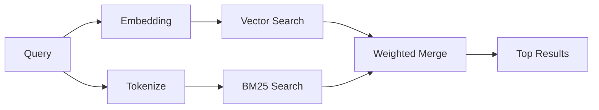

---
read_when:
    - memory_search がどのように機能するかを理解したい
    - 埋め込みプロバイダーを選択したい
    - 検索品質を調整したい
summary: メモリ検索が埋め込みとハイブリッド検索を使って関連ノートを見つける仕組み
title: メモリ検索
x-i18n:
    generated_at: "2026-06-27T11:10:30Z"
    model: gpt-5.5
    postprocess_version: locale-links-v1
    provider: openai
    source_hash: b0bcb8cf400100ba8b6ddbb46bdf8b2a89a8bc32a550ee6df47c874e7e9e0879
    source_path: concepts/memory-search.md
    workflow: 16
---

`memory_search` は、元のテキストと表現が異なる場合でも、メモリファイルから関連するノートを見つけます。これは、メモリを小さなチャンクにインデックス化し、埋め込み、キーワード、またはその両方を使って検索することで機能します。

## クイックスタート

メモリ検索はデフォルトで OpenAI 埋め込みを使用します。別の埋め込みバックエンドを使うには、プロバイダーを明示的に設定します:

```json5
{
  agents: {
    defaults: {
      memorySearch: {
        provider: "openai", // or "gemini", "local", "ollama", "openai-compatible", etc.
      },
    },
  },
}
```

メモリ専用プロバイダーを持つマルチエンドポイント構成では、そのプロバイダーが `api: "ollama"` または別のメモリ埋め込みアダプター所有者を設定している場合、`provider` に `ollama-5080` のようなカスタム `models.providers.<id>` エントリを指定することもできます。

API キーなしでローカル埋め込みを使うには、`@openclaw/llama-cpp-provider` をインストールして `provider: "local"` を設定します。ソースチェックアウトでは、引き続きネイティブビルドの承認が必要な場合があります: `pnpm approve-builds` の後に `pnpm rebuild node-llama-cpp` を実行します。

一部の OpenAI 互換埋め込みエンドポイントでは、検索には `input_type: "query"`、インデックス化されたチャンクには `input_type: "document"` または `"passage"` のような非対称ラベルが必要です。これらは `memorySearch.queryInputType` と `memorySearch.documentInputType` で設定します。[メモリ設定リファレンス](/ja-JP/reference/memory-config#provider-specific-config)を参照してください。

## 対応プロバイダー

| プロバイダー      | ID                  | API キーが必要 | 注記                          |
| ----------------- | ------------------- | -------------- | ----------------------------- |
| Bedrock           | `bedrock`           | いいえ         | AWS 認証情報チェーンを使用    |
| DeepInfra         | `deepinfra`         | はい           | デフォルト: `BAAI/bge-m3`     |
| Gemini            | `gemini`            | はい           | 画像/音声のインデックス化に対応 |
| GitHub Copilot    | `github-copilot`    | いいえ         | Copilot サブスクリプションを使用 |
| Local             | `local`             | いいえ         | GGUF モデル、約 0.6 GB のダウンロード |
| Mistral           | `mistral`           | はい           |                               |
| Ollama            | `ollama`            | いいえ         | ローカル/セルフホスト         |
| OpenAI            | `openai`            | はい           | デフォルト                    |
| OpenAI-compatible | `openai-compatible` | 通常           | 汎用 `/v1/embeddings`         |
| Voyage            | `voyage`            | はい           |                               |

## 検索の仕組み

OpenClaw は 2 つの取得パスを並列に実行し、結果をマージします:



- **ベクトル検索**は、意味が似ているノートを見つけます（「Gateway ホスト」は「OpenClaw を実行しているマシン」に一致します）。
- **BM25 キーワード検索**は、完全一致（ID、エラー文字列、設定キー）を見つけます。

片方のパスだけが利用可能な場合は、もう一方だけが実行されます。意図的な FTS のみモード（`provider: "none"`）と自動/デフォルトのプロバイダー選択では、埋め込みが利用できない場合でも語彙ランキングを使用できます。

明示的な非ローカル埋め込みプロバイダーは異なります。`memorySearch.provider` を具体的なリモートバックエンドのプロバイダーに設定し、そのプロバイダーがランタイムで利用できない場合、`memory_search` は FTS のみの結果を黙って使うのではなく、メモリを利用不可として報告します。これにより、設定済みのセマンティックプロバイダーの破損が見える状態に保たれます。意図的な FTS のみの再現には `provider: "none"` を設定するか、プロバイダー/認証設定を修正してセマンティックランキングを復元します。

## 検索品質の改善

大きなノート履歴がある場合、2 つの任意機能が役立ちます:

### 時間減衰

古いノートはランキング重みを徐々に失うため、最近の情報が先に表示されます。デフォルトの半減期 30 日では、先月のノートは元の重みの 50% でスコアリングされます。`MEMORY.md` のような常緑ファイルは減衰されません。

<Tip>
エージェントに数か月分の日次ノートがあり、古い情報が最近のコンテキストより上位に出続ける場合は、時間減衰を有効にします。
</Tip>

### MMR（多様性）

冗長な結果を減らします。5 つのノートがすべて同じルーター設定に言及している場合、MMR は上位結果が繰り返しではなく異なるトピックをカバーするようにします。

<Tip>
`memory_search` が異なる日次ノートからほぼ重複したスニペットを返し続ける場合は、MMR を有効にします。
</Tip>

### 両方を有効化

```json5
{
  agents: {
    defaults: {
      memorySearch: {
        query: {
          hybrid: {
            mmr: { enabled: true },
            temporalDecay: { enabled: true },
          },
        },
      },
    },
  },
}
```

## マルチモーダルメモリ

Gemini Embedding 2 では、Markdown と並べて画像ファイルと音声ファイルをインデックス化できます。検索クエリはテキストのままですが、視覚コンテンツと音声コンテンツに対して一致します。セットアップについては[メモリ設定リファレンス](/ja-JP/reference/memory-config)を参照してください。

## セッションメモリ検索

任意でセッショントランスクリプトをインデックス化し、`memory_search` が以前の会話を思い出せるようにできます。これは `memorySearch.experimental.sessionMemory` によるオプトインです。詳細は[設定リファレンス](/ja-JP/reference/memory-config)を参照してください。

## トラブルシューティング

**結果がありませんか？** `openclaw memory status` を実行してインデックスを確認します。空の場合は、`openclaw memory index --force` を実行します。

**キーワード一致のみですか？** 埋め込みプロバイダーが設定されていない可能性があります。`openclaw memory status --deep` を確認します。

**ローカル埋め込みがタイムアウトしますか？** `ollama`、`lmstudio`、`local` はデフォルトで長めのインラインバッチタイムアウトを使用します。ホストが単に遅い場合は、`agents.defaults.memorySearch.sync.embeddingBatchTimeoutSeconds` を設定し、`openclaw memory index --force` を再実行します。

**CJK テキストが見つかりませんか？** `openclaw memory index --force` で FTS インデックスを再構築します。

## 関連資料

- [Active Memory](/ja-JP/concepts/active-memory) -- 対話型チャットセッション用のサブエージェントメモリ
- [メモリ](/ja-JP/concepts/memory) -- ファイルレイアウト、バックエンド、ツール
- [メモリ設定リファレンス](/ja-JP/reference/memory-config) -- すべての設定ノブ

## 関連項目

- [メモリ概要](/ja-JP/concepts/memory)
- [Active Memory](/ja-JP/concepts/active-memory)
- [組み込みメモリエンジン](/ja-JP/concepts/memory-builtin)
