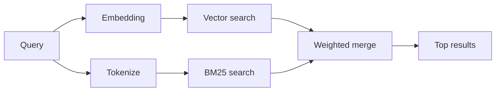

---
read_when:
    - memory_search の仕組みを理解したい
    - 埋め込みプロバイダーを選択したい
    - 検索品質を調整したい
summary: メモリ検索が埋め込みとハイブリッド検索を使用して関連するノートを見つける方法
title: メモリ検索
x-i18n:
    generated_at: "2026-07-05T11:17:04Z"
    model: gpt-5.5
    postprocess_version: locale-links-v1
    provider: openai
    source_hash: 1a29115d09ffc919e48a08e4b1ae4945f40b1e49c71c8a0a63af6f9f5ead1ddc
    source_path: concepts/memory-search.md
    workflow: 16
---

`memory_search` は、元のテキストと表現が異なる場合でも、メモリファイルから関連するノートを見つけます。メモリを小さな断片に分割し、埋め込み、キーワード、またはその両方で検索します。

## クイックスタート

OpenClaw はデフォルトで OpenAI 埋め込みを使用します。別のプロバイダーを使用するには、明示的に設定します。

```json5
{
  agents: {
    defaults: {
      memorySearch: {
        provider: "openai", // or "gemini", "voyage", "mistral", "bedrock", "local", "ollama", "lmstudio", "github-copilot", "openai-compatible"
      },
    },
  },
}
```

`provider` はカスタムの `models.providers.<id>` エントリ（たとえば `ollama-5080`）を参照することもできます。そのエントリが `api` を `"ollama"`、またはメモリ埋め込みアダプターを持つ別のプロバイダー ID に設定している場合に限ります。

API キーなしでローカル埋め込みを使用するには、公式の llama.cpp プロバイダー Plugin をインストールし、`provider: "local"` を設定します。

```bash
openclaw plugins install @openclaw/llama-cpp-provider
```

ソースチェックアウトでは、引き続きネイティブビルドの承認が必要です: `pnpm approve-builds` を実行してから、`pnpm rebuild node-llama-cpp` を実行します。

一部の OpenAI 互換埋め込みエンドポイントでは、検索用の `"query"`、インデックス化されたチャンク用の `"document"`/`"passage"` など、非対称の `input_type` ラベルが必要です。これらは `queryInputType` と `documentInputType` で設定します。詳細は [メモリ設定リファレンス](/ja-JP/reference/memory-config#provider-specific-config) を参照してください。

## サポートされるプロバイダー

| プロバイダー      | ID                  | API キーが必要 | 注記                              |
| ----------------- | ------------------- | ------------- | --------------------------------- |
| Bedrock           | `bedrock`           | いいえ        | AWS 認証情報チェーンを使用        |
| DeepInfra         | `deepinfra`         | はい          | デフォルトモデル `BAAI/bge-m3`    |
| Gemini            | `gemini`            | はい          | 画像/音声のインデックス化をサポート |
| GitHub Copilot    | `github-copilot`    | いいえ        | Copilot サブスクリプションを使用  |
| Local             | `local`             | いいえ        | GGUF モデル、約 0.6 GB を自動ダウンロード |
| LM Studio         | `lmstudio`          | いいえ        | ローカル/セルフホストサーバー     |
| Mistral           | `mistral`           | はい          |                                   |
| Ollama            | `ollama`            | いいえ        | ローカル/セルフホストサーバー     |
| OpenAI            | `openai`            | はい          | デフォルト                        |
| OpenAI-compatible | `openai-compatible` | 通常は必要    | 汎用 `/v1/embeddings` エンドポイント |
| Voyage            | `voyage`            | はい          |                                   |

## 検索の仕組み

OpenClaw は 2 つの取得パスを並列に実行し、結果をマージします。



- **ベクトル検索** は似た意味に一致します（"gateway host" は "the
  machine running OpenClaw" に一致します）。
- **BM25 キーワード検索** は正確な語句（ID、エラー文字列、設定キー）に一致します。

片方のパスしか利用できない場合は、もう片方だけが実行されます。

**FTS のみモード。** 埋め込みを意図的に無効化し、キーワードのみで検索するには `provider: "none"` を設定します。`provider` を未設定のままにするか `"auto"` に設定した場合も、埋め込み認証が構成されていなければ、エラーにせずキーワードのみのランキングにフォールバックします。`provider: "local"`（GGUF/llama.cpp プロバイダー）が失敗した場合も同様です。

**明示的なプロバイダーが利用できない場合。** 他のプロバイダー（たとえば `openai`、`ollama`、`gemini`）を明示的に指定し、それがリクエスト時に利用できなくなった場合（認証不備、ネットワーク障害）、`memory_search` は FTS のみの結果へ暗黙に劣化するのではなく、メモリが利用できないと報告します。これにより、壊れた設定済みプロバイダーが見える状態に保たれます。意図的に FTS のみの想起を行うには `provider: "none"` を設定するか、セマンティックランキングを復旧するためにプロバイダー/認証設定を修正してください。

## 検索品質の改善

大きなノート履歴には、2 つの任意機能が役立ちます。

### 時間減衰

古いノートはランキングの重みが徐々に下がるため、最近の情報が先に表示されます。デフォルトの 30 日の半減期では、先月のノートは元の重みの 50% でスコア付けされます。`MEMORY.md` と `memory/` 配下のその他の日付なしファイルは常緑扱いで、減衰しません。日付付きの `memory/YYYY-MM-DD.md` ファイルだけが減衰します。

<Tip>
エージェントに数か月分の日次ノートがあり、古い情報が最近のコンテキストより上位に出続ける場合は、これを有効にしてください。
</Tip>

### MMR（多様性）

冗長な結果を減らします。5 つのノートがすべて同じルーター設定に言及している場合、MMR は上位結果が繰り返しではなく異なるトピックをカバーするようにします。

<Tip>
`memory_search` が異なる日次ノートからほぼ重複したスニペットを返し続ける場合は、これを有効にしてください。
</Tip>

### 両方を有効化

```json5
{
  agents: {
    defaults: {
      memorySearch: {
        query: {
          hybrid: {
            mmr: { enabled: true },
            temporalDecay: { enabled: true },
          },
        },
      },
    },
  },
}
```

## マルチモーダルメモリ

`gemini-embedding-2-preview` を使用すると、Markdown とあわせて画像と音声をインデックス化できます。これは `memorySearch.extraPaths` 配下のファイルにのみ適用されます。デフォルトのメモリルート（`MEMORY.md`、`memory/*.md`）は Markdown のみのままです。検索クエリはテキストのままですが、視覚コンテンツや音声コンテンツにも一致します。設定については [メモリ設定リファレンス](/ja-JP/reference/memory-config#multimodal-memory-gemini) を参照してください。

## セッションメモリ検索

任意でセッショントランスクリプトをインデックス化し、`memory_search` が以前の会話を想起できるようにします。これはオプトインです。`experimental.sessionMemory: true` を設定し、`sources` に `"sessions"` を追加します（デフォルトの `sources` は `["memory"]` です）。

セッションのヒットは `tools.sessions.visibility` に従います。デフォルトの `"tree"` では、現在のセッションと、それが生成したセッションだけを公開します。別のセッションから、同じエージェントの無関係なセッション（たとえば DM から Gateway によってディスパッチされたセッション）を想起するには、可視性を `"agent"` に広げます。

QMD バックエンドを使用する場合は、トランスクリプトが QMD コレクションにエクスポートされるように、`memory.qmd.sessions.enabled: true` も設定します。`experimental.sessionMemory` と `sources` だけでは、トランスクリプトは QMD にエクスポートされません。詳細は [設定リファレンス](/ja-JP/reference/memory-config#session-memory-search-experimental) を参照してください。

## トラブルシューティング

**結果がありませんか？** インデックスを確認するには `openclaw memory status` を実行します。空の場合は、`openclaw memory index --force` を実行します。

**キーワード一致だけですか？** 埋め込みプロバイダーが構成されていない可能性があります。`openclaw memory status --deep` を確認してください。

**ローカル埋め込みがタイムアウトしますか？** `ollama`、`lmstudio`、`local` はデフォルトで長めのインラインバッチタイムアウトを使用します。ホストが単に遅い場合は、`agents.defaults.memorySearch.sync.embeddingBatchTimeoutSeconds` を設定し、`openclaw memory index --force` を再実行してください。

**CJK テキストが見つかりませんか？** `openclaw memory index --force` で FTS インデックスを再構築してください。

## 関連

- [メモリ概要](/ja-JP/concepts/memory)
- [Active Memory](/ja-JP/concepts/active-memory)
- [組み込みメモリエンジン](/ja-JP/concepts/memory-builtin)
- [メモリ設定リファレンス](/ja-JP/reference/memory-config)
