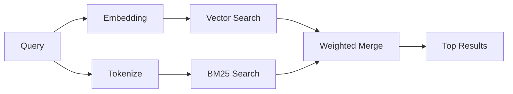

---
read_when:
    - '`memory_search` がどのように動作するかを理解したい場合'
    - 埋め込みプロバイダーを選びたい場合
    - 検索品質を調整したい場合
summary: メモリ検索では、埋め込みとハイブリッド検索を使って関連するノートを見つけます。
title: メモリ検索
x-i18n:
    generated_at: "2026-04-10T04:43:43Z"
    model: gpt-5.4
    provider: openai
    source_hash: ca0237f4f1ee69dcbfb12e6e9527a53e368c0bf9b429e506831d4af2f3a3ac6f
    source_path: concepts/memory-search.md
    workflow: 15
---

# メモリ検索

`memory_search` は、元のテキストと表現が異なる場合でも、メモリファイルから関連するノートを見つけます。メモリを小さなチャンクにインデックス化し、埋め込み、キーワード、またはその両方を使って検索することで動作します。

## クイックスタート

OpenAI、Gemini、Voyage、または Mistral の API キーが設定されていれば、メモリ検索は自動的に動作します。プロバイダーを明示的に設定するには、次のようにします。

```json5
{
  agents: {
    defaults: {
      memorySearch: {
        provider: "openai", // または "gemini"、"local"、"ollama" など
      },
    },
  },
}
```

API キーなしでローカル埋め込みを使用するには、`provider: "local"` を使います（`node-llama-cpp` が必要です）。

## サポートされているプロバイダー

| プロバイダー | ID        | API キーが必要 | 注記                                                  |
| ------------ | --------- | --------------- | ----------------------------------------------------- |
| OpenAI       | `openai`  | はい            | 自動検出、高速                                        |
| Gemini       | `gemini`  | はい            | 画像/音声のインデックス化をサポート                  |
| Voyage       | `voyage`  | はい            | 自動検出                                              |
| Mistral      | `mistral` | はい            | 自動検出                                              |
| Bedrock      | `bedrock` | いいえ          | AWS 認証情報チェーンが解決されると自動検出されます   |
| Ollama       | `ollama`  | いいえ          | ローカル、明示的な設定が必要                         |
| Local        | `local`   | いいえ          | GGUF モデル、約 0.6 GB のダウンロード                |

## 検索の仕組み

OpenClaw は 2 つの検索経路を並列で実行し、結果をマージします。



- **ベクトル検索** は、意味が近いノートを見つけます（「gateway host」が「OpenClaw を実行しているマシン」に一致するなど）。
- **BM25 キーワード検索** は、完全一致を見つけます（ID、エラー文字列、設定キーなど）。

片方の経路しか利用できない場合（埋め込みがない、または FTS がない場合）、もう片方だけで実行されます。

## 検索品質の改善

ノート履歴が大量にある場合、2 つのオプション機能が役立ちます。

### 時間減衰

古いノートはランキングの重みが徐々に下がるため、新しい情報が先に表示されやすくなります。デフォルトの半減期 30 日では、先月のノートは元の重みの 50% でスコアリングされます。`MEMORY.md` のようなエバーグリーンなファイルには減衰は適用されません。

<Tip>
エージェントに数か月分の日次ノートがあり、古い情報が最近のコンテキストより上位に出続ける場合は、時間減衰を有効にしてください。
</Tip>

### MMR（多様性）

重複した結果を減らします。5 つのノートがすべて同じルーター設定に言及している場合、MMR によって上位結果が繰り返しではなく異なるトピックをカバーするようになります。

<Tip>
`memory_search` が異なる日次ノートからほぼ重複したスニペットばかり返す場合は、MMR を有効にしてください。
</Tip>

### 両方を有効にする

```json5
{
  agents: {
    defaults: {
      memorySearch: {
        query: {
          hybrid: {
            mmr: { enabled: true },
            temporalDecay: { enabled: true },
          },
        },
      },
    },
  },
}
```

## マルチモーダルメモリ

Gemini Embedding 2 を使うと、Markdown と並べて画像や音声ファイルをインデックス化できます。検索クエリは引き続きテキストですが、視覚および音声コンテンツに対して一致します。設定方法については、[Memory configuration reference](/ja-JP/reference/memory-config) を参照してください。

## セッションメモリ検索

`memory_search` が以前の会話を想起できるように、セッショントランスクリプトを任意でインデックス化できます。これは `memorySearch.experimental.sessionMemory` によるオプトイン機能です。詳細は [configuration reference](/ja-JP/reference/memory-config) を参照してください。

## トラブルシューティング

**結果が出ない場合** `openclaw memory status` を実行してインデックスを確認してください。空の場合は、`openclaw memory index --force` を実行します。

**キーワード一致しか出ない場合** 埋め込みプロバイダーが設定されていない可能性があります。`openclaw memory status --deep` を確認してください。

**CJK テキストが見つからない場合** `openclaw memory index --force` で FTS インデックスを再構築してください。

## さらに読む

- [Active Memory](/ja-JP/concepts/active-memory) -- 対話型チャットセッション向けのサブエージェントメモリ
- [Memory](/ja-JP/concepts/memory) -- ファイルレイアウト、バックエンド、ツール
- [Memory configuration reference](/ja-JP/reference/memory-config) -- すべての設定項目
