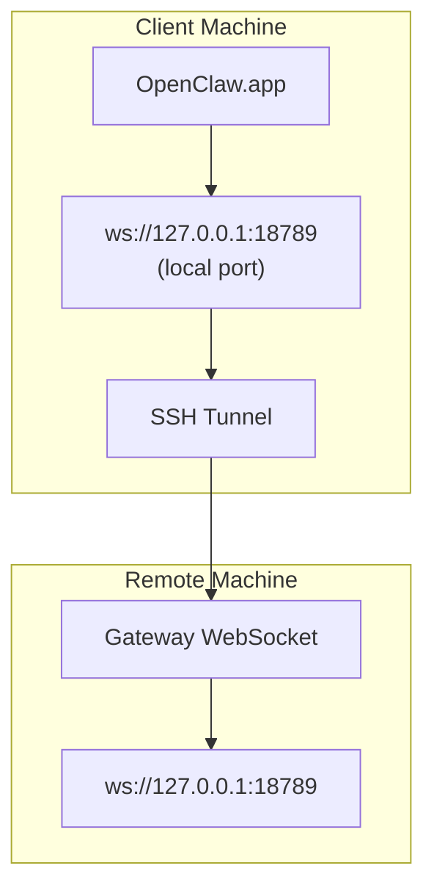

> この内容は[Remote Access](/ja-JP/gateway/remote#macos-persistent-ssh-tunnel-via-launchagent)に統合されました。現在のガイドについては、そのページを参照してください。

# リモートGatewayでOpenClaw.appを実行する

OpenClaw.appは、SSHトンネリングを使用してリモートgatewayに接続します。このガイドでは、そのセットアップ方法を示します。

## 概要



## クイックセットアップ

### ステップ1: SSH設定を追加する

`~/.ssh/config`を編集し、次を追加します。

```ssh
Host remote-gateway
    HostName <REMOTE_IP>          # 例: 172.27.187.184
    User <REMOTE_USER>            # 例: jefferson
    LocalForward 18789 127.0.0.1:18789
    IdentityFile ~/.ssh/id_rsa
```

`<REMOTE_IP>`と`<REMOTE_USER>`を自分の値に置き換えてください。

### ステップ2: SSH鍵をコピーする

公開鍵をリモートマシンへコピーします（パスワード入力は1回だけ）:

```bash
ssh-copy-id -i ~/.ssh/id_rsa <REMOTE_USER>@<REMOTE_IP>
```

### ステップ3: リモートGateway認証を設定する

```bash
openclaw config set gateway.remote.token "<your-token>"
```

リモートgatewayがパスワード認証を使う場合は、代わりに`gateway.remote.password`を使用してください。
`OPENCLAW_GATEWAY_TOKEN`も引き続きシェルレベルの上書きとして有効ですが、永続的な
リモートクライアントセットアップとしては`gateway.remote.token` / `gateway.remote.password`を使います。

### ステップ4: SSHトンネルを開始する

```bash
ssh -N remote-gateway &
```

### ステップ5: OpenClaw.appを再起動する

```bash
# OpenClaw.appを終了（⌘Q）し、その後再度開きます:
open /path/to/OpenClaw.app
```

これで、アプリはSSHトンネル経由でリモートgatewayに接続します。

---

## ログイン時にトンネルを自動起動する

ログイン時にSSHトンネルを自動起動したい場合は、Launch Agentを作成します。

### PLISTファイルを作成する

これを`~/Library/LaunchAgents/ai.openclaw.ssh-tunnel.plist`として保存します。

```xml
<?xml version="1.0" encoding="UTF-8"?>
<!DOCTYPE plist PUBLIC "-//Apple//DTD PLIST 1.0//EN" "http://www.apple.com/DTDs/PropertyList-1.0.dtd">
<plist version="1.0">
<dict>
    <key>Label</key>
    <string>ai.openclaw.ssh-tunnel</string>
    <key>ProgramArguments</key>
    <array>
        <string>/usr/bin/ssh</string>
        <string>-N</string>
        <string>remote-gateway</string>
    </array>
    <key>KeepAlive</key>
    <true/>
    <key>RunAtLoad</key>
    <true/>
</dict>
</plist>
```

### Launch Agentを読み込む

```bash
launchctl bootstrap gui/$UID ~/Library/LaunchAgents/ai.openclaw.ssh-tunnel.plist
```

これでトンネルは次のようになります。

- ログイン時に自動起動する
- クラッシュした場合に再起動する
- バックグラウンドで動作し続ける

レガシー注意: 残っている`com.openclaw.ssh-tunnel` LaunchAgentが存在する場合は削除してください。

---

## トラブルシューティング

**トンネルが動作中か確認する:**

```bash
ps aux | grep "ssh -N remote-gateway" | grep -v grep
lsof -i :18789
```

**トンネルを再起動する:**

```bash
launchctl kickstart -k gui/$UID/ai.openclaw.ssh-tunnel
```

**トンネルを停止する:**

```bash
launchctl bootout gui/$UID/ai.openclaw.ssh-tunnel
```

---

## 仕組み

| コンポーネント | 役割 |
| ------------------------------------ | ------------------------------------------------------------ |
| `LocalForward 18789 127.0.0.1:18789` | ローカルポート18789をリモートポート18789へ転送する |
| `ssh -N`                             | リモートコマンドを実行せずにSSHする（ポート転送のみ） |
| `KeepAlive`                          | クラッシュした場合にトンネルを自動再起動する |
| `RunAtLoad`                          | エージェントの読み込み時にトンネルを起動する |

OpenClaw.appは、クライアントマシン上の`ws://127.0.0.1:18789`に接続します。SSHトンネルは、その接続をGatewayが動作しているリモートマシン上のポート18789へ転送します。

## 関連

- [Remote access](/ja-JP/gateway/remote)
- [Tailscale](/ja-JP/gateway/tailscale)
