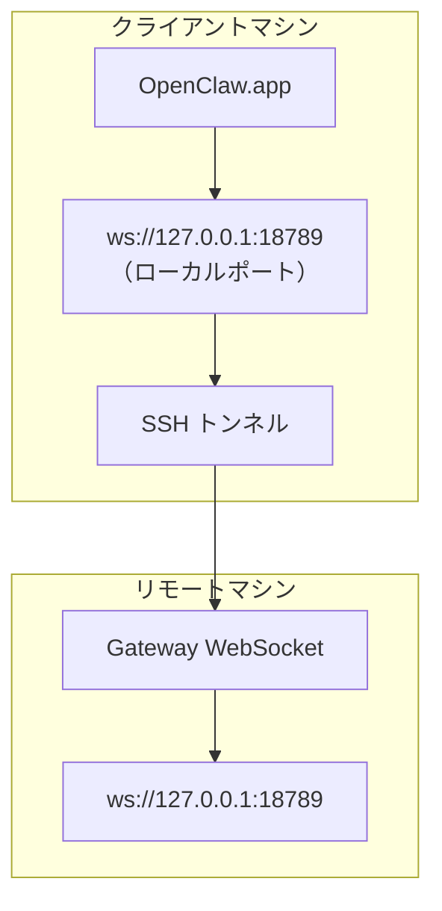

<Note>
このコンテンツは現在、[リモートアクセス](/ja-JP/gateway/remote#macos-persistent-ssh-tunnel-via-launchagent)にあります。最新のガイドについてはそちらのページを参照してください。このページはリダイレクト先として残されています。
</Note>

# リモート Gateway で OpenClaw.app を実行する

OpenClaw.app は SSH トンネル経由でリモート Gateway に接続します。SSH の `LocalForward` により、ローカルポートがリモートホスト上の Gateway WebSocket ポートにマッピングされます。

## セットアップ

1. `LocalForward 18789 127.0.0.1:18789` を指定した SSH 設定エントリを追加します（設定ブロック全体については、[リモートアクセス](/ja-JP/gateway/remote#macos-persistent-ssh-tunnel-via-launchagent)を参照してください）。
2. `ssh-copy-id` を使用して、SSH 鍵をリモートホストにコピーします。
3. `openclaw config set gateway.remote.token "<your-token>"` を使用して、`gateway.remote.token`（または `gateway.remote.password`）を設定します。
4. トンネルを開始します：`ssh -N remote-gateway &`。
5. OpenClaw.app を終了し、再度開きます。

再起動後も維持され、自動的に再接続するトンネルを使用するには、手動の `ssh -N` の代わりに、[リモートアクセス](/ja-JP/gateway/remote#macos-persistent-ssh-tunnel-via-launchagent)ページにある LaunchAgent のセットアップを使用してください。

## 仕組み

| コンポーネント                       | 動作                                                         |
| ------------------------------------ | ------------------------------------------------------------ |
| `LocalForward 18789 127.0.0.1:18789` | ローカルポート 18789 をリモートポート 18789 に転送する       |
| `ssh -N`                             | リモートコマンドを実行せずに SSH を使用する（ポート転送のみ） |
| `KeepAlive`                          | トンネルがクラッシュした場合に自動的に再起動する（LaunchAgent） |
| `RunAtLoad`                          | LaunchAgent の読み込み時にトンネルを開始する（LaunchAgent）  |

OpenClaw.app はクライアント上の `ws://127.0.0.1:18789` に接続します。トンネルは、その接続を Gateway が実行されているリモートホストのポート 18789 に転送します。

## 関連項目

- [リモートアクセス](/ja-JP/gateway/remote)
- [Tailscale](/ja-JP/gateway/tailscale)
