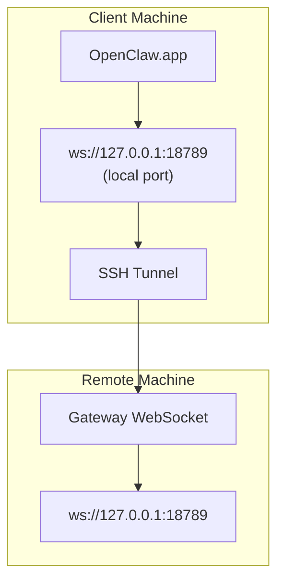

> この内容は[リモートアクセス](/ja-JP/gateway/remote#macos-persistent-ssh-tunnel-via-launchagent)に統合されました。現在のガイドはそのページを参照してください。

# リモート Gateway で OpenClaw.app を実行する

OpenClaw.app は SSH トンネリングを使ってリモート Gateway に接続します。このガイドでは、その設定方法を示します。

## 概要



## クイックセットアップ

### 手順 1: SSH 設定を追加する

`~/.ssh/config` を編集して、次を追加します。

```ssh
Host remote-gateway
    HostName <REMOTE_IP>          # e.g., 172.27.187.184
    User <REMOTE_USER>            # e.g., jefferson
    LocalForward 18789 127.0.0.1:18789
    IdentityFile ~/.ssh/id_rsa
```

`<REMOTE_IP>` と `<REMOTE_USER>` を自分の値に置き換えてください。

### 手順 2: SSH キーをコピーする

公開鍵をリモートマシンにコピーします（一度だけパスワードを入力します）。

```bash
ssh-copy-id -i ~/.ssh/id_rsa <REMOTE_USER>@<REMOTE_IP>
```

### 手順 3: リモート Gateway 認証を設定する

```bash
openclaw config set gateway.remote.token "<your-token>"
```

リモート Gateway がパスワード認証を使う場合は、代わりに `gateway.remote.password` を使用します。
`OPENCLAW_GATEWAY_TOKEN` はシェルレベルの上書きとして引き続き有効ですが、永続的なリモートクライアント設定は `gateway.remote.token` / `gateway.remote.password` です。

### 手順 4: SSH トンネルを開始する

```bash
ssh -N remote-gateway &
```

### 手順 5: OpenClaw.app を再起動する

```bash
# Quit OpenClaw.app (⌘Q), then reopen:
open /path/to/OpenClaw.app
```

これでアプリは SSH トンネル経由でリモート Gateway に接続します。

---

## ログイン時にトンネルを自動開始する

ログイン時に SSH トンネルを自動的に開始するには、Launch Agent を作成します。

### PLIST ファイルを作成する

これを `~/Library/LaunchAgents/ai.openclaw.ssh-tunnel.plist` として保存します。

```xml
<?xml version="1.0" encoding="UTF-8"?>
<!DOCTYPE plist PUBLIC "-//Apple//DTD PLIST 1.0//EN" "http://www.apple.com/DTDs/PropertyList-1.0.dtd">
<plist version="1.0">
<dict>
    <key>Label</key>
    <string>ai.openclaw.ssh-tunnel</string>
    <key>ProgramArguments</key>
    <array>
        <string>/usr/bin/ssh</string>
        <string>-N</string>
        <string>remote-gateway</string>
    </array>
    <key>KeepAlive</key>
    <true/>
    <key>RunAtLoad</key>
    <true/>
</dict>
</plist>
```

### Launch Agent を読み込む

```bash
launchctl bootstrap gui/$UID ~/Library/LaunchAgents/ai.openclaw.ssh-tunnel.plist
```

これでトンネルは次のようになります。

- ログイン時に自動的に開始する
- クラッシュした場合に再起動する
- バックグラウンドで実行し続ける

レガシーメモ: 残っている `com.openclaw.ssh-tunnel` LaunchAgent がある場合は削除してください。

---

## トラブルシューティング

**トンネルが実行中か確認する:**

```bash
ps aux | grep "ssh -N remote-gateway" | grep -v grep
lsof -i :18789
```

**トンネルを再起動する:**

```bash
launchctl kickstart -k gui/$UID/ai.openclaw.ssh-tunnel
```

**トンネルを停止する:**

```bash
launchctl bootout gui/$UID/ai.openclaw.ssh-tunnel
```

---

## 仕組み

| コンポーネント                       | 役割                                                         |
| ------------------------------------ | ------------------------------------------------------------ |
| `LocalForward 18789 127.0.0.1:18789` | ローカルポート 18789 をリモートポート 18789 に転送する       |
| `ssh -N`                             | リモートコマンドを実行しない SSH（ポート転送のみ）           |
| `KeepAlive`                          | クラッシュした場合にトンネルを自動的に再起動する             |
| `RunAtLoad`                          | エージェントの読み込み時にトンネルを開始する                 |

OpenClaw.app はクライアントマシン上の `ws://127.0.0.1:18789` に接続します。SSH トンネルは、その接続を Gateway が実行されているリモートマシンのポート 18789 に転送します。

## 関連

- [リモートアクセス](/ja-JP/gateway/remote)
- [Tailscale](/ja-JP/gateway/tailscale)
