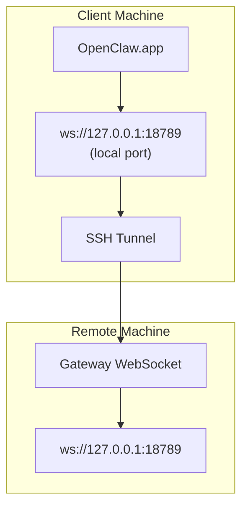

<Note>
この内容は現在、[リモートアクセス](/ja-JP/gateway/remote#macos-persistent-ssh-tunnel-via-launchagent)に移動しています。現在のガイドにはそのページを使用してください。このページはリダイレクト先として残っています。
</Note>

# リモート Gateway で OpenClaw.app を実行する

OpenClaw.app は SSH トンネル経由でリモート Gateway に到達します。SSH の `LocalForward` は、ローカルポートをリモートホスト上の Gateway WebSocket ポートにマップします。

## セットアップ

1. `LocalForward 18789 127.0.0.1:18789` を含む SSH config エントリを追加します（完全な config ブロックについては [リモートアクセス](/ja-JP/gateway/remote#macos-persistent-ssh-tunnel-via-launchagent) を参照してください）。
2. `ssh-copy-id` で SSH キーをリモートホストにコピーします。
3. `openclaw config set gateway.remote.token "<your-token>"` で `gateway.remote.token`（または `gateway.remote.password`）を設定します。
4. トンネルを開始します: `ssh -N remote-gateway &`。
5. OpenClaw.app を終了して再度開きます。

再起動後も維持され、自動的に再接続されるトンネルには、手動の `ssh -N` ではなく、[リモートアクセス](/ja-JP/gateway/remote#macos-persistent-ssh-tunnel-via-launchagent)ページの LaunchAgent セットアップを使用してください。

## 仕組み

| コンポーネント                       | 役割                                                          |
| ------------------------------------ | ------------------------------------------------------------- |
| `LocalForward 18789 127.0.0.1:18789` | ローカルポート 18789 をリモートポート 18789 に転送します      |
| `ssh -N`                             | リモートコマンドを実行しない SSH（ポート転送のみ）            |
| `KeepAlive`                          | クラッシュした場合にトンネルを自動的に再起動します（LaunchAgent） |
| `RunAtLoad`                          | LaunchAgent の読み込み時にトンネルを開始します（LaunchAgent） |

OpenClaw.app はクライアント上の `ws://127.0.0.1:18789` に接続します。トンネルは、その接続を Gateway が動作しているリモートホスト上のポート 18789 に転送します。

## 関連

- [リモートアクセス](/ja-JP/gateway/remote)
- [Tailscale](/ja-JP/gateway/tailscale)
