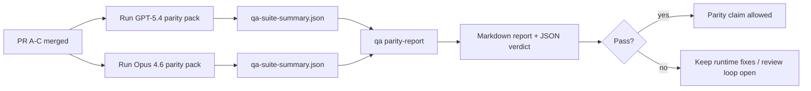

---
x-i18n:
    generated_at: "2026-04-11T15:15:52Z"
    model: gpt-5.4
    provider: openai
    source_hash: 910bcf7668becf182ef48185b43728bf2fa69629d6d50189d47d47b06f807a9e
    source_path: help/gpt54-codex-agentic-parity-maintainers.md
    workflow: 15
---

# GPT-5.4 / Codex パリティ保守担当者向けメモ

このメモでは、元の6つの契約アーキテクチャを維持したまま、GPT-5.4 / Codex パリティプログラムを4つのマージ単位としてレビューする方法を説明します。

## マージ単位

### PR A: 厳格なエージェント実行

担当範囲:

- `executionContract`
- GPT-5優先の同一ターン内フォロースルー
- 非終端の進捗追跡としての `update_plan`
- 計画だけで黙って停止するのではなく、明示的なブロック状態

担当外:

- 認証/ランタイム障害の分類
- 権限に関する真実性
- リプレイ/継続の再設計
- パリティのベンチマーク

### PR B: ランタイムの真実性

担当範囲:

- Codex OAuth スコープの正確性
- 型付きの provider/ランタイム障害分類
- 真実に基づく `/elevated full` の利用可否とブロック理由

担当外:

- ツールスキーマの正規化
- リプレイ/ライブネス状態
- ベンチマークのゲーティング

### PR C: 実行の正確性

担当範囲:

- providerが所有する OpenAI/Codex ツール互換性
- パラメータ不要の厳格なスキーマ処理
- replay-invalid の表面化
- 一時停止、ブロック、放棄された長時間タスク状態の可視化

担当外:

- 自己選択による継続
- provider hook外の一般的な Codex 方言挙動
- ベンチマークのゲーティング

### PR D: パリティハーネス

担当範囲:

- 第1波の GPT-5.4 vs Opus 4.6 シナリオパック
- パリティ文書
- パリティレポートとリリースゲートの仕組み

担当外:

- QA-lab 外でのランタイム挙動変更
- ハーネス内での認証/プロキシ/DNS シミュレーション

## 元の6つの契約への対応関係

| 元の契約                                 | マージ単位 |
| ---------------------------------------- | ---------- |
| provider のトランスポート/認証の正確性   | PR B       |
| ツール契約/スキーマ互換性                | PR C       |
| 同一ターン内実行                         | PR A       |
| 権限に関する真実性                       | PR B       |
| リプレイ/継続/ライブネスの正確性         | PR C       |
| ベンチマーク/リリースゲート             | PR D       |

## レビュー順序

1. PR A
2. PR B
3. PR C
4. PR D

PR D は証明レイヤーです。ランタイム正確性のPRを遅らせる理由にしてはいけません。

## 確認すべき点

### PR A

- GPT-5 の実行は、解説だけで止まるのではなく、行動するかフェイルクローズする
- `update_plan` がそれ自体では進捗に見えなくなる
- 挙動が GPT-5優先かつ埋め込み Pi スコープのままである

### PR B

- 認証/プロキシ/ランタイム障害が、一般的な「model failed」処理にまとめられなくなる
- `/elevated full` は、実際に利用可能な場合にのみ利用可能と説明される
- ブロック理由が、モデルとユーザー向けランタイムの両方から見える

### PR C

- 厳格な OpenAI/Codex ツール登録が予測可能に動作する
- パラメータ不要ツールが厳格なスキーマ検証で失敗しない
- リプレイとコンパクションの結果が、真実に基づくライブネス状態を維持する

### PR D

- シナリオパックが理解しやすく再現可能である
- パックに、読み取り専用フローだけでなく、変更を伴うリプレイ安全性レーンが含まれている
- レポートが人間にも自動化にも読みやすい
- パリティの主張が、逸話ではなく証拠に裏付けられている

PR D の期待成果物:

- 各モデル実行ごとの `qa-suite-report.md` / `qa-suite-summary.json`
- 集約比較とシナリオ単位比較を含む `qa-agentic-parity-report.md`
- 機械可読な判定を含む `qa-agentic-parity-summary.json`

## リリースゲート

以下を満たすまで、GPT-5.4 が Opus 4.6 と同等または優れていると主張してはいけません。

- PR A、PR B、PR C がマージされている
- PR D が第1波パリティパックをクリーンに実行している
- ランタイム真実性の回帰スイートがグリーンを維持している
- パリティレポートで偽成功ケースがなく、停止挙動の回帰もない

パリティハーネスだけが唯一の証拠源ではありません。レビューではこの分割を明確に維持してください。

- PR D は、シナリオベースの GPT-5.4 vs Opus 4.6 比較を担当する
- PR B の決定論的スイートは、認証/プロキシ/DNS とフルアクセスの真実性の証拠を引き続き担当する

## 目標から証拠への対応表

| 完了ゲート項目                           | 主担当      | レビュー成果物                                                     |
| ---------------------------------------- | ----------- | ------------------------------------------------------------------ |
| 計画だけで止まる停滞がない               | PR A        | 厳格なエージェント実行ランタイムテストと `approval-turn-tool-followthrough` |
| 偽の進捗や偽のツール完了がない           | PR A + PR D | パリティの偽成功件数とシナリオ単位レポートの詳細                 |
| 誤った `/elevated full` 案内がない       | PR B        | 決定論的ランタイム真実性スイート                                   |
| リプレイ/ライブネス障害が明示的なまま   | PR C + PR D | ライフサイクル/リプレイスイートと `compaction-retry-mutating-tool` |
| GPT-5.4 が Opus 4.6 と同等以上           | PR D        | `qa-agentic-parity-report.md` と `qa-agentic-parity-summary.json`  |

## レビュワー向け短縮表現: 変更前 vs 変更後

| 変更前のユーザー可視の問題                               | 変更後のレビューシグナル                                                                 |
| -------------------------------------------------------- | ---------------------------------------------------------------------------------------- |
| GPT-5.4 が計画後に停止していた                           | PR A により、解説だけで終わるのではなく、実行またはブロックの挙動が示される            |
| 厳格な OpenAI/Codex スキーマでツール利用が不安定だった   | PR C により、ツール登録とパラメータ不要呼び出しが予測可能に保たれる                    |
| `/elevated full` の案内が時々誤解を招いていた            | PR B により、案内が実際のランタイム能力とブロック理由に結び付けられる                  |
| 長時間タスクがリプレイ/コンパクションの曖昧さに埋もれた | PR C により、paused、blocked、abandoned、replay-invalid の状態が明示的に出力される    |
| パリティの主張が逸話的だった                             | PR D により、両モデルで同じシナリオ範囲を使ったレポートと JSON 判定が生成される       |
