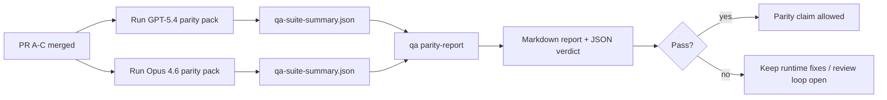

---
read_when:
    - GPT-5.4 / Codex パリティ PR シリーズをレビューする場合
    - パリティプログラムの背後にある 6 つの契約から成るエージェントアーキテクチャを保守する場合
summary: GPT-5.4 / Codex パリティプログラムを 4 つのマージ単位としてレビューする方法
title: GPT-5.4 / Codex パリティのメンテナーノート
x-i18n:
    generated_at: "2026-04-24T05:01:30Z"
    model: gpt-5.4
    provider: openai
    source_hash: 803b62bf5bb6b00125f424fa733e743ecdec7f8410dec0782096f9d1ddbed6c0
    source_path: help/gpt54-codex-agentic-parity-maintainers.md
    workflow: 15
---

このノートでは、元の 6 契約アーキテクチャを失わずに、GPT-5.4 / Codex パリティプログラムを 4 つのマージ単位としてレビューする方法を説明します。

## マージ単位

### PR A: strict-agentic execution

担当:

- `executionContract`
- GPT-5 優先の同一ターン内フォロースルー
- 非終端の進捗追跡としての `update_plan`
- plan だけで黙って停止するのではなく、明示的な blocked 状態

担当しないもの:

- 認証/ランタイム失敗の分類
- 権限の truthfulness
- replay/continuation の再設計
- パリティベンチマーク

### PR B: runtime truthfulness

担当:

- Codex OAuth スコープの正確性
- 型付き provider/runtime 失敗分類
- 真実に即した `/elevated full` の利用可否と blocked reason

担当しないもの:

- ツールスキーマの正規化
- replay/liveness 状態
- ベンチマークゲート

### PR C: execution correctness

担当:

- provider 所有の OpenAI/Codex ツール互換性
- パラメータなし strict schema 処理
- replay-invalid の表面化
- paused、blocked、abandoned な長時間タスク状態の可視化

担当しないもの:

- 自己選択された continuation
- provider hook 外での汎用 Codex 方言挙動
- ベンチマークゲート

### PR D: parity harness

担当:

- 第 1 波 GPT-5.4 vs Opus 4.6 シナリオパック
- パリティドキュメント
- パリティレポートとリリースゲート機構

担当しないもの:

- QA-lab 外でのランタイム挙動変更
- harness 内での auth/proxy/DNS シミュレーション

## 元の 6 契約への対応

| 元の契約                        | マージ単位 |
| ---------------------------------------- | ---------- |
| Provider transport/auth correctness      | PR B       |
| Tool contract/schema compatibility       | PR C       |
| Same-turn execution                      | PR A       |
| Permission truthfulness                  | PR B       |
| Replay/continuation/liveness correctness | PR C       |
| Benchmark/release gate                   | PR D       |

## レビュー順序

1. PR A
2. PR B
3. PR C
4. PR D

PR D は証明レイヤーです。ランタイム正確性 PR を遅らせる理由にしてはいけません。

## 確認すべき点

### PR A

- GPT-5 実行が、コメントだけで止まらず、行動するか fail closed する
- `update_plan` が、それ自体では進捗に見えなくなる
- 挙動が GPT-5 優先かつ embedded-Pi スコープに留まっている

### PR B

- auth/proxy/runtime 失敗が、一般的な「model failed」処理に潰されなくなる
- `/elevated full` が、実際に利用可能なときだけ利用可能と説明される
- blocked reason が、モデルとユーザー向けランタイムの両方に見える

### PR C

- strict OpenAI/Codex ツール登録が予測可能に動作する
- パラメータなしツールが strict schema チェックに失敗しない
- replay と Compaction の結果が、truthful な liveness 状態を保持する

### PR D

- シナリオパックが理解しやすく再現可能である
- パックに、読み取り専用フローだけでなく、変更を伴う replay-safety レーンが含まれている
- レポートが人間にも自動化にも読める
- パリティ主張が逸話ではなく根拠に裏付けられている

PR D から期待される成果物:

- 各モデル実行ごとの `qa-suite-report.md` / `qa-suite-summary.json`
- 集計およびシナリオレベル比較を含む `qa-agentic-parity-report.md`
- 機械可読 verdict を含む `qa-agentic-parity-summary.json`

## リリースゲート

以下を満たすまで、GPT-5.4 が Opus 4.6 と同等または優位だと主張しないでください。

- PR A、PR B、PR C がマージされている
- PR D が第 1 波パリティパックをクリーンに実行している
- runtime-truthfulness 回帰スイートが green のままである
- パリティレポートに fake-success ケースがなく、stop 挙動の回帰もない

パリティ harness は唯一の証拠源ではありません。レビューではこの分離を明示的に保ってください。

- PR D は、シナリオベースの GPT-5.4 vs Opus 4.6 比較を担当
- PR B の決定的スイートは、引き続き auth/proxy/DNS と full-access truthfulness の証拠を担当

## 目標と証拠の対応表

| 完了ゲート項目                     | 主担当 | レビュー成果物                                                     |
| ---------------------------------------- | ------------- | ------------------------------------------------------------------- |
| plan だけで停止しない                      | PR A          | strict-agentic ランタイムテストと `approval-turn-tool-followthrough` |
| 偽の進捗や偽のツール完了がない | PR A + PR D   | parity fake-success 件数とシナリオレベルのレポート詳細        |
| 偽の `/elevated full` ガイダンスがない       | PR B          | 決定的 runtime-truthfulness スイート                           |
| replay/liveness 失敗が明示的なままである | PR C + PR D   | lifecycle/replay スイートと `compaction-retry-mutating-tool`       |
| GPT-5.4 が Opus 4.6 と同等以上        | PR D          | `qa-agentic-parity-report.md` と `qa-agentic-parity-summary.json`  |

## レビュアー向け省略メモ: before vs after

| 変更前のユーザー可視の問題                                 | 変更後のレビューシグナル                                                                     |
| ----------------------------------------------------------- | --------------------------------------------------------------------------------------- |
| GPT-5.4 が planning の後で止まっていた                              | PR A で commentary-only completion ではなく、act-or-block 挙動が示される                  |
| strict OpenAI/Codex schema でツール利用が脆く感じられた      | PR C がツール登録とパラメータなし呼び出しを予測可能に保つ                  |
| `/elevated full` のヒントが時々誤解を招いていた            | PR B がガイダンスを実際のランタイム能力と blocked reason に結び付ける                     |
| 長時間タスクが replay/Compaction の曖昧さの中に消えることがあった | PR C が paused、blocked、abandoned、replay-invalid 状態を明示的に出力する                |
| パリティ主張が逸話的だった                                | PR D が、両モデルで同じシナリオカバレッジを持つレポートと JSON verdict を生成する |

## 関連

- [GPT-5.4 / Codex agentic parity](/ja-JP/help/gpt54-codex-agentic-parity)
