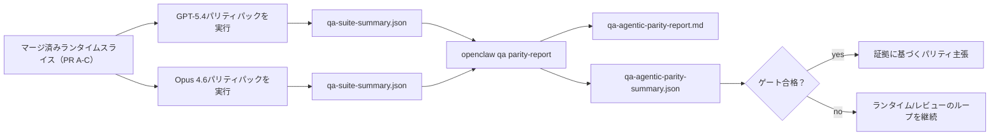

---
x-i18n:
    generated_at: "2026-04-11T15:15:52Z"
    model: gpt-5.4
    provider: openai
    source_hash: 7ee6b925b8a0f8843693cea9d50b40544657b5fb8a9e0860e2ff5badb273acb6
    source_path: help/gpt54-codex-agentic-parity.md
    workflow: 15
---

# OpenClawにおけるGPT-5.4 / Codexエージェント性パリティ

OpenClawはすでにツールを使う最先端モデルとうまく連携できていましたが、GPT-5.4やCodex系モデルには、実運用でまだいくつかの弱点がありました。

- 計画だけ立てて作業を実行せずに止まることがある
- 厳格なOpenAI/Codexツールスキーマを誤って扱うことがある
- フルアクセスが不可能な場合でも`/elevated full`を要求することがある
- リプレイやコンパクション中に長時間タスクの状態を失うことがある
- Claude Opus 4.6とのパリティ主張が、再現可能なシナリオではなく逸話に基づいていた

このパリティプログラムは、これらのギャップを4つのレビュー可能なスライスで解消します。

## 変更内容

### PR A: 厳格なエージェント実行

このスライスでは、埋め込みPiのGPT-5実行向けに、オプトインの`strict-agentic`実行契約を追加します。

有効にすると、OpenClawは計画だけのターンを「十分な完了」として受け入れなくなります。モデルが何をするつもりかだけを述べ、実際にはツールを使わず進捗も出さない場合、OpenClawは「今すぐ行動する」よう促して再試行し、それでも進まなければタスクを黙って終了するのではなく、明示的なblocked状態でクローズドフェイルします。

これは特に、次のようなケースでGPT-5.4の体験を改善します。

- 短い「ok do it」のフォローアップ
- 最初の一手が明白なコードタスク
- `update_plan`が埋め草テキストではなく進捗追跡であるべきフロー

### PR B: ランタイムの真実性

このスライスにより、OpenClawは次の2点について正確に伝えるようになります。

- provider/runtime呼び出しが失敗した理由
- `/elevated full`が実際に利用可能かどうか

これによりGPT-5.4は、スコープ不足、認証更新失敗、HTML 403認証失敗、プロキシ問題、DNSやタイムアウト障害、そしてブロックされたフルアクセスモードについて、より適切なランタイムシグナルを受け取れます。モデルが誤った対処法を幻覚したり、ランタイムが提供できない権限モードを繰り返し要求したりする可能性が低くなります。

### PR C: 実行の正確性

このスライスでは、2種類の正確性を改善します。

- provider側が所有するOpenAI/Codexツールスキーマ互換性
- リプレイと長時間タスクの生存状態の可視化

ツール互換性の改善により、厳格なOpenAI/Codexツール登録におけるスキーマ摩擦が軽減されます。特に、パラメーターなしツールやstrict object-root期待値まわりで効果があります。リプレイ/生存状態まわりの改善により、長時間タスクの状態をより観測しやすくなり、一時停止、blocked、abandoned状態が、汎用的な失敗テキストの中に埋もれずに見えるようになります。

### PR D: パリティハーネス

このスライスでは、GPT-5.4とOpus 4.6を同じシナリオで実行し、共有された証拠を使って比較できるようにする、最初のQA-labパリティパックを追加します。

このパリティパックは証明レイヤーです。これ自体ではランタイム挙動は変えません。

`qa-suite-summary.json`アーティファクトを2つ用意したら、次のコマンドでリリースゲート比較を生成します。

```bash
pnpm openclaw qa parity-report \
  --repo-root . \
  --candidate-summary .artifacts/qa-e2e/gpt54/qa-suite-summary.json \
  --baseline-summary .artifacts/qa-e2e/opus46/qa-suite-summary.json \
  --output-dir .artifacts/qa-e2e/parity
```

このコマンドは次を出力します。

- 人間が読めるMarkdownレポート
- 機械可読なJSON判定
- 明示的な`pass` / `fail`ゲート結果

## これが実際のGPT-5.4をどう改善するか

この作業以前、OpenClaw上のGPT-5.4は、実際のコーディングセッションではOpusよりエージェント性が低く感じられることがありました。理由は、GPT-5系モデルにとって特に有害な挙動をランタイムが許容していたためです。

- コメントだけのターン
- ツール周りのスキーマ摩擦
- あいまいな権限フィードバック
- リプレイやコンパクションの破綻が黙って起きること

目標は、GPT-5.4にOpusを模倣させることではありません。目標は、実際の進捗を報い、よりクリーンなツールと権限のセマンティクスを提供し、失敗モードを機械可読かつ人間可読な明示的状態へ変換するランタイム契約をGPT-5.4に与えることです。

これにより、ユーザー体験は次のように変わります。

- 「モデルはよい計画を立てたが止まった」

から、

- 「モデルは実行した、またはOpenClawが実行できなかった正確な理由を表示した」

へ。

## GPT-5.4ユーザーにとってのBefore / After

| このプログラム以前 | PR A-D以後 |
| ---------------------------------------------------------------------------------------------- | ---------------------------------------------------------------------------------------- |
| GPT-5.4は妥当な計画の後、次のツール操作を行わずに止まることがあった | PR Aにより「計画だけ」は「今すぐ実行するか、blocked状態を表示するか」に変わる |
| 厳格なツールスキーマにより、パラメーターなしツールやOpenAI/Codex型ツールがわかりにくい形で拒否されることがあった | PR Cによりprovider側が所有するツール登録と呼び出しの予測可能性が向上する |
| `/elevated full`の案内が、ブロックされたランタイムではあいまいまたは誤っていることがあった | PR BによりGPT-5.4とユーザーに対して正確なランタイム情報と権限ヒントを提供する |
| リプレイやコンパクションの失敗により、タスクが黙って消えたように感じられることがあった | PR Cによりpaused、blocked、abandoned、replay-invalidの結果が明示的に表示される |
| 「GPT-5.4はOpusより悪く感じる」はほぼ逸話だった | PR Dにより、同じシナリオパック、同じメトリクス、厳格なpass/failゲートに変わる |

## アーキテクチャ


## リリースフロー



## シナリオパック

最初のパリティパックでは現在、5つのシナリオをカバーしています。

### `approval-turn-tool-followthrough`

短い承認の後、モデルが「それをやります」で止まらないことを確認します。同じターンで最初の具体的アクションを取る必要があります。

### `model-switch-tool-continuity`

モデル/ランタイムの切り替え境界をまたいでも、ツールを使う作業がコメントに戻ったり実行コンテキストを失ったりせず、一貫して継続することを確認します。

### `source-docs-discovery-report`

モデルがソースとドキュメントを読み、知見を統合し、薄い要約を出して早期停止するのではなく、エージェント的にタスクを継続できることを確認します。

### `image-understanding-attachment`

添付ファイルを含む混合モードのタスクが、あいまいな説明に崩れず、実行可能な形を保つことを確認します。

### `compaction-retry-mutating-tool`

実際に変更を書き込むタスクにおいて、実行がコンパクト化・再試行されたり、負荷下で応答状態を失ったりした場合でも、リプレイ安全でないことが黙ってリプレイ安全に見えるようにならず、明示されたままであることを確認します。

## シナリオマトリクス

| シナリオ | 何をテストするか | 良いGPT-5.4の挙動 | 失敗シグナル |
| ---------------------------------- | --------------------------------------- | ------------------------------------------------------------------------------ | ------------------------------------------------------------------------------ |
| `approval-turn-tool-followthrough` | 計画の後の短い承認ターン | 意図を言い直すのではなく、最初の具体的なツール操作を即座に開始する | 計画だけのフォローアップ、ツール活動なし、または本当のブロッカーなしのblockedターン |
| `model-switch-tool-continuity` | ツール使用中のランタイム/モデル切り替え | タスクコンテキストを保ち、一貫して行動を継続する | コメントに戻る、ツールコンテキストを失う、または切り替え後に停止する |
| `source-docs-discovery-report` | ソース読解 + 統合 + 実行 | ソースを見つけ、ツールを使い、停止せずに有用なレポートを生成する | 薄い要約、ツール作業不足、または不完全なターンでの停止 |
| `image-understanding-attachment` | 添付ファイル駆動のエージェント作業 | 添付ファイルを解釈し、ツールにつなげてタスクを継続する | あいまいな説明、添付ファイルの無視、または具体的な次アクションなし |
| `compaction-retry-mutating-tool` | コンパクション圧力下での変更系作業 | 実際の書き込みを行い、副作用の後もリプレイ安全でないことを明示し続ける | 変更書き込みは発生するが、リプレイ安全性が示唆される、欠落する、または矛盾する |

## リリースゲート

マージ済みランタイムがパリティパックとランタイム真実性のリグレッションを同時に通過した場合にのみ、GPT-5.4はパリティ以上と見なせます。

必要な結果:

- 次のツール操作が明確なときに、計画だけで停止しない
- 実際の実行なしに完了を偽装しない
- 誤った`/elevated full`案内をしない
- リプレイやコンパクションによるabandonmentが黙って起きない
- 合意済みのOpus 4.6ベースライン以上のパリティパックメトリクスを満たす

最初のハーネスでは、ゲートは次を比較します。

- completion rate
- unintended-stop rate
- valid-tool-call rate
- fake-success count

パリティ証拠は意図的に2つのレイヤーに分割されています。

- PR Dは、QA-labにより同一シナリオでのGPT-5.4とOpus 4.6の挙動を証明する
- PR Bの決定論的スイートは、ハーネス外でauth、proxy、DNS、および`/elevated full`の真実性を証明する

## 目標と証拠のマトリクス

| 完了ゲート項目 | 所有PR | 証拠ソース | 合格シグナル |
| -------------------------------------------------------- | ----------- | ------------------------------------------------------------------ | ---------------------------------------------------------------------------------------- |
| GPT-5.4が計画後に停止しなくなった | PR A | `approval-turn-tool-followthrough`とPR Aのランタイムスイート | 承認ターンで実際の作業が始まるか、明示的なblocked状態になる |
| GPT-5.4が偽の進捗や偽のツール完了を示さなくなった | PR A + PR D | パリティレポートのシナリオ結果とfake-success count | 疑わしい成功結果がなく、コメントだけの完了もない |
| GPT-5.4が誤った`/elevated full`案内をしなくなった | PR B | 決定論的真実性スイート | blocked理由とフルアクセスヒントがランタイムに対して正確であり続ける |
| リプレイ/生存状態の失敗が明示されたままになる | PR C + PR D | PR Cのライフサイクル/リプレイスイートと`compaction-retry-mutating-tool` | 変更系作業で、リプレイ安全でないことが黙って消えず明示されたままになる |
| GPT-5.4が合意済みメトリクスでOpus 4.6に並ぶか上回る | PR D | `qa-agentic-parity-report.md`と`qa-agentic-parity-summary.json` | 同じシナリオ範囲をカバーし、completion、停止挙動、有効なツール使用でリグレッションがない |

## パリティ判定の読み方

最初のパリティパックにおける最終的な機械可読判定として、`qa-agentic-parity-summary.json`の判定を使用してください。

- `pass`は、GPT-5.4がOpus 4.6と同じシナリオをカバーし、合意済みの集計メトリクスでリグレッションを起こしていないことを意味します。
- `fail`は、少なくとも1つのハードゲートが発火したことを意味します。たとえば、completionの弱化、意図しない停止の悪化、有効なツール使用の弱化、fake-successケースの発生、またはシナリオカバレッジの不一致です。
- 「shared/base CI issue」は、それ自体ではパリティ結果ではありません。PR Dの外側にあるCIノイズが実行を妨げた場合、判定はブランチ時代のログから推定するのではなく、クリーンなマージ済みランタイム実行を待つべきです。
- auth、proxy、DNS、および`/elevated full`の真実性は引き続きPR Bの決定論的スイートから得られるため、最終的なリリース主張には両方が必要です。つまり、PR Dのパリティ判定がpassであり、PR Bの真実性カバレッジもグリーンである必要があります。

## `strict-agentic`を有効にすべき人

次のような場合は`strict-agentic`を使用してください。

- 次の一手が明白なときに、エージェントが即座に行動することを期待する
- GPT-5.4またはCodex系モデルが主要なランタイムである
- 「親切な」要約だけの応答よりも、明示的なblocked状態を優先したい

次のような場合はデフォルト契約を維持してください。

- 既存の、より緩い挙動を望む
- GPT-5系モデルを使っていない
- ランタイム強制ではなくプロンプトをテストしている
