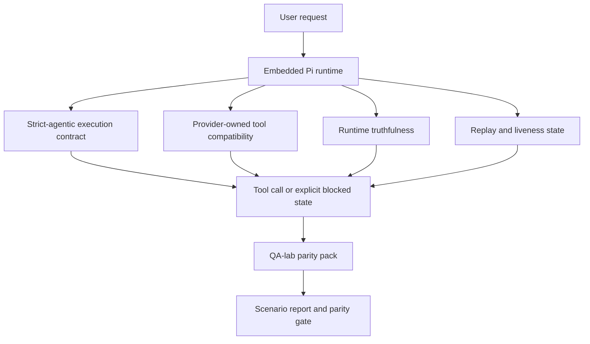
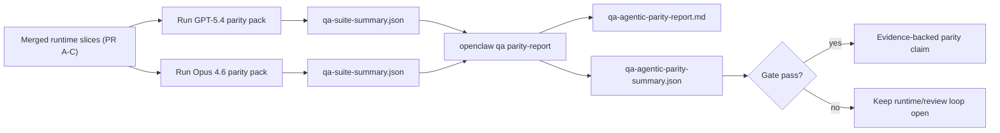

---
read_when:
    - GPT-5.4またはCodexのエージェント動作をデバッグしている場合
    - フロンティアモデル間でOpenClawのエージェント動作を比較している場合
    - strict-agentic、ツールスキーマ、elevation、およびreplay修正をレビューしている場合
summary: OpenClawがGPT-5.4およびCodex系モデルのエージェント実行ギャップをどのように埋めるか
title: GPT-5.4 / Codexのエージェント機能同等性
x-i18n:
    generated_at: "2026-04-24T05:01:42Z"
    model: gpt-5.4
    provider: openai
    source_hash: 9f8c7dcf21583e6dbac80da9ddd75f2dc9af9b80801072ade8fa14b04258d4dc
    source_path: help/gpt54-codex-agentic-parity.md
    workflow: 15
---

# OpenClawにおけるGPT-5.4 / Codexのエージェント機能同等性

OpenClawはすでにツール利用型のフロンティアモデルとうまく連携していましたが、GPT-5.4とCodex系モデルは、実運用上いくつかの点でまだ性能不足でした。

- 作業を実行せず、計画だけで止まることがある
- strictなOpenAI/Codexツールスキーマを誤って使うことがある
- フルアクセスが不可能な場合でも`/elevated full`を求めることがある
- replayやCompaction中に長時間タスクの状態を失うことがある
- Claude Opus 4.6との同等性主張が、再現可能なシナリオではなく逸話ベースだった

この同等性プログラムは、これらのギャップを4つのレビュー可能なスライスで修正します。

## 変更点

### PR A: strict-agentic実行

このスライスでは、組み込みPi GPT-5実行向けにオプトインの`strict-agentic`実行コントラクトを追加します。

有効にすると、OpenClawは計画だけのターンを「十分に良い」完了として受け入れなくなります。モデルが意図だけを述べ、実際にはツールを使わず進捗も出さない場合、OpenClawはact-nowの誘導付きで再試行し、それでもだめなら、タスクを静かに終了する代わりに、明示的なblocked状態でfail closedします。

これにより、特に次の場面でGPT-5.4の体験が向上します。

- 短い「ok do it」フォローアップ
- 最初の一歩が明確なコード作業
- `update_plan`が埋め草ではなく進捗追跡であるべきフロー

### PR B: ランタイムの真実性

このスライスでは、OpenClawが次の2点について真実を伝えるようにします。

- プロバイダー/ランタイム呼び出しが失敗した理由
- `/elevated full`が実際に利用可能かどうか

つまり、GPT-5.4は、スコープ不足、auth更新失敗、HTML 403認証失敗、プロキシ問題、DNSまたはタイムアウト失敗、フルアクセスモードのブロックに対して、より良いランタイムシグナルを得られます。モデルは、誤った修復方法を幻覚しにくくなり、ランタイムが提供できない権限モードを求め続けることも減ります。

### PR C: 実行の正しさ

このスライスでは、2種類の正しさを改善します。

- プロバイダー所有のOpenAI/Codexツールスキーマ互換性
- replayと長時間タスクの生存状態の可視化

ツール互換性の作業により、strictなOpenAI/Codexツール登録でのスキーマ摩擦が減ります。特に、パラメータなしツールやstrictなオブジェクトルート期待値まわりが改善されます。replay/生存状態の作業により、長時間タスクがより観測可能になり、paused、blocked、abandoned状態が一般的な失敗文言に埋もれず可視化されます。

### PR D: 同等性ハーネス

このスライスでは、第一波のQA-lab同等性パックを追加し、GPT-5.4とOpus 4.6を同じシナリオで実行し、共有された証拠で比較できるようにします。

同等性パックは証明層です。これ自体でランタイム動作は変更しません。

2つの`qa-suite-summary.json`アーティファクトがそろったら、次でリリースゲート比較を生成します。

```bash
pnpm openclaw qa parity-report \
  --repo-root . \
  --candidate-summary .artifacts/qa-e2e/gpt54/qa-suite-summary.json \
  --baseline-summary .artifacts/qa-e2e/opus46/qa-suite-summary.json \
  --output-dir .artifacts/qa-e2e/parity
```

このコマンドは次を書き出します。

- 人が読めるMarkdownレポート
- 機械可読なJSON判定
- 明示的な`pass` / `fail`ゲート結果

## これが実際にGPT-5.4をどう改善するか

この作業以前、OpenClaw上のGPT-5.4は、実際のコーディングセッションでOpusよりエージェント的でないと感じられることがありました。なぜなら、ランタイムがGPT-5系モデルに特に有害な挙動を許容していたからです。

- コメントだけのターン
- ツールまわりのスキーマ摩擦
- あいまいな権限フィードバック
- replayやCompactionの無言の破損

目的は、GPT-5.4をOpusの模倣にすることではありません。目的は、GPT-5.4に対して、実際の進捗を報い、より明確なツールおよび権限セマンティクスを提供し、失敗モードを機械可読かつ人間可読な明示状態へ変換するランタイムコントラクトを与えることです。

これにより、ユーザー体験は次のように変わります。

- 「モデルは良い計画を立てたが止まった」

から

- 「モデルは実行した、あるいはOpenClawが実行できなかった正確な理由を表面化した」

へ

## GPT-5.4ユーザーにとってのBefore / After

| このプログラム以前 | PR A-D以後 |
| ---------------------------------------------------------------------------------------------- | ---------------------------------------------------------------------------------------- |
| GPT-5.4は、妥当な計画の後に次のツールステップを取らず止まることがあった | PR Aにより、「計画のみ」は「今すぐ実行するか、blocked状態を表面化するか」になる |
| strictなツールスキーマが、パラメータなしツールやOpenAI/Codex形状ツールを分かりにくく拒否することがあった | PR Cにより、プロバイダー所有のツール登録と呼び出しがより予測可能になる |
| `/elevated full`のガイダンスが、ブロックされたランタイムで曖昧または誤っていることがあった | PR Bにより、GPT-5.4とユーザーへ真実のランタイムおよび権限ヒントを与える |
| replayやCompactionの失敗で、タスクが静かに消えたように感じられることがあった | PR Cにより、paused、blocked、abandoned、およびreplay-invalidの結果が明示的に表面化される |
| 「GPT-5.4はOpusより悪い気がする」は、ほぼ逸話だった | PR Dにより、それが同じシナリオパック、同じメトリクス、明確なpass/failゲートになる |

## アーキテクチャ



## リリースフロー



## シナリオパック

現在の第一波同等性パックは、5つのシナリオを対象としています。

### `approval-turn-tool-followthrough`

短い承認の後に、モデルが「そうします」で止まらないことを確認します。同じターン内で最初の具体的アクションを取るべきです。

### `model-switch-tool-continuity`

ツール利用作業が、モデル/ランタイム切り替え境界をまたいでも整合性を保ち、コメントに戻ったり実行コンテキストを失ったりしないことを確認します。

### `source-docs-discovery-report`

モデルがソースとドキュメントを読み、発見を統合し、薄い要約だけを出して早く止まるのではなく、エージェント的にタスクを続行できることを確認します。

### `image-understanding-attachment`

添付を伴う混合モードのタスクが、曖昧な説明へ崩れず、実行可能性を保つことを確認します。

### `compaction-retry-mutating-tool`

実際に変更を伴う書き込みを含むタスクが、Compaction、再試行、またはreply状態の喪失が起きても、静かにreplay-safeに見えてしまうのではなく、replay不安全性を明示したまま保つことを確認します。

## シナリオマトリクス

| シナリオ | テスト内容 | 良いGPT-5.4の挙動 | 失敗シグナル |
| ---------------------------------- | --------------------------------------- | ------------------------------------------------------------------------------ | ------------------------------------------------------------------------------ |
| `approval-turn-tool-followthrough` | 計画後の短い承認ターン | 意図を言い換える代わりに、最初の具体的ツールアクションを即座に開始する | 計画だけのフォローアップ、ツールアクティビティなし、または実際のブロッカーなしのblockedターン |
| `model-switch-tool-continuity`     | ツール利用下でのランタイム/モデル切り替え | タスクコンテキストを保持し、整合的に実行を継続する | コメントへリセットする、ツールコンテキストを失う、または切り替え後に止まる |
| `source-docs-discovery-report`     | ソース読解 + 統合 + 実行 | ソースを見つけ、ツールを使い、失速せず有用なレポートを作る | 薄い要約、ツール作業不足、または不完全ターン停止 |
| `image-understanding-attachment`   | 添付主導のエージェント作業 | 添付を解釈し、ツールへ結び付け、タスクを継続する | 曖昧な説明、添付の無視、または具体的な次アクションなし |
| `compaction-retry-mutating-tool`   | Compaction圧下での変更作業 | 実際の書き込みを行い、副作用後もreplay不安全性を明示したままにする | 変更書き込みは起きたが、replay安全性が暗示される、欠落する、または矛盾する |

## リリースゲート

GPT-5.4が同等またはそれ以上と見なされるのは、マージ済みランタイムが同等性パックとランタイム真実性の回帰を同時に通過した場合のみです。

必要な結果:

- 次のツールアクションが明確なときに、計画だけで停止しない
- 実際の実行なしに偽の完了をしない
- 誤った`/elevated full`ガイダンスを出さない
- replayまたはCompactionの無言の放棄がない
- 合意済みOpus 4.6ベースラインと少なくとも同等の同等性パックメトリクス

第一波ハーネスでは、ゲートは次を比較します。

- 完了率
- 意図しない停止率
- 有効ツール呼び出し率
- 偽成功数

同等性の証拠は意図的に2層へ分かれています。

- PR Dは、QA-labにより同一シナリオでのGPT-5.4対Opus 4.6挙動を証明する
- PR Bの決定的スイートは、ハーネス外でのauth、プロキシ、DNS、および`/elevated full`の真実性を証明する

## 目標と証拠のマトリクス

| 完了ゲート項目 | 所有PR | 証拠ソース | パスシグナル |
| -------------------------------------------------------- | ----------- | ------------------------------------------------------------------ | ---------------------------------------------------------------------------------------- |
| GPT-5.4が計画後に停止しなくなる | PR A | `approval-turn-tool-followthrough`およびPR Aランタイムスイート | 承認ターンが実際の作業、または明示的なblocked状態を引き起こす |
| GPT-5.4が偽の進捗や偽のツール完了をしなくなる | PR A + PR D | 同等性レポートのシナリオ結果と偽成功数 | 疑わしい成功結果がなく、コメントだけの完了もない |
| GPT-5.4が誤った`/elevated full`ガイダンスを出さなくなる | PR B | 決定的な真実性スイート | blocked理由とフルアクセスヒントがランタイムに対して正確なまま |
| replay/生存状態の失敗が明示されたままになる | PR C + PR D | PR Cライフサイクル/replayスイートおよび`compaction-retry-mutating-tool` | 変更作業が、静かに消えるのではなく、replay不安全性を明示したまま保つ |
| GPT-5.4が合意済みメトリクスでOpus 4.6に並ぶか上回る | PR D | `qa-agentic-parity-report.md`および`qa-agentic-parity-summary.json` | 同じシナリオ対象範囲で、完了、停止挙動、有効ツール利用に回帰がない |

## 同等性判定の読み方

第一波同等性パックにおける最終的な機械可読判定として、`qa-agentic-parity-summary.json`内の判定を使用してください。

- `pass`は、GPT-5.4がOpus 4.6と同じシナリオをカバーし、合意された集約メトリクスで回帰しなかったことを意味します。
- `fail`は、少なくとも1つのハードゲートが発火したことを意味します。たとえば、完了率の低下、意図しない停止の悪化、有効ツール利用の低下、偽成功ケースの発生、またはシナリオ対象範囲の不一致です。
- 「shared/base CI issue」は、それ自体では同等性結果ではありません。PR Dの外側にあるCIノイズが実行を妨げた場合、判定はブランチ時代のログから推測するのではなく、クリーンなマージ済みランタイム実行を待つべきです。
- auth、プロキシ、DNS、および`/elevated full`の真実性は、引き続きPR Bの決定的スイートから得られるため、最終的なリリース主張には両方が必要です。つまり、PR Dの同等性判定がpassであり、PR Bの真実性カバレッジがgreenであることです。

## `strict-agentic`を有効にすべき人

次の場合は`strict-agentic`を使用してください。

- 次のステップが明白なときに、エージェントが即座に実行することを期待している
- GPT-5.4またはCodex系モデルが主要ランタイムである
- 「親切な」要約だけの返信より、明示的なblocked状態を好む

次の場合はデフォルトコントラクトのままにしてください。

- 既存のより緩い動作を望む
- GPT-5系モデルを使っていない
- ランタイム強制ではなくプロンプトをテストしている

## 関連

- [GPT-5.4 / Codex parity maintainer notes](/ja-JP/help/gpt54-codex-agentic-parity-maintainers)
