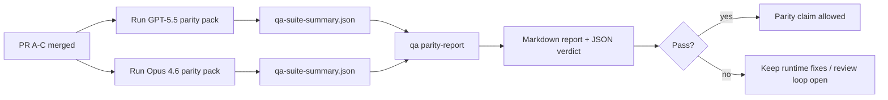

---
read_when:
    - GPT-5.5 / Codex パリティPRシリーズのレビュー
    - パリティプログラムを支える6つのコントラクトによるagenticアーキテクチャの維持
summary: GPT-5.5 / Codex パリティプログラムを4つのマージ単位としてレビューする方法
title: GPT-5.5 / Codex パリティのメンテナー向けメモ
x-i18n:
    generated_at: "2026-04-25T18:18:26Z"
    model: gpt-5.4
    provider: openai
    source_hash: 8de69081f5985954b88583880c36388dc47116c3351c15d135b8ab3a660058e3
    source_path: help/gpt55-codex-agentic-parity-maintainers.md
    workflow: 15
---

このメモでは、元の6つのコントラクトによるアーキテクチャを失わずに、GPT-5.5 / Codex パリティプログラムを4つのマージ単位としてレビューする方法を説明します。

## マージ単位

### PR A: strict-agentic 実行

対象:

- `executionContract`
- GPT-5優先の同一ターン内フォロースルー
- 非終端の進捗追跡としての `update_plan`
- planのみで静かに停止するのではなく、明示的なblocked状態

対象外:

- auth/runtime失敗分類
- permission truthfulness
- replay/continuation の再設計
- パリティベンチマーク

### PR B: ランタイムの truthfulness

対象:

- Codex OAuth scope の正確性
- 型付き provider/runtime 失敗分類
- 正確な `/elevated full` の可用性と blocked reason

対象外:

- ツールスキーマ正規化
- replay/liveness 状態
- ベンチマークゲーティング

### PR C: 実行の正確性

対象:

- provider所有の OpenAI/Codex ツール互換性
- パラメータなし strict schema 処理
- replay-invalid の可視化
- paused、blocked、abandoned な長時間タスク状態の可視化

対象外:

- self-elected continuation
- provider hook 外の汎用 Codex dialect 動作
- ベンチマークゲーティング

### PR D: パリティハーネス

対象:

- 第1波の GPT-5.5 vs Opus 4.6 シナリオパック
- パリティドキュメント
- パリティレポートとリリースゲートの仕組み

対象外:

- QA-lab 外のランタイム動作変更
- ハーネス内の auth/proxy/DNS シミュレーション

## 元の6つのコントラクトへの対応

| 元のコントラクト | マージ単位 |
| ---------------------------------------- | ---------- |
| Provider transport/auth の正確性 | PR B       |
| ツールコントラクト/schema 互換性 | PR C       |
| 同一ターン実行 | PR A       |
| Permission truthfulness | PR B       |
| Replay/continuation/liveness の正確性 | PR C       |
| ベンチマーク/リリースゲート | PR D       |

## レビュー順序

1. PR A
2. PR B
3. PR C
4. PR D

PR D は証明レイヤーです。これがランタイム正確性PRの遅延理由になってはいけません。

## 確認すべき点

### PR A

- GPT-5 の実行は、コメントだけで止まらず、行動するか fail closed する
- `update_plan` が、それ単体では進捗に見えなくなる
- 動作が GPT-5優先かつ埋め込みPiスコープのままである

### PR B

- auth/proxy/runtime 失敗が、汎用的な「model failed」処理にまとめられなくなる
- `/elevated full` は、実際に利用可能なときにのみ利用可能と説明される
- blocked reason が、model とユーザー向けランタイムの両方に見える

### PR C

- strict な OpenAI/Codex ツール登録が予測可能に動作する
- パラメータなしツールが strict schema チェックに失敗しない
- replay と Compaction の結果が正確な liveness 状態を保つ

### PR D

- シナリオパックが理解しやすく再現可能である
- パックに、読み取り専用フローだけでなく、変更を伴う replay-safety レーンが含まれる
- レポートが人間にも自動化にも読みやすい
- パリティの主張が逸話ではなく証拠に基づいている

PR D に期待されるアーティファクト:

- 各model実行に対する `qa-suite-report.md` / `qa-suite-summary.json`
- 集約比較およびシナリオ単位比較を含む `qa-agentic-parity-report.md`
- 機械可読な判定を含む `qa-agentic-parity-summary.json`

## リリースゲート

次の条件が満たされるまでは、GPT-5.5 が Opus 4.6 に対してパリティまたは優位性を持つと主張してはいけません。

- PR A、PR B、PR C がマージされている
- PR D が第1波パリティパックをクリーンに実行している
- runtime-truthfulness 回帰スイートがグリーンを維持している
- パリティレポートに fake-success ケースがなく、停止動作の回帰もない

パリティハーネスは唯一の証拠源ではありません。レビューではこの分割を明示的に保ってください。

- PR D は、シナリオベースの GPT-5.5 vs Opus 4.6 比較を担当する
- PR B の決定論的スイートは、引き続き auth/proxy/DNS および full-access truthfulness の証拠を担当する

## メンテナー向けの簡易マージ手順

パリティPRをマージする準備ができていて、再現可能で低リスクな手順を使いたい場合にこれを使ってください。

1. マージ前に証拠基準が満たされていることを確認する:
   - 再現可能な症状または失敗テスト
   - 変更箇所コード内で検証された根本原因
   - 問題のある経路での修正
   - 回帰テスト、または明示的な手動検証メモ
2. マージ前にトリアージ/ラベル付けを行う:
   - PR をマージすべきでない場合は、該当する `r:*` 自動クローズラベルを付ける
   - マージ候補に未解決の blocker スレッドを残さない
3. 変更箇所サーフェスをローカルで検証する:
   - `pnpm check:changed`
   - テストが変更された場合、またはバグ修正の確信にテストカバレッジが必要な場合は `pnpm test:changed`
4. 標準のメンテナーフロー（`/landpr` プロセス）でマージし、その後確認する:
   - 関連 issue の自動クローズ動作
   - `main` 上のCIおよびマージ後ステータス
5. マージ後、関連する未クローズPR/issue の重複検索を実行し、canonical reference を付けてのみクローズする。

証拠基準の項目が1つでも欠けている場合は、マージせず変更を依頼してください。

## 目標と証拠の対応表

| 完了ゲート項目 | 主担当 | レビューアーティファクト |
| ---------------------------------------- | ------------- | ------------------------------------------------------------------- |
| planだけで止まる停止がない | PR A          | strict-agentic ランタイムテストと `approval-turn-tool-followthrough` |
| 偽の進捗や偽のツール完了がない | PR A + PR D   | パリティ fake-success 件数とシナリオ単位レポート詳細 |
| 誤った `/elevated full` ガイダンスがない | PR B          | 決定論的 runtime-truthfulness スイート |
| replay/liveness 失敗が明示的なまま維持される | PR C + PR D   | lifecycle/replay スイートと `compaction-retry-mutating-tool` |
| GPT-5.5 が Opus 4.6 と同等以上である | PR D          | `qa-agentic-parity-report.md` と `qa-agentic-parity-summary.json` |

## レビュアー向け短縮表現: 変更前 vs 変更後

| 変更前のユーザー可視の問題 | 変更後のレビューシグナル |
| ----------------------------------------------------------- | --------------------------------------------------------------------------------------- |
| GPT-5.5 が計画後に停止していた | PR A により、コメントだけの完了ではなく、act-or-block 動作が示される |
| strict な OpenAI/Codex schema でツール利用が脆く感じられた | PR C により、ツール登録とパラメータなし呼び出しが予測可能に保たれる |
| `/elevated full` のヒントが時々誤解を招いていた | PR B により、ガイダンスが実際のランタイム capability と blocked reason に結び付けられる |
| 長時間タスクが replay/Compaction の曖昧さの中に消えることがあった | PR C により、paused、blocked、abandoned、replay-invalid 状態が明示的に出力される |
| パリティの主張が逸話的だった | PR D により、両modelで同じシナリオカバレッジを持つレポートと JSON 判定が生成される |

## 関連

- [GPT-5.5 / Codex agentic parity](/ja-JP/help/gpt55-codex-agentic-parity)
