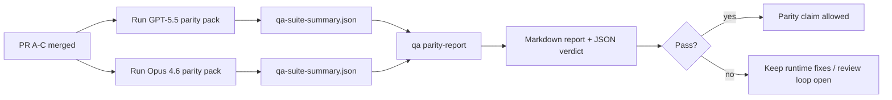

---
read_when:
    - GPT-5.5 / Codex パリティ PR シリーズのレビュー
    - パリティプログラムを支える6つの契約によるエージェント型アーキテクチャの保守
summary: GPT-5.5 / Codex パリティプログラムを4つのマージ単位としてレビューする方法
title: GPT-5.5 / Codex パリティのメンテナー向けメモ
x-i18n:
    generated_at: "2026-05-06T05:07:47Z"
    model: gpt-5.5
    provider: openai
    source_hash: 5752b4610f8b0d70b80d880ea10df75478b5f85ca431cdb73d3b61d745b23356
    source_path: help/gpt55-codex-agentic-parity-maintainers.md
    workflow: 16
---

このメモでは、元の6つのコントラクトアーキテクチャを失わずに、GPT-5.5 / Codex パリティプログラムを4つのマージ単位としてレビューする方法を説明します。

## マージ単位

### PR A: 厳格なエージェント的実行

所有範囲:

- `executionContract`
- GPT-5優先の同一ターンでの完遂
- 終端ではない進捗追跡としての `update_plan`
- 計画だけで静かに停止するのではなく、明示的なブロック状態

所有しない範囲:

- 認証/ランタイム失敗の分類
- 権限に関する正確性
- リプレイ/継続の再設計
- パリティベンチマーク

### PR B: ランタイムの正確性

所有範囲:

- Codex OAuth スコープの正確性
- 型付けされたプロバイダー/ランタイム失敗分類
- `/elevated full` の利用可否とブロック理由の正確な提示

所有しない範囲:

- ツールスキーマの正規化
- リプレイ/生存状態
- ベンチマークゲート

### PR C: 実行の正確性

所有範囲:

- プロバイダー所有の OpenAI/Codex ツール互換性
- パラメーターなしの厳格スキーマ処理
- リプレイ無効状態の表面化
- 一時停止、ブロック、放棄された長時間タスク状態の可視性

所有しない範囲:

- 自己選択による継続
- プロバイダーフック外の汎用 Codex ダイアレクト動作
- ベンチマークゲート

### PR D: パリティハーネス

所有範囲:

- 第1波 GPT-5.5 対 Opus 4.6 シナリオパック
- パリティドキュメント
- パリティレポートとリリースゲートの仕組み

所有しない範囲:

- QA-lab 外のランタイム動作変更
- ハーネス内の認証/プロキシ/DNS シミュレーション

## 元の6つのコントラクトへの対応

| 元のコントラクト                         | マージ単位 |
| ---------------------------------------- | ---------- |
| プロバイダー転送/認証の正確性            | PR B       |
| ツールコントラクト/スキーマ互換性        | PR C       |
| 同一ターン実行                           | PR A       |
| 権限に関する正確性                       | PR B       |
| リプレイ/継続/生存の正確性               | PR C       |
| ベンチマーク/リリースゲート              | PR D       |

## レビュー順序

1. PR A
2. PR B
3. PR C
4. PR D

PR D は証明レイヤーです。これがランタイム正確性 PR の遅延理由になってはいけません。

## 確認すべき点

### PR A

- GPT-5 実行が、コメントで止まるのではなく、行動するかフェイルクローズする
- `update_plan` が、それ単体では進捗に見えなくなる
- 動作が GPT-5優先かつ組み込み Pi スコープに留まる

### PR B

- 認証/プロキシ/ランタイム失敗が、汎用的な「モデル失敗」処理に潰れなくなる
- `/elevated full` は、実際に利用可能な場合にのみ利用可能と説明される
- ブロック理由がモデルとユーザー向けランタイムの両方に見える

### PR C

- 厳格な OpenAI/Codex ツール登録が予測可能に動作する
- パラメーターなしツールが厳格スキーマチェックで失敗しない
- リプレイと Compaction の結果が、正確な生存状態を保持する

### PR D

- シナリオパックが理解可能で再現可能である
- パックに読み取り専用フローだけでなく、変更を伴うリプレイ安全性レーンが含まれている
- レポートが人間と自動化の両方にとって読みやすい
- パリティ主張が逸話ではなく証拠に裏付けられている

PR D から期待される成果物:

- 各モデル実行の `qa-suite-report.md` / `qa-suite-summary.json`
- 集計およびシナリオレベル比較を含む `qa-agentic-parity-report.md`
- 機械可読な判定を含む `qa-agentic-parity-summary.json`

## リリースゲート

以下が満たされるまで、GPT-5.5 が Opus 4.6 と同等または優れていると主張してはいけません。

- PR A、PR B、PR C がマージされている
- PR D が第1波パリティパックをクリーンに実行する
- ランタイム正確性リグレッションスイートが引き続き成功している
- パリティレポートに偽成功ケースがなく、停止動作のリグレッションがない

パリティハーネスは唯一の証拠ソースではありません。レビューではこの分割を明示的に保ってください。

- PR D は、シナリオベースの GPT-5.5 対 Opus 4.6 比較を所有する
- PR B の決定的スイートは、引き続き認証/プロキシ/DNS とフルアクセスの正確性に関する証拠を所有する

## メンテナー向けクイックマージワークフロー

パリティ PR を取り込む準備ができており、再現可能で低リスクな手順が必要な場合に使用します。

1. マージ前に証拠基準が満たされていることを確認する:
   - 再現可能な症状または失敗テスト
   - 変更対象コードで検証済みの根本原因
   - 関連するパス内の修正
   - リグレッションテストまたは明示的な手動検証メモ
2. マージ前にトリアージ/ラベル付けする:
   - PR を取り込むべきでない場合は、任意の `r:*` 自動クローズラベルを適用する
   - マージ候補に未解決のブロッカースレッドを残さない
3. 変更対象の表面をローカルで検証する:
   - `pnpm check:changed`
   - テストが変更された場合、またはバグ修正の確信がテストカバレッジに依存する場合は `pnpm test:changed`
4. 標準のメンテナーフロー（`/landpr` プロセス）で取り込み、その後確認する:
   - リンクされた issue の自動クローズ動作
   - `main` 上の CI とマージ後ステータス
5. 取り込み後、関連する未解決 PR/issue の重複検索を実行し、正規参照を添えた場合にのみクローズする。

証拠基準項目のいずれか1つでも欠けている場合は、マージではなく変更をリクエストしてください。

## 目標と証拠の対応表

| 完了ゲート項目                           | 主所有者      | レビュー成果物                                                      |
| ---------------------------------------- | ------------- | ------------------------------------------------------------------- |
| 計画だけでの停止がない                   | PR A          | 厳格なエージェント的ランタイムテストと `approval-turn-tool-followthrough` |
| 偽の進捗や偽のツール完了がない           | PR A + PR D   | パリティの偽成功数とシナリオレベルレポートの詳細                    |
| 誤った `/elevated full` ガイダンスがない | PR B          | 決定的なランタイム正確性スイート                                    |
| リプレイ/生存失敗が明示的なままである    | PR C + PR D   | ライフサイクル/リプレイスイートと `compaction-retry-mutating-tool`   |
| GPT-5.5 が Opus 4.6 と同等または上回る   | PR D          | `qa-agentic-parity-report.md` と `qa-agentic-parity-summary.json`    |

## レビュー担当者向け略記: 変更前と変更後

| 変更前のユーザーに見える問題                                  | 変更後のレビューシグナル                                                                  |
| ------------------------------------------------------------- | ----------------------------------------------------------------------------------------- |
| GPT-5.5 が計画後に停止した                                    | PR A がコメントだけの完了ではなく、行動またはブロックの動作を示す                         |
| 厳格な OpenAI/Codex スキーマでツール使用が壊れやすく感じられた | PR C がツール登録とパラメーターなし呼び出しを予測可能に保つ                               |
| `/elevated full` のヒントが誤解を招く場合があった              | PR B がガイダンスを実際のランタイム能力とブロック理由に結び付ける                         |
| 長時間タスクがリプレイ/Compaction の曖昧さの中に消えることがあった | PR C が一時停止、ブロック、放棄、リプレイ無効の状態を明示的に発行する                     |
| パリティ主張が逸話的だった                                    | PR D が両モデルで同じシナリオカバレッジを持つレポートと JSON 判定を生成する               |

## 関連

- [GPT-5.5 / Codex エージェント的パリティ](/ja-JP/help/gpt55-codex-agentic-parity)
