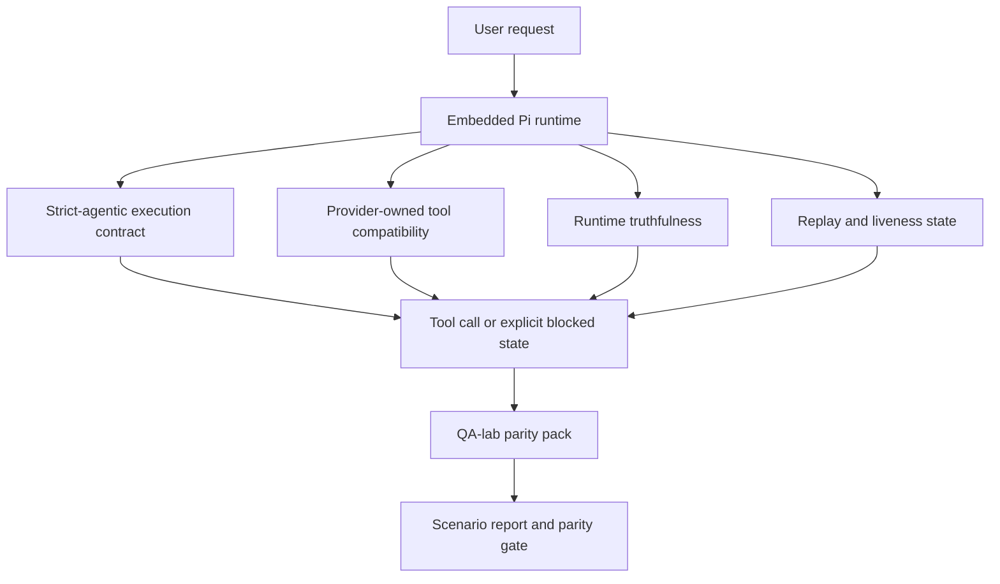
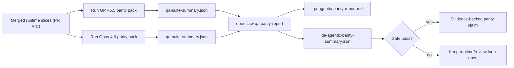

---
read_when:
    - GPT-5.5 または Codex のエージェント動作のデバッグ
    - フロンティアモデル間で OpenClaw のエージェント実行動作を比較する
    - strict-agentic、tool-schema、elevation、replay 修正のレビュー
summary: OpenClaw が GPT-5.5 と Codex スタイルのモデルにおけるエージェント実行ギャップをどのように埋めるか
title: GPT-5.5 / Codex のエージェント実行パリティ
x-i18n:
    generated_at: "2026-04-25T18:18:54Z"
    model: gpt-5.4
    provider: openai
    source_hash: 8a3b9375cd9e9d95855c4a1135953e00fd7a939e52fb7b75342da3bde2d83fe1
    source_path: help/gpt55-codex-agentic-parity.md
    workflow: 15
---

# OpenClaw における GPT-5.5 / Codex のエージェント実行パリティ

OpenClaw はすでにツールを使うフロンティアモデルで良好に動作していましたが、GPT-5.5 と Codex スタイルのモデルには、実運用上まだいくつか不十分な点がありました。

- 作業を実行せず、計画だけで止まってしまうことがある
- 厳格な OpenAI/Codex のツールスキーマを誤って扱うことがある
- フルアクセスが不可能な場合でも `/elevated full` を要求してしまうことがある
- replay や Compaction 中に長時間実行タスクの状態を失うことがある
- Claude Opus 4.6 とのパリティ主張が、再現可能なシナリオではなく逸話に基づいていた

このパリティプログラムは、これらのギャップをレビュー可能な 4 つのスライスで修正します。

## 変更点

### PR A: strict-agentic 実行

このスライスでは、埋め込み Pi の GPT-5 実行向けに、オプトインの `strict-agentic` 実行契約を追加します。

有効にすると、OpenClaw は計画だけのターンを「十分な」完了として受け入れなくなります。モデルが何をするつもりかだけを述べ、実際にはツールを使わず進捗も出さない場合、OpenClaw は「今すぐ行動する」よう促して再試行し、それでもだめならタスクを黙って終了する代わりに、明示的な blocked 状態で fail closed します。

これにより、特に次のような場面で GPT-5.5 の体験が向上します。

- 短い「ok do it」の追従ターン
- 最初の一手が明白なコードタスク
- `update_plan` が埋め草テキストではなく進捗追跡であるべきフロー

### PR B: ランタイムの真実性

このスライスでは、OpenClaw が次の 2 点について正確に伝えるようになります。

- プロバイダー/ランタイム呼び出しがなぜ失敗したか
- `/elevated full` が実際に利用可能かどうか

これにより、GPT-5.5 は不足しているスコープ、認証リフレッシュ失敗、HTML 403 認証失敗、プロキシ問題、DNS またはタイムアウト障害、そしてブロックされたフルアクセスモードについて、より良いランタイムシグナルを得られます。モデルが誤った対処法を幻覚したり、ランタイムが提供できない権限モードを要求し続けたりする可能性が低くなります。

### PR C: 実行の正しさ

このスライスでは、2 種類の正しさを改善します。

- プロバイダーが所有する OpenAI/Codex ツールスキーマ互換性
- replay と長時間タスクの liveness 可視化

ツール互換性の改善により、厳格な OpenAI/Codex ツール登録におけるスキーマ摩擦が減ります。特に、パラメーター不要ツールと、厳格なオブジェクトルート期待値の周辺が改善されます。replay/liveness の改善により、長時間実行タスクの状態が観測しやすくなり、paused、blocked、abandoned 状態が、汎用的な失敗メッセージに埋もれず可視化されます。

### PR D: パリティ harness

このスライスでは、GPT-5.5 と Opus 4.6 を同じシナリオで実行し、共通の証拠で比較できるようにする、第一波の QA-lab パリティパックを追加します。

このパリティパックは証明レイヤーです。これ自体ではランタイム動作を変更しません。

2 つの `qa-suite-summary.json` アーティファクトが揃ったら、次のコマンドでリリースゲート比較を生成します。

```bash
pnpm openclaw qa parity-report \
  --repo-root . \
  --candidate-summary .artifacts/qa-e2e/gpt55/qa-suite-summary.json \
  --baseline-summary .artifacts/qa-e2e/opus46/qa-suite-summary.json \
  --output-dir .artifacts/qa-e2e/parity
```

このコマンドは次を出力します。

- 人間が読める Markdown レポート
- 機械可読な JSON 判定
- 明示的な `pass` / `fail` ゲート結果

## これが実運用で GPT-5.5 を改善する理由

この作業以前の OpenClaw 上の GPT-5.5 は、実際のコーディングセッションで Opus よりエージェント実行性が低く感じられることがありました。理由は、ランタイムが GPT-5 系モデルに特に有害な挙動を許容していたためです。

- コメントだけのターン
- ツールまわりのスキーマ摩擦
- あいまいな権限フィードバック
- 黙って起きる replay または Compaction の破綻

目標は、GPT-5.5 を Opus の模倣にすることではありません。目標は、実際の進捗を報いるランタイム契約、よりクリーンなツールおよび権限セマンティクス、そして失敗モードを機械可読かつ人間可読な明示状態へ変える仕組みを GPT-5.5 に与えることです。

これにより、ユーザー体験は次のように変わります。

- 「モデルは良い計画を立てたが止まった」

から、

- 「モデルは実行した、または OpenClaw が実行できなかった正確な理由を表示した」

へ。

## GPT-5.5 ユーザーにとっての Before / After

| このプログラム以前 | PR A-D 後 |
| ---------------------------------------------------------------------------------------------- | ---------------------------------------------------------------------------------------- |
| GPT-5.5 は妥当な計画のあと、次のツール操作を行わずに止まることがあった | PR A により「計画のみ」は「今すぐ実行、または blocked 状態を表示」に変わる |
| 厳格なツールスキーマにより、パラメーター不要ツールや OpenAI/Codex 形状のツールがわかりにくい形で拒否されることがあった | PR C により、プロバイダー所有のツール登録と呼び出しがより予測可能になる |
| `/elevated full` の案内が、ブロックされたランタイムであいまいまたは誤っていることがあった | PR B により、GPT-5.5 とユーザーに正確なランタイムおよび権限ヒントが与えられる |
| replay または Compaction の失敗により、タスクが静かに消えたように感じられることがあった | PR C により、paused、blocked、abandoned、replay-invalid の結果が明示的に表示される |
| 「GPT-5.5 は Opus より悪い気がする」はほぼ逸話ベースだった | PR D により、同じシナリオパック、同じメトリクス、明確な pass/fail ゲートへ変わる |

## アーキテクチャ



## リリースフロー



## シナリオパック

現在の第一波パリティパックは、5 つのシナリオを対象としています。

### `approval-turn-tool-followthrough`

短い承認のあとに、モデルが「やります」と言ったところで止まらないことを確認します。同じターン内で最初の具体的アクションを取るべきです。

### `model-switch-tool-continuity`

モデル/ランタイム切り替え境界をまたいでも、ツールを使う作業の一貫性が保たれ、コメントモードに戻ったり実行コンテキストを失ったりしないことを確認します。

### `source-docs-discovery-report`

モデルがソースとドキュメントを読み、所見を統合し、薄い要約を出して早期停止するのではなく、エージェント的にタスクを継続できることを確認します。

### `image-understanding-attachment`

添付を含む混合モードのタスクが、あいまいな説明に崩れず、実行可能性を維持することを確認します。

### `compaction-retry-mutating-tool`

実際に変更を書き込むタスクが、Compaction、再試行、あるいは高負荷時の返信状態喪失が起きても、replay-safe に見えてしまうことなく、replay 非安全性を明示し続けることを確認します。

## シナリオマトリクス

| シナリオ | テストするもの | 良い GPT-5.5 の挙動 | 失敗シグナル |
| ---------------------------------- | --------------------------------------- | ------------------------------------------------------------------------------ | ------------------------------------------------------------------------------ |
| `approval-turn-tool-followthrough` | 計画後の短い承認ターン | 意図を言い直すのではなく、最初の具体的ツールアクションを即座に開始する | 計画だけの追従、ツール活動なし、または実際のブロッカーがない blocked ターン |
| `model-switch-tool-continuity` | ツール使用中のランタイム/モデル切り替え | タスクコンテキストを保持し、一貫して実行を継続する | コメントモードへリセット、ツールコンテキスト喪失、または切り替え後停止 |
| `source-docs-discovery-report` | ソース読み取り + 統合 + 実行 | ソースを見つけ、ツールを使い、停止せず有用なレポートを生成する | 薄い要約、ツール作業の欠落、または不完全ターン停止 |
| `image-understanding-attachment` | 添付主導のエージェント実行作業 | 添付を解釈し、ツールへ結びつけ、タスクを継続する | あいまいな説明、添付無視、または具体的な次アクションなし |
| `compaction-retry-mutating-tool` | Compaction 圧力下の変更作業 | 実際の書き込みを行い、副作用後も replay 非安全性を明示し続ける | 変更書き込みは起きたのに replay 安全性が示唆される、欠落する、または矛盾する |

## リリースゲート

GPT-5.5 は、マージされたランタイムがパリティパックとランタイム真実性の回帰を同時にパスした場合にのみ、パリティ以上と見なせます。

必要な結果:

- 次のツール操作が明らかなときに、計画だけで停止しない
- 実行なしの偽の完了がない
- 誤った `/elevated full` 案内がない
- 黙った replay または Compaction による abandonment がない
- 合意済みの Opus 4.6 ベースライン以上のパリティパックメトリクス

第一波 harness では、次を比較します。

- 完了率
- 意図しない停止率
- 有効ツール呼び出し率
- 偽成功数

パリティ証拠は意図的に 2 層に分割されています。

- PR D は、QA-lab による同一シナリオでの GPT-5.5 対 Opus 4.6 の挙動を証明します
- PR B の決定的スイートは、harness 外で auth、proxy、DNS、`/elevated full` の真実性を証明します

## 目標から証拠へのマトリクス

| 完了ゲート項目 | 所有 PR | 証拠ソース | パスシグナル |
| -------------------------------------------------------- | ----------- | ------------------------------------------------------------------ | ---------------------------------------------------------------------------------------- |
| GPT-5.5 が計画後に停止しなくなった | PR A | `approval-turn-tool-followthrough` と PR A ランタイムスイート | 承認ターンが実作業または明示的 blocked 状態を引き起こす |
| GPT-5.5 が偽の進捗や偽のツール完了を出さなくなった | PR A + PR D | パリティレポートのシナリオ結果と偽成功数 | 疑わしい pass 結果がなく、コメントのみの完了もない |
| GPT-5.5 が誤った `/elevated full` 案内をしなくなった | PR B | 決定的な真実性スイート | blocked 理由とフルアクセスヒントがランタイムに対して正確なまま維持される |
| replay/liveness 失敗が明示的なまま維持される | PR C + PR D | PR C のライフサイクル/replay スイートと `compaction-retry-mutating-tool` | 変更作業が replay 非安全性を静かに消さず、明示したまま維持する |
| GPT-5.5 が合意済みメトリクスで Opus 4.6 と同等以上になる | PR D | `qa-agentic-parity-report.md` と `qa-agentic-parity-summary.json` | 同一シナリオカバレッジがあり、完了、停止挙動、有効ツール使用で回帰がない |

## パリティ判定の読み方

第一波パリティパックにおける最終的な機械可読の判定として、`qa-agentic-parity-summary.json` 内の verdict を使用してください。

- `pass` は、GPT-5.5 が Opus 4.6 と同じシナリオをカバーし、合意済みの集計メトリクスで回帰しなかったことを意味します。
- `fail` は、少なくとも 1 つのハードゲートに引っかかったことを意味します。完了率の低下、意図しない停止の悪化、有効ツール使用の低下、偽成功ケースの発生、またはシナリオカバレッジの不一致が該当します。
- 「shared/base CI issue」自体はパリティ結果ではありません。PR D の外側にある CI ノイズが実行を妨げた場合、判定はブランチ時代のログから推測するのではなく、マージ済みランタイムでのクリーンな実行を待つべきです。
- auth、proxy、DNS、`/elevated full` の真実性は引き続き PR B の決定的スイートから得られるため、最終的なリリース主張には両方が必要です。すなわち、PR D のパリティ判定が pass し、PR B の真実性カバレッジが green であることです。

## `strict-agentic` を有効化すべき人

次の場合は `strict-agentic` を使用してください。

- 次の一手が明白なときに、エージェントが即座に実行することが期待される
- GPT-5.5 または Codex ファミリーのモデルが主要ランタイムである
- 「役に立つ」要約だけの応答よりも、明示的な blocked 状態を好む

次の場合はデフォルト契約のままにしてください。

- 既存の、より緩い挙動を使いたい
- GPT-5 ファミリーのモデルを使っていない
- ランタイム強制ではなくプロンプトをテストしている

## 関連

- [GPT-5.5 / Codex parity maintainer notes](/ja-JP/help/gpt55-codex-agentic-parity-maintainers)
