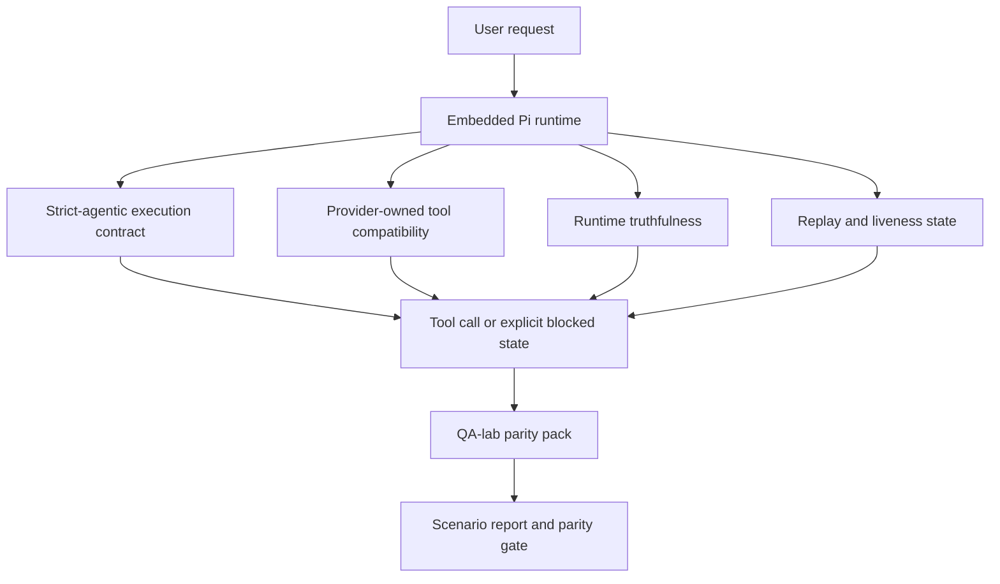
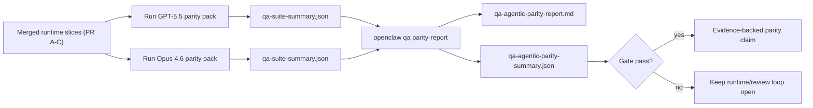

---
read_when:
    - GPT-5.5 または Codex エージェントの動作のデバッグ
    - フロンティアモデル間で OpenClaw のエージェント的挙動を比較する
    - 厳格エージェント型、ツールスキーマ、昇格、リプレイの修正をレビュー中
summary: OpenClaw が GPT-5.5 と Codex スタイルのモデルにおけるエージェント実行ギャップを埋める仕組み
title: GPT-5.5 / Codex のエージェント機能の同等性
x-i18n:
    generated_at: "2026-05-06T05:08:01Z"
    model: gpt-5.5
    provider: openai
    source_hash: bbc32f418dfffe2786093fa6b42b19f92a2d382c9408dfc55dd0154d67959390
    source_path: help/gpt55-codex-agentic-parity.md
    workflow: 16
---

OpenClaw は、ツールを使う frontier model ではすでに十分に機能していましたが、GPT-5.5 と Codex スタイルのモデルには、まだいくつかの実用面で不足がありました。

- 作業を実行せず、計画の後で停止することがあった
- 厳密な OpenAI/Codex ツールスキーマを誤って使うことがあった
- フルアクセスが不可能な場合でも `/elevated full` を求めることがあった
- replay や compaction の間に、長時間実行タスクの状態を失うことがあった
- Claude Opus 4.6 に対する parity 主張が、再現可能なシナリオではなく逸話に基づいていた

この parity プログラムは、これらの不足をレビュー可能な 4 つの slice で修正します。

## 変更点

### PR A: strict-agentic 実行

この slice は、埋め込み Pi GPT-5 実行向けに、オプトインの `strict-agentic` 実行契約を追加します。

有効にすると、OpenClaw は計画だけの turn を「十分な」完了として受け入れなくなります。モデルが実行意図だけを述べ、実際にツールを使ったり進捗を作ったりしない場合、OpenClaw は即時実行を促す steer で再試行し、タスクを黙って終了する代わりに、明示的な blocked 状態で fail closed します。

これにより、GPT-5.5 体験は特に次の場面で改善されます。

- 短い「ok do it」フォローアップ
- 最初の手順が明らかなコードタスク
- `update_plan` が埋め草のテキストではなく進捗トラッキングであるべき flow

### PR B: runtime の正直性

この slice は、OpenClaw が次の 2 点について正確に伝えるようにします。

- provider/runtime 呼び出しが失敗した理由
- `/elevated full` が実際に利用可能かどうか

つまり、GPT-5.5 は、scope 不足、auth refresh 失敗、HTML 403 auth 失敗、proxy 問題、DNS または timeout 失敗、ブロックされた full-access mode について、より良い runtime signal を得られます。モデルが誤った remediation を hallucinate したり、runtime が提供できない permission mode を求め続けたりする可能性が低くなります。

### PR C: 実行の正確性

この slice は、2 種類の正確性を改善します。

- provider 所有の OpenAI/Codex ツールスキーマ互換性
- replay と長時間タスクの liveness 表面化

ツール互換性の作業により、厳密な OpenAI/Codex ツール登録における schema friction が減ります。特に、パラメーターなしのツールや、厳密な object-root 期待値の周辺で効果があります。replay/liveness の作業により、長時間実行タスクがより観測しやすくなり、paused、blocked、abandoned の状態が、汎用的な失敗テキストに消えるのではなく可視化されます。

### PR D: parity harness

この slice は、GPT-5.5 と Opus 4.6 を同じシナリオで実行し、共有 evidence を使って比較できるように、最初の QA-lab parity pack を追加します。

parity pack は proof layer です。それ自体は runtime の挙動を変更しません。

2 つの `qa-suite-summary.json` artifact が揃ったら、次で release-gate 比較を生成します。

```bash
pnpm openclaw qa parity-report \
  --repo-root . \
  --candidate-summary .artifacts/qa-e2e/gpt55/qa-suite-summary.json \
  --baseline-summary .artifacts/qa-e2e/opus46/qa-suite-summary.json \
  --output-dir .artifacts/qa-e2e/parity
```

このコマンドは次を書き出します。

- 人間が読める Markdown レポート
- 機械可読の JSON verdict
- 明示的な `pass` / `fail` gate 結果

## これが実践上 GPT-5.5 を改善する理由

この作業以前、OpenClaw 上の GPT-5.5 は、実際のコーディングセッションで Opus より agentic さが低く感じられることがありました。runtime が、GPT-5 スタイルのモデルに特に有害な挙動を許容していたためです。

- commentary のみの turn
- ツール周辺の schema friction
- 曖昧な permission feedback
- silent な replay または compaction 破損

目標は、GPT-5.5 に Opus を模倣させることではありません。目標は、GPT-5.5 に、実際の進捗を促進し、より明確なツールと permission semantics を提供し、failure mode を明示的で機械と人間が読める状態に変換する runtime 契約を与えることです。

これにより、ユーザー体験は次から変わります。

- 「モデルは良い計画を持っていたが停止した」

次のようになります。

- 「モデルは実行したか、OpenClaw が実行できなかった正確な理由を表面化した」

## GPT-5.5 ユーザーにとっての before と after

| このプログラム以前                                                                            | PR A-D 後                                                                             |
| ---------------------------------------------------------------------------------------------- | ---------------------------------------------------------------------------------------- |
| GPT-5.5 は妥当な計画の後、次のツール手順を実行せずに停止することがあった                   | PR A は「計画のみ」を「今すぐ実行するか、blocked 状態を表面化する」に変える                         |
| 厳密なツールスキーマが、パラメーターなし、または OpenAI/Codex 形状のツールを分かりにくい形で拒否することがあった | PR C は provider 所有のツール登録と invocation をより予測可能にする              |
| ブロックされた runtime で、`/elevated full` guidance が曖昧または誤っていることがあった                          | PR B は GPT-5.5 とユーザーに、runtime と permission の正確な hint を与える                    |
| replay または compaction 失敗により、タスクが黙って消えたように感じられることがあった                    | PR C は paused、blocked、abandoned、replay-invalid の結果を明示的に表面化する         |
| 「GPT-5.5 は Opus より悪く感じる」は、ほとんど逸話に基づいていた                                           | PR D はそれを、同じ scenario pack、同じ metrics、hard pass/fail gate に変える |

## アーキテクチャ



## リリース flow



## シナリオ pack

first-wave parity pack は現在 5 つのシナリオを対象にしています。

### `approval-turn-tool-followthrough`

短い approval の後、モデルが「I'll do that」で停止しないことを確認します。同じ turn で最初の具体的な action を取るべきです。

### `model-switch-tool-continuity`

ツールを使う作業が、model/runtime の切り替え境界をまたいでも coherent なままであり、commentary に戻ったり execution context を失ったりしないことを確認します。

### `source-docs-discovery-report`

モデルが source と docs を読み、findings を統合し、薄い summary を出して早期停止するのではなく、agentic にタスクを継続できることを確認します。

### `image-understanding-attachment`

attachment を含む mixed-mode タスクが actionable なままであり、曖昧な narration に崩れないことを確認します。

### `compaction-retry-mutating-tool`

実際の mutating write を伴うタスクが、run が compaction、retry、または圧力下で reply state を失った場合でも、静かに replay-safe に見えるのではなく、replay-unsafety を明示したままにすることを確認します。

## シナリオ matrix

| シナリオ                           | テスト内容                           | 良い GPT-5.5 の挙動                                                          | failure signal                                                                 |
| ---------------------------------- | --------------------------------------- | ------------------------------------------------------------------------------ | ------------------------------------------------------------------------------ |
| `approval-turn-tool-followthrough` | 計画後の短い approval turn       | intent を言い直す代わりに、最初の具体的なツール action をすぐに開始する  | plan-only follow-up、ツール activity なし、または実際の blocker なしの blocked turn  |
| `model-switch-tool-continuity`     | ツール使用中の runtime/model 切り替え  | タスク context を保持し、coherent に実行を続ける                         | commentary にリセットする、ツール context を失う、または切り替え後に停止する              |
| `source-docs-discovery-report`     | source 読み取り + synthesis + action     | source を見つけ、ツールを使い、stall せず有用な report を生成する       | 薄い summary、ツール作業の欠落、または incomplete-turn stop                       |
| `image-understanding-attachment`   | attachment 駆動の agentic work          | attachment を解釈し、それをツールに接続し、タスクを継続する        | 曖昧な narration、attachment 無視、または具体的な next action なし                |
| `compaction-retry-mutating-tool`   | compaction 圧力下の mutating work | 実際の write を実行し、副作用後も replay-unsafety を明示したままにする | mutating write は発生するが、replay safety が implied、missing、または contradictory |

## リリース gate

GPT-5.5 は、統合済み runtime が parity pack と runtime-truthfulness regression を同時に pass した場合にのみ、parity 以上と見なせます。

必須の outcome:

- 次のツール action が明確なときに plan-only stall がない
- 実際の実行なしの fake completion がない
- 誤った `/elevated full` guidance がない
- silent な replay または compaction abandonment がない
- 合意済みの Opus 4.6 baseline と少なくとも同等に強い parity-pack metrics

first-wave harness では、gate は次を比較します。

- completion rate
- unintended-stop rate
- valid-tool-call rate
- fake-success count

parity evidence は意図的に 2 つの layer に分割されています。

- PR D は QA-lab により、同一シナリオでの GPT-5.5 vs Opus 4.6 の挙動を証明する
- PR B の deterministic suite は、harness の外側で auth、proxy、DNS、`/elevated full` の正直性を証明する

## 目標から evidence への matrix

| completion gate item                                     | 所有 PR   | evidence source                                                    | pass signal                                                                              |
| -------------------------------------------------------- | ----------- | ------------------------------------------------------------------ | ---------------------------------------------------------------------------------------- |
| GPT-5.5 が計画後に stall しなくなる                  | PR A        | `approval-turn-tool-followthrough` と PR A runtime suite        | approval turn が実際の作業、または明示的な blocked state を trigger する                            |
| GPT-5.5 が progress または tool completion を fake しなくなる | PR A + PR D | parity report scenario outcome と fake-success count             | suspicious な pass result がなく、commentary-only completion もない                             |
| GPT-5.5 が誤った `/elevated full` guidance を出さなくなる  | PR B        | deterministic truthfulness suite                                  | blocked reason と full-access hint が runtime-accurate なままである                              |
| Replay/liveness failure が明示されたままになる                   | PR C + PR D | PR C lifecycle/replay suite と `compaction-retry-mutating-tool` | mutating work が silent に消えるのではなく、replay-unsafety を明示したままにする            |
| GPT-5.5 が合意済み metrics で Opus 4.6 と同等以上になる  | PR D        | `qa-agentic-parity-report.md` と `qa-agentic-parity-summary.json` | 同じ scenario coverage があり、completion、stop behavior、valid tool use で regression がない |

## parity verdict の読み方

first-wave parity pack の最終的な機械可読 decision として、`qa-agentic-parity-summary.json` の verdict を使用してください。

- `pass` は、GPT-5.5 が Opus 4.6 と同じシナリオをカバーし、合意済みの集計メトリクスで退行しなかったことを意味します。
- `fail` は、少なくとも 1 つのハードゲートが発火したことを意味します。完了性能の低下、意図しない停止の悪化、有効なツール使用の低下、偽の成功ケース、またはシナリオカバレッジの不一致です。
- 「共有/ベース CI の問題」は、それ自体では同等性の結果ではありません。PR D 外の CI ノイズが実行を妨げる場合、判定はブランチ期間のログから推測するのではなく、クリーンなマージ済みランタイム実行を待つべきです。
- 認証、プロキシ、DNS、および `/elevated full` の真実性は引き続き PR B の決定的スイートに由来するため、最終リリースの主張には両方が必要です。PR D の同等性判定が合格していることと、PR B の真実性カバレッジがグリーンであることです。

## `strict-agentic` を有効にすべき人

次の場合は `strict-agentic` を使用します。

- 次のステップが明らかなときに、エージェントが即座に行動することが期待される
- GPT-5.5 または Codex 系モデルが主要なランタイムである
- 「親切な」要約だけの返信よりも、明示的なブロック状態を好む

次の場合はデフォルトのコントラクトを維持します。

- 既存のより緩い挙動を望む
- GPT-5 系モデルを使用していない
- ランタイム強制ではなくプロンプトをテストしている

## 関連

- [GPT-5.5 / Codex 同等性メンテナー向けメモ](/ja-JP/help/gpt55-codex-agentic-parity-maintainers)
