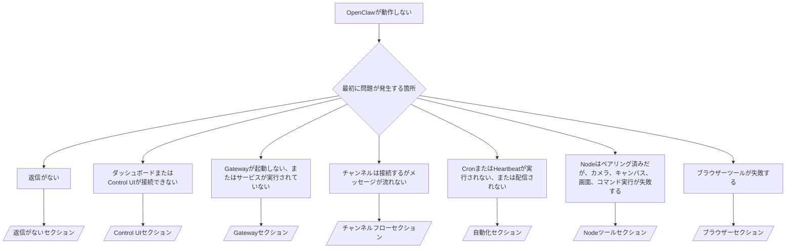

---
read_when:
    - OpenClawが動作せず、最短で修正する必要がある場合
    - 詳細なランブックに進む前に、トリアージフローが必要な場合
summary: OpenClaw の症状別トラブルシューティングハブ
title: 一般的なトラブルシューティング
x-i18n:
    generated_at: "2026-07-11T22:19:40Z"
    model: gpt-5.6
    postprocess_version: locale-links-v1
    provider: openai
    source_hash: db50e0cdf4d11f3aa6196be445358d904a2b9c40c89243f1b124c77167f6dd85
    source_path: help/troubleshooting.md
    workflow: 16
---

トリアージの入口。2分で診断し、その後、詳細ページに進みます。

## 最初の60秒

次の手順を順番に実行します。

```bash
openclaw status
openclaw status --all
openclaw gateway probe
openclaw gateway status
openclaw doctor
openclaw channels status --probe
openclaw logs --follow
```

正常な出力（各項目1行）：

- `openclaw status` に設定済みのチャンネルが表示され、認証エラーがない。
- `openclaw status --all` により、共有可能な完全なレポートが生成される。
- `openclaw gateway probe` に `Reachable: yes` と表示される。`Capability: ...` はプローブで確認された認証レベルです。`Read probe: limited - missing scope:
operator.read` は診断機能の制限であり、接続失敗ではありません。
- `openclaw gateway status` に `Runtime: running`、`Connectivity probe:
ok`、および妥当な `Capability: ...` が表示される。読み取りスコープのRPC確認も必須にするには、`--require-rpc` を追加します。
- `openclaw doctor` から、処理を妨げる設定またはサービスのエラーが報告されない。
- `openclaw channels status --probe` は、Gatewayに到達できる場合、アカウントごとの現在の転送状態（`works` / `audit ok`）を返す。到達できない場合は、設定のみの概要にフォールバックする。
- `openclaw logs --follow` に安定した動作が表示され、致命的なエラーが繰り返されていない。

## アシスタントの機能が制限されている、またはツールが見つからない

有効なツールプロファイルを確認します。

```bash
openclaw status
openclaw status --all
openclaw doctor
```

一般的な原因：

- `tools.profile: "minimal"` では、`session_status` のみが許可される。
- `tools.profile: "messaging"` は、チャット専用エージェント向けの限定的なプロファイルです。
- `tools.profile: "coding"` は、新しいローカル設定のデフォルトです（リポジトリ、ファイル、シェル、ランタイムの操作）。
- `tools.profile: "full"` はプロファイルによる制限を解除する。信頼できるオペレーター管理下のエージェントに限定してください。
- エージェント単位の `agents.list[].tools` は、1つのエージェントについてルートプロファイルを制限または拡張する。

プロファイルを変更し、Gatewayを再起動または再読み込みしてから、`openclaw status --all` でもう一度確認します。プロファイルとグループの完全な表：[ツールプロファイル](/ja-JP/gateway/config-tools#tool-profiles)。

## Anthropicの長いコンテキストでの429

`HTTP 429: rate_limit_error: Extra usage is required for long context requests`
→ [Anthropicの長いコンテキストで追加使用量が必要となる429](/ja-JP/gateway/troubleshooting#anthropic-429-extra-usage-required-for-long-context)。

## ローカルのOpenAI互換バックエンドは直接実行では動作するが、OpenClawでは失敗する

ローカルまたはセルフホストの `/v1` バックエンドは、直接の `/v1/chat/completions` プローブには応答するものの、`openclaw infer model run` または通常のエージェントターンでは失敗します。

1. エラーに、`messages[].content` は文字列である必要があると示されている場合：`models.providers.<provider>.models[].compat.requiresStringContent: true` を設定します。
2. 引き続きOpenClawのエージェントターンでのみ失敗する場合：`models.providers.<provider>.models[].compat.supportsTools: false` を設定して再試行します。
3. 小さな直接呼び出しは動作するが、より大きなOpenClawプロンプトでバックエンドがクラッシュする場合：これは上流のモデルまたはサーバーの制限であり、OpenClawのバグではありません。[ローカルのOpenAI互換バックエンドは直接プローブに成功するが、エージェント実行は失敗する](/ja-JP/gateway/troubleshooting#local-openai-compatible-backend-passes-direct-probes-but-agent-runs-fail)に進んでください。

## openclaw extensionsの欠落によりPluginのインストールが失敗する

`package.json missing openclaw.extensions` は、PluginパッケージがOpenClawでサポートされなくなった形式を使用していることを意味します。

Pluginパッケージで修正します。

1. `package.json` に `openclaw.extensions` を追加し、ビルド済みのランタイムファイル（通常は `./dist/index.js`）を指定します。
2. 再公開してから、`openclaw plugins install <package>` をもう一度実行します。

```json
{
  "name": "@openclaw/my-plugin",
  "version": "1.2.3",
  "openclaw": {
    "extensions": ["./dist/index.js"]
  }
}
```

参照：[Pluginアーキテクチャ](/ja-JP/plugins/architecture)

## インストールポリシーによってPluginのインストールまたは更新がブロックされる

更新は完了するものの、Pluginが古い、無効になっている、または `blocked by install
policy`、`install policy failed closed`、`Disabled "<plugin>" after plugin
update failure` と表示される場合：`security.installPolicy` を確認します。

インストールポリシーは、Pluginのインストールおよび更新時に実行されます。`@openclaw/*` Pluginのバージョンは通常、OpenClawのリリースとともに更新されるため、OpenClawの更新後の同期中に、対応するPluginの更新が必要になる場合があります。

対応するアップグレード規則も管理していない限り、次のようなポリシーは避けてください。

- OpenClaw所有のPluginを特定の古いバージョンに固定する（たとえば、`@openclaw/*@2026.5.3` のみを許可する）。
- ソースの種類だけでブロックする（すべてのnpm、ネットワーク、または `request.mode:
"update"` リクエスト）。
- ポリシーコマンドを省略可能なものとして扱う：`security.installPolicy` が有効な場合、ポリシーの実行ファイルが存在しない、遅い、読み取れない、または権限によってブロックされていると、フェイルクローズになります。
- リクエストの `openclawVersion` とPlugin候補のメタデータを照合せずに、バージョンを承認する。

1つのリリースに永久に固定するのではなく、現在のホストと互換性がある、信頼済みの `@openclaw/*` 更新を許可する規則を推奨します。npmをデフォルトでブロックする場合は、使用するPlugin IDに限定した例外を追加し、インストールと同じ信頼規則を `request.mode: "update"` にも適用します。

復旧手順：

```bash
openclaw doctor --deep
openclaw plugins update --all
openclaw status --all
```

意図的に厳格なポリシーを使用している場合は、信頼済みのアップグレード期間中のみ緩和し、`openclaw plugins update --all` を再実行してから、より厳格な規則に戻します。更新の失敗によりPluginが無効になった場合は、再度有効にする前に調査します。

```bash
openclaw plugins inspect <plugin-id> --runtime --json
openclaw plugins enable <plugin-id>
```

参照：[オペレーターのインストールポリシー](/ja-JP/tools/skills-config#operator-install-policy-securityinstallpolicy)

## Pluginは存在するが、不審な所有権によりブロックされる

`openclaw doctor`、セットアップ、または起動時の警告に次のように表示されます。

```text
blocked plugin candidate: suspicious ownership (... uid=1000, expected uid=0 or root)
plugin present but blocked
```

Pluginファイルが、それを読み込むプロセスとは異なるUnixユーザーによって所有されています。Plugin設定を削除しないでください。ファイルの所有権を修正するか、状態ディレクトリを所有するユーザーとしてOpenClawを実行します。

Dockerのインストールでは、`node`（uid `1000`）として実行されます。ホストのバインドマウントを修復します。

```bash
sudo chown -R 1000:1000 /path/to/openclaw-config /path/to/openclaw-workspace
openclaw doctor --fix
```

意図的にrootとしてOpenClawを実行する場合は、代わりに管理対象のPluginルートを修復します。

```bash
sudo chown -R root:root /path/to/openclaw-config/npm
openclaw doctor --fix
```

詳細なドキュメント：[ブロックされたPluginパスの所有権](/ja-JP/tools/plugin#blocked-plugin-path-ownership)、[Docker：権限とEACCES](/ja-JP/install/docker#shell-helpers-optional)

## 判断フロー



<AccordionGroup>
  <Accordion title="返信がない">
    ```bash
    openclaw status
    openclaw gateway status
    openclaw channels status --probe
    openclaw pairing list --channel <channel> [--account <id>]
    openclaw logs --follow
    ```

    正常な出力：

    - `Runtime: running`
    - `Connectivity probe: ok`
    - `Capability: read-only`、`write-capable`、または `admin-capable`
    - チャンネルの転送が接続済みと表示され、サポートされている場合は `channels status --probe` に `works` または `audit ok` と表示される
    - 送信者が承認されている（またはDMポリシーがオープンまたは許可リスト方式である）

    ログの特徴：

    - `drop guild message (mention required` → Discordのメンション制限によってメッセージがブロックされた。
    - `pairing request` → 送信者が未承認で、DMペアリングの承認を待っている。
    - チャンネルログ内の `blocked` / `allowlist` → 送信者、ルーム、またはグループが除外された。

    詳細ページ：[返信がない](/ja-JP/gateway/troubleshooting#no-replies)、[チャンネルのトラブルシューティング](/ja-JP/channels/troubleshooting)、[ペアリング](/ja-JP/channels/pairing)

  </Accordion>

  <Accordion title="ダッシュボードまたはControl UIが接続できない">
    ```bash
    openclaw status
    openclaw gateway status
    openclaw logs --follow
    openclaw doctor
    openclaw channels status --probe
    ```

    正常な出力：

    - `openclaw gateway status` に `Dashboard: http://...` が表示される
    - `Connectivity probe: ok`
    - `Capability: read-only`、`write-capable`、または `admin-capable`
    - ログに認証ループがない

    ログの特徴：

    - `device identity required` → HTTPまたは非セキュアなコンテキストでは、デバイス認証を完了できない。
    - `origin not allowed` → ブラウザーの `Origin` が、Control UIのGateway接続先で許可されていない。
    - `AUTH_TOKEN_MISMATCH` と `canRetryWithDeviceToken=true` → ペアリング済みトークンにキャッシュされたスコープを再利用し、信頼済みデバイストークンによる再試行が1回、自動的に行われる場合がある。
    - その再試行後も `unauthorized` が繰り返される → トークンまたはパスワードが誤っている、認証モードが一致していない、またはペアリング済みデバイストークンが古い。
    - `too many failed authentication attempts (retry later)` → そのブラウザーの `Origin` から失敗が繰り返されたため、一時的にロックアウトされている。他のlocalhostオリジンには別のバケットが使用される。Tailscale Serveの同時再試行に関する注意点は、[ダッシュボード／Control UIの接続](/ja-JP/gateway/troubleshooting#dashboard-control-ui-connectivity)を参照してください。
    - `gateway connect failed:` → UIが誤ったURLまたはポートを接続先にしているか、Gatewayに到達できない。

    詳細ページ：[ダッシュボード／Control UIの接続](/ja-JP/gateway/troubleshooting#dashboard-control-ui-connectivity)、[Control UI](/ja-JP/web/control-ui)、[認証](/ja-JP/gateway/authentication)

  </Accordion>

  <Accordion title="Gatewayが起動しない、またはサービスはインストール済みだが実行されていない">
    ```bash
    openclaw status
    openclaw gateway status
    openclaw logs --follow
    openclaw doctor
    openclaw channels status --probe
    ```

    正常な出力：

    - `Service: ... (loaded)`
    - `Runtime: running`
    - `Connectivity probe: ok`
    - `Capability: read-only`、`write-capable`、または `admin-capable`

    ログの特徴：

    - `Gateway start blocked: set gateway.mode=local` または `existing config is missing gateway.mode` → Gatewayモードがリモートになっているか、設定にローカルモードを示す情報がなく、修復が必要。
    - `refusing to bind gateway ... without auth` → 有効な認証経路（トークン／パスワード、または設定済みの場合は信頼済みプロキシ）がない状態で、ループバック以外にバインドしようとしている。
    - `another gateway instance is already listening` または `EADDRINUSE` → ポートがすでに使用されている。

    詳細ページ：[Gatewayサービスが実行されていない](/ja-JP/gateway/troubleshooting#gateway-service-not-running)、[バックグラウンドプロセス](/ja-JP/gateway/background-process)、[設定](/ja-JP/gateway/configuration)

  </Accordion>

  <Accordion title="チャンネルは接続するがメッセージが流れない">
    ```bash
    openclaw status
    openclaw gateway status
    openclaw logs --follow
    openclaw doctor
    openclaw channels status --probe
    ```

    正常な出力：

    - チャンネルの転送が接続済み。
    - ペアリングおよび許可リストの確認に合格している。
    - 必要な箇所でメンションが検出されている。

    ログの特徴：

    - `mention required` → グループのメンション制限によって処理がブロックされた。
    - `pairing` / `pending` → DMの送信者がまだ承認されていない。
    - `not_in_channel`、`missing_scope`、`Forbidden`、`401/403` → チャンネルの権限またはトークンの問題。

    詳細ページ：[チャンネルは接続済みだがメッセージが流れない](/ja-JP/gateway/troubleshooting#channel-connected-messages-not-flowing)、[チャンネルのトラブルシューティング](/ja-JP/channels/troubleshooting)

  </Accordion>

  <Accordion title="CronまたはHeartbeatが実行されない、または配信されない">
    ```bash
    openclaw status
    openclaw gateway status
    openclaw cron status
    openclaw cron list
    openclaw cron runs --id <jobId> --limit 20
    openclaw logs --follow
    ```

    正常な出力：

    - `cron status` に、スケジューラーが有効であり、次回の起動時刻が設定されていることが表示される。
    - `cron runs` に最近の `ok` エントリが表示される。
    - Heartbeatが有効であり、アクティブ時間内である。

    ログの特徴：

    - `cron: scheduler disabled; jobs will not run automatically` → cron は無効です。
    - `heartbeat skipped` の理由が `quiet-hours` → 設定されたアクティブ時間外です。
    - `heartbeat skipped` の理由が `empty-heartbeat-file` → `HEARTBEAT.md` は存在しますが、空白、コメント、見出し、フェンス、または空のチェックリストのひな形しか含まれていません。
    - `heartbeat skipped` の理由が `no-tasks-due` → タスクモードは有効ですが、まだ実行時刻に達したタスク間隔がありません。
    - `heartbeat skipped` の理由が `alerts-disabled` → `showOk`、`showAlerts`、`useIndicator` がすべてオフです。
    - `requests-in-flight` → メインレーンが処理中のため、Heartbeat の起動が延期されています。
    - `unknown accountId` → Heartbeat の配信先アカウントが存在しません。

    詳細ページ: [Cron と Heartbeat の配信](/ja-JP/gateway/troubleshooting#cron-and-heartbeat-delivery)、[スケジュール済みタスク: トラブルシューティング](/ja-JP/automation/cron-jobs#troubleshooting)、[Heartbeat](/ja-JP/gateway/heartbeat)

  </Accordion>

  <Accordion title="Node はペアリング済みだが camera canvas screen exec ツールが失敗する">
    ```bash
    openclaw status
    openclaw gateway status
    openclaw nodes status
    openclaw nodes describe --node <idOrNameOrIp>
    openclaw logs --follow
    ```

    正常な出力:

    - Node がロール `node` として接続済みかつペアリング済みと表示されます。
    - 呼び出しているコマンドに必要なケイパビリティが存在します。
    - ツールの権限状態が許可済みです。

    ログの特徴:

    - `NODE_BACKGROUND_UNAVAILABLE` → Node アプリをフォアグラウンドに移動してください。
    - `*_PERMISSION_REQUIRED` → OS の権限が拒否されているか、付与されていません。
    - `SYSTEM_RUN_DENIED: approval required` → exec の承認待ちです。
    - `SYSTEM_RUN_DENIED: allowlist miss` → コマンドが exec の許可リストにありません。

    詳細ページ: [Node はペアリング済みだがツールが失敗する](/ja-JP/gateway/troubleshooting#node-paired-tool-fails)、[Node のトラブルシューティング](/ja-JP/nodes/troubleshooting)、[Exec の承認](/ja-JP/tools/exec-approvals)

  </Accordion>

  <Accordion title="Exec が突然承認を求める">
    ```bash
    openclaw config get tools.exec.host
    openclaw config get tools.exec.security
    openclaw config get tools.exec.ask
    openclaw gateway restart
    ```

    変更された点:

    - `tools.exec.host` が未設定の場合、デフォルトは `auto` です。これはサンドボックスランタイムが有効な場合は `sandbox`、それ以外の場合は `gateway` として解決されます。
    - `host=auto` はルーティングのみを行います。プロンプトなしの動作は、Gateway/Node 上の `security=full` と `ask=off` の組み合わせによるものです。
    - `tools.exec.security` が未設定の場合、`gateway`/`node` ではデフォルトが `full` です。
    - `tools.exec.ask` が未設定の場合、デフォルトは `off` です。
    - 承認が表示される場合は、ホストローカルまたはセッション単位のポリシーによって、exec がこれらのデフォルトより厳しく制限されています。

    現在の承認不要のデフォルトを復元します:

    ```bash
    openclaw config set tools.exec.host gateway
    openclaw config set tools.exec.security full
    openclaw config set tools.exec.ask off
    openclaw gateway restart
    ```

    より安全な代替策:

    - ホストのルーティングを安定させるには、`tools.exec.host=gateway` のみを設定します。
    - ホストでの exec に `security=allowlist` と `ask=on-miss` を使用し、許可リストにない場合に確認します。
    - サンドボックスモードを有効にして、`host=auto` が再び `sandbox` として解決されるようにします。

    ログの特徴:

    - `Approval required.` → コマンドは `/approve ...` を待っています。
    - `SYSTEM_RUN_DENIED: approval required` → Node ホストでの exec の承認待ちです。
    - `exec host=sandbox requires a sandbox runtime for this session` → 暗黙的または明示的にサンドボックスが選択されていますが、サンドボックスモードはオフです。

    詳細ページ: [Exec](/ja-JP/tools/exec)、[Exec の承認](/ja-JP/tools/exec-approvals)、[セキュリティ: 監査で確認される項目](/ja-JP/gateway/security#what-the-audit-checks-high-level)

  </Accordion>

  <Accordion title="ブラウザーツールが失敗する">
    ```bash
    openclaw status
    openclaw gateway status
    openclaw browser status
    openclaw logs --follow
    openclaw doctor
    ```

    正常な出力:

    - ブラウザーの状態に `running: true` と、選択されたブラウザー/プロファイルが表示されます。
    - `openclaw` プロファイルが起動するか、`user` プロファイルからローカルの Chrome タブを認識できます。

    ログの特徴:

    - `unknown command "browser"` → `plugins.allow` が設定されており、`browser` が除外されています。
    - `Failed to start Chrome CDP on port` → ローカルブラウザーの起動に失敗しました。
    - `browser.executablePath not found` → 設定されたバイナリーパスが誤っています。
    - `browser.cdpUrl must be http(s) or ws(s)` → 設定された CDP URL がサポートされていないスキームを使用しています。
    - `browser.cdpUrl has invalid port` → 設定された CDP URL のポートが不正か、範囲外です。
    - `No Chrome tabs found for profile="user"` → Chrome MCP 接続プロファイルに、開いているローカル Chrome タブがありません。
    - `Remote CDP for profile "<name>" is not reachable` → 設定されたリモート CDP エンドポイントに、このホストから到達できません。
    - `Browser attachOnly is enabled ... not reachable` → 接続専用プロファイルに稼働中の CDP ターゲットがありません。
    - 接続専用またはリモート CDP プロファイルに古いビューポート/ダークモード/ロケール/オフラインのオーバーライドが残っている → `openclaw browser stop --browser-profile <name>` を実行すると、Gateway を再起動せずに制御セッションを終了し、エミュレーション状態を解除できます。

    詳細ページ: [ブラウザーツールが失敗する](/ja-JP/gateway/troubleshooting#browser-tool-fails)、[ブラウザーのコマンドまたはツールが見つからない](/ja-JP/tools/browser#missing-browser-command-or-tool)、[ブラウザー: Linux のトラブルシューティング](/ja-JP/tools/browser-linux-troubleshooting)、[ブラウザー: WSL2/Windows リモート CDP のトラブルシューティング](/ja-JP/tools/browser-wsl2-windows-remote-cdp-troubleshooting)

  </Accordion>

</AccordionGroup>

## 関連項目

- [よくある質問](/ja-JP/help/faq) — よく寄せられる質問
- [Gateway のトラブルシューティング](/ja-JP/gateway/troubleshooting) — Gateway 固有の問題
- [Doctor](/ja-JP/gateway/doctor) — 自動化された正常性チェックと修復
- [チャンネルのトラブルシューティング](/ja-JP/channels/troubleshooting) — チャンネルの接続問題
- [スケジュール済みタスク: トラブルシューティング](/ja-JP/automation/cron-jobs#troubleshooting) — cron と Heartbeat の問題
