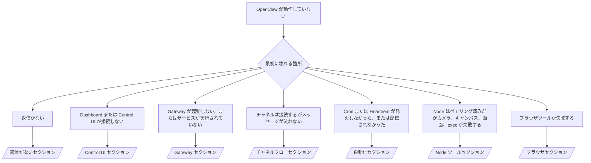

---
read_when:
    - OpenClaw が動作しておらず、最短で修正する必要がある
    - 詳細なランブックに入る前に、トリアージフローが必要です
summary: OpenClaw の症状別トラブルシューティングハブ
title: 一般的なトラブルシューティング
x-i18n:
    generated_at: "2026-07-05T11:30:11Z"
    model: gpt-5.5
    postprocess_version: locale-links-v1
    provider: openai
    source_hash: db50e0cdf4d11f3aa6196be445358d904a2b9c40c89243f1b124c77167f6dd85
    source_path: help/troubleshooting.md
    workflow: 16
---

トリアージの入口。2分で診断し、その後詳細ページへ移動します。

## 最初の60秒

この手順を順番に実行します。

```bash
openclaw status
openclaw status --all
openclaw gateway probe
openclaw gateway status
openclaw doctor
openclaw channels status --probe
openclaw logs --follow
```

良好な出力は各1行です。

- `openclaw status` は設定済みチャネルを表示し、認証エラーがありません。
- `openclaw status --all` は共有可能な完全レポートを生成します。
- `openclaw gateway probe` は `Reachable: yes` を表示します。`Capability: ...` はプローブで証明された認証レベルです。`Read probe: limited - missing scope:
operator.read` は診断機能の低下であり、接続失敗ではありません。
- `openclaw gateway status` は `Runtime: running`、`Connectivity probe:
ok`、妥当な `Capability: ...` を表示します。読み取りスコープ RPC の証明も必須にするには `--require-rpc` を追加します。
- `openclaw doctor` はブロック要因となる設定/サービスエラーを報告しません。
- `openclaw channels status --probe` は、Gateway に到達できる場合、アカウントごとのライブなトランスポート状態（`works` / `audit ok`）を返します。到達できない場合は設定のみの要約にフォールバックします。
- `openclaw logs --follow` は安定した動作を表示し、致命的エラーの繰り返しがありません。

## アシスタントが制限されている、またはツールが見つからない

有効なツールプロファイルを確認します。

```bash
openclaw status
openclaw status --all
openclaw doctor
```

一般的な原因:

- `tools.profile: "minimal"` は `session_status` のみを許可します。
- `tools.profile: "messaging"` は狭く、チャット専用エージェント向けです。
- `tools.profile: "coding"` は新しいローカル設定のデフォルトです（リポジトリ、ファイル、シェル、ランタイム作業）。
- `tools.profile: "full"` はプロファイル制限を解除します。信頼できるオペレーター管理下のエージェントに限定してください。
- エージェントごとの `agents.list[].tools` オーバーライドは、1つのエージェントについてルートプロファイルを狭めたり広げたりします。

プロファイルを変更し、Gateway を再起動またはリロードしてから、`openclaw status --all` で再確認します。完全なプロファイル/グループ表: [ツールプロファイル](/ja-JP/gateway/config-tools#tool-profiles)。

## Anthropic の長いコンテキストでの 429

`HTTP 429: rate_limit_error: Extra usage is required for long context requests`
→ [長いコンテキストに追加使用量が必要な Anthropic 429](/ja-JP/gateway/troubleshooting#anthropic-429-extra-usage-required-for-long-context)。

## ローカルの OpenAI 互換バックエンドは直接動作するが OpenClaw では失敗する

ローカル/セルフホストの `/v1` バックエンドは直接の `/v1/chat/completions` プローブには応答するものの、`openclaw infer model run` または通常のエージェントターンで失敗します。

1. エラーが `messages[].content` には文字列が必要であることに言及している場合:
   `models.providers.<provider>.models[].compat.requiresStringContent: true` を設定します。
2. OpenClaw エージェントターンでのみまだ失敗する場合:
   `models.providers.<provider>.models[].compat.supportsTools: false` を設定して再試行します。
3. 小さな直接呼び出しは動作するが、より大きな OpenClaw プロンプトでバックエンドがクラッシュする場合:
   それは上流のモデル/サーバーの制限であり、OpenClaw のバグではありません。[ローカルの OpenAI 互換バックエンドは直接プローブに合格するが、エージェント実行は失敗する](/ja-JP/gateway/troubleshooting#local-openai-compatible-backend-passes-direct-probes-but-agent-runs-fail) に進みます。

## Plugin インストールが openclaw extensions の不足で失敗する

`package.json missing openclaw.extensions` は、その Plugin パッケージが OpenClaw で現在受け入れられない形を使用していることを意味します。

Plugin パッケージ内で修正します。

1. `package.json` に `openclaw.extensions` を追加し、ビルド済みランタイムファイル（通常は `./dist/index.js`）を指すようにします。
2. 再公開してから、`openclaw plugins install <package>` を再度実行します。

```json
{
  "name": "@openclaw/my-plugin",
  "version": "1.2.3",
  "openclaw": {
    "extensions": ["./dist/index.js"]
  }
}
```

参照: [Plugin アーキテクチャ](/ja-JP/plugins/architecture)

## インストールポリシーが Plugin のインストールまたは更新をブロックする

更新は完了するものの Plugin が古い、無効化されている、または `blocked by install
policy`、`install policy failed closed`、`Disabled "<plugin>" after plugin
update failure` を表示する場合は、`security.installPolicy` を確認します。

インストールポリシーは Plugin のインストールと更新で実行されます。`@openclaw/*` Plugin のバージョンは通常 OpenClaw リリースに合わせて進むため、OpenClaw の更新では、更新後同期中に対応する Plugin 更新が必要になることがあります。

一致するアップグレードルールも保守していない限り、次のようなポリシー形状は避けてください。

- OpenClaw 所有の Plugin を古い特定の1バージョンに固定する（例: `@openclaw/*@2026.5.3` のみ）。
- ソース種別だけでブロックする（すべての npm、ネットワーク、または `request.mode:
"update"` リクエスト）。
- ポリシーコマンドを任意扱いにする: `security.installPolicy` が有効な場合、ポリシー実行ファイルがない、遅い、読み取れない、または権限でブロックされると、フェイルクローズします。
- リクエストの `openclawVersion` を Plugin 候補メタデータと照合せずにバージョンを承認する。

1つのリリースを永続的に固定するのではなく、現在のホストと互換性がある信頼済み `@openclaw/*` 更新を許可するルールを推奨します。デフォルトで npm をブロックする場合は、使用している Plugin id に狭い例外を追加し、インストールと同じ信頼ルールを `request.mode: "update"` にも適用します。

復旧:

```bash
openclaw doctor --deep
openclaw plugins update --all
openclaw status --all
```

ポリシーが意図的に厳格な場合は、信頼済みアップグレード期間だけ緩和し、`openclaw plugins update --all` を再実行してから、より厳格なルールを復元します。更新失敗で Plugin が無効化された場合は、再有効化の前に調査します。

```bash
openclaw plugins inspect <plugin-id> --runtime --json
openclaw plugins enable <plugin-id>
```

参照: [オペレーターインストールポリシー](/ja-JP/tools/skills-config#operator-install-policy-securityinstallpolicy)

## Plugin は存在するが疑わしい所有権でブロックされている

`openclaw doctor`、セットアップ、または起動時の警告に次が表示されます。

```text
blocked plugin candidate: suspicious ownership (... uid=1000, expected uid=0 or root)
plugin present but blocked
```

Plugin ファイルの所有者が、それを読み込むプロセスとは異なる Unix ユーザーです。Plugin 設定を削除しないでください。ファイル所有権を修正するか、状態ディレクトリを所有しているユーザーとして OpenClaw を実行してください。

Docker インストールは `node`（uid `1000`）として実行されます。ホストのバインドマウントを修復します。

```bash
sudo chown -R 1000:1000 /path/to/openclaw-config /path/to/openclaw-workspace
openclaw doctor --fix
```

意図的に OpenClaw を root として実行している場合は、代わりに管理対象 Plugin ルートを修復します。

```bash
sudo chown -R root:root /path/to/openclaw-config/npm
openclaw doctor --fix
```

詳細ドキュメント: [ブロックされた Plugin パス所有権](/ja-JP/tools/plugin#blocked-plugin-path-ownership)、[Docker: 権限と EACCES](/ja-JP/install/docker#shell-helpers-optional)

## 判断ツリー



<AccordionGroup>
  <Accordion title="返信がない">
    ```bash
    openclaw status
    openclaw gateway status
    openclaw channels status --probe
    openclaw pairing list --channel <channel> [--account <id>]
    openclaw logs --follow
    ```

    良好な出力:

    - `Runtime: running`
    - `Connectivity probe: ok`
    - `Capability: read-only`、`write-capable`、または `admin-capable`
    - チャネルでトランスポート接続済みと表示され、対応している場合は `channels status --probe` に `works` または `audit ok` が表示される
    - 送信者が承認済み（または DM ポリシーが open/allowlist）

    ログシグネチャ:

    - `drop guild message (mention required` → Discord のメンションゲートによりメッセージがブロックされました。
    - `pairing request` → 送信者が未承認で、DM ペアリング承認待ちです。
    - チャネルログ内の `blocked` / `allowlist` → 送信者、ルーム、またはグループがフィルタリングされています。

    詳細ページ: [返信がない](/ja-JP/gateway/troubleshooting#no-replies)、[チャネルのトラブルシューティング](/ja-JP/channels/troubleshooting)、[ペアリング](/ja-JP/channels/pairing)

  </Accordion>

  <Accordion title="Dashboard または Control UI が接続しない">
    ```bash
    openclaw status
    openclaw gateway status
    openclaw logs --follow
    openclaw doctor
    openclaw channels status --probe
    ```

    良好な出力:

    - `openclaw gateway status` に `Dashboard: http://...` が表示される
    - `Connectivity probe: ok`
    - `Capability: read-only`、`write-capable`、または `admin-capable`
    - ログに認証ループがない

    ログシグネチャ:

    - `device identity required` → HTTP/非セキュアコンテキストではデバイス認証を完了できません。
    - `origin not allowed` → ブラウザの `Origin` が Control UI の Gateway ターゲットに許可されていません。
    - `AUTH_TOKEN_MISMATCH` と `canRetryWithDeviceToken=true` → 信頼済みデバイストークンによる1回の再試行が自動的に発生することがあり、ペアリング済みトークンのキャッシュされたスコープを再利用します。
    - その再試行後も `unauthorized` が繰り返される → トークン/パスワードが誤っている、認証モードが一致しない、またはペアリング済みデバイストークンが古い状態です。
    - `too many failed authentication attempts (retry later)` → そのブラウザ `Origin` からの失敗が繰り返されたため一時的にロックアウトされています。他の localhost オリジンは別バケットを使用します。Tailscale Serve の同時再試行のニュアンスについては [Dashboard/Control UI 接続性](/ja-JP/gateway/troubleshooting#dashboard-control-ui-connectivity) を参照してください。
    - `gateway connect failed:` → UI が誤った URL/ポートを対象にしているか、Gateway に到達できません。

    詳細ページ: [Dashboard/Control UI 接続性](/ja-JP/gateway/troubleshooting#dashboard-control-ui-connectivity)、[Control UI](/ja-JP/web/control-ui)、[認証](/ja-JP/gateway/authentication)

  </Accordion>

  <Accordion title="Gateway が起動しない、またはサービスはインストール済みだが実行されていない">
    ```bash
    openclaw status
    openclaw gateway status
    openclaw logs --follow
    openclaw doctor
    openclaw channels status --probe
    ```

    良好な出力:

    - `Service: ... (loaded)`
    - `Runtime: running`
    - `Connectivity probe: ok`
    - `Capability: read-only`、`write-capable`、または `admin-capable`

    ログシグネチャ:

    - `Gateway start blocked: set gateway.mode=local` または `existing config is missing gateway.mode` → Gateway モードが remote、または設定にローカルモードのスタンプがなく修復が必要です。
    - `refusing to bind gateway ... without auth` → 有効な認証パス（トークン/パスワード、または設定済みの場合は trusted-proxy）なしで非ループバックにバインドしています。
    - `another gateway instance is already listening` または `EADDRINUSE` → ポートがすでに使用されています。

    詳細ページ: [Gateway サービスが実行されていない](/ja-JP/gateway/troubleshooting#gateway-service-not-running)、[バックグラウンドプロセス](/ja-JP/gateway/background-process)、[設定](/ja-JP/gateway/configuration)

  </Accordion>

  <Accordion title="チャネルは接続するがメッセージが流れない">
    ```bash
    openclaw status
    openclaw gateway status
    openclaw logs --follow
    openclaw doctor
    openclaw channels status --probe
    ```

    良好な出力:

    - チャネルトランスポートが接続されています。
    - ペアリング/allowlist チェックに合格します。
    - 必要な場所でメンションが検出されています。

    ログシグネチャ:

    - `mention required` → グループメンションゲートにより処理がブロックされました。
    - `pairing` / `pending` → DM 送信者がまだ承認されていません。
    - `not_in_channel`、`missing_scope`、`Forbidden`、`401/403` → チャネル権限トークンの問題です。

    詳細ページ: [チャネルは接続済みだがメッセージが流れない](/ja-JP/gateway/troubleshooting#channel-connected-messages-not-flowing)、[チャネルのトラブルシューティング](/ja-JP/channels/troubleshooting)

  </Accordion>

  <Accordion title="Cron または Heartbeat が発火しなかった、または配信されなかった">
    ```bash
    openclaw status
    openclaw gateway status
    openclaw cron status
    openclaw cron list
    openclaw cron runs --id <jobId> --limit 20
    openclaw logs --follow
    ```

    良好な出力:

    - `cron status` は、次回起床時刻付きでスケジューラーが有効であることを示します。
    - `cron runs` は最近の `ok` エントリを表示します。
    - Heartbeat が有効で、アクティブ時間内です。

    ログシグネチャ:

    - `cron: scheduler disabled; jobs will not run automatically` → cron は無効です。
    - `heartbeat skipped` reason `quiet-hours` → 設定されたアクティブ時間外です。
    - `heartbeat skipped` reason `empty-heartbeat-file` → `HEARTBEAT.md` は存在しますが、空行、コメント、ヘッダー、フェンス、または空のチェックリストの足場のみを含みます。
    - `heartbeat skipped` reason `no-tasks-due` → タスクモードは有効ですが、まだ期限になったタスク間隔はありません。
    - `heartbeat skipped` reason `alerts-disabled` → `showOk`、`showAlerts`、`useIndicator` がすべてオフです。
    - `requests-in-flight` → メインレーンがビジーです。heartbeat の wake は延期されます。
    - `unknown accountId` → heartbeat 配信先アカウントが存在しません。

    詳細ページ: [Cron と heartbeat 配信](/ja-JP/gateway/troubleshooting#cron-and-heartbeat-delivery), [スケジュール済みタスク: トラブルシューティング](/ja-JP/automation/cron-jobs#troubleshooting), [Heartbeat](/ja-JP/gateway/heartbeat)

  </Accordion>

  <Accordion title="Node はペアリング済みだがツールが camera canvas screen exec で失敗する">
    ```bash
    openclaw status
    openclaw gateway status
    openclaw nodes status
    openclaw nodes describe --node <idOrNameOrIp>
    openclaw logs --follow
    ```

    正常な出力:

    - Node が `node` ロールで接続済みかつペアリング済みとして一覧表示される。
    - 呼び出しているコマンドに対応する capability が存在する。
    - ツールの permission 状態が granted である。

    ログシグネチャ:

    - `NODE_BACKGROUND_UNAVAILABLE` → node アプリをフォアグラウンドに移動します。
    - `*_PERMISSION_REQUIRED` → OS の permission が拒否されているか不足しています。
    - `SYSTEM_RUN_DENIED: approval required` → exec approval が保留中です。
    - `SYSTEM_RUN_DENIED: allowlist miss` → コマンドが exec allowlist にありません。

    詳細ページ: [Node はペアリング済みだがツールが失敗する](/ja-JP/gateway/troubleshooting#node-paired-tool-fails), [Node トラブルシューティング](/ja-JP/nodes/troubleshooting), [Exec approval](/ja-JP/tools/exec-approvals)

  </Accordion>

  <Accordion title="Exec が突然 approval を求める">
    ```bash
    openclaw config get tools.exec.host
    openclaw config get tools.exec.security
    openclaw config get tools.exec.ask
    openclaw gateway restart
    ```

    変更点:

    - 未設定の `tools.exec.host` は `auto` をデフォルトにし、sandbox runtime が有効な場合は `sandbox`、それ以外は `gateway` に解決されます。
    - `host=auto` はルーティングのみを行います。プロンプトなしの動作は、
      gateway/node 上の `security=full` と `ask=off` によるものです。
    - 未設定の `tools.exec.security` は `gateway`/`node` で `full` をデフォルトにします。
    - 未設定の `tools.exec.ask` は `off` をデフォルトにします。
    - approval が表示される場合、何らかの host-local またはセッションごとのポリシーにより、
      exec がこれらのデフォルトより厳しくされています。

    現在の approval なしデフォルトを復元します:

    ```bash
    openclaw config set tools.exec.host gateway
    openclaw config set tools.exec.security full
    openclaw config set tools.exec.ask off
    openclaw gateway restart
    ```

    より安全な代替:

    - 安定したホストルーティングのために `tools.exec.host=gateway` のみを設定します。
    - host exec で allowlist miss 時にレビューするには、`security=allowlist` と `ask=on-miss` を使用します。
    - sandbox mode を有効にして、`host=auto` が `sandbox` に戻って解決されるようにします。

    ログシグネチャ:

    - `Approval required.` → コマンドは `/approve ...` を待っています。
    - `SYSTEM_RUN_DENIED: approval required` → node-host exec approval が保留中です。
    - `exec host=sandbox requires a sandbox runtime for this session` → 暗黙的/明示的に sandbox が選択されていますが、sandbox mode はオフです。

    詳細ページ: [Exec](/ja-JP/tools/exec), [Exec approval](/ja-JP/tools/exec-approvals), [Security: 監査のチェック内容](/ja-JP/gateway/security#what-the-audit-checks-high-level)

  </Accordion>

  <Accordion title="Browser ツールが失敗する">
    ```bash
    openclaw status
    openclaw gateway status
    openclaw browser status
    openclaw logs --follow
    openclaw doctor
    ```

    正常な出力:

    - Browser ステータスに `running: true` と選択された browser/profile が表示される。
    - `openclaw` profile が起動する、または `user` profile がローカルの Chrome タブを認識する。

    ログシグネチャ:

    - `unknown command "browser"` → `plugins.allow` が設定されており、`browser` を除外しています。
    - `Failed to start Chrome CDP on port` → ローカル browser の起動に失敗しました。
    - `browser.executablePath not found` → 設定されたバイナリパスが間違っています。
    - `browser.cdpUrl must be http(s) or ws(s)` → 設定された CDP URL がサポートされていないスキームを使用しています。
    - `browser.cdpUrl has invalid port` → 設定された CDP URL に不正または範囲外のポートがあります。
    - `No Chrome tabs found for profile="user"` → Chrome MCP attach profile に開いているローカル Chrome タブがありません。
    - `Remote CDP for profile "<name>" is not reachable` → 設定された remote CDP endpoint にこのホストから到達できません。
    - `Browser attachOnly is enabled ... not reachable` → attach-only profile に稼働中の CDP target がありません。
    - attach-only または remote CDP profile 上の古い viewport/dark-mode/locale/offline override → gateway を再起動せずに control session を閉じて emulation state を解放するには、`openclaw browser stop --browser-profile <name>` を実行します。

    詳細ページ: [Browser ツールが失敗する](/ja-JP/gateway/troubleshooting#browser-tool-fails), [Browser コマンドまたはツールが見つからない](/ja-JP/tools/browser#missing-browser-command-or-tool), [Browser: Linux トラブルシューティング](/ja-JP/tools/browser-linux-troubleshooting), [Browser: WSL2/Windows remote CDP トラブルシューティング](/ja-JP/tools/browser-wsl2-windows-remote-cdp-troubleshooting)

  </Accordion>

</AccordionGroup>

## 関連

- [FAQ](/ja-JP/help/faq) — よくある質問
- [Gateway Troubleshooting](/ja-JP/gateway/troubleshooting) — gateway 固有の問題
- [Doctor](/ja-JP/gateway/doctor) — 自動ヘルスチェックと修復
- [Channel Troubleshooting](/ja-JP/channels/troubleshooting) — channel 接続の問題
- [スケジュール済みタスク: トラブルシューティング](/ja-JP/automation/cron-jobs#troubleshooting) — cron と heartbeat の問題
