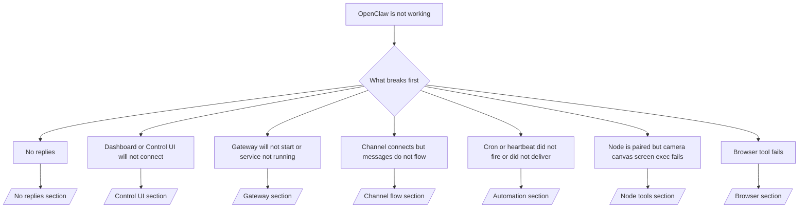

---
read_when:
    - OpenClaw が動作しておらず、修正への最短手順が必要です
    - 深いランブックに入る前にトリアージフローが必要な場合
summary: OpenClaw の症状別トラブルシューティングハブ
title: 一般的なトラブルシューティング
x-i18n:
    generated_at: "2026-06-27T11:45:26Z"
    model: gpt-5.5
    postprocess_version: locale-links-v1
    provider: openai
    source_hash: ae1236c73e3a5c9237bd81d603e8dca18c595a8bcbb71f5931bfbf2389b342cd
    source_path: help/troubleshooting.md
    workflow: 16
---

時間が 2 分しかない場合は、このページをトリアージの入口として使用してください。

## 最初の 60 秒

この正確な手順を順番に実行します。

```bash
openclaw status
openclaw status --all
openclaw gateway probe
openclaw gateway status
openclaw doctor
openclaw channels status --probe
openclaw logs --follow
```

良好な出力を 1 行で表すと次のとおりです。

- `openclaw status` → 構成済みチャンネルが表示され、明らかな認証エラーがない。
- `openclaw status --all` → 完全なレポートが存在し、共有できる。
- `openclaw gateway probe` → 期待される gateway ターゲットに到達できる（`Reachable: yes`）。`Capability: ...` はプローブで証明できた認証レベルを示し、`Read probe: limited - missing scope: operator.read` は診断機能の低下であり、接続失敗ではありません。
- `openclaw gateway status` → `Runtime: running`、`Connectivity probe: ok`、妥当な `Capability: ...` 行が表示される。読み取りスコープの RPC 証明も必要な場合は `--require-rpc` を使用します。
- `openclaw doctor` → ブロック要因となる構成/サービスエラーがない。
- `openclaw channels status --probe` → 到達可能な gateway は、ライブのアカウント別
  トランスポート状態に加えて、`works` や `audit ok` などのプローブ/監査結果を返します。gateway に
  到達できない場合、コマンドは構成のみの要約にフォールバックします。
- `openclaw logs --follow` → 安定したアクティビティがあり、致命的なエラーの繰り返しがない。

## Assistant が制限されている、またはツールが見つからないように感じる

Assistant がファイルを検査できない、コマンドを実行できない、ブラウザ自動化を使用できない、または
期待されるツールを確認できない場合は、まず有効なツールプロファイルを確認してください。

```bash
openclaw status
openclaw status --all
openclaw doctor
```

一般的な原因:

- `tools.profile: "messaging"` はチャット専用エージェント向けに意図的に狭くなっています。
- `tools.profile: "coding"` は、リポジトリ、ファイル、シェル、
  ランタイムワークフロー向けの通常のプロファイルです。
- `tools.profile: "full"` は最も広いツールセットを公開するため、
  信頼できるオペレーター制御のエージェントに限定する必要があります。
- エージェント別の `agents.list[].tools` オーバーライドにより、1 つのエージェントに対してルート
  プロファイルを狭めたり広げたりできます。

ルートまたはエージェント別のツールプロファイルを変更し、Gateway を再起動または再読み込みしてから
`openclaw status --all` を再度実行します。プロファイル
モデルと allow/deny オーバーライドについては、[ツール](/ja-JP/tools) を参照してください。

## Anthropic 長いコンテキスト 429

次のエラーが表示される場合:
`HTTP 429: rate_limit_error: Extra usage is required for long context requests`,
[/gateway/troubleshooting#anthropic-429-extra-usage-required-for-long-context](/ja-JP/gateway/troubleshooting#anthropic-429-extra-usage-required-for-long-context) に進んでください。

## ローカルの OpenAI 互換バックエンドは直接動作するが OpenClaw では失敗する

ローカルまたはセルフホストの `/v1` バックエンドが、小さな直接の
`/v1/chat/completions` プローブには応答するものの、`openclaw infer model run` や通常の
エージェントターンで失敗する場合:

1. エラーが `messages[].content` に文字列が期待されることを示している場合は、
   `models.providers.<provider>.models[].compat.requiresStringContent: true` を設定します。
2. それでもバックエンドが OpenClaw のエージェントターンでのみ失敗する場合は、
   `models.providers.<provider>.models[].compat.supportsTools: false` を設定して再試行します。
3. ごく小さな直接呼び出しは引き続き動作する一方で、より大きな OpenClaw プロンプトにより
   バックエンドがクラッシュする場合は、残りの問題を上流のモデル/サーバーの制限として扱い、
   詳細ランブックに進んでください:
   [/gateway/troubleshooting#local-openai-compatible-backend-passes-direct-probes-but-agent-runs-fail](/ja-JP/gateway/troubleshooting#local-openai-compatible-backend-passes-direct-probes-but-agent-runs-fail)

## Plugin のインストールが openclaw extensions の欠落で失敗する

インストールが `package.json missing openclaw.extensions` で失敗する場合、その plugin パッケージは
OpenClaw が現在受け付けない古い形を使用しています。

plugin パッケージで修正します。

1. `package.json` に `openclaw.extensions` を追加します。
2. エントリをビルド済みランタイムファイル（通常は `./dist/index.js`）に向けます。
3. plugin を再公開し、`openclaw plugins install <package>` を再度実行します。

例:

```json
{
  "name": "@openclaw/my-plugin",
  "version": "1.2.3",
  "openclaw": {
    "extensions": ["./dist/index.js"]
  }
}
```

参照: [Plugin アーキテクチャ](/ja-JP/plugins/architecture)

## インストールポリシーが plugin のインストールまたは更新をブロックする

更新が完了しても plugin が古い、無効化されている、または
`blocked by install policy`、`install policy failed closed`、または
`Disabled "<plugin>" after plugin update failure` のようなメッセージが表示される場合は、
`security.installPolicy` を確認してください。

インストールポリシーは plugin のインストールと更新で実行されます。OpenClaw 所有の plugin
バージョンは通常 OpenClaw リリースに合わせて進むため、OpenClaw の更新では
更新後同期中に一致する `@openclaw/*` plugin の更新も必要になる場合があります。

対応するアップグレード
ルールも保守していない限り、次のような広範なポリシー形状は避けてください。

- OpenClaw 所有の plugin を、たとえば
  `@openclaw/*@2026.5.3` のみを許可するような、単一の厳密な古いバージョンに固定する。
- npm、ネットワーク、または
  `request.mode: "update"` の plugin リクエストすべてなど、ソース種別だけでブロックする。
- ポリシーコマンドを任意として扱う。`security.installPolicy` が
  有効な場合、ポリシー実行ファイルが存在しない、遅い、読み取れない、または権限でブロックされていると
  fail closed になります。
- ポリシーリクエストの
  `openclawVersion` と plugin 候補メタデータを考慮せずに plugin バージョンを承認する。

より安全なポリシールールでは、単一のリリースに永続的に固定するのではなく、
候補が現在の OpenClaw ホストと互換性がある場合に、信頼された OpenClaw 所有 plugin の更新を許可します。
npm をデフォルトでブロックする場合は、使用している信頼済み `@openclaw/*` plugin パッケージまたは plugin id に
限定的な例外を設けます。インストールリクエストと更新リクエストを区別する場合は、
同じ信頼ルールを `request.mode: "update"` に適用します。

復旧:

```bash
openclaw doctor --deep
openclaw plugins update --all
openclaw status --all
```

ポリシーが意図的に厳格な場合は、信頼済み OpenClaw アップグレード
期間中だけ緩和し、`openclaw plugins update --all` を再実行してから、より厳格なルールを復元します。
更新失敗後に plugin が無効化された場合は、調査し、更新が成功した後にのみ再有効化します。

```bash
openclaw plugins inspect <plugin-id> --runtime --json
openclaw plugins enable <plugin-id>
```

参照: [オペレーターインストールポリシー](/ja-JP/tools/skills-config#operator-install-policy-securityinstallpolicy)

## Pluginは存在するが、不審な所有権によりブロックされている

`openclaw doctor`、セットアップ、または起動時の警告に次のように表示される場合:

```text
blocked plugin candidate: suspicious ownership (... uid=1000, expected uid=0 or root)
plugin present but blocked
```

Pluginファイルは、それらを読み込むプロセスとは異なるUnixユーザーに所有されています。Plugin設定は削除しないでください。ファイルの所有権を修正するか、状態ディレクトリを所有しているユーザーと同じユーザーでOpenClawを実行してください。

Dockerインストールは通常 `node` (uid `1000`) として実行されます。デフォルトのDockerセットアップでは、ホストのバインドマウントを修復します:

```bash
sudo chown -R 1000:1000 /path/to/openclaw-config /path/to/openclaw-workspace
openclaw doctor --fix
```

意図的にOpenClawをrootとして実行している場合は、代わりに管理対象のPluginルートをroot所有権に修復します:

```bash
sudo chown -R root:root /path/to/openclaw-config/npm
openclaw doctor --fix
```

詳細なドキュメント:

- [Pluginパスの所有権](/ja-JP/tools/plugin#blocked-plugin-path-ownership)
- [Dockerの権限](/ja-JP/install/docker#permissions-and-eacces)

## 判断ツリー



<AccordionGroup>
  <Accordion title="返信がない">
    ```bash
    openclaw status
    openclaw gateway status
    openclaw channels status --probe
    openclaw pairing list --channel <channel> [--account <id>]
    openclaw logs --follow
    ```

    良好な出力は次のようになります:

    - `Runtime: running`
    - `Connectivity probe: ok`
    - `Capability: read-only`、`write-capable`、または`admin-capable`
    - チャンネルでトランスポートが接続済みと表示され、対応している場合は `channels status --probe` に `works` または `audit ok` が表示される
    - 送信者が承認済みとして表示される、またはDMポリシーがオープン/許可リストになっている

    よくあるログのシグネチャ:

    - `drop guild message (mention required` → メンションゲートによりDiscord内のメッセージがブロックされました。
    - `pairing request` → 送信者は未承認で、DMペアリング承認を待っています。
    - チャンネルログ内の `blocked` / `allowlist` → 送信者、ルーム、またはグループがフィルタされています。

    詳細ページ:

    - [/gateway/troubleshooting#no-replies](/ja-JP/gateway/troubleshooting#no-replies)
    - [/channels/troubleshooting](/ja-JP/channels/troubleshooting)
    - [/channels/pairing](/ja-JP/channels/pairing)

  </Accordion>

  <Accordion title="ダッシュボードまたはControl UIが接続できない">
    ```bash
    openclaw status
    openclaw gateway status
    openclaw logs --follow
    openclaw doctor
    openclaw channels status --probe
    ```

    良好な出力は次のようになります:

    - `openclaw gateway status` に `Dashboard: http://...` が表示される
    - `Connectivity probe: ok`
    - `Capability: read-only`、`write-capable`、または`admin-capable`
    - ログに認証ループがない

    よくあるログのシグネチャ:

    - `device identity required` → HTTP/非セキュアなコンテキストではデバイス認証を完了できません。
    - `origin not allowed` → ブラウザの `Origin` がControl UIのGatewayターゲットで許可されていません。
    - 再試行ヒント (`canRetryWithDeviceToken=true`) 付きの `AUTH_TOKEN_MISMATCH` → 信頼済みデバイストークンによる再試行が1回、自動的に行われる場合があります。
    - そのキャッシュ済みトークンの再試行では、ペアリング済みデバイストークンと一緒に保存されたキャッシュ済みスコープセットを再利用します。明示的な `deviceToken` / 明示的な `scopes` の呼び出し元は、代わりに要求したスコープセットを維持します。
    - 非同期のTailscale Serve Control UIパスでは、同じ `{scope, ip}` に対する失敗した試行は、リミッターが失敗を記録する前に直列化されるため、2つ目の同時の不正な再試行ですでに `retry later` が表示されることがあります。
    - localhostブラウザオリジンからの `too many failed authentication attempts (retry later)` → 同じ `Origin` からの失敗が繰り返されたため、一時的にロックアウトされています。別のlocalhostオリジンは別のバケットを使用します。
    - その再試行後も `unauthorized` が繰り返される → トークン/パスワードが誤っている、認証モードが一致しない、またはペアリング済みデバイストークンが古くなっています。
    - `gateway connect failed:` → UIが誤ったURL/ポートを指しているか、Gatewayに到達できません。

    詳細ページ:

    - [/gateway/troubleshooting#dashboard-control-ui-connectivity](/ja-JP/gateway/troubleshooting#dashboard-control-ui-connectivity)
    - [/web/control-ui](/ja-JP/web/control-ui)
    - [/gateway/authentication](/ja-JP/gateway/authentication)

  </Accordion>

  <Accordion title="Gatewayが起動しない、またはサービスはインストール済みだが実行されていない">
    ```bash
    openclaw status
    openclaw gateway status
    openclaw logs --follow
    openclaw doctor
    openclaw channels status --probe
    ```

    良好な出力は次のようになります:

    - `Service: ... (loaded)`
    - `Runtime: running`
    - `Connectivity probe: ok`
    - `Capability: read-only`、`write-capable`、または`admin-capable`

    よくあるログのシグネチャ:

    - `Gateway start blocked: set gateway.mode=local` または `existing config is missing gateway.mode` → Gatewayモードがremoteであるか、設定ファイルにlocal-modeスタンプがなく、修復する必要があります。
    - `refusing to bind gateway ... without auth` → 有効なGateway認証パス（トークン/パスワード、または設定済みの場合はtrusted-proxy）なしで非ループバックにバインドしようとしています。
    - `another gateway instance is already listening` または `EADDRINUSE` → ポートはすでに使用されています。

    詳細ページ:

    - [/gateway/troubleshooting#gateway-service-not-running](/ja-JP/gateway/troubleshooting#gateway-service-not-running)
    - [/gateway/background-process](/ja-JP/gateway/background-process)
    - [/gateway/configuration](/ja-JP/gateway/configuration)

  </Accordion>

  <Accordion title="チャネルは接続されるがメッセージが流れない">
    ```bash
    openclaw status
    openclaw gateway status
    openclaw logs --follow
    openclaw doctor
    openclaw channels status --probe
    ```

    良好な出力は次のようになります。

    - チャネルのトランスポートが接続されています。
    - ペアリング/許可リストのチェックが通っています。
    - 必要な場所でメンションが検出されています。

    よくあるログシグネチャ:

    - `mention required` → グループメンションゲートにより処理がブロックされました。
    - `pairing` / `pending` → DM 送信者はまだ承認されていません。
    - `not_in_channel`, `missing_scope`, `Forbidden`, `401/403` → チャネル権限トークンの問題です。

    詳細ページ:

    - [/gateway/troubleshooting#channel-connected-messages-not-flowing](/ja-JP/gateway/troubleshooting#channel-connected-messages-not-flowing)
    - [/channels/troubleshooting](/ja-JP/channels/troubleshooting)

  </Accordion>

  <Accordion title="Cron または Heartbeat が実行されない、または配信されない">
    ```bash
    openclaw status
    openclaw gateway status
    openclaw cron status
    openclaw cron list
    openclaw cron runs --id <jobId> --limit 20
    openclaw logs --follow
    ```

    良好な出力は次のようになります。

    - `cron.status` は有効で、次回の起動時刻が表示されています。
    - `cron runs` に最近の `ok` エントリが表示されています。
    - Heartbeat が有効で、アクティブ時間外ではありません。

    よくあるログシグネチャ:

    - `cron: scheduler disabled; jobs will not run automatically` → cron は無効です。
    - `heartbeat skipped` with `reason=quiet-hours` → 設定されたアクティブ時間外です。
    - `heartbeat skipped` with `reason=empty-heartbeat-file` → `HEARTBEAT.md` は存在しますが、空白、コメント、ヘッダー、フェンス、または空のチェックリストの足場のみを含んでいます。
    - `heartbeat skipped` with `reason=no-tasks-due` → `HEARTBEAT.md` のタスクモードは有効ですが、まだ期限に達したタスク間隔がありません。
    - `heartbeat skipped` with `reason=alerts-disabled` → すべての heartbeat 表示が無効です（`showOk`、`showAlerts`、`useIndicator` がすべてオフです）。
    - `requests-in-flight` → メインレーンがビジーです。heartbeat の起動は延期されました。
    - `unknown accountId` → heartbeat 配信先アカウントが存在しません。

    詳細ページ:

    - [/gateway/troubleshooting#cron-and-heartbeat-delivery](/ja-JP/gateway/troubleshooting#cron-and-heartbeat-delivery)
    - [/automation/cron-jobs#troubleshooting](/ja-JP/automation/cron-jobs#troubleshooting)
    - [/gateway/heartbeat](/ja-JP/gateway/heartbeat)

  </Accordion>

  <Accordion title="Node はペアリング済みだがツールで camera canvas screen exec が失敗する">
    ```bash
    openclaw status
    openclaw gateway status
    openclaw nodes status
    openclaw nodes describe --node <idOrNameOrIp>
    openclaw logs --follow
    ```

    良好な出力は次のようになります。

    - Node が接続済みとして一覧に表示され、ロール `node` に対してペアリングされています。
    - 呼び出しているコマンドに対応するケイパビリティが存在します。
    - ツールの権限状態が許可済みです。

    よくあるログシグネチャ:

    - `NODE_BACKGROUND_UNAVAILABLE` → ノードアプリをフォアグラウンドに移動してください。
    - `*_PERMISSION_REQUIRED` → OS 権限が拒否されたか不足しています。
    - `SYSTEM_RUN_DENIED: approval required` → exec 承認が保留中です。
    - `SYSTEM_RUN_DENIED: allowlist miss` → コマンドが exec 許可リストにありません。

    詳細ページ:

    - [/gateway/troubleshooting#node-paired-tool-fails](/ja-JP/gateway/troubleshooting#node-paired-tool-fails)
    - [/nodes/troubleshooting](/ja-JP/nodes/troubleshooting)
    - [/tools/exec-approvals](/ja-JP/tools/exec-approvals)

  </Accordion>

  <Accordion title="Exec が突然承認を求める">
    ```bash
    openclaw config get tools.exec.host
    openclaw config get tools.exec.security
    openclaw config get tools.exec.ask
    openclaw gateway restart
    ```

    変更点:

    - `tools.exec.host` が未設定の場合、デフォルトは `auto` です。
    - `host=auto` は、サンドボックスランタイムがアクティブな場合は `sandbox`、それ以外の場合は `gateway` に解決されます。
    - `host=auto` はルーティングのみです。プロンプトなしの「YOLO」動作は、gateway/node 上の `security=full` と `ask=off` によって発生します。
    - `gateway` と `node` では、未設定の `tools.exec.security` はデフォルトで `full` になります。
    - 未設定の `tools.exec.ask` はデフォルトで `off` になります。
    - 結果: 承認が表示されている場合、何らかのホストローカルまたはセッションごとのポリシーが exec を現在のデフォルトより厳しくしています。

    現在のデフォルトの承認不要動作を復元する:

    ```bash
    openclaw config set tools.exec.host gateway
    openclaw config set tools.exec.security full
    openclaw config set tools.exec.ask off
    openclaw gateway restart
    ```

    より安全な代替案:

    - 安定したホストルーティングだけが必要な場合は、`tools.exec.host=gateway` のみを設定してください。
    - ホスト exec は使いたいが、許可リストにない場合はレビューも必要なら、`security=allowlist` と `ask=on-miss` を使用してください。
    - `host=auto` を `sandbox` に戻して解決したい場合は、サンドボックスモードを有効にしてください。

    よくあるログシグネチャ:

    - `Approval required.` → コマンドは `/approve ...` を待機しています。
    - `SYSTEM_RUN_DENIED: approval required` → node ホスト exec 承認が保留中です。
    - `exec host=sandbox requires a sandbox runtime for this session` → 暗黙的/明示的なサンドボックス選択ですが、サンドボックスモードがオフです。

    詳細ページ:

    - [/tools/exec](/ja-JP/tools/exec)
    - [/tools/exec-approvals](/ja-JP/tools/exec-approvals)
    - [/gateway/security#what-the-audit-checks-high-level](/ja-JP/gateway/security#what-the-audit-checks-high-level)

  </Accordion>

  <Accordion title="ブラウザツールが失敗する">
    ```bash
    openclaw status
    openclaw gateway status
    openclaw browser status
    openclaw logs --follow
    openclaw doctor
    ```

    良好な出力は次のようになります。

    - ブラウザステータスに `running: true` と選択されたブラウザ/プロファイルが表示されています。
    - `openclaw` が起動する、または `user` がローカルの Chrome タブを確認できます。

    よくあるログシグネチャ:

    - `unknown command "browser"` or `unknown command 'browser'` → `plugins.allow` が設定されており、`browser` が含まれていません。
    - `Failed to start Chrome CDP on port` → ローカルブラウザの起動に失敗しました。
    - `browser.executablePath not found` → 設定されたバイナリパスが誤っています。
    - `browser.cdpUrl must be http(s) or ws(s)` → 設定された CDP URL はサポートされていないスキームを使用しています。
    - `browser.cdpUrl has invalid port` → 設定された CDP URL のポートが不正、または範囲外です。
    - `No Chrome tabs found for profile="user"` → Chrome MCP アタッチプロファイルに開いているローカル Chrome タブがありません。
    - `Remote CDP for profile "<name>" is not reachable` → 設定されたリモート CDP エンドポイントはこのホストから到達できません。
    - `Browser attachOnly is enabled ... not reachable` or `Browser attachOnly is enabled and CDP websocket ... is not reachable` → アタッチ専用プロファイルに稼働中の CDP ターゲットがありません。
    - attach-only またはリモート CDP プロファイルで古いビューポート / ダークモード / ロケール / オフラインのオーバーライドが残っている → Gateway を再起動せずに、`openclaw browser stop --browser-profile <name>` を実行してアクティブな制御セッションを閉じ、エミュレーション状態を解放してください。

    詳細ページ:

    - [/gateway/troubleshooting#browser-tool-fails](/ja-JP/gateway/troubleshooting#browser-tool-fails)
    - [/tools/browser#missing-browser-command-or-tool](/ja-JP/tools/browser#missing-browser-command-or-tool)
    - [/tools/browser-linux-troubleshooting](/ja-JP/tools/browser-linux-troubleshooting)
    - [/tools/browser-wsl2-windows-remote-cdp-troubleshooting](/ja-JP/tools/browser-wsl2-windows-remote-cdp-troubleshooting)

  </Accordion>

</AccordionGroup>

## 関連

- [FAQ](/ja-JP/help/faq) — よくある質問
- [Gateway Troubleshooting](/ja-JP/gateway/troubleshooting) — gateway 固有の問題
- [Doctor](/ja-JP/gateway/doctor) — 自動ヘルスチェックと修復
- [Channel Troubleshooting](/ja-JP/channels/troubleshooting) — チャネル接続の問題
- [Automation Troubleshooting](/ja-JP/automation/cron-jobs#troubleshooting) — cron と heartbeat の問題
