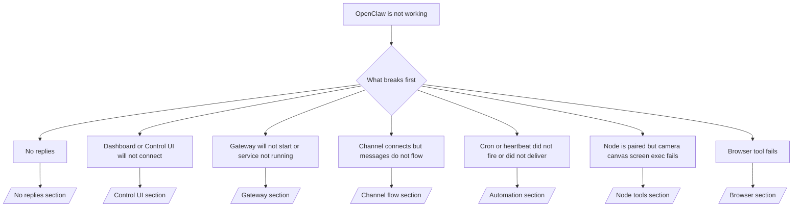

---
read_when:
    - OpenClaw が動作しておらず、最速で修正にたどり着く必要がある場合
    - 詳細なランブックに入る前にトリアージフローが欲しい場合
summary: OpenClaw の症状優先トラブルシューティングハブ
title: 一般的なトラブルシューティング
x-i18n:
    generated_at: "2026-04-21T04:47:22Z"
    model: gpt-5.4
    provider: openai
    source_hash: cc5d8c9f804084985c672c5a003ce866e8142ab99fe81abb7a0d38e22aea4b88
    source_path: help/troubleshooting.md
    workflow: 15
---

# トラブルシューティング

2 分しかない場合は、このページをトリアージの入口として使ってください。

## 最初の 60 秒

次の正確な手順をこの順番で実行してください。

```bash
openclaw status
openclaw status --all
openclaw gateway probe
openclaw gateway status
openclaw doctor
openclaw channels status --probe
openclaw logs --follow
```

良い出力を 1 行で言うと:

- `openclaw status` → 設定済みチャネルが表示され、明らかな auth エラーがない。
- `openclaw status --all` → 完全なレポートが表示され、共有可能である。
- `openclaw gateway probe` → 想定した gateway target に到達できる（`Reachable: yes`）。`Capability: ...` は、その probe がどの auth レベルまで証明できたかを示します。`Read probe: limited - missing scope: operator.read` は診断の劣化であり、接続失敗ではありません。
- `openclaw gateway status` → `Runtime: running`、`Connectivity probe: ok`、および妥当な `Capability: ...` 行。読み取りスコープの RPC 証明も必要なら `--require-rpc` を使用してください。
- `openclaw doctor` → config/service のブロッキングエラーがない。
- `openclaw channels status --probe` → 到達可能な gateway は、アカウントごとのライブな
  transport 状態に加え、`works` や `audit ok` のような probe/audit 結果を返します。gateway に到達できない場合、このコマンドは config-only のサマリーにフォールバックします。
- `openclaw logs --follow` → 活動が安定しており、繰り返す致命的エラーがない。

## Anthropic の長文コンテキスト 429

次が表示された場合:
`HTTP 429: rate_limit_error: Extra usage is required for long context requests`
[/gateway/troubleshooting#anthropic-429-extra-usage-required-for-long-context](/ja-JP/gateway/troubleshooting#anthropic-429-extra-usage-required-for-long-context) に進んでください。

## ローカルの OpenAI 互換バックエンドは直接では動くが OpenClaw では失敗する

ローカルまたはセルフホストの `/v1` バックエンドが、小さな直接
`/v1/chat/completions` probe には応答するのに、`openclaw infer model run` や通常の
agent ターンでは失敗する場合:

1. エラーに `messages[].content` が文字列を期待するとある場合は、
   `models.providers.<provider>.models[].compat.requiresStringContent: true` を設定してください。
2. それでもバックエンドが OpenClaw の agent ターンでのみ失敗する場合は、
   `models.providers.<provider>.models[].compat.supportsTools: false` を設定して再試行してください。
3. 小さな直接呼び出しは動くのに、より大きな OpenClaw prompt でバックエンドがクラッシュする場合は、
   残っている問題を上流の model/server の制限として扱い、詳細ランブックに進んでください:
   [/gateway/troubleshooting#local-openai-compatible-backend-passes-direct-probes-but-agent-runs-fail](/ja-JP/gateway/troubleshooting#local-openai-compatible-backend-passes-direct-probes-but-agent-runs-fail)

## Plugin のインストールが openclaw extensions 不足で失敗する

`package.json missing openclaw.extensions` でインストールが失敗する場合、その plugin package
は OpenClaw が現在受け付けない古い形式を使っています。

plugin package 側での修正:

1. `package.json` に `openclaw.extensions` を追加する。
2. entry をビルド済みランタイムファイル（通常は `./dist/index.js`）に向ける。
3. plugin を再公開し、`openclaw plugins install <package>` を再実行する。

例:

```json
{
  "name": "@openclaw/my-plugin",
  "version": "1.2.3",
  "openclaw": {
    "extensions": ["./dist/index.js"]
  }
}
```

参照: [Plugin architecture](/ja-JP/plugins/architecture)

## 判断ツリー



<AccordionGroup>
  <Accordion title="返信がない">
    ```bash
    openclaw status
    openclaw gateway status
    openclaw channels status --probe
    openclaw pairing list --channel <channel> [--account <id>]
    openclaw logs --follow
    ```

    良い出力の例:

    - `Runtime: running`
    - `Connectivity probe: ok`
    - `Capability: read-only`、`write-capable`、または `admin-capable`
    - あなたのチャネルで transport が接続済みと表示され、サポートされる場合は `channels status --probe` に `works` または `audit ok` が出る
    - 送信者が承認済みである（または DM policy が open/allowlist になっている）

    よくあるログシグネチャ:

    - `drop guild message (mention required` → Discord でメンションのゲートによりメッセージがブロックされた。
    - `pairing request` → 送信者が未承認で、DM pairing approval 待ち。
    - チャネルログ内の `blocked` / `allowlist` → 送信者、room、または group がフィルタされている。

    詳細ページ:

    - [/gateway/troubleshooting#no-replies](/ja-JP/gateway/troubleshooting#no-replies)
    - [/channels/troubleshooting](/ja-JP/channels/troubleshooting)
    - [/channels/pairing](/ja-JP/channels/pairing)

  </Accordion>

  <Accordion title="Dashboard または Control UI が接続できない">
    ```bash
    openclaw status
    openclaw gateway status
    openclaw logs --follow
    openclaw doctor
    openclaw channels status --probe
    ```

    良い出力の例:

    - `Dashboard: http://...` が `openclaw gateway status` に表示される
    - `Connectivity probe: ok`
    - `Capability: read-only`、`write-capable`、または `admin-capable`
    - ログに auth loop がない

    よくあるログシグネチャ:

    - `device identity required` → HTTP/非セキュアコンテキストでは device auth を完了できない。
    - `origin not allowed` → browser の `Origin` が、その Control UI の
      gateway target で許可されていない。
    - `AUTH_TOKEN_MISMATCH` と再試行ヒント（`canRetryWithDeviceToken=true`）→ 信頼済み device token を使った再試行が 1 回、自動で行われることがあります。
    - その cached-token 再試行では、paired
      device token と一緒に保存されている cached scope set が再利用されます。明示的な `deviceToken` / 明示的な `scopes` 呼び出し元では、要求した scope set が維持されます。
    - 非同期の Tailscale Serve Control UI パスでは、同じ
      `{scope, ip}` に対する失敗した試行は、limiter がその失敗を記録する前に直列化されるため、2 回目の同時の不正な再試行ではすでに `retry later` が表示されることがあります。
    - localhost browser origin からの `too many failed authentication attempts (retry later)` → 同じ `Origin` からの繰り返し失敗は一時的にロックアウトされています。別の localhost origin は別バケットを使います。
    - その再試行後も `unauthorized` が繰り返される → token/password の誤り、auth mode の不一致、または古い paired device token。
    - `gateway connect failed:` → UI が誤った URL/port または到達不能な gateway を向いている。

    詳細ページ:

    - [/gateway/troubleshooting#dashboard-control-ui-connectivity](/ja-JP/gateway/troubleshooting#dashboard-control-ui-connectivity)
    - [/web/control-ui](/web/control-ui)
    - [/gateway/authentication](/ja-JP/gateway/authentication)

  </Accordion>

  <Accordion title="Gateway が起動しない、または service はインストール済みだが動作していない">
    ```bash
    openclaw status
    openclaw gateway status
    openclaw logs --follow
    openclaw doctor
    openclaw channels status --probe
    ```

    良い出力の例:

    - `Service: ... (loaded)`
    - `Runtime: running`
    - `Connectivity probe: ok`
    - `Capability: read-only`、`write-capable`、または `admin-capable`

    よくあるログシグネチャ:

    - `Gateway start blocked: set gateway.mode=local` または `existing config is missing gateway.mode` → gateway mode が remote になっているか、config file に local-mode stamp がなく、修復が必要。
    - `refusing to bind gateway ... without auth` → 有効な gateway auth パス（token/password、または設定されている trusted-proxy）なしで non-loopback bind しようとしている。
    - `another gateway instance is already listening` または `EADDRINUSE` → ポートがすでに使用中。

    詳細ページ:

    - [/gateway/troubleshooting#gateway-service-not-running](/ja-JP/gateway/troubleshooting#gateway-service-not-running)
    - [/gateway/background-process](/ja-JP/gateway/background-process)
    - [/gateway/configuration](/ja-JP/gateway/configuration)

  </Accordion>

  <Accordion title="チャネルは接続するがメッセージが流れない">
    ```bash
    openclaw status
    openclaw gateway status
    openclaw logs --follow
    openclaw doctor
    openclaw channels status --probe
    ```

    良い出力の例:

    - チャネル transport が接続されている。
    - pairing/allowlist チェックが通る。
    - 必要な場所でメンションが検出されている。

    よくあるログシグネチャ:

    - `mention required` → グループのメンションゲートにより処理がブロックされた。
    - `pairing` / `pending` → DM 送信者がまだ承認されていない。
    - `not_in_channel`, `missing_scope`, `Forbidden`, `401/403` → チャネル権限 token の問題。

    詳細ページ:

    - [/gateway/troubleshooting#channel-connected-messages-not-flowing](/ja-JP/gateway/troubleshooting#channel-connected-messages-not-flowing)
    - [/channels/troubleshooting](/ja-JP/channels/troubleshooting)

  </Accordion>

  <Accordion title="Cron または Heartbeat が起動しない、または配信されない">
    ```bash
    openclaw status
    openclaw gateway status
    openclaw cron status
    openclaw cron list
    openclaw cron runs --id <jobId> --limit 20
    openclaw logs --follow
    ```

    良い出力の例:

    - `cron.status` で有効化されており、次回 wake が表示される。
    - `cron runs` に最近の `ok` エントリがある。
    - Heartbeat が有効で、active hours の外ではない。

    よくあるログシグネチャ:

    - `cron: scheduler disabled; jobs will not run automatically` → Cron が無効。
    - `heartbeat skipped` と `reason=quiet-hours` → 設定された active hours の外。
    - `heartbeat skipped` と `reason=empty-heartbeat-file` → `HEARTBEAT.md` は存在するが、空または header だけの雛形しか含まれていない。
    - `heartbeat skipped` と `reason=no-tasks-due` → `HEARTBEAT.md` の task mode は有効だが、該当する task interval がまだ到来していない。
    - `heartbeat skipped` と `reason=alerts-disabled` → すべての Heartbeat 可視性が無効（`showOk`、`showAlerts`、`useIndicator` がすべてオフ）。
    - `requests-in-flight` → main lane がビジーで、Heartbeat wake が延期された。
    - `unknown accountId` → Heartbeat 配信先の target account が存在しない。

    詳細ページ:

    - [/gateway/troubleshooting#cron-and-heartbeat-delivery](/ja-JP/gateway/troubleshooting#cron-and-heartbeat-delivery)
    - [/automation/cron-jobs#troubleshooting](/ja-JP/automation/cron-jobs#troubleshooting)
    - [/gateway/heartbeat](/ja-JP/gateway/heartbeat)

    </Accordion>

    <Accordion title="Node は paired されているが、tool の camera canvas screen exec が失敗する">
      ```bash
      openclaw status
      openclaw gateway status
      openclaw nodes status
      openclaw nodes describe --node <idOrNameOrIp>
      openclaw logs --follow
      ```

      良い出力の例:

      - Node が role `node` 用に接続済みかつ paired 済みとして表示される。
      - 呼び出そうとしているコマンドに対する Capability が存在する。
      - tool に必要な Permission state が許可されている。

      よくあるログシグネチャ:

      - `NODE_BACKGROUND_UNAVAILABLE` → node app をフォアグラウンドに戻す。
      - `*_PERMISSION_REQUIRED` → OS 権限が拒否されている、または不足している。
      - `SYSTEM_RUN_DENIED: approval required` → exec approval が保留中。
      - `SYSTEM_RUN_DENIED: allowlist miss` → コマンドが exec allowlist にない。

      詳細ページ:

      - [/gateway/troubleshooting#node-paired-tool-fails](/ja-JP/gateway/troubleshooting#node-paired-tool-fails)
      - [/nodes/troubleshooting](/ja-JP/nodes/troubleshooting)
      - [/tools/exec-approvals](/ja-JP/tools/exec-approvals)

    </Accordion>

    <Accordion title="Exec が突然 approval を求める">
      ```bash
      openclaw config get tools.exec.host
      openclaw config get tools.exec.security
      openclaw config get tools.exec.ask
      openclaw gateway restart
      ```

      何が変わったか:

      - `tools.exec.host` が未設定の場合、デフォルトは `auto` です。
      - `host=auto` は、サンドボックスランタイムがアクティブなら `sandbox` に、そうでなければ `gateway` に解決されます。
      - `host=auto` はルーティングだけの話です。プロンプトなしの「YOLO」動作は、gateway/node での `security=full` と `ask=off` によって決まります。
      - `gateway` と `node` では、未設定の `tools.exec.security` のデフォルトは `full` です。
      - 未設定の `tools.exec.ask` のデフォルトは `off` です。
      - 結果として、approval が表示されているなら、ホストローカルまたはセッションごとのポリシーが、現在のデフォルトより厳しく exec を制限したことを意味します。

      現在のデフォルトである「approval なし」動作を復元するには:

      ```bash
      openclaw config set tools.exec.host gateway
      openclaw config set tools.exec.security full
      openclaw config set tools.exec.ask off
      openclaw gateway restart
      ```

      より安全な代替案:

      - 安定したホストルーティングだけが必要なら、`tools.exec.host=gateway` のみを設定する。
      - ホスト exec は使いたいが、allowlist ミス時には確認も欲しいなら、`security=allowlist` と `ask=on-miss` を使う。
      - `host=auto` を再び `sandbox` に解決させたいなら、サンドボックスモードを有効にする。

      よくあるログシグネチャ:

      - `Approval required.` → コマンドは `/approve ...` を待っています。
      - `SYSTEM_RUN_DENIED: approval required` → node-host exec approval が保留中です。
      - `exec host=sandbox requires a sandbox runtime for this session` → 暗黙または明示の sandbox 選択だが、sandbox mode がオフです。

      詳細ページ:

      - [/tools/exec](/ja-JP/tools/exec)
      - [/tools/exec-approvals](/ja-JP/tools/exec-approvals)
      - [/gateway/security#what-the-audit-checks-high-level](/ja-JP/gateway/security#what-the-audit-checks-high-level)

    </Accordion>

    <Accordion title="browser ツールが失敗する">
      ```bash
      openclaw status
      openclaw gateway status
      openclaw browser status
      openclaw logs --follow
      openclaw doctor
      ```

      良い出力の例:

      - Browser status に `running: true` と選択された browser/profile が表示される。
      - `openclaw` が起動する、または `user` がローカル Chrome タブを確認できる。

      よくあるログシグネチャ:

      - `unknown command "browser"` または `unknown command 'browser'` → `plugins.allow` が設定されており、`browser` が含まれていない。
      - `Failed to start Chrome CDP on port` → ローカル browser の起動に失敗した。
      - `browser.executablePath not found` → 設定されたバイナリパスが誤っている。
      - `browser.cdpUrl must be http(s) or ws(s)` → 設定された CDP URL が未サポートの scheme を使っている。
      - `browser.cdpUrl has invalid port` → 設定された CDP URL の port が不正または範囲外。
      - `No Chrome tabs found for profile="user"` → Chrome MCP attach profile に開いているローカル Chrome タブがない。
      - `Remote CDP for profile "<name>" is not reachable` → 設定されたリモート CDP endpoint にこのホストから到達できない。
      - `Browser attachOnly is enabled ... not reachable` または `Browser attachOnly is enabled and CDP websocket ... is not reachable` → attach-only profile に有効な CDP target がない。
      - attach-only またはリモート CDP profile で viewport / dark-mode / locale / offline の上書き状態が残っている → `openclaw browser stop --browser-profile <name>` を実行して、gateway を再起動せずにアクティブな control session を閉じ、emulation state を解放してください。

      詳細ページ:

      - [/gateway/troubleshooting#browser-tool-fails](/ja-JP/gateway/troubleshooting#browser-tool-fails)
      - [/tools/browser#missing-browser-command-or-tool](/ja-JP/tools/browser#missing-browser-command-or-tool)
      - [/tools/browser-linux-troubleshooting](/ja-JP/tools/browser-linux-troubleshooting)
      - [/tools/browser-wsl2-windows-remote-cdp-troubleshooting](/ja-JP/tools/browser-wsl2-windows-remote-cdp-troubleshooting)

    </Accordion>

  </AccordionGroup>

## 関連

- [FAQ](/ja-JP/help/faq) — よくある質問
- [Gateway Troubleshooting](/ja-JP/gateway/troubleshooting) — Gateway 固有の問題
- [Doctor](/ja-JP/gateway/doctor) — 自動化された健全性チェックと修復
- [Channel Troubleshooting](/ja-JP/channels/troubleshooting) — チャネル接続の問題
- [Automation Troubleshooting](/ja-JP/automation/cron-jobs#troubleshooting) — Cron と Heartbeat の問題
