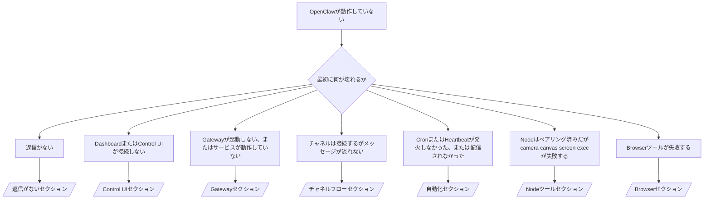

---
read_when:
    - OpenClawが動作しておらず、最短で解決したい
    - 詳細な手順書に入る前に、トリアージフローを使いたい
summary: OpenClawの症状別トラブルシューティングハブ
title: 一般的なトラブルシューティング
x-i18n:
    generated_at: "2026-04-24T05:02:15Z"
    model: gpt-5.4
    provider: openai
    source_hash: ce06ddce9de9e5824b4c5e8c182df07b29ce3ff113eb8e29c62aef9a4682e8e9
    source_path: help/troubleshooting.md
    workflow: 15
---

# トラブルシューティング

2分しかないなら、このページをトリアージの入口として使ってください。

## 最初の60秒

次のラダーをこの順番でそのまま実行してください:

```bash
openclaw status
openclaw status --all
openclaw gateway probe
openclaw gateway status
openclaw doctor
openclaw channels status --probe
openclaw logs --follow
```

正常な出力を1行で言うと:

- `openclaw status` → 設定済みチャネルが表示され、明らかなauthエラーがない。
- `openclaw status --all` → 完全なレポートが表示され、共有可能である。
- `openclaw gateway probe` → 想定したgatewayターゲットに到達できる（`Reachable: yes`）。`Capability: ...` はprobeが証明できたauthレベルを示し、`Read probe: limited - missing scope: operator.read` は診断の劣化であって接続失敗ではない。
- `openclaw gateway status` → `Runtime: running`、`Connectivity probe: ok`、そしてもっともらしい `Capability: ...` 行。read-scope RPCの証明も必要なら `--require-rpc` を使ってください。
- `openclaw doctor` → 設定/サービスに関するブロッキングなエラーがない。
- `openclaw channels status --probe` → gatewayに到達できる場合、アカウントごとのライブトランスポート状態と、対応していれば `works` や `audit ok` のようなprobe/audit結果を返す。gatewayに到達できない場合、このコマンドは設定のみのサマリーへフォールバックする。
- `openclaw logs --follow` → 安定したアクティビティがあり、繰り返される致命的エラーがない。

## Anthropic long context 429

`HTTP 429: rate_limit_error: Extra usage is required for long context requests`
が表示されたら、
[/gateway/troubleshooting#anthropic-429-extra-usage-required-for-long-context](/ja-JP/gateway/troubleshooting#anthropic-429-extra-usage-required-for-long-context)
へ進んでください。

## ローカルのOpenAI互換バックエンドは直接では動くが、OpenClaw内では失敗する

ローカルまたはセルフホストの `/v1` バックエンドが、小さな直接
`/v1/chat/completions` probeには応答するのに、`openclaw infer model run` や通常の
agentターンでは失敗する場合:

1. エラーに `messages[].content` が文字列を期待しているとあるなら、
   `models.providers.<provider>.models[].compat.requiresStringContent: true` を設定してください。
2. バックエンドが依然としてOpenClawのagentターンでのみ失敗するなら、
   `models.providers.<provider>.models[].compat.supportsTools: false` を設定して再試行してください。
3. 小さな直接呼び出しが引き続き動作するのに、より大きなOpenClawプロンプトで
   バックエンドがクラッシュするなら、残る問題はupstreamのモデル/サーバー制限として扱い、
   詳細手順書に進んでください:
   [/gateway/troubleshooting#local-openai-compatible-backend-passes-direct-probes-but-agent-runs-fail](/ja-JP/gateway/troubleshooting#local-openai-compatible-backend-passes-direct-probes-but-agent-runs-fail)

## Pluginのインストールが openclaw extensions 不足で失敗する

`package.json missing openclaw.extensions` でインストールが失敗する場合、そのplugin packageは、OpenClawがもはや受け付けない古い形式を使っています。

plugin package側での修正:

1. `package.json` に `openclaw.extensions` を追加する。
2. エントリをビルド済みランタイムファイル（通常は `./dist/index.js`）に向ける。
3. pluginを再公開し、`openclaw plugins install <package>` を再実行する。

例:

```json
{
  "name": "@openclaw/my-plugin",
  "version": "1.2.3",
  "openclaw": {
    "extensions": ["./dist/index.js"]
  }
}
```

参考: [Pluginアーキテクチャ](/ja-JP/plugins/architecture)

## 決定木



<AccordionGroup>
  <Accordion title="返信がない">
    ```bash
    openclaw status
    openclaw gateway status
    openclaw channels status --probe
    openclaw pairing list --channel <channel> [--account <id>]
    openclaw logs --follow
    ```

    正常な出力は次のようになります:

    - `Runtime: running`
    - `Connectivity probe: ok`
    - `Capability: read-only`、`write-capable`、または `admin-capable`
    - あなたのチャネルでトランスポートが接続済みと表示され、対応していれば `channels status --probe` に `works` または `audit ok` が出る
    - 送信者が承認済みである（またはDMポリシーがopen/allowlistである）

    よくあるログシグネチャ:

    - `drop guild message (mention required` → Discordでメンションゲーティングによりメッセージがブロックされた。
    - `pairing request` → 送信者は未承認で、DMペアリング承認待ち。
    - チャネルログ内の `blocked` / `allowlist` → 送信者、ルーム、またはグループがフィルタされている。

    詳細ページ:

    - [/gateway/troubleshooting#no-replies](/ja-JP/gateway/troubleshooting#no-replies)
    - [/channels/troubleshooting](/ja-JP/channels/troubleshooting)
    - [/channels/pairing](/ja-JP/channels/pairing)

  </Accordion>

  <Accordion title="DashboardまたはControl UIが接続しない">
    ```bash
    openclaw status
    openclaw gateway status
    openclaw logs --follow
    openclaw doctor
    openclaw channels status --probe
    ```

    正常な出力は次のようになります:

    - `openclaw gateway status` に `Dashboard: http://...` が表示される
    - `Connectivity probe: ok`
    - `Capability: read-only`、`write-capable`、または `admin-capable`
    - ログにauthループがない

    よくあるログシグネチャ:

    - `device identity required` → HTTP/非secure contextではdevice authを完了できない。
    - `origin not allowed` → ブラウザの `Origin` がそのControl UI gatewayターゲットで許可されていない。
    - `AUTH_TOKEN_MISMATCH` と再試行ヒント（`canRetryWithDeviceToken=true`） → 1回だけ信頼されたdevice-token再試行が自動で起こる場合がある。
    - そのキャッシュ済みtoken再試行では、ペアリング済みdevice tokenとともに保存されたキャッシュ済みscopeセットを再利用する。明示的な `deviceToken` / 明示的な `scopes` の呼び出し元は、代わりに要求したscopeセットを維持する。
    - 非同期のTailscale Serve Control UI経路では、同じ `{scope, ip}` に対する失敗試行は、limiterが失敗を記録する前に直列化されるため、2回目の不正な同時再試行ではすでに `retry later` が表示されることがある。
    - localhostブラウザoriginからの `too many failed authentication attempts (retry later)` → 同じ `Origin` からの繰り返し失敗は一時的にロックアウトされる。別のlocalhost originは別のバケットを使う。
    - その再試行後も `unauthorized` が繰り返される → token/passwordが間違っている、auth mode不一致、または古いペアリング済みdevice token。
    - `gateway connect failed:` → UIが間違ったURL/ポートまたは到達不能なgatewayを対象にしている。

    詳細ページ:

    - [/gateway/troubleshooting#dashboard-control-ui-connectivity](/ja-JP/gateway/troubleshooting#dashboard-control-ui-connectivity)
    - [/web/control-ui](/ja-JP/web/control-ui)
    - [/gateway/authentication](/ja-JP/gateway/authentication)

  </Accordion>

  <Accordion title="Gatewayが起動しない、またはサービスはインストール済みだが動作していない">
    ```bash
    openclaw status
    openclaw gateway status
    openclaw logs --follow
    openclaw doctor
    openclaw channels status --probe
    ```

    正常な出力は次のようになります:

    - `Service: ... (loaded)`
    - `Runtime: running`
    - `Connectivity probe: ok`
    - `Capability: read-only`、`write-capable`、または `admin-capable`

    よくあるログシグネチャ:

    - `Gateway start blocked: set gateway.mode=local` または `existing config is missing gateway.mode` → gateway modeがremoteになっている、または設定ファイルにlocal-modeの印がなく、修復が必要。
    - `refusing to bind gateway ... without auth` → 有効なgateway auth経路（token/password、または設定済みtrusted-proxy）がないままloopback以外へbindしている。
    - `another gateway instance is already listening` または `EADDRINUSE` → ポートがすでに使われている。

    詳細ページ:

    - [/gateway/troubleshooting#gateway-service-not-running](/ja-JP/gateway/troubleshooting#gateway-service-not-running)
    - [/gateway/background-process](/ja-JP/gateway/background-process)
    - [/gateway/configuration](/ja-JP/gateway/configuration)

  </Accordion>

  <Accordion title="チャネルは接続するがメッセージが流れない">
    ```bash
    openclaw status
    openclaw gateway status
    openclaw logs --follow
    openclaw doctor
    openclaw channels status --probe
    ```

    正常な出力は次のようになります:

    - チャネルトランスポートが接続済み。
    - pairing/allowlistチェックに通る。
    - 必要な場合にメンションが検出される。

    よくあるログシグネチャ:

    - `mention required` → グループのメンションゲーティングにより処理がブロックされた。
    - `pairing` / `pending` → DM送信者がまだ承認されていない。
    - `not_in_channel`、`missing_scope`、`Forbidden`、`401/403` → チャネル権限tokenの問題。

    詳細ページ:

    - [/gateway/troubleshooting#channel-connected-messages-not-flowing](/ja-JP/gateway/troubleshooting#channel-connected-messages-not-flowing)
    - [/channels/troubleshooting](/ja-JP/channels/troubleshooting)

  </Accordion>

  <Accordion title="CronまたはHeartbeatが発火しなかった、または配信されなかった">
    ```bash
    openclaw status
    openclaw gateway status
    openclaw cron status
    openclaw cron list
    openclaw cron runs --id <jobId> --limit 20
    openclaw logs --follow
    ```

    正常な出力は次のようになります:

    - `cron.status` にenabledと次回wakeが表示される。
    - `cron runs` に最近の `ok` エントリが表示される。
    - Heartbeatが有効で、active hoursの時間外ではない。

    よくあるログシグネチャ:

    - `cron: scheduler disabled; jobs will not run automatically` → cronが無効。
    - `heartbeat skipped` with `reason=quiet-hours` → 設定されたactive hoursの外。
    - `heartbeat skipped` with `reason=empty-heartbeat-file` → `HEARTBEAT.md` は存在するが、空行/ヘッダーのみの足場しか含んでいない。
    - `heartbeat skipped` with `reason=no-tasks-due` → `HEARTBEAT.md` のタスクモードは有効だが、タスク間隔がまだどれも期限到来していない。
    - `heartbeat skipped` with `reason=alerts-disabled` → Heartbeat可視性がすべて無効（`showOk`、`showAlerts`、`useIndicator` がすべてオフ）。
    - `requests-in-flight` → main laneがビジーで、Heartbeat wakeが遅延された。
    - `unknown accountId` → Heartbeat配信ターゲットのアカウントが存在しない。

    詳細ページ:

    - [/gateway/troubleshooting#cron-and-heartbeat-delivery](/ja-JP/gateway/troubleshooting#cron-and-heartbeat-delivery)
    - [/automation/cron-jobs#troubleshooting](/ja-JP/automation/cron-jobs#troubleshooting)
    - [/gateway/heartbeat](/ja-JP/gateway/heartbeat)

  </Accordion>

  <Accordion title="Nodeはペアリング済みだがcamera canvas screen execツールが失敗する">
    ```bash
    openclaw status
    openclaw gateway status
    openclaw nodes status
    openclaw nodes describe --node <idOrNameOrIp>
    openclaw logs --follow
    ```

    正常な出力は次のようになります:

    - Nodeが接続済みかつrole `node` でペアリング済みとして表示される。
    - 呼び出そうとしているコマンドに対するcapabilityが存在する。
    - ツールに対する権限状態が付与済みである。

    よくあるログシグネチャ:

    - `NODE_BACKGROUND_UNAVAILABLE` → nodeアプリをforegroundに持ってくる。
    - `*_PERMISSION_REQUIRED` → OS権限が拒否されている/欠落している。
    - `SYSTEM_RUN_DENIED: approval required` → exec承認が保留中。
    - `SYSTEM_RUN_DENIED: allowlist miss` → コマンドがexec allowlistにない。

    詳細ページ:

    - [/gateway/troubleshooting#node-paired-tool-fails](/ja-JP/gateway/troubleshooting#node-paired-tool-fails)
    - [/nodes/troubleshooting](/ja-JP/nodes/troubleshooting)
    - [/tools/exec-approvals](/ja-JP/tools/exec-approvals)

  </Accordion>

  <Accordion title="Execが突然承認を求めるようになった">
    ```bash
    openclaw config get tools.exec.host
    openclaw config get tools.exec.security
    openclaw config get tools.exec.ask
    openclaw gateway restart
    ```

    何が変わったか:

    - `tools.exec.host` が未設定の場合、デフォルトは `auto` です。
    - `host=auto` は、sandbox runtimeがアクティブなら `sandbox` に、そうでなければ `gateway` に解決されます。
    - `host=auto` はルーティングのみです。プロンプトなしの「YOLO」動作は、gateway/node上の `security=full` と `ask=off` から来ます。
    - `gateway` と `node` では、未設定の `tools.exec.security` のデフォルトは `full` です。
    - 未設定の `tools.exec.ask` のデフォルトは `off` です。
    - 結果として、承認が表示されているなら、何らかのホストローカルまたはセッションごとのポリシーが、現在のデフォルトより厳しくexecを制限しています。

    現在のデフォルトである「承認なし」動作を復元するには:

    ```bash
    openclaw config set tools.exec.host gateway
    openclaw config set tools.exec.security full
    openclaw config set tools.exec.ask off
    openclaw gateway restart
    ```

    より安全な代替案:

    - 安定したホストルーティングだけが欲しいなら、`tools.exec.host=gateway` だけを設定する。
    - ホストexecは維持しつつallowlist miss時にレビューしたいなら、`security=allowlist` と `ask=on-miss` を使う。
    - `host=auto` を再び `sandbox` に解決させたいなら、sandbox modeを有効にする。

    よくあるログシグネチャ:

    - `Approval required.` → コマンドは `/approve ...` を待っている。
    - `SYSTEM_RUN_DENIED: approval required` → node-host exec承認が保留中。
    - `exec host=sandbox requires a sandbox runtime for this session` → 暗黙または明示のsandbox選択だが、sandbox modeがオフ。

    詳細ページ:

    - [/tools/exec](/ja-JP/tools/exec)
    - [/tools/exec-approvals](/ja-JP/tools/exec-approvals)
    - [/gateway/security#what-the-audit-checks-high-level](/ja-JP/gateway/security#what-the-audit-checks-high-level)

  </Accordion>

  <Accordion title="Browserツールが失敗する">
    ```bash
    openclaw status
    openclaw gateway status
    openclaw browser status
    openclaw logs --follow
    openclaw doctor
    ```

    正常な出力は次のようになります:

    - Browser status に `running: true` と選択されたbrowser/profileが表示される。
    - `openclaw` が起動する、または `user` がローカルChromeタブを確認できる。

    よくあるログシグネチャ:

    - `unknown command "browser"` または `unknown command 'browser'` → `plugins.allow` が設定されており、`browser` を含んでいない。
    - `Failed to start Chrome CDP on port` → ローカルbrowser起動に失敗した。
    - `browser.executablePath not found` → 設定されたバイナリパスが間違っている。
    - `browser.cdpUrl must be http(s) or ws(s)` → 設定されたCDP URLが未対応スキームを使っている。
    - `browser.cdpUrl has invalid port` → 設定されたCDP URLのポートが不正または範囲外。
    - `No Chrome tabs found for profile="user"` → Chrome MCP attach profileに開いているローカルChromeタブがない。
    - `Remote CDP for profile "<name>" is not reachable` → 設定されたremote CDP endpointにこのホストから到達できない。
    - `Browser attachOnly is enabled ... not reachable` または `Browser attachOnly is enabled and CDP websocket ... is not reachable` → attach-only profileに生きているCDPターゲットがない。
    - attach-onlyまたはremote CDP profileで古いviewport / dark-mode / locale / offline上書きが残っている → `openclaw browser stop --browser-profile <name>` を実行し、gatewayを再起動せずにアクティブなcontrol sessionを閉じてエミュレーション状態を解放する。

    詳細ページ:

    - [/gateway/troubleshooting#browser-tool-fails](/ja-JP/gateway/troubleshooting#browser-tool-fails)
    - [/tools/browser#missing-browser-command-or-tool](/ja-JP/tools/browser#missing-browser-command-or-tool)
    - [/tools/browser-linux-troubleshooting](/ja-JP/tools/browser-linux-troubleshooting)
    - [/tools/browser-wsl2-windows-remote-cdp-troubleshooting](/ja-JP/tools/browser-wsl2-windows-remote-cdp-troubleshooting)

  </Accordion>

</AccordionGroup>

## 関連

- [FAQ](/ja-JP/help/faq) — よくある質問
- [Gatewayトラブルシューティング](/ja-JP/gateway/troubleshooting) — Gateway固有の問題
- [Doctor](/ja-JP/gateway/doctor) — 自動ヘルスチェックと修復
- [チャネルトラブルシューティング](/ja-JP/channels/troubleshooting) — チャネル接続の問題
- [自動化トラブルシューティング](/ja-JP/automation/cron-jobs#troubleshooting) — CronとHeartbeatの問題
