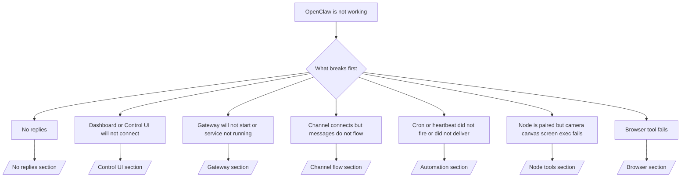

---
read_when:
    - OpenClaw が動作せず、最短で修正したい場合
    - 詳細なランブックに進む前にトリアージフローが必要な場合
summary: 症状を起点にした OpenClaw のトラブルシューティングハブ
title: 一般的なトラブルシューティング
x-i18n:
    generated_at: "2026-05-06T05:08:31Z"
    model: gpt-5.5
    provider: openai
    source_hash: 624fa34cda3b440fa9cc636beb3fe6e3608a77a332933fa593097ebc556ac745
    source_path: help/troubleshooting.md
    workflow: 16
---

時間が 2 分しかない場合は、このページをトリアージの入口として使ってください。

## 最初の 60 秒

次の正確な手順を順番に実行してください。

```bash
openclaw status
openclaw status --all
openclaw gateway probe
openclaw gateway status
openclaw doctor
openclaw channels status --probe
openclaw logs --follow
```

正常な出力の要点:

- `openclaw status` → 設定済みのチャネルが表示され、明らかな認証エラーがない。
- `openclaw status --all` → 完全なレポートが存在し、共有できる。
- `openclaw gateway probe` → 期待される gateway ターゲットに到達できる (`Reachable: yes`)。`Capability: ...` はプローブで証明できた認証レベルを示し、`Read probe: limited - missing scope: operator.read` は診断機能の低下であり、接続失敗ではない。
- `openclaw gateway status` → `Runtime: running`、`Connectivity probe: ok`、妥当な `Capability: ...` 行がある。read-scope RPC の証明も必要な場合は `--require-rpc` を使う。
- `openclaw doctor` → ブロック要因となる設定/サービスエラーがない。
- `openclaw channels status --probe` → 到達可能な gateway は、アカウントごとのライブな
  トランスポート状態に加えて、`works` や `audit ok` などのプローブ/監査結果を返す。gateway に到達できない場合、このコマンドは設定のみの要約にフォールバックする。
- `openclaw logs --follow` → 安定した動作があり、致命的エラーが繰り返されていない。

## Anthropic の長いコンテキスト 429

次の内容が表示された場合:
`HTTP 429: rate_limit_error: Extra usage is required for long context requests`
[/gateway/troubleshooting#anthropic-429-extra-usage-required-for-long-context](/ja-JP/gateway/troubleshooting#anthropic-429-extra-usage-required-for-long-context) に進んでください。

## ローカルの OpenAI 互換バックエンドは直接なら動作するが OpenClaw では失敗する

ローカルまたはセルフホストの `/v1` バックエンドが小さな直接
`/v1/chat/completions` プローブには応答するものの、`openclaw infer model run` や通常の
エージェントターンで失敗する場合:

1. エラーが `messages[].content` に文字列を期待していることを示す場合は、
   `models.providers.<provider>.models[].compat.requiresStringContent: true` を設定する。
2. バックエンドが OpenClaw のエージェントターンでのみまだ失敗する場合は、
   `models.providers.<provider>.models[].compat.supportsTools: false` を設定して再試行する。
3. 小さな直接呼び出しはまだ動作するが、より大きな OpenClaw プロンプトで
   バックエンドがクラッシュする場合、残る問題は上流のモデル/サーバー制限として扱い、
   詳細なランブックに進む:
   [/gateway/troubleshooting#local-openai-compatible-backend-passes-direct-probes-but-agent-runs-fail](/ja-JP/gateway/troubleshooting#local-openai-compatible-backend-passes-direct-probes-but-agent-runs-fail)

## openclaw extensions がないため Plugin インストールに失敗する

`package.json missing openclaw.extensions` でインストールが失敗する場合、その plugin パッケージは
OpenClaw が現在は受け付けない古い形式を使っています。

plugin パッケージ側で修正します。

1. `package.json` に `openclaw.extensions` を追加する。
2. エントリをビルド済みランタイムファイルに向ける (通常は `./dist/index.js`)。
3. plugin を再公開し、`openclaw plugins install <package>` を再実行する。

例:

```json
{
  "name": "@openclaw/my-plugin",
  "version": "1.2.3",
  "openclaw": {
    "extensions": ["./dist/index.js"]
  }
}
```

参照: [Plugin アーキテクチャ](/ja-JP/plugins/architecture)

## Plugin は存在するが疑わしい所有権によりブロックされる

`openclaw doctor`、セットアップ、または起動時の警告で次が表示される場合:

```text
blocked plugin candidate: suspicious ownership (... uid=1000, expected uid=0 or root)
plugin present but blocked
```

plugin ファイルは、それらを読み込むプロセスとは異なる Unix ユーザーによって所有されています。plugin 設定は削除しないでください。ファイルの所有権を修正するか、状態ディレクトリを所有する同じユーザーとして OpenClaw を実行してください。

Docker インストールは通常 `node` (uid `1000`) として実行されます。デフォルトの Docker
セットアップでは、ホストの bind mount を修復します。

```bash
sudo chown -R 1000:1000 /path/to/openclaw-config /path/to/openclaw-workspace
openclaw doctor --fix
```

意図的に OpenClaw を root として実行している場合は、managed plugin root を
代わりに root 所有に修復します。

```bash
sudo chown -R root:root /path/to/openclaw-config/npm
openclaw doctor --fix
```

詳細なドキュメント:

- [Plugin パスの所有権](/ja-JP/tools/plugin#blocked-plugin-path-ownership)
- [Docker 権限](/ja-JP/install/docker#permissions-and-eacces)

## 判断ツリー



<AccordionGroup>
  <Accordion title="No replies">
    ```bash
    openclaw status
    openclaw gateway status
    openclaw channels status --probe
    openclaw pairing list --channel <channel> [--account <id>]
    openclaw logs --follow
    ```

    正常な出力は次のようになります。

    - `Runtime: running`
    - `Connectivity probe: ok`
    - `Capability: read-only`、`write-capable`、または `admin-capable`
    - チャネルでトランスポートが接続済みと表示され、対応している場合は `channels status --probe` に `works` または `audit ok` が表示される
    - 送信者が承認済みとして表示される (または DM ポリシーが open/allowlist)

    よくあるログの特徴:

    - `drop guild message (mention required` → Discord でメンションゲートによりメッセージがブロックされた。
    - `pairing request` → 送信者が未承認で、DM ペアリング承認を待っている。
    - チャネルログ内の `blocked` / `allowlist` → 送信者、ルーム、またはグループがフィルタリングされている。

    詳細ページ:

    - [/gateway/troubleshooting#no-replies](/ja-JP/gateway/troubleshooting#no-replies)
    - [/channels/troubleshooting](/ja-JP/channels/troubleshooting)
    - [/channels/pairing](/ja-JP/channels/pairing)

  </Accordion>

  <Accordion title="Dashboard or Control UI will not connect">
    ```bash
    openclaw status
    openclaw gateway status
    openclaw logs --follow
    openclaw doctor
    openclaw channels status --probe
    ```

    正常な出力は次のようになります。

    - `openclaw gateway status` に `Dashboard: http://...` が表示される
    - `Connectivity probe: ok`
    - `Capability: read-only`、`write-capable`、または `admin-capable`
    - ログに認証ループがない

    よくあるログの特徴:

    - `device identity required` → HTTP/非セキュアコンテキストではデバイス認証を完了できない。
    - `origin not allowed` → ブラウザーの `Origin` が Control UI
      gateway ターゲットで許可されていない。
    - `AUTH_TOKEN_MISMATCH` と再試行ヒント (`canRetryWithDeviceToken=true`) → 信頼済みデバイストークンでの再試行が 1 回、自動的に発生する場合がある。
    - そのキャッシュ済みトークンの再試行は、ペアリング済みデバイストークンと一緒に保存されたキャッシュ済みスコープセットを再利用する。明示的な `deviceToken` / 明示的な `scopes` の呼び出し元は、代わりに要求したスコープセットを維持する。
    - 非同期 Tailscale Serve Control UI パスでは、同じ
      `{scope, ip}` に対する失敗した試行は、リミッターが失敗を記録する前に直列化されるため、2 回目の同時不正再試行ですでに `retry later` が表示されることがある。
    - localhost ブラウザー origin からの `too many failed authentication attempts (retry later)` → 同じ `Origin` からの失敗が繰り返されたため、一時的にロックアウトされている。別の localhost origin は別のバケットを使う。
    - その再試行後も `unauthorized` が繰り返される → トークン/パスワードが間違っている、認証モードが一致しない、またはペアリング済みデバイストークンが古い。
    - `gateway connect failed:` → UI が誤った URL/ポートを指している、または gateway に到達できない。

    詳細ページ:

    - [/gateway/troubleshooting#dashboard-control-ui-connectivity](/ja-JP/gateway/troubleshooting#dashboard-control-ui-connectivity)
    - [/web/control-ui](/ja-JP/web/control-ui)
    - [/gateway/authentication](/ja-JP/gateway/authentication)

  </Accordion>

  <Accordion title="Gateway will not start or service installed but not running">
    ```bash
    openclaw status
    openclaw gateway status
    openclaw logs --follow
    openclaw doctor
    openclaw channels status --probe
    ```

    正常な出力は次のようになります。

    - `Service: ... (loaded)`
    - `Runtime: running`
    - `Connectivity probe: ok`
    - `Capability: read-only`、`write-capable`、または `admin-capable`

    よくあるログの特徴:

    - `Gateway start blocked: set gateway.mode=local` または `existing config is missing gateway.mode` → gateway モードが remote である、または設定ファイルに local-mode スタンプがなく修復が必要。
    - `refusing to bind gateway ... without auth` → 有効な gateway 認証パス (トークン/パスワード、または設定されている場合は trusted-proxy) なしで non-loopback bind している。
    - `another gateway instance is already listening` または `EADDRINUSE` → ポートがすでに使用されている。

    詳細ページ:

    - [/gateway/troubleshooting#gateway-service-not-running](/ja-JP/gateway/troubleshooting#gateway-service-not-running)
    - [/gateway/background-process](/ja-JP/gateway/background-process)
    - [/gateway/configuration](/ja-JP/gateway/configuration)

  </Accordion>

  <Accordion title="Channel connects but messages do not flow">
    ```bash
    openclaw status
    openclaw gateway status
    openclaw logs --follow
    openclaw doctor
    openclaw channels status --probe
    ```

    正常な出力は次のようになります。

    - チャネルのトランスポートが接続済み。
    - ペアリング/allowlist チェックに合格している。
    - 必要な場所でメンションが検出されている。

    よくあるログの特徴:

    - `mention required` → グループメンションゲートにより処理がブロックされた。
    - `pairing` / `pending` → DM 送信者がまだ承認されていない。
    - `not_in_channel`、`missing_scope`、`Forbidden`、`401/403` → チャネル権限トークンの問題。

    詳細ページ:

    - [/gateway/troubleshooting#channel-connected-messages-not-flowing](/ja-JP/gateway/troubleshooting#channel-connected-messages-not-flowing)
    - [/channels/troubleshooting](/ja-JP/channels/troubleshooting)

  </Accordion>

  <Accordion title="Cron or heartbeat did not fire or did not deliver">
    ```bash
    openclaw status
    openclaw gateway status
    openclaw cron status
    openclaw cron list
    openclaw cron runs --id <jobId> --limit 20
    openclaw logs --follow
    ```

    正常な出力は次のようになります。

    - `cron.status` が有効で、次の wake があることを示す。
    - `cron runs` に最近の `ok` エントリが表示される。
    - Heartbeat が有効で、active hours の外ではない。

    よくあるログの特徴:

    - `cron: scheduler disabled; jobs will not run automatically` → cron が無効。
    - `reason=quiet-hours` を伴う `heartbeat skipped` → 設定された active hours の外。
    - `reason=empty-heartbeat-file` を伴う `heartbeat skipped` → `HEARTBEAT.md` は存在するが、空白/ヘッダーのみの足場だけを含む。
    - `reason=no-tasks-due` を伴う `heartbeat skipped` → `HEARTBEAT.md` のタスクモードは有効だが、まだ期限になったタスク間隔がない。
    - `reason=alerts-disabled` を伴う `heartbeat skipped` → すべての heartbeat 表示が無効 (`showOk`、`showAlerts`、`useIndicator` がすべてオフ)。
    - `requests-in-flight` → メインレーンがビジーで、heartbeat wake が延期された。
    - `unknown accountId` → heartbeat 配信先アカウントが存在しない。

    詳細ページ:

    - [/gateway/troubleshooting#cron-and-heartbeat-delivery](/ja-JP/gateway/troubleshooting#cron-and-heartbeat-delivery)
    - [/automation/cron-jobs#troubleshooting](/ja-JP/automation/cron-jobs#troubleshooting)
    - [/gateway/heartbeat](/ja-JP/gateway/heartbeat)

  </Accordion>

  <Accordion title="Node is paired but tool fails camera canvas screen exec">
    ```bash
    openclaw status
    openclaw gateway status
    openclaw nodes status
    openclaw nodes describe --node <idOrNameOrIp>
    openclaw logs --follow
    ```

    正常な出力は次のようになります。

    - Node が接続済みとして一覧表示され、ロール `node` でペアリングされている。
    - 呼び出しているコマンドの capability が存在する。
    - そのツールの権限状態が granted である。

    よくあるログの特徴:

    - `NODE_BACKGROUND_UNAVAILABLE` → Node アプリをフォアグラウンドに移動します。
    - `*_PERMISSION_REQUIRED` → OS 権限が拒否されたか、欠落しています。
    - `SYSTEM_RUN_DENIED: approval required` → exec の承認が保留中です。
    - `SYSTEM_RUN_DENIED: allowlist miss` → コマンドが exec allowlist にありません。

    詳細ページ:

    - [/gateway/troubleshooting#node-paired-tool-fails](/ja-JP/gateway/troubleshooting#node-paired-tool-fails)
    - [/nodes/troubleshooting](/ja-JP/nodes/troubleshooting)
    - [/tools/exec-approvals](/ja-JP/tools/exec-approvals)

  </Accordion>

  <Accordion title="Exec が突然承認を求める">
    ```bash
    openclaw config get tools.exec.host
    openclaw config get tools.exec.security
    openclaw config get tools.exec.ask
    openclaw gateway restart
    ```

    変更点:

    - `tools.exec.host` が未設定の場合、デフォルトは `auto` です。
    - sandbox runtime が有効な場合、`host=auto` は `sandbox` に解決され、それ以外の場合は `gateway` に解決されます。
    - `host=auto` はルーティング専用です。プロンプトなしの「YOLO」動作は、gateway/node での `security=full` と `ask=off` によるものです。
    - `gateway` と `node` では、未設定の `tools.exec.security` はデフォルトで `full` になります。
    - 未設定の `tools.exec.ask` はデフォルトで `off` になります。
    - 結果: 承認が表示される場合は、ホストローカルまたはセッションごとのポリシーにより、exec が現在のデフォルトより厳しくなっています。

    現在のデフォルトである承認なしの動作を復元する:

    ```bash
    openclaw config set tools.exec.host gateway
    openclaw config set tools.exec.security full
    openclaw config set tools.exec.ask off
    openclaw gateway restart
    ```

    より安全な代替案:

    - 安定したホストルーティングだけが必要な場合は、`tools.exec.host=gateway` のみを設定します。
    - ホスト exec は必要だが、allowlist ミス時には確認したい場合は、`security=allowlist` と `ask=on-miss` を使用します。
    - `host=auto` を再び `sandbox` に解決したい場合は、sandbox モードを有効にします。

    よくあるログシグネチャ:

    - `Approval required.` → コマンドは `/approve ...` を待機しています。
    - `SYSTEM_RUN_DENIED: approval required` → node-host exec の承認が保留中です。
    - `exec host=sandbox requires a sandbox runtime for this session` → 暗黙的または明示的に sandbox が選択されていますが、sandbox モードがオフです。

    詳細ページ:

    - [/tools/exec](/ja-JP/tools/exec)
    - [/tools/exec-approvals](/ja-JP/tools/exec-approvals)
    - [/gateway/security#what-the-audit-checks-high-level](/ja-JP/gateway/security#what-the-audit-checks-high-level)

  </Accordion>

  <Accordion title="Browser ツールが失敗する">
    ```bash
    openclaw status
    openclaw gateway status
    openclaw browser status
    openclaw logs --follow
    openclaw doctor
    ```

    正常な出力は次のようになります:

    - Browser ステータスに `running: true` と、選択されたブラウザー/プロファイルが表示されます。
    - `openclaw` が起動するか、`user` がローカルの Chrome タブを確認できます。

    よくあるログシグネチャ:

    - `unknown command "browser"` または `unknown command 'browser'` → `plugins.allow` が設定されており、`browser` が含まれていません。
    - `Failed to start Chrome CDP on port` → ローカルブラウザーの起動に失敗しました。
    - `browser.executablePath not found` → 設定されたバイナリパスが間違っています。
    - `browser.cdpUrl must be http(s) or ws(s)` → 設定された CDP URL がサポートされていないスキームを使用しています。
    - `browser.cdpUrl has invalid port` → 設定された CDP URL に不正なポート、または範囲外のポートがあります。
    - `No Chrome tabs found for profile="user"` → Chrome MCP attach プロファイルに、開いているローカル Chrome タブがありません。
    - `Remote CDP for profile "<name>" is not reachable` → 設定されたリモート CDP エンドポイントに、このホストから到達できません。
    - `Browser attachOnly is enabled ... not reachable` または `Browser attachOnly is enabled and CDP websocket ... is not reachable` → attach-only プロファイルに稼働中の CDP ターゲットがありません。
    - attach-only またはリモート CDP プロファイルで viewport / dark-mode / locale / offline のオーバーライドが古くなっている → `openclaw browser stop --browser-profile <name>` を実行し、Gateway を再起動せずにアクティブな制御セッションを閉じてエミュレーション状態を解放します。

    詳細ページ:

    - [/gateway/troubleshooting#browser-tool-fails](/ja-JP/gateway/troubleshooting#browser-tool-fails)
    - [/tools/browser#missing-browser-command-or-tool](/ja-JP/tools/browser#missing-browser-command-or-tool)
    - [/tools/browser-linux-troubleshooting](/ja-JP/tools/browser-linux-troubleshooting)
    - [/tools/browser-wsl2-windows-remote-cdp-troubleshooting](/ja-JP/tools/browser-wsl2-windows-remote-cdp-troubleshooting)

  </Accordion>

</AccordionGroup>

## 関連

- [FAQ](/ja-JP/help/faq) — よくある質問
- [Gateway のトラブルシューティング](/ja-JP/gateway/troubleshooting) — Gateway 固有の問題
- [Doctor](/ja-JP/gateway/doctor) — 自動ヘルスチェックと修復
- [Channel のトラブルシューティング](/ja-JP/channels/troubleshooting) — channel 接続の問題
- [自動化のトラブルシューティング](/ja-JP/automation/cron-jobs#troubleshooting) — Cron と Heartbeat の問題
