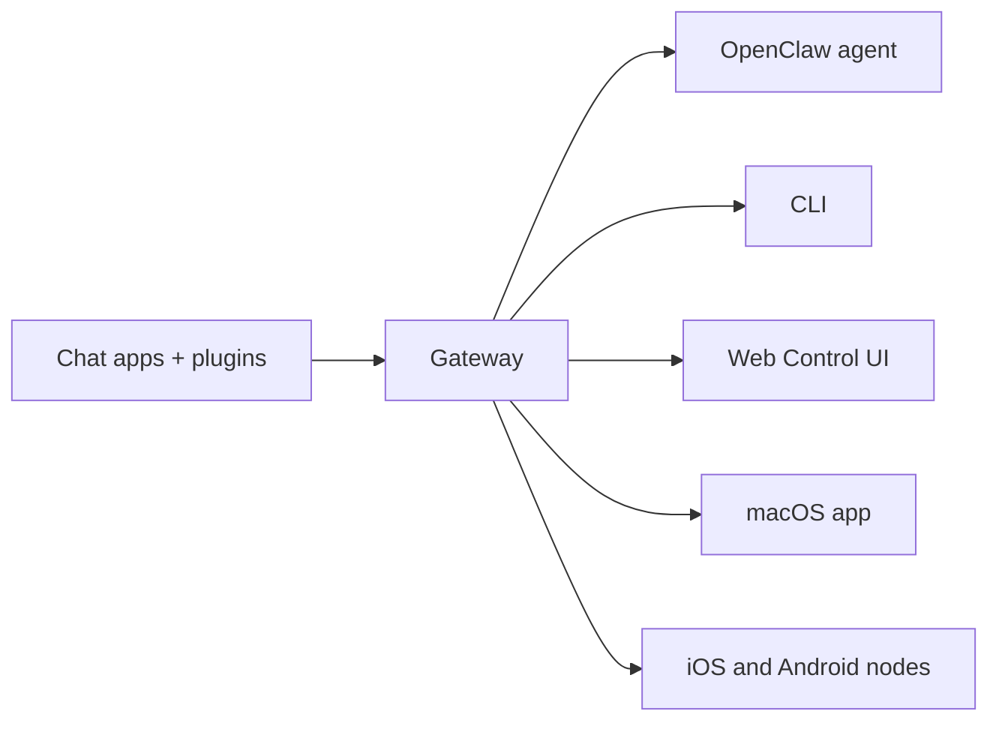

---
read_when:
    - 初めての方へのOpenClawの紹介
summary: OpenClaw は、あらゆる OS で動作する AI エージェント向けのマルチチャネル Gateway です。
title: OpenClaw
x-i18n:
    generated_at: "2026-07-11T22:20:26Z"
    model: gpt-5.6
    postprocess_version: locale-links-v1
    provider: openai
    source_hash: 2b87c2a9ce06f110bda45709fb6055ed8000f73993793ea7386db2a47a782828
    source_path: index.md
    workflow: 16
---

# OpenClaw 🦞

<p align="center">
    
    
</p>

> _「脱皮せよ！脱皮せよ！」_ — おそらく宇宙のロブスター

<p align="center">
  <strong>Discord、Google Chat、iMessage、Matrix、Microsoft Teams、Signal、Slack、Telegram、WhatsApp、Zalo などで AI エージェントを利用するための、あらゆる OS に対応した Gateway。</strong><br />
  メッセージを送れば、手元の端末でエージェントから応答を受け取れます。1 つの Gateway で、チャンネル Plugin、WebChat、モバイル Node を運用できます。
</p>

<Columns>
  <Card title="はじめに" href="/ja-JP/start/getting-started" icon="rocket">
    OpenClaw をインストールし、数分で Gateway を起動します。
  </Card>
  <Card title="オンボーディングを実行" href="/ja-JP/start/wizard" icon="list-checks">
    `openclaw onboard` とペアリングフローによるガイド付きセットアップです。
  </Card>
  <Card title="チャンネルに接続" href="/ja-JP/channels" icon="message-circle">
    Discord、Signal、Telegram、WhatsApp などを連携し、どこからでもチャットできます。
  </Card>
  <Card title="コントロール UI を開く" href="/ja-JP/web/control-ui" icon="layout-dashboard">
    チャット、設定、セッション用のブラウザダッシュボードを起動します。
  </Card>
</Columns>

## ドキュメントを見る

モバイルブラウザでは、デスクトップ版のタブバー全体が表示されず、セクションメニューだけが表示される場合があります。
ページ本文から同じ最上位のドキュメント領域に移動するには、以下のハブリンクを使用してください。

<Columns>
  <Card title="はじめに" href="/ja-JP" icon="rocket">
    概要、活用例、最初の手順、セットアップガイドです。
  </Card>
  <Card title="インストール" href="/ja-JP/install" icon="download">
    インストール方法、アップデート、コンテナ、ホスティング、高度なセットアップです。
  </Card>
  <Card title="チャンネル" href="/ja-JP/channels" icon="messages-square">
    メッセージングチャンネル、ペアリング、ルーティング、アクセスグループ、チャンネル QA です。
  </Card>
  <Card title="エージェント" href="/ja-JP/concepts/architecture" icon="bot">
    アーキテクチャ、セッション、コンテキスト、メモリ、マルチエージェントルーティングです。
  </Card>
  <Card title="機能" href="/ja-JP/tools" icon="wand-sparkles">
    ツール、Skills、Cron、Webhook、自動化機能です。
  </Card>
  <Card title="ClawHub" href="/ja-JP/clawhub" icon="store">
    Plugin マーケットプレイス、公開、キュレーション、信頼性に関するガイダンスです。
  </Card>
  <Card title="モデル" href="/ja-JP/providers" icon="brain">
    プロバイダー、モデル設定、フェイルオーバー、ローカルモデルサービスです。
  </Card>
  <Card title="プラットフォーム" href="/ja-JP/platforms" icon="monitor-smartphone">
    macOS、Windows、iOS、Android、Node、Web インターフェースです。
  </Card>
  <Card title="Gateway と運用" href="/ja-JP/gateway" icon="server">
    Gateway の設定、セキュリティ、診断、運用です。
  </Card>
  <Card title="リファレンス" href="/ja-JP/cli" icon="terminal">
    CLI リファレンス、スキーマ、RPC、リリースノート、テンプレートです。
  </Card>
  <Card title="ヘルプ" href="/ja-JP/help" icon="life-buoy">
    トラブルシューティング、よくある質問、テスト、診断、環境チェックです。
  </Card>
</Columns>

## OpenClaw とは？

OpenClaw は、お気に入りのチャットアプリ（Discord、Google Chat、iMessage、Matrix、Microsoft Teams、Signal、Slack、Telegram、WhatsApp、Zalo など）をチャンネル Plugin 経由で AI コーディングエージェントに接続する、**セルフホスト型 Gateway**です。自分のマシン（またはサーバー）で 1 つの Gateway プロセスを実行すると、メッセージングアプリと常時利用可能な AI アシスタントをつなぐ橋渡し役になります。

**対象ユーザーは？** データの管理権を手放したり、ホスティングサービスに依存したりせず、どこからでもメッセージを送れる個人用 AI アシスタントを求める開発者やパワーユーザーです。

**他との違いは？**

- **セルフホスト型**：自分のハードウェア上で、自分のルールに従って動作
- **マルチチャンネル**：1 つの Gateway ですべての設定済みチャンネル Plugin を同時に提供
- **エージェントネイティブ**：ツール使用、セッション、メモリ、マルチエージェントルーティングに対応するコーディングエージェント向けの設計
- **オープンソース**：MIT ライセンスで、コミュニティ主導

**必要なものは？** Node 24（推奨）、または互換性のための Node 22 LTS（`22.19+`）、選択したプロバイダーの API キー、そして 5 分です。最高の品質とセキュリティを得るには、利用可能な最新世代のモデルのうち最も高性能なものを使用してください。

## 仕組み



Gateway は、セッション、ルーティング、チャンネル接続に関する唯一の信頼できる情報源です。

## 主な機能

<Columns>
  <Card title="マルチチャンネル Gateway" icon="network" href="/ja-JP/channels">
    1 つの Gateway プロセスで Discord、iMessage、Signal、Slack、Telegram、WhatsApp、WebChat などを利用できます。
  </Card>
  <Card title="Plugin チャンネル" icon="plug" href="/ja-JP/tools/plugin">
    チャンネル Plugin により Matrix、Nostr、Twitch、Zalo などを追加できます。公式 Plugin は必要に応じてインストールされます。
  </Card>
  <Card title="マルチエージェントルーティング" icon="route" href="/ja-JP/concepts/multi-agent">
    エージェント、ワークスペース、送信者ごとに分離されたセッションです。
  </Card>
  <Card title="メディア対応" icon="image" href="/ja-JP/nodes/images">
    画像、音声、ドキュメントを送受信できます。
  </Card>
  <Card title="Web コントロール UI" icon="monitor" href="/ja-JP/web/control-ui">
    チャット、設定、セッション、Node 用のブラウザダッシュボードです。
  </Card>
  <Card title="モバイル Node" icon="smartphone" href="/ja-JP/nodes">
    iOS および Android の Node をペアリングして、Canvas、カメラ、音声対応ワークフローを利用できます。
  </Card>
</Columns>

## クイックスタート

<Steps>
  <Step title="OpenClaw をインストール">
    ```bash
    npm install -g openclaw@latest
    ```
  </Step>
  <Step title="オンボーディングを行い、サービスをインストール">
    ```bash
    openclaw onboard --install-daemon
    ```
  </Step>
  <Step title="チャット">
    ブラウザでコントロール UI を開き、メッセージを送信します。

    ```bash
    openclaw dashboard
    ```

    または、チャンネル（[Telegram](/ja-JP/channels/telegram) が最も迅速です）に接続し、スマートフォンからチャットします。

  </Step>
</Steps>

完全なインストール手順と開発環境のセットアップが必要ですか？[はじめに](/ja-JP/start/getting-started)を参照してください。

## ダッシュボード

Gateway の起動後に、ブラウザのコントロール UI を開きます。

- ローカルのデフォルト：[http://127.0.0.1:18789/](http://127.0.0.1:18789/)
- リモートアクセス：[Web インターフェース](/ja-JP/web)と [Tailscale](/ja-JP/gateway/tailscale)

<p align="center">
  
</p>

## 設定（任意）

設定は `~/.openclaw/openclaw.json` に保存されます。

- **何も設定しない**場合、OpenClaw は同梱の OpenClaw エージェントランタイムを使用します。DM はエージェントのメインセッションを共有し、各グループチャットには個別のセッションが割り当てられます。
- アクセスを制限する場合は、`channels.whatsapp.allowFrom` と、グループ向けのメンションルールから設定してください。

例：

```json5
{
  channels: {
    whatsapp: {
      allowFrom: ["+15555550123"],
      groups: { "*": { requireMention: true } },
    },
  },
  messages: { groupChat: { mentionPatterns: ["@openclaw"] } },
}
```

## まずはこちら

<Columns>
  <Card title="ドキュメントハブ" href="/ja-JP/start/hubs" icon="book-open">
    ユースケース別に整理されたすべてのドキュメントとガイドです。
  </Card>
  <Card title="設定" href="/ja-JP/gateway/configuration" icon="settings">
    Gateway のコア設定、トークン、プロバイダー設定です。
  </Card>
  <Card title="リモートアクセス" href="/ja-JP/gateway/remote" icon="globe">
    SSH と tailnet のアクセスパターンです。
  </Card>
  <Card title="チャンネル" href="/ja-JP/channels/telegram" icon="message-square">
    Discord、Feishu、Microsoft Teams、Telegram、WhatsApp などのチャンネル固有のセットアップです。
  </Card>
  <Card title="Node" href="/ja-JP/nodes" icon="smartphone">
    ペアリング、Canvas、カメラ、デバイス操作に対応する iOS および Android の Node です。
  </Card>
  <Card title="ヘルプ" href="/ja-JP/help" icon="life-buoy">
    よくある問題の解決方法とトラブルシューティングの入口です。
  </Card>
</Columns>

## さらに詳しく

<Columns>
  <Card title="全機能一覧" href="/ja-JP/concepts/features" icon="list">
    チャンネル、ルーティング、メディア機能の完全な一覧です。
  </Card>
  <Card title="マルチエージェントルーティング" href="/ja-JP/concepts/multi-agent" icon="route">
    ワークスペースの分離とエージェントごとのセッションです。
  </Card>
  <Card title="セキュリティ" href="/ja-JP/gateway/security" icon="shield">
    トークン、許可リスト、安全制御です。
  </Card>
  <Card title="トラブルシューティング" href="/ja-JP/gateway/troubleshooting" icon="wrench">
    Gateway の診断と一般的なエラーです。
  </Card>
  <Card title="概要とクレジット" href="/ja-JP/reference/credits" icon="info">
    プロジェクトの由来、コントリビューター、ライセンスです。
  </Card>
</Columns>
