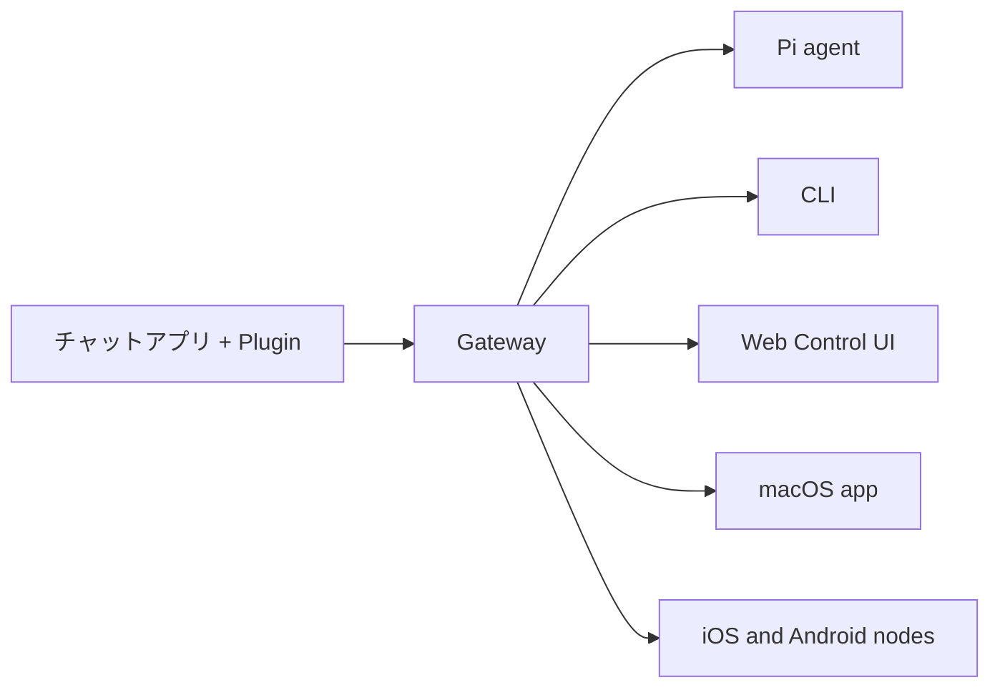

---
read_when:
    - OpenClawを初めて使う人への紹介
summary: OpenClawは、あらゆるOSで動作するAIエージェント向けのマルチチャネルGatewayです。
title: OpenClaw
x-i18n:
  refreshed_at: '2026-04-28T05:14:37Z'
    generated_at: "2026-04-22T04:23:40Z"
    model: gpt-5.4
    provider: openai
    source_hash: 923d34fa604051d502e4bc902802d6921a4b89a9447f76123aa8d2ff085f0b99
    source_path: index.md
    workflow: 15
---

# OpenClaw 🦞

<p align="center">
    
    
</p>

> _「EXFOLIATE! EXFOLIATE!」_ — たぶん宇宙ロブスター

<p align="center">
  <strong>Discord、Google Chat、iMessage、Matrix、Microsoft Teams、Signal、Slack、Telegram、WhatsApp、ZaloなどにまたがるAIエージェント向けの、あらゆるOSで動作するGatewayです。</strong><br />
  メッセージを送ると、ポケットからエージェントの応答を受け取れます。組み込みチャネル、バンドルされたチャネルPlugin、WebChat、モバイルNodeをまたいで、1つのGatewayを実行できます。
</p>

<Columns>
  <Card title="はじめに" href="/ja-JP/start/getting-started" icon="rocket">
    OpenClawをインストールして、数分でGatewayを立ち上げます。
  </Card>
  <Card title="オンボーディングを実行" href="/ja-JP/start/wizard" icon="sparkles">
    `openclaw onboard` とペアリングフローによるガイド付きセットアップ。
  </Card>
  <Card title="Control UIを開く" href="/web/control-ui" icon="layout-dashboard">
    チャット、config、セッションのためのブラウザダッシュボードを起動します。
  </Card>
</Columns>

## OpenClawとは？

OpenClawは、Discord、Google Chat、iMessage、Matrix、Microsoft Teams、Signal、Slack、Telegram、WhatsApp、Zaloなどの組み込みチャネルに加え、バンドルまたは外部のチャネルPluginを通じた各種チャットアプリやチャネルサーフェスを、PiのようなAIコーディングエージェントへ接続する**セルフホスト型Gateway**です。自分のマシン（またはサーバー）上で1つのGatewayプロセスを実行すると、それがメッセージングアプリと常時利用可能なAIアシスタントとの橋渡しになります。

**誰向けですか？** どこからでもメッセージできる個人用AIアシスタントを求めつつ、データの管理権を手放したくない、またはホスト型サービスに依存したくない開発者やパワーユーザー向けです。

**何が違いますか？**

- **セルフホスト**: 自分のハードウェアで、自分のルールで動作
- **マルチチャネル**: 1つのGatewayで、組み込みチャネルに加え、バンドルまたは外部のチャネルPluginを同時提供
- **エージェントネイティブ**: ツール利用、セッション、メモリ、マルチエージェントルーティングを備えたコーディングエージェント向けに構築
- **オープンソース**: MITライセンス、コミュニティ主導

**必要なものは？** Node 24（推奨）、または互換性のためのNode 22 LTS（`22.14+`）、選択したプロバイダーのAPIキー、そして5分です。品質とセキュリティを最優先するなら、利用可能な最新世代で最も強力なモデルを使ってください。

## 仕組み



Gatewayは、セッション、ルーティング、チャネル接続の単一の信頼できる情報源です。

## 主な機能

<Columns>
  <Card title="マルチチャネルGateway" icon="network" href="/ja-JP/channels">
    Discord、iMessage、Signal、Slack、Telegram、WhatsApp、WebChatなどを、単一のGatewayプロセスで扱えます。
  </Card>
  <Card title="Pluginチャネル" icon="plug" href="/ja-JP/tools/plugin">
    バンドルされたPluginにより、通常の現行リリースでMatrix、Nostr、Twitch、Zaloなどを追加できます。
  </Card>
  <Card title="マルチエージェントルーティング" icon="route" href="/ja-JP/concepts/multi-agent">
    エージェント、ワークスペース、または送信者ごとの分離されたセッション。
  </Card>
  <Card title="メディアサポート" icon="image" href="/ja-JP/nodes/images">
    画像、音声、ドキュメントを送受信できます。
  </Card>
  <Card title="Web Control UI" icon="monitor" href="/web/control-ui">
    チャット、config、セッション、Nodeのためのブラウザダッシュボード。
  </Card>
  <Card title="モバイルNode" icon="smartphone" href="/ja-JP/nodes">
    Canvas、カメラ、音声対応ワークフローのためにiOSおよびAndroid Nodeをペアリングできます。
  </Card>
</Columns>

## クイックスタート

<Steps>
  <Step title="OpenClawをインストール">
    ```bash
    npm install -g openclaw@latest
    ```
  </Step>
  <Step title="オンボーディングを実行してサービスをインストール">
    ```bash
    openclaw onboard --install-daemon
    ```
  </Step>
  <Step title="チャット">
    ブラウザでControl UIを開いて、メッセージを送ります:

    ```bash
    openclaw dashboard
    ```

    またはチャネルを接続し（[Telegram](/ja-JP/channels/telegram) が最速です）、スマートフォンからチャットします。

  </Step>
</Steps>

完全なインストールと開発セットアップが必要ですか？ [はじめに](/ja-JP/start/getting-started) を参照してください。

## ダッシュボード

Gatewayの起動後に、ブラウザのControl UIを開きます。

- ローカルのデフォルト: [http://127.0.0.1:18789/](http://127.0.0.1:18789/)
- リモートアクセス: [Web surfaces](/web) と [Tailscale](/ja-JP/gateway/tailscale)

<p align="center">
  
</p>

## 設定（任意）

configは `~/.openclaw/openclaw.json` にあります。

- **何もしない** 場合、OpenClawはバンドルされたPiバイナリをRPCモードで使用し、送信者ごとのセッションを使います。
- 制限を強めたい場合は、`channels.whatsapp.allowFrom` と（グループ向けの）メンションルールから始めてください。

例:

```json5
{
  channels: {
    whatsapp: {
      allowFrom: ["+15555550123"],
      groups: { "*": { requireMention: true } },
    },
  },
  messages: { groupChat: { mentionPatterns: ["@openclaw"] } },
}
```

## ここから始める

<Columns>
  <Card title="ドキュメントハブ" href="/ja-JP/start/hubs" icon="book-open">
    すべてのドキュメントとガイドを、用途別に整理しています。
  </Card>
  <Card title="設定" href="/ja-JP/gateway/configuration" icon="settings">
    コアGateway設定、トークン、プロバイダーconfig。
  </Card>
  <Card title="リモートアクセス" href="/ja-JP/gateway/remote" icon="globe">
    SSHおよびtailnetアクセスのパターン。
  </Card>
  <Card title="チャネル" href="/ja-JP/channels/telegram" icon="message-square">
    Feishu、Microsoft Teams、WhatsApp、Telegram、Discordなどのチャネル固有セットアップ。
  </Card>
  <Card title="Node" href="/ja-JP/nodes" icon="smartphone">
    ペアリング、Canvas、カメラ、デバイスアクションに対応したiOSおよびAndroid Node。
  </Card>
  <Card title="ヘルプ" href="/ja-JP/help" icon="life-buoy">
    一般的な修正とトラブルシューティングの入口。
  </Card>
</Columns>

## さらに詳しく

<Columns>
  <Card title="完全な機能一覧" href="/ja-JP/concepts/features" icon="list">
    完全なチャネル、ルーティング、メディア機能。
  </Card>
  <Card title="マルチエージェントルーティング" href="/ja-JP/concepts/multi-agent" icon="route">
    ワークスペース分離とエージェントごとのセッション。
  </Card>
  <Card title="セキュリティ" href="/ja-JP/gateway/security" icon="shield">
    トークン、許可リスト、安全制御。
  </Card>
  <Card title="トラブルシューティング" href="/ja-JP/gateway/troubleshooting" icon="wrench">
    Gatewayの診断と一般的なエラー。
  </Card>
  <Card title="概要とクレジット" href="/ja-JP/reference/credits" icon="info">
    プロジェクトの由来、貢献者、ライセンス。
  </Card>
</Columns>
