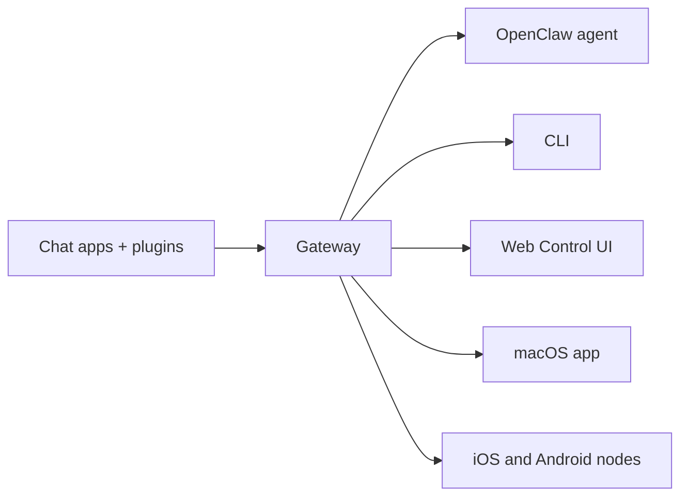

---
read_when:
    - OpenClawを初めて使う人に紹介する
summary: OpenClaw は、任意の OS で動作する AI エージェント向けのマルチチャネル Gateway です。
title: OpenClaw
x-i18n:
    generated_at: "2026-07-05T11:30:38Z"
    model: gpt-5.5
    postprocess_version: locale-links-v1
    provider: openai
    source_hash: 6840275ad22e3c260c27f019264e49637562d0c095dc26ed84c110a4b12613f1
    source_path: index.md
    workflow: 16
---

# OpenClaw 🦞

<p align="center">
    
    
</p>

> _「脱皮しろ！脱皮しろ！」_ — 宇宙ロブスター、おそらく

<p align="center">
  <strong>Discord、Google Chat、iMessage、Matrix、Microsoft Teams、Signal、Slack、Telegram、WhatsApp、Zalo などにわたって AI エージェントを利用するための、あらゆる OS に対応した Gateway。</strong><br />
  メッセージを送るだけで、ポケットからエージェントの応答を受け取れます。チャネル Plugin、WebChat、モバイルノードをまたいで 1 つの Gateway を実行します。
</p>

<Columns>
  <Card title="開始する" href="/ja-JP/start/getting-started" icon="rocket">
    OpenClaw をインストールし、数分で Gateway を起動します。
  </Card>
  <Card title="オンボーディングを実行" href="/ja-JP/start/wizard" icon="list-checks">
    `openclaw onboard` とペアリングフローによるガイド付きセットアップ。
  </Card>
  <Card title="Control UI を開く" href="/ja-JP/web/control-ui" icon="layout-dashboard">
    チャット、設定、セッションのためのブラウザダッシュボードを起動します。
  </Card>
</Columns>

## OpenClaw とは？

OpenClaw は、Discord、Google Chat、iMessage、Matrix、Microsoft Teams、Signal、Slack、Telegram、WhatsApp、Zalo などのお気に入りのチャットアプリを、チャネル Plugin 経由で AI コーディングエージェントにつなぐ **セルフホスト型 Gateway** です。自分のマシン（またはサーバー）で単一の Gateway プロセスを実行すると、メッセージングアプリと常時利用可能な AI アシスタントの橋渡しになります。

**誰向けですか？** ホスト型サービスに頼ったりデータの制御を手放したりせず、どこからでもメッセージを送れる個人用 AI アシスタントが欲しい開発者やパワーユーザー向けです。

**何が違いますか？**

- **セルフホスト型**: 自分のハードウェアで、自分のルールに従って実行
- **マルチチャネル**: 1 つの Gateway が、設定済みのすべてのチャネル Plugin を同時に処理
- **エージェントネイティブ**: ツール利用、セッション、メモリ、マルチエージェントルーティングを備えたコーディングエージェント向けに構築
- **オープンソース**: MIT ライセンス、コミュニティ主導

**何が必要ですか？** Node 24（推奨）、または互換性のための Node 22 LTS（`22.19+`）、選択したプロバイダーの API キー、そして 5 分です。最高の品質とセキュリティのために、利用可能な最新世代の最も強力なモデルを使ってください。

## 仕組み



Gateway は、セッション、ルーティング、チャネル接続における唯一の信頼できる情報源です。

## 主な機能

<Columns>
  <Card title="マルチチャネル Gateway" icon="network" href="/ja-JP/channels">
    Discord、iMessage、Signal、Slack、Telegram、WhatsApp、WebChat などを、単一の Gateway プロセスで利用できます。
  </Card>
  <Card title="Plugin チャネル" icon="plug" href="/ja-JP/tools/plugin">
    チャネル Plugin により Matrix、Nostr、Twitch、Zalo などを追加できます。公式 Plugin は必要に応じてインストールされます。
  </Card>
  <Card title="マルチエージェントルーティング" icon="route" href="/ja-JP/concepts/multi-agent">
    エージェント、ワークスペース、送信者ごとに分離されたセッション。
  </Card>
  <Card title="メディア対応" icon="image" href="/ja-JP/nodes/images">
    画像、音声、ドキュメントを送受信できます。
  </Card>
  <Card title="Web Control UI" icon="monitor" href="/ja-JP/web/control-ui">
    チャット、設定、セッション、ノードのためのブラウザダッシュボード。
  </Card>
  <Card title="モバイルノード" icon="smartphone" href="/ja-JP/nodes">
    Canvas、カメラ、音声対応ワークフローのために iOS と Android のノードをペアリングします。
  </Card>
</Columns>

## クイックスタート

<Steps>
  <Step title="OpenClaw をインストール">
    ```bash
    npm install -g openclaw@latest
    ```
  </Step>
  <Step title="オンボーディングしてサービスをインストール">
    ```bash
    openclaw onboard --install-daemon
    ```
  </Step>
  <Step title="チャット">
    ブラウザで Control UI を開き、メッセージを送信します。

    ```bash
    openclaw dashboard
    ```

    または、チャネル（[Telegram](/ja-JP/channels/telegram) が最速です）に接続して、スマートフォンからチャットします。

  </Step>
</Steps>

完全なインストール手順と開発セットアップが必要ですか？[はじめに](/ja-JP/start/getting-started) を参照してください。

## ダッシュボード

Gateway の起動後に、ブラウザの Control UI を開きます。

- ローカルのデフォルト: [http://127.0.0.1:18789/](http://127.0.0.1:18789/)
- リモートアクセス: [Web サーフェス](/ja-JP/web) と [Tailscale](/ja-JP/gateway/tailscale)

<p align="center">
  
</p>

## 設定（任意）

設定は `~/.openclaw/openclaw.json` にあります。

- **何もしない**場合、OpenClaw は同梱の OpenClaw エージェントランタイムを使用します。DM はエージェントのメインセッションを共有し、各グループチャットには独自のセッションが割り当てられます。
- 制限を強化したい場合は、`channels.whatsapp.allowFrom` と、（グループの場合は）メンションルールから始めてください。

例:

```json5
{
  channels: {
    whatsapp: {
      allowFrom: ["+15555550123"],
      groups: { "*": { requireMention: true } },
    },
  },
  messages: { groupChat: { mentionPatterns: ["@openclaw"] } },
}
```

## ここから始める

<Columns>
  <Card title="ドキュメントハブ" href="/ja-JP/start/hubs" icon="book-open">
    ユースケース別に整理された、すべてのドキュメントとガイド。
  </Card>
  <Card title="設定" href="/ja-JP/gateway/configuration" icon="settings">
    コア Gateway 設定、トークン、プロバイダー設定。
  </Card>
  <Card title="リモートアクセス" href="/ja-JP/gateway/remote" icon="globe">
    SSH と tailnet のアクセスパターン。
  </Card>
  <Card title="チャネル" href="/ja-JP/channels/telegram" icon="message-square">
    Discord、Feishu、Microsoft Teams、Telegram、WhatsApp などのチャネル別セットアップ。
  </Card>
  <Card title="ノード" href="/ja-JP/nodes" icon="smartphone">
    ペアリング、Canvas、カメラ、デバイスアクションを備えた iOS と Android のノード。
  </Card>
  <Card title="ヘルプ" href="/ja-JP/help" icon="life-buoy">
    よくある修正とトラブルシューティングの入口。
  </Card>
</Columns>

## さらに学ぶ

<Columns>
  <Card title="全機能リスト" href="/ja-JP/concepts/features" icon="list">
    チャネル、ルーティング、メディア機能の完全な一覧。
  </Card>
  <Card title="マルチエージェントルーティング" href="/ja-JP/concepts/multi-agent" icon="route">
    ワークスペース分離とエージェントごとのセッション。
  </Card>
  <Card title="セキュリティ" href="/ja-JP/gateway/security" icon="shield">
    トークン、許可リスト、安全制御。
  </Card>
  <Card title="トラブルシューティング" href="/ja-JP/gateway/troubleshooting" icon="wrench">
    Gateway の診断と一般的なエラー。
  </Card>
  <Card title="概要とクレジット" href="/ja-JP/reference/credits" icon="info">
    プロジェクトの起源、コントリビューター、ライセンス。
  </Card>
</Columns>
