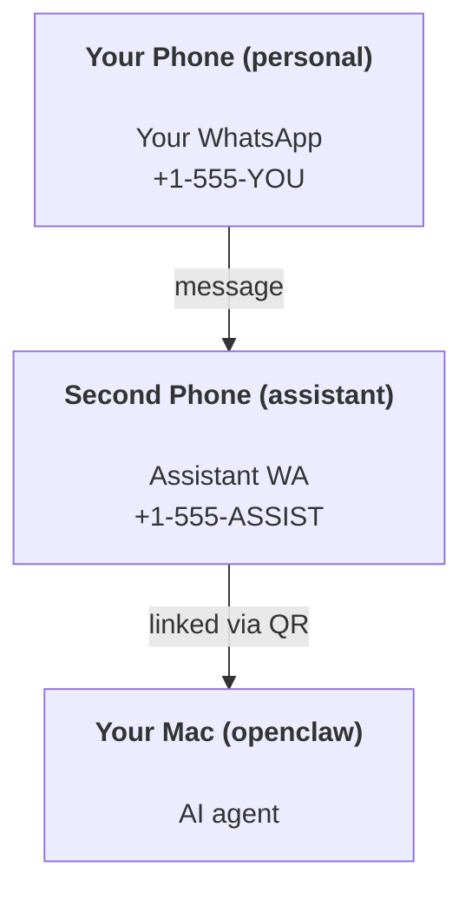

---
read_when:
    - 新しいアシスタントインスタンスのオンボーディング
    - 安全性と権限への影響をレビューする
summary: OpenClaw を安全上の注意とともにパーソナルアシスタントとして実行するためのエンドツーエンドガイド
title: 個人アシスタントのセットアップ
x-i18n:
    generated_at: "2026-07-05T11:47:40Z"
    model: gpt-5.5
    postprocess_version: locale-links-v1
    provider: openai
    source_hash: 57c515fa414d579850e008aaa60ddb5243a1237b205be111187907dd905be9cb
    source_path: start/openclaw.md
    workflow: 16
---

OpenClaw は、Discord、Google Chat、iMessage、Matrix、Microsoft Teams、Signal、Slack、Telegram、WhatsApp、Zalo などを AI エージェントに接続するセルフホスト型 Gateway です。このガイドでは、「パーソナルアシスタント」セットアップを扱います。専用の WhatsApp 番号が、常時稼働する AI アシスタントのように動作する構成です。

## まず安全性

エージェントにチャンネルを与えると、ツールポリシーによっては、そのエージェントがあなたのマシンでコマンドを実行し、ワークスペース内のファイルを読み書きし、接続済みの任意のチャンネル経由でメッセージを送信できる立場になります。控えめに始めてください。

- 必ず `channels.whatsapp.allowFrom` を設定します（個人用 Mac で世界中に開放した状態で実行しないでください）。
- アシスタント用に専用の WhatsApp 番号を使います。
- Heartbeat のデフォルトは 30 分ごとです。セットアップを信頼できるまで、`agents.defaults.heartbeat.every: "0m"` を設定して無効化してください。

## 前提条件

- OpenClaw がインストール済みでオンボーディング済みであること - まだの場合は [はじめに](/ja-JP/start/getting-started) を参照してください
- アシスタント用の 2 つ目の電話番号（SIM/eSIM/プリペイド）

## 2 台の電話セットアップ（推奨）

目指す構成は次のとおりです。



個人用 WhatsApp を OpenClaw にリンクすると、あなた宛てのすべてのメッセージが「エージェント入力」になります。通常、それは望ましい動作ではありません。

## 5 分のクイックスタート

1. WhatsApp Web をペアリングします（QR が表示されます。アシスタント用の電話でスキャンします）。

```bash
openclaw channels login
```

2. Gateway を起動します（実行したままにします）。

```bash
openclaw gateway --port 18789
```

3. 最小構成を `~/.openclaw/openclaw.json` に入れます。

```json5
{
  gateway: { mode: "local" },
  channels: { whatsapp: { allowFrom: ["+15555550123"] } },
}
```

これで、許可リストに入れた電話からアシスタント番号にメッセージを送れます。

オンボーディングが完了すると、OpenClaw はダッシュボードを自動で開き、クリーンな（トークン化されていない）リンクを表示します。ダッシュボードが認証を求める場合は、設定済みの共有シークレットを Control UI 設定に貼り付けてください。オンボーディングではデフォルトでトークン（`gateway.auth.token`）を使いますが、`gateway.auth.mode` を `password` に切り替えている場合はパスワード認証も使えます。後で再度開くには、`openclaw dashboard` を使います。

## エージェントにワークスペースを与える（AGENTS）

OpenClaw は、ワークスペースディレクトリから運用指示と「メモリ」を読み込みます。

デフォルトでは、OpenClaw は `~/.openclaw/workspace` をエージェントワークスペースとして使い、オンボーディング時または初回エージェント実行時にそれを自動作成します（あわせてスターター用の `AGENTS.md`、`SOUL.md`、`TOOLS.md`、`IDENTITY.md`、`USER.md`、`HEARTBEAT.md` も作成します）。`BOOTSTRAP.md` は完全に新しいワークスペースにだけ作成され、削除した後に戻ってくるべきではありません。`MEMORY.md` は任意で、自動作成されることはありません。存在する場合、通常セッションで読み込まれます。サブエージェントセッションでは `AGENTS.md` と `TOOLS.md` だけが注入されます。

<Tip>
このフォルダーを OpenClaw のメモリのように扱い、git リポジトリ（理想的には非公開）にして、`AGENTS.md` とメモリファイルをバックアップしてください。git がインストールされている場合、完全に新しいワークスペースは `git init` で自動初期化されます。
</Tip>

完全なオンボーディング ウィザードを実行せずにワークスペースと設定フォルダーを作成するには、次を実行します。

```bash
openclaw setup --baseline
```

（裸の `openclaw setup` は `openclaw onboard` のエイリアスで、完全な対話型ウィザードを実行します。）

完全なワークスペースレイアウトとバックアップガイド: [エージェントワークスペース](/ja-JP/concepts/agent-workspace)
メモリワークフロー: [メモリ](/ja-JP/concepts/memory)

任意: `agents.defaults.workspace` で別のワークスペースを選択できます（`~` をサポート）。

```json5
{
  agents: {
    defaults: {
      workspace: "~/.openclaw/workspace",
    },
  },
}
```

すでに自分のワークスペースファイルをリポジトリから配布している場合は、ブートストラップファイル作成を完全に無効化できます。

```json5
{
  agents: {
    defaults: {
      skipBootstrap: true,
    },
  },
}
```

## 「アシスタント」にする設定

OpenClaw のデフォルトは良好なアシスタント構成ですが、通常は次を調整します。

- [`SOUL.md`](/ja-JP/concepts/soul) 内のペルソナ/指示
- thinking のデフォルト（必要な場合）
- Heartbeat（信頼できるようになった後）

例:

```json5
{
  logging: { level: "info" },
  agents: {
    defaults: {
      model: { primary: "anthropic/claude-opus-4-8" },
      workspace: "~/.openclaw/workspace",
      thinkingDefault: "high",
      timeoutSeconds: 1800,
      // Start with 0; enable later.
      heartbeat: { every: "0m" },
    },
    list: [
      {
        id: "main",
        default: true,
        groupChat: {
          mentionPatterns: ["@openclaw", "openclaw"],
        },
      },
    ],
  },
  channels: {
    whatsapp: {
      allowFrom: ["+15555550123"],
      groups: {
        "*": { requireMention: true },
      },
    },
  },
  session: {
    scope: "per-sender",
    resetTriggers: ["/new", "/reset"],
    reset: {
      mode: "daily",
      atHour: 4,
      idleMinutes: 10080,
    },
  },
}
```

## セッションとメモリ

- セッションファイル: `~/.openclaw/agents/<agentId>/sessions/{{SessionId}}.jsonl`
- セッションメタデータ（トークン使用量、最後のルートなど）: `~/.openclaw/agents/<agentId>/sessions/sessions.json`
- `/new` または `/reset` は、そのチャットの新しいセッションを開始します（`session.resetTriggers` で設定可能）。単独で送信された場合、OpenClaw はモデルを呼び出さずにリセットを確認します。
- `/compact [instructions]` はセッションコンテキストを compact し、残りのコンテキスト予算を報告します。

## Heartbeat（プロアクティブモード）

デフォルトでは、OpenClaw は次のプロンプトで 30 分ごとに Heartbeat を実行します。
`Read HEARTBEAT.md if it exists (workspace context). Follow it strictly. Do not infer or repeat old tasks from prior chats. If nothing needs attention, reply HEARTBEAT_OK.`
無効化するには `agents.defaults.heartbeat.every: "0m"` を設定します。

- `HEARTBEAT.md` が存在するものの実質的に空（空行のみ、Markdown/HTML コメント、`# Heading` のような Markdown 見出し、フェンスマーカー、または空のチェックリストスタブのみ）の場合、OpenClaw は API 呼び出しを節約するため Heartbeat 実行をスキップします。
- ファイルが存在しない場合でも Heartbeat は実行され、モデルが何をするかを判断します。
- エージェントが `HEARTBEAT_OK` を返した場合（短い埋め文字を任意で含められます。`agents.defaults.heartbeat.ackMaxChars` を参照）、OpenClaw はその Heartbeat の送信を抑制します。
- デフォルトでは、DM 形式の `user:<id>` ターゲットへの Heartbeat 配信は許可されています。Heartbeat 実行を有効にしたまま直接ターゲットへの配信を抑制するには、`agents.defaults.heartbeat.directPolicy: "block"` を設定します。
- Heartbeat は完全なエージェントターンを実行します - 間隔を短くすると、より多くのトークンを消費します。

```json5
{
  agents: {
    defaults: {
      heartbeat: { every: "30m" },
    },
  },
}
```

## メディアの入出力

受信添付ファイル（画像/音声/ドキュメント）は、テンプレート経由でコマンドに提示できます。

- `{{MediaPath}}`（ローカル一時ファイルパス）
- `{{MediaUrl}}`（疑似 URL）
- `{{Transcript}}`（音声文字起こしが有効な場合）

エージェントからの送信添付ファイルは、メッセージツールまたは返信ペイロード上の構造化メディアフィールドを使います。たとえば `media`、`mediaUrl`、`mediaUrls`、`path`、`filePath` などです。メッセージツール引数の例:

```json
{
  "message": "Here's the screenshot.",
  "mediaUrl": "https://example.com/screenshot.png"
}
```

OpenClaw は構造化メディアをテキストと一緒に送信します。互換性のため、従来の最終アシスタント返信は引き続き正規化される場合がありますが、ツール出力、ブラウザー出力、ストリーミングブロック、メッセージアクションは、テキストを添付ファイルコマンドとして解析しません。

ローカルパスの動作は、エージェントと同じファイル読み取り信頼モデルに従います。

- `tools.fs.workspaceOnly` が `true` の場合、送信ローカルメディアパスは OpenClaw 一時ルート、メディアキャッシュ、エージェントワークスペースパス、サンドボックス生成ファイルに制限されます。
- `tools.fs.workspaceOnly` が `false` の場合、送信ローカルメディアは、エージェントがすでに読み取りを許可されているホストローカルファイルを使用できます。
- ローカルパスは、絶対パス、ワークスペース相対、または `~/` を使ったホーム相対にできます。
- ホストローカル送信でも、メディアと安全なドキュメント種別（画像、音声、動画、PDF、Office ドキュメント、Markdown/MD、TXT、JSON、YAML、YML など検証済みのテキストドキュメント）のみが許可されます。これは既存のホスト読み取り信頼境界の拡張であり、シークレットスキャナーではありません。エージェントがホストローカルの `secret.txt` や `config.json` を読み取れる場合、拡張子と内容検証が一致すれば、そのファイルを添付できます。

機密ファイルはエージェントが読めるファイルシステムの外に置くか、より厳格なローカルパス送信のために `tools.fs.workspaceOnly: true` を維持してください。

## 運用チェックリスト

```bash
openclaw status          # local status (creds, sessions, queued events)
openclaw status --all    # full diagnosis (read-only, pasteable)
openclaw status --deep   # probe channels (WhatsApp Web + Telegram + Discord + Slack + Signal)
openclaw health --json   # gateway health snapshot over the WS connection
```

ログは `/tmp/openclaw/` の下にあります（デフォルト: `openclaw-YYYY-MM-DD.log`）。

## 次のステップ

- WebChat: [WebChat](/ja-JP/web/webchat)
- Gateway 運用: [Gateway ランブック](/ja-JP/gateway)
- Cron + ウェイクアップ: [Cron ジョブ](/ja-JP/automation/cron-jobs)
- macOS メニューバーコンパニオン: [OpenClaw macOS アプリ](/ja-JP/platforms/macos)
- iOS ノードアプリ: [iOS アプリ](/ja-JP/platforms/ios)
- Android ノードアプリ: [Android アプリ](/ja-JP/platforms/android)
- Windows Hub: [Windows](/ja-JP/platforms/windows)
- Linux ステータス: [Linux アプリ](/ja-JP/platforms/linux)
- セキュリティ: [セキュリティ](/ja-JP/gateway/security)

## 関連

- [はじめに](/ja-JP/start/getting-started)
- [セットアップ](/ja-JP/start/setup)
- [チャンネル概要](/ja-JP/channels)
